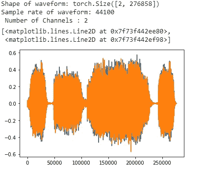
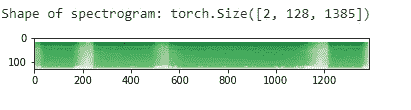

# 语音分析第 2 部分，TorchAudio 中的声音分析

> 原文：<https://medium.com/analytics-vidhya/speech-analytics-part-2-sound-analytics-in-torchaudio-7645a3dd192d?source=collection_archive---------11----------------------->

数据科学的前景每天都在变化。在过去的几年里，我们看到了自然语言处理和计算机视觉领域的大量研究和进展。但是有一个领域仍未被探索，并且有很大的潜力，这个领域就是——语言。

在上一个教程中，我们已经了解了:

1.  什么是声波？

2.声波的基本性质

3.声波的特征提取

4.预处理声波

在本教程中，我们将探讨它在 Python 中的实际应用。两个最受欢迎的图书馆为您的旅程提供了帮助:

1.  利布罗萨
2.  火炬报

torch audio——这是一个 PyTorch 域库，由 I/O、流行的数据集和常见的音频转换组成，可以为您的 PyTorch 项目带来新的速度和效率。这是一个由脸书创造的强大的语音调制软件。

按照[这些](https://github.com/pytorch/audio)步骤进行安装。

我们将在本教程中使用 TorchAudio，并学习如何预处理声波来开始您的语音建模之旅。获取整个笔记本[在这里](https://github.com/divapriya/Speech-Analytics-SpeechToText/blob/master/audio_preprocessing_tutorial.ipynb)

## 步骤 1:读取声音文件

支持的文件格式有 mp3，wav，aac，ogg，flac，avr，cdda，cvs/vms，，aiff，au，amr，mp2，mp4，ac3，avi，wmv，mpeg，ircam 以及 libsox 支持的任何其他格式。函数的作用是读取声音文件。

## 步骤 2:文件信息和可视化

声波带有不同类型的信息。正如我们在之前的博客中读到的，我们对原始波做的转换越多，我们能够从中提取的信息就越多。

在第一级中，我们可以提取采样速率、通道数、声音文件持续时间等信息，并可以使用 Matplotlib 可视化声波的振幅和时标。

输出:

## 第三步:重采样

让我们研究来自通道 1 的波形，并对其进行重新采样。

输出:

## **步骤 4:复杂特征提取**

如果你读过我以前的博客，你会知道我们需要对简单的声波(振幅对时间)进行变换，以从中提取其他特征。

让我们应用 DFT(离散傅立叶变换)来研究这个波的频谱

输出:

光谱图

现在让我们应用另一个 DFT(离散傅立叶变换)来研究倒谱。我们将研究 MelSpectrum 并研究音频的 MFCC 特征。波形的 MFCC 特征被认为是扬声器识别、声音分类、声音修改或涉及人类可感知声音范围的任何类型的声音分析等用例的最佳格式。详情见[上一篇博客。](/@divalicious.priya/speech-analytics-part-1-basics-of-speech-analytics-37ba6d5904e2)

输出:

梅尔频谱图

## 步骤 5:归一化波形以应用 MuLaw 编码:

波形的标准化类似于数字数据的标准化。它在-1 到 1 之间改变数值(振幅)。

输出:

对波形应用 MuEncoding

## 第六步:转换——放大和抖动

放大——这一步包括增加整个波的音量

扰动——将较高的位分辨率转换为较低的位分辨率。[阅读更多](http://darkroommastering.com/blog/dithering-explained/)

## 步骤 7:转换-过滤

滤镜的作用就像一个屏幕，让高于特定频率的音频通过(高通滤镜)或低于特定频率的音频通过(低通滤镜)。超出这些限制的任何东西都会被削弱。

输出:

低通滤波器输出

高通滤波器输出

## 第八步:淡化

这导致声音中的褪色效果。这可以在声波开始时或结束时应用。

输出:

走漏

## 第九步:均衡器

大多数人熟悉的最基本的均衡类型是家用音频设备上的高音/低音控制。高音控制调节高频，低音控制调节低频。[阅读更多](https://www.mediacollege.com/audio/eq/)

输出:

补偿

点击获取整个笔记本

我们的声波已经处理完毕，可以开始我们的建模任务了。在下一部分中，我们将学习如何使用上述步骤的输出波形来创建 SpeechToText 分类器。