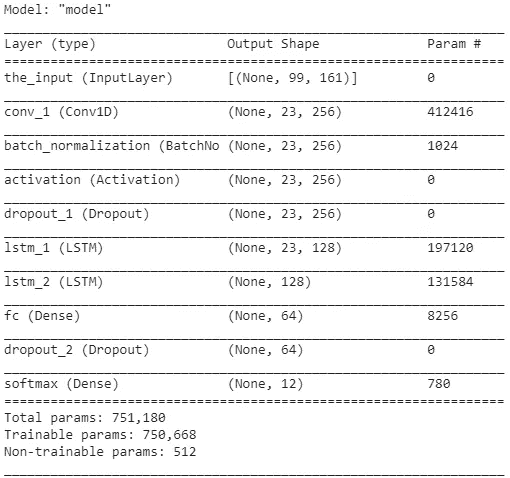
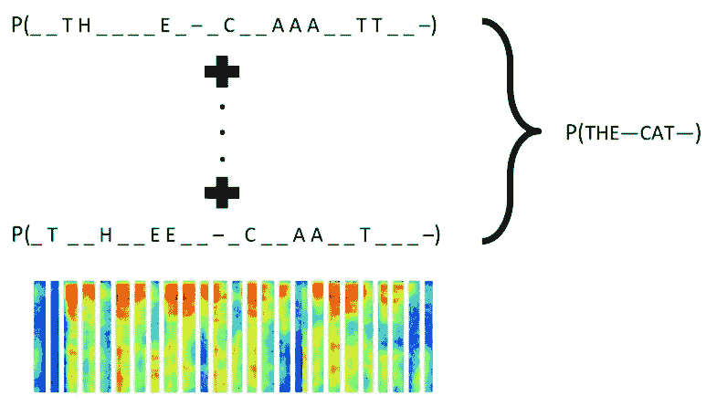

# 语音分析第 3 部分，创建语音文本分类器

> 原文：<https://medium.com/analytics-vidhya/speech-analytics-part-3-creating-a-speechtotext-classifier-e46b7befe240?source=collection_archive---------20----------------------->

制作声音模型与制作数据、NLP 或计算机视觉非常相似。最重要的部分是了解声波的基础知识，以及我们如何对其进行预处理以将其放入模型中。

你可以看看这个系列之前的[第一部分](/@divalicious.priya/speech-analytics-part-1-basics-of-speech-analytics-37ba6d5904e2)和[第二部分](/@divalicious.priya/speech-analytics-part-2-sound-analytics-in-torchaudio-7645a3dd192d)，了解我们是如何处理声波的。

我们将使用本次比赛中使用的[数据集](https://www.kaggle.com/c/tensorflow-speech-recognition-challenge/data?select=train.7z)来创建我们的 SpeechToText 分类器。数据集由 12 个单词的若干次出现组成——“是”、“否”、“上”、“下”、“左”、“右”、“开”、“关”、“停止”、“开始”、“沉默”和未知的声音。假设我们将创建一个分类器模型，该模型将只能预测 12 个单词中的任何一个。

你可以在这里找到整个[笔记本](https://github.com/divapriya/Speech-Analytics-SpeechToText/blob/master/BasicModelAudio_part2.ipynb)

## 步骤 1:浏览子文件夹来阅读我们的声音文件

## 步骤 2:剪切和填充声音文件

分类器模型的一个关键要求是每个单词的输入长度必须相同。因此，我们将确保在出现时间不等于 16 秒的单词的末尾砍掉额外的时间并填充静音。

## 步骤 3:从声波中提取特征

要深入了解这一点，请参考我以前的[博客。对于这个问题，我们将提取声音的 MFCC 特征，并将它们用作我的分类器模型的输入。](/@divalicious.priya/speech-analytics-part-2-sound-analytics-in-torchaudio-7645a3dd192d)

## 步骤 4:模型架构

假设每个单词都由音素组成，模型需要做的第一步是从整个单词中提取必要的特征/音素。因此，我们将使用 CNN 模型来捕捉这些特征。下一步，我们需要研究所有的特征/音素，并将单词分类到其中一个类别。序列在这里起着重要的作用。因此，我们将增加一个 LSTM 层。

最终的架构看起来像:

## 第五步:拟合模型

## 第六步:通过麦克风录下一个单词

让我们学习如何从麦克风获取输入

通过麦克风记录输入

## 步骤 7:将录音转换成文本

我们将使用上面创建的模型来预测来自麦克风的输入记录

你可以在这里找到整个[笔记本](https://github.com/divapriya/Speech-Analytics-SpeechToText/blob/master/BasicModelAudio_part2.ipynb)

这是你制造 SpeechToText 引擎的第一步。实际上，这种架构非常复杂，并且考虑到它需要学习的单词数量，需要很高的计算能力(我们最终的模型应该能够预测任何单词，而不仅仅是 12 个单词)。

使用的一些著名架构有:-

1.  双向 LSTMs + CTC
2.  基于注意力的 Seq2Seq 模型

CTC 模式

请等待本文的第 4 部分来详细介绍这种架构。