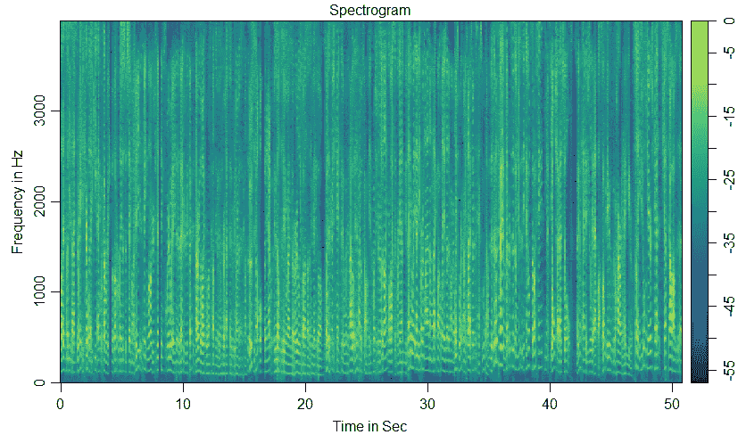

# 语音检测使用梅尔频率(MFCC)在 R 工作室！

> 原文：<https://medium.com/analytics-vidhya/speech-detection-using-mel-frequency-mfcc-in-r-studio-c8582f6ecfe0?source=collection_archive---------2----------------------->

## 借助 MFCC(梅尔频率倒谱系数)特征提取实现语音检测的实用指南。

研究的目的是从数据库中提取特征。wav 文件。讲话也反映了人的心情和他们说话时的情绪状态。

例如，当我们最喜欢的球队赢了比赛，一个朋友打电话给我们，通常我们会带着兴奋的语气和朋友交谈。同样，如果你早上和男朋友吵了一架，你的语气或与出租车司机的对话可能是愤怒或悲伤的(基于你的情绪状况)。

在这个实验中，我们展示了从语音信号中提取特征的实际实现。

这里，我们没有解释音频信号是如何形成的，或者 MFCC 的步骤..比如什么是预加重和 Mel-filter 等等。关于这一点有很多研究和文章，你可以从网上查阅或者从这里了解。

请注意，除了 MFCC，还有许多其他技术可以从音频信号中提取特征，如线性预测系数(LPC)、离散小波变换(DWT)等。


由[杰森·罗斯韦尔](https://unsplash.com/@jasonrosewell?utm_source=medium&utm_medium=referral)在 [Unsplash](https://unsplash.com?utm_source=medium&utm_medium=referral) 上拍摄的照片

该项目可以从商业角度实施，

1.  **Telecallers:** 团队中哪个人更有效率，为什么！我们能否从最好的远程呼叫者中找出参数(如语气、交谈时间、潜在客户互动等)来培训初级远程呼叫者！
2.  **销售:**更好和正确的销售电话分析，这可以通过使用 NLP 和语音分析来完成。哪个业务员谈什么？用哪种情绪，哪种语气？客户的反应和语气如何？这些和更多的参数可以帮助公司微调他们的销售人员。
3.  **招聘:**借助过去的面试数据，以及当前表现最佳的资源，可以引导企业精心挑选未来最聪明的头脑。一般来说，面试官会说，只需不到 2-4 分钟的初步互动，就能决定受访者是否适合该公司。这也是面试官根据他们长期的面试经验和谈话方式以及他们谈话时的自信和情绪来决定的。


[神奇碗](https://unsplash.com/@magicbowls?utm_source=medium&utm_medium=referral)在 [Unsplash](https://unsplash.com?utm_source=medium&utm_medium=referral) 上拍照

**MFCC(Mel-频率倒谱系数)在 R Studio 中的实现:**

在这项研究中，我们使用了 R studio 中的内置库，

```
library(wrassp)library(readr)library(tuneR)library(signal)library(oce)
```

任何数据分析的一个重要部分是数据收集。为了这项研究，我们对一些进行了分类。wav 文件具有不同的音调/情绪，如愤怒、激动、正常、悲伤等。

然而，在我们为一项研究处理实际数据之前，我将让您基本了解为什么 MFCC 对于使用声谱图进行特征提取很重要。这里我们取一个简单的。wav 文件并创建了一个没有 MFCC 和 MFCC 数据矩阵的声谱图。

加载。wav 文件数据，以及

```
path = 'male.wav'audio = readWave('male.wav')
```

检查的组件和结构。wav 文件数据。

```
> str(audio)Formal class ‘Wave’ [package “tuneR”] with 6 slots
 ..@ left : int [1:408226] -79 -104 -153 -175 -201 -209 -231 -224 -233 -221 …
 ..@ right : num(0) 
 ..@ stereo : logi FALSE
 ..@ samp.rate: int 8000
 ..@ bit : int 16
 ..@ pcm : logi TRUE
```

> ***我们在实际的语音检测分析中也面临着一些限制，***
> 
> *1。如果音频文件是 1000 或 5000，我们需要加载每个文件。因此，我们需要重复相同的代码将文件加载到系统中。这意味着我们每次都需要使用 readWave()来加载文件。*
> 
> *2。在现实生活中，并不是每个文件都有相同的大小，例如在 telecallers 数据文件中，没有一个调用具有相同的元素和信号大小。因此，为了训练语音检测模型，我们需要确保每个元素都具有相同的大小，例如，@ left: int [1: 1000000]等，*
> 
> *把这两点记下，我会在学习中进一步说明。*

这是怎么回事？wav 文件看起来像信号形式，为此我们使用 plot()绘制图形。

```
plot(audio@left[10:408226], type ='l', col = 'seagreen', xlab = 'Elements / Time', ylab = 'Freq', main = 'Audio Frequency Wave')
```


> *注意:在这个音频文件中，一名男性正在连续讲话，因此我们看不到信号中断。我们选择了从 10 到 408226 的元素。*

## 用 R studio 中的 MFCC 进行特征提取

有关 melfcc()函数的更多详细信息，也可以访问— [RDocumentation](https://www.rdocumentation.org/packages/tuneR/versions/1.3.3/topics/melfcc)


IFC.com

```
sr = audio@samp.rate         # samp rate in Hz

 mfcc.m = melfcc(audio, sr = sr,
     wintime = 0.015,        # Window length
     hoptime = 0.005,        # Successive windown inbetween
   # numcep = 3,             # By default it will be 12 features
     sumpower = TRUE,        # frequence scale transformation based on powerspectrum
     nbands = 40,            # Number of spectra bands, filter banks
     bwidth = 1,             # Width of spectral bands
     preemph = 0.95,         # pre Emphasis
   # frames_in_rows = TRUE)
```

melfcc()函数的输出存储在 mfcc.m 中，它有 12 个特性。


输出矩阵

**几个重要提示:**

*   mfcc.m 数据集是一个 10203 * 12 的矩阵，其中的行有 10203 个观测值。
*   行数取决于音频文件的长度，因为您记得“音频”文件包含从 0:408226 开始的元素。
*   如果我们有 1000 或 5000 个。wav 文件，那么我们需要为所有不同长度的。wav 文件。
*   这是非常重要的，因为一般来说，从卡格尔和 UCI 的数据集的长度。wav 数据文件被设置(让我们说 0:50000 元素，这对于所有的。wav 数据文件)。但是在现实世界中，数据文件的长度并不相同。
*   为什么设置所有的？具有相同元素的 wav 文件。因为，正如我们从 melfcc()中观察到的，该函数将创建 n 个观察值(在上面的例子中是 10203)。这将有助于我们进一步的研究，语音检测的研究。
*   要运行任何监督学习模型来预测结果，假设在这种情况下，我们想知道客户是否对某个特定的远程呼叫者满意！基于语音检测技术，我们可以在与客户互动时对好的远程呼叫员或粗鲁/不良的远程呼叫员进行分类。突然之间，我们可以采取相应的行动，而不是等待客户投诉或因为电话公司的不良行为而失去客户。
*   比如基于 5000。wav 数据文件我们以矩阵形式提取特征，现在要使用这些数据作为监督学习模型的输入，我们需要将这 5000 个矩阵转换成一个数据帧。
*   对于数据帧，我们首先简单地将所有矩阵转换成向量，然后将它们绑定到一个数据帧中。
*   现在，如果向量的大小不同，将不会创建数据框，因此将所有 5000 的元素大小设置为相同非常重要。wav 数据文件。

小技术！休息一下，然后重新开始:)听听这首歌— [这里](https://www.youtube.com/watch?v=FM7MFYoylVs)


由[马腾·范登赫维尔](https://unsplash.com/@mvdheuvel?utm_source=medium&utm_medium=referral)在 [Unsplash](https://unsplash.com?utm_source=medium&utm_medium=referral) 上拍摄的照片

好了，到目前为止，我们已经讨论了声音信号的特征提取，以及如何从商业角度利用这一点。

最后，我还会展示原始信号数据和 mfcc 特性数据的频谱图。我们将比较这两个声谱图，并检查 MFCC 特征提取在语音检测中是否真的有所不同！

**在绘制频谱图之前，我们做了两件事，**

1.  定义了光谱图的参数，并
2.  将全局函数()设置为 spectrogram {…}(您可以为函数取任何名称)

```
1\. # Determine durationdur = length(mfcc.m)/audio@samp.rate
dur # in seconds# d=Determine sample ratefs = audio@samp.rate
fs # in Hz## Spectrogram parametersnfft = 512    #Fast Fourier Transformation size can be 512 (default), 1024 or 2048.window = 1500overlap = 500
```

.

```
2\. # Creater a global function called 'spectrogram'spectrogram = function(a) {# Define Parametersspec = specgram(x = a,
                n = nfft,
                Fs = fs,
                window = window,
                overlap = overlap)# Structure of 'spec'str(spec)P = abs(spec$S)# Normalize
P = P/max(P)     # If we do without abs(*) it will creat NA# Convert to dB
P = 10*log10(P)# config time axis
t = spec$t# plot spectrogramimagep(x = t,
       y = spec$f,
       z = t(P),
       col = oce.colorsViridis,
       ylab = 'Frequency in Hz',
       xlab = 'Time in Sec',
       main = 'Spectrogram',
       drawPalette = T,
       decimate = F)}# Spectrogram without MFCCwithout.mfcc = spectrogram(as.matrix(audio@left))# Spectrogram with MFCCwith.mfcc = spectrogram(mfcc.m)
```

**没有 MFCC:**



**与 MFCC:**


在比较两个频谱图之后，我们可以清楚地识别出频率被转换到 Mel 频率标度。

R studio 中的详细代码，也可以访问— [这里](https://github.com/RutvijBhutaiya/Speech-detection-using-Mel-Frequency-MFCC)。

在 Github 上，我添加了两个代码文件，

1.  基础知识。r 用于特征提取和声谱图，
2.  MFCC 函数+声谱图函数。r 代表一个以上。wav 文件。在这个文件中，我捕获了四个。wav 文件，但也可以加载更多。wav 文件根据他们的研究要求。

[](https://github.com/RutvijBhutaiya/Speech-detection-using-Mel-Frequency-MFCC) [## rutvijbhutaya/使用 Mel 频率的语音检测-MFCC

### 一个实用指南，以实现语音检测的帮助下，MFCC(梅尔频率倒谱系数)的特点…

github.com](https://github.com/RutvijBhutaiya/Speech-detection-using-Mel-Frequency-MFCC)