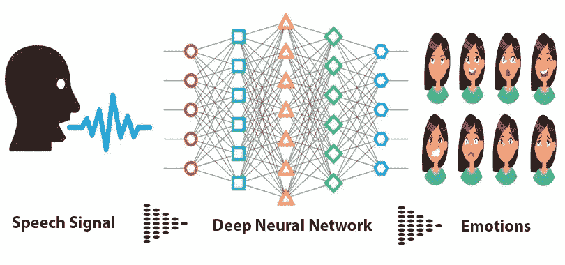

# 使用语音和转录文本的语音情感检测—第一部分

> 原文：<https://medium.com/analytics-vidhya/speech-emotion-detection-using-voice-transcribed-text-part-1-ce1b9e3e3c12?source=collection_archive---------19----------------------->

参考:[https://medium . com/@ raihanh 93/speech-emotion-recognition-using-deep-neural-network-part-I-68 EDB 5921229](/@raihanh93/speech-emotion-recognition-using-deep-neural-network-part-i-68edb5921229)

# 提议的模型:深度双重递归编码器模型

所提出的模型同时使用“抄本文本数据”和音频特征来理解与语音相关的情绪。该模型将具有从“信号水平”到“语言水平”分析语音数据的能力。这种方法是使用深度…