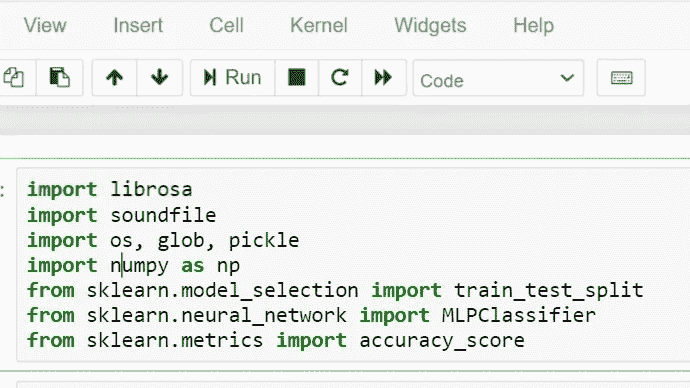

# 基于机器学习的语音情感识别

> 原文：<https://medium.com/analytics-vidhya/speech-emotion-recognition-using-machine-learning-df31f6fa8404?source=collection_archive---------9----------------------->

> 作为人类，语言是表达自己最自然的方式之一。我们如此依赖表情符号，以至于在求助于电子邮件和短信等其他交流形式时，我们认识到了它的重要性，我们经常使用表情符号来表达与信息相关的情绪。由于情感在交流中起着至关重要的作用，因此对情感的检测和分析在当今远程交流的数字世界中至关重要。情绪检测是一项具有挑战性的任务，因为情绪是主观的。对于如何对它们进行衡量或分类，还没有达成共识。

语音情感识别(Speech Emotion Recognition)，缩写为 **SER** ，是试图从语音中识别人类情感和情感状态的行为。这种系统可以在各种各样的应用领域中找到用途，例如基于交互式语音的助理或呼叫者代理对话分析。

# SER -目标

使用 python 的 **librosa** 库构建一个从语音中识别情绪的模型。

# 数据源

对于这个项目，我们将使用 **RAVDESS** 数据集，它是瑞尔森情感语音和歌曲数据集的视听数据库的缩写形式。这个数据集有 **7356** 个文件，由 **247** 个人对情感有效性、强度和真实性进行了 10 次评级。

# 使用的库

我们将使用的主要库是 **Librosa。**除此之外，我们还将使用**声音文件**和 **Pyaudio。Librosa** 是一个用于分析音频和音乐的 Python 库。它具有更扁平的封装布局、标准化的接口和名称、向后兼容性、模块化功能和可读代码。

# **本研究中使用的特征**

从音频数据中我们提取了**三个**关键特征用于本研究，即 **MFCC** (梅尔频率倒谱系数)**梅尔声谱图**和**色度**。Librosa 用于他们的提取。

**MFCC :** 到目前为止，MFCC 是该数据集中研究和利用最多的要素。它代表声音的短期功率谱。

**Mel 光谱图:**这只是一个描述振幅的光谱图，该振幅映射在 Mel 标度上。

**色度:**色度矢量通常是 12 元素的特征矢量，指示在标准色度标度中每个音调类有多少能量存在于信号中。

# 提取特征

我们只需定义一个函数，从声音文件中提取 MFCC、色度和 Mel 特征。这个函数有 4 个参数——文件名和三个布尔参数。用声音文件库打开声音文件。从中读取并调用它 **X** 。另外，获取采样率。如果色度为真，得到 **X** 的**短时傅立叶变换**。

假设结果是一个空的 numpy 数组。现在，对于这三个特性中的每一个，如果存在的话，从 librosa.feature 中调用相应的函数，得到平均值。用结果和特征值从 numpy 调用函数 hstack()，并将它存储在 result 中。然后，返回结果。

# 遵循的流程

我们定义了一个字典来保存 RAVDESS 数据集中可用的数字和情绪，以及一个列表来保存我们想要的东西——平静、快乐、恐惧和厌恶。

**加载数据**

我们用一个函数加载数据，该函数将测试集的相对大小作为参数。x 和 y 是空列表。我们将使用来自 **glob 模块**的 **glob()** 函数来获取数据集中声音文件的所有路径名。

因此，对于每一个这样的路径，获得文件的基本名称，通过将名称分割在“-”周围并提取第三个值来获得情感。

使用我们的**情感字典**，这个数字被转换成一种情感，我们的函数检查这个情感是否在我们的**观察到的情感列表中，**如果不在，它继续到下一个文件。它调用**提取特征**，并将返回的内容存储在“特征”中。然后，它将特征附加到 x，将情感附加到 y。因此，列表 x 保存特征，而 y 保存情感。我们用这些调用函数 train-test-split，测试大小，和一个随机状态值，并返回它。

**列车测试分割**

我们将数据集分为训练和测试数据，保持测试规模为总数据的 25% 。

**分类任务**

对于我们的语音情感识别系统，我们将使用**MLP 分类器**。这是多层感知器分类器，它使用随机梯度下降优化对数损失函数。MLP 分类器具有用于分类的内部神经网络。这是一个前馈人工神经网络模型。

然后，我们训练我们的模型，并从中获得预测。

**模型评估**

为了计算我们模型的精确度，我们将调用从 [sklearn](https://scikit-learn.org/) 导入的 **accuracy_score()** 函数。我们还将使用**混淆矩阵**来更好地理解我们的模型预测。

从代码输出可以清楚地看出，该模型获得了 **68.75%** 的准确度分数

完整的代码可以在我的 GitHub 资源库中找到:

 [## umair-1119/语音情感识别

### 在 GitHub 上创建一个帐户，为 Umair-1119/语音情感识别的发展做出贡献。

github.com](https://github.com/Umair-1119/Speech-Emotion-Recognition) 

欢迎在 [LinkedIn](https://www.linkedin.com/in/umair-ayub-/) 上联系我！