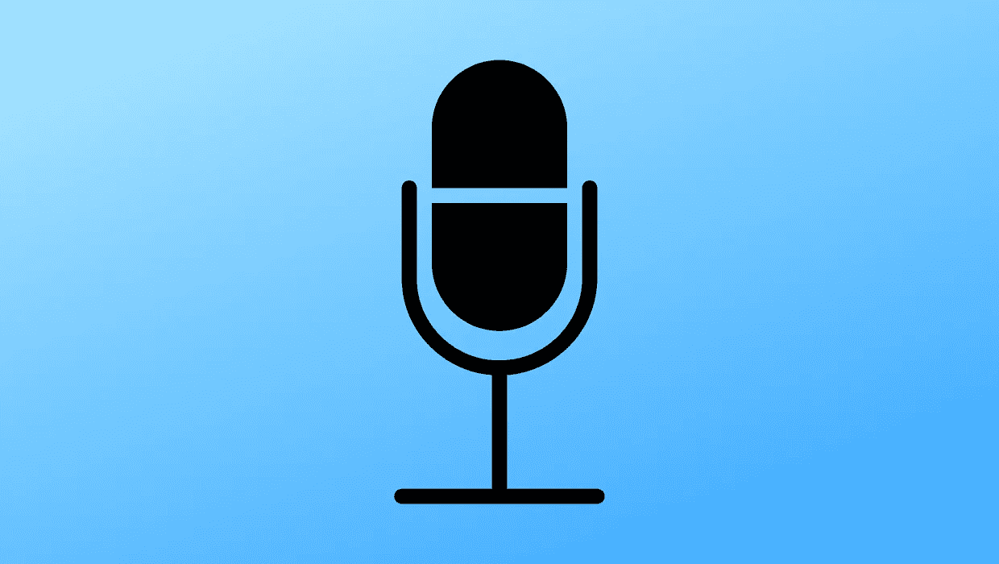
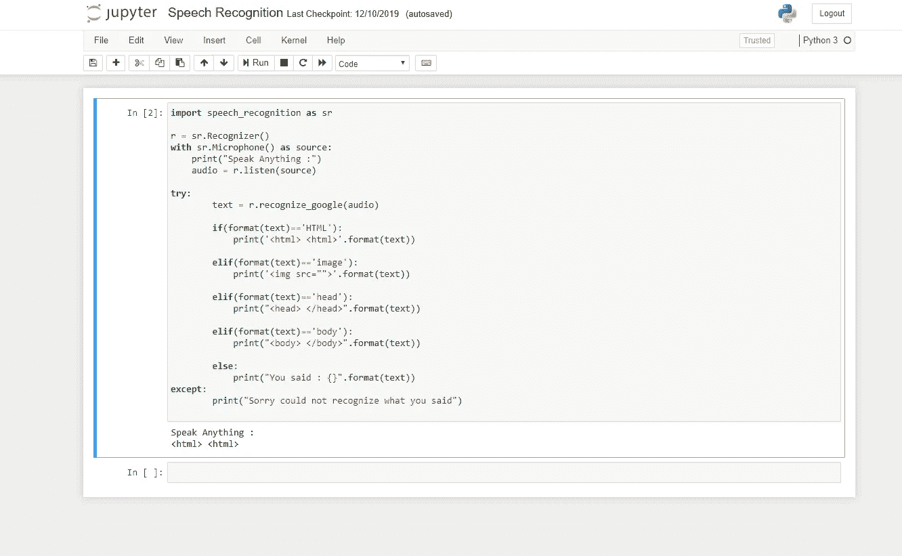
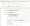

# 基于语音识别的代码编辑器- Pat 1

> 原文：<https://medium.com/analytics-vidhya/speech-recognition-based-code-editor-f55844dff7f8?source=collection_archive---------18----------------------->

> “在这 10 年的时间框架内，我相信我们将不仅使用键盘和鼠标进行交互，而且在此期间，我们将完善语音识别和语音输出，使其成为界面的标准部分。”——比尔·盖茨，1997 年 10 月 1 日

有时候，通过打字来写代码变得非常乏味和烦人，因为我们会遇到拼写错误，然后再次按退格键，然后再次重写单词。你不觉得吗？！根据心理学，这是由于打字时手指的混合和我们打字的速度。

所以要解决这个问题。为什么我们不能有一个代码编辑器来处理语音并检查语法，就像我们使用任何代码编辑器一样。这里有一个小例子，虽然没有完全实现。我也有一个简单的想法，我们如何才能实现它进一步的进程。下面是我从侧面检查的一个小尝试。

**第一步:**获取下面的 python 库

[1] pip 安装语音识别

[2] pip 安装 PyAudio

[3] pip 安装端口音频

**第二步:**打开你最喜欢的 IDE，我们正在选择 Jupyter 笔记本，并编写下面的代码。

语言输出

**步骤#3:** 现在，在你运行上面的代码片段之后，无论你在麦克风上说什么，都会被转换成文本:D

# **注:**

现在，我已经为 HTML 编写了上面的小代码，你可以为你选择的其他编程语言编写它，比如 Python，JavaScript，php 等等。

# **可以添加的功能:**

[1]您不能通过使用 **Try** 和**来添加所有的**标签**，除了**，因为不会为代码提供效率。你可以用熊猫让它变得更好。在其中，你可以制作 2 列其中一列是**标记&用途**列

**标签**列显然包含我们所说的语音文本(“ **Html** ”)，它检查标签列中的文本

**目的**列包含 Html 标签(例如:“**<Html></Html>**”)

[2]一旦你完成了**逻辑** **部分**并且工作正常，就像任何其他代码编辑器一样将其嵌入到适当的 **GUI** 中。

[3]您也可以将 excel 类型的字段添加到编辑器中，用户可以**关闭**和**打开**他想要使用或不使用的标签。这将减少搜索标签列的时间。

[4]你还可以添加一个功能，如果语音不能检测我们所说的话，那么它可以显示可检测的文本，然后它可以在光标上向我们显示建议。

# 结论

在本文中，我们已经能够构建一个简单的语音识别代码编辑器。我们还可以做一些更酷的事情，但是我会留给你去思考和实现。

如果您有问题或反馈，请在下面留言。我迫不及待地想看看你用这个做了什么。你可以在 Linkedin 上联系我

希望有帮助。谢谢；)