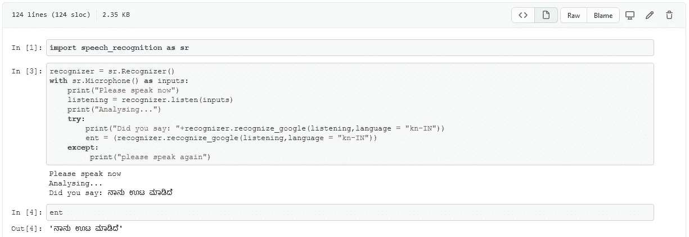

# 仅用 10 行 Python 代码实现语音识别

> 原文：<https://medium.com/analytics-vidhya/speech-recognition-in-just-10-lines-of-python-code-69cd92c30fa?source=collection_archive---------9----------------------->

ನಮಸ್ಕಾರಎಲ್ಲರಿಗೂ[在卡纳达语中是大家好的意思]。

本文主要讨论使用 Python 语言的语音识别。几天前我在搜索“卡纳达语的语音识别”，我几乎没有找到任何与此相关的文章，所以想到为ನಮ್ಮಕನ್ನಡ[我们的卡纳达语]的语音识别写点东西。

正如标题中提到的，它只有 10 行 Python 代码，这里我们尝试使用谷歌的语音识别系统，该系统支持大约 **119 种语言**。根据我的经验，这个系统的准确性非常好，它可以正确地识别卡纳达语中 10 个语音笔记中的 7 个，并且拼写由语音识别系统完美地写出。

用于简单语音识别系统的 Python 代码:

```
import speech_recognition as sr
```

我们导入必要的包来运行程序，在这种情况下，我们需要导入 speech_recognition 模块作为 sr。

```
recognizer = sr.Recognizer()
with sr.Microphone() as inputs:
    print("Please speak now")
    listening = recognizer.listen(inputs)
    print("Analysing...")
    try:
        print("Did you say: "+recognizer.recognize_google(listening,language = "kn-IN"))
        ent = (recognizer.recognize_google(listening,language = "kn-IN"))
    except:
         print("please speak again")
```

导入包后，是时候初始化识别器，然后从麦克风输入音频输入，然后使用谷歌的语音识别技术识别它。

在这里，因为我正在为卡纳达语执行语音识别，所以我必须在下面提到的代码行中指定“**kn-IN**”[这已经是上面提到的主代码的一部分]

```
recognizer.recognize_google(listening,language = "kn-IN")
```

如果你正在尝试其他语言的语音识别系统，那么请点击这个[链接](https://cloud.google.com/speech-to-text/docs/languages)，它包含了谷歌语音识别系统支持的语言列表以及相应的语言代码。

语音识别的输出示例如下:



卡纳达语的语音识别

好了，这篇短小精悍的文章就到这里。你也可以看看我的 YouTube 视频，我解释了语音识别代码，并演示了同样的工作。

我希望这篇文章对你有用！如果你做了，别忘了竖起大拇指！非常感谢！

请随时通过 [LinkedIn](https://www.linkedin.com/in/arnold-sachith-98752a141/) 、 [Instagram](https://www.instagram.com/arnoldsachith/) 或[脸书](https://www.facebook.com/arnold.sachith)与我联系。

> *干杯！*
> 
> 阿诺德·萨希特