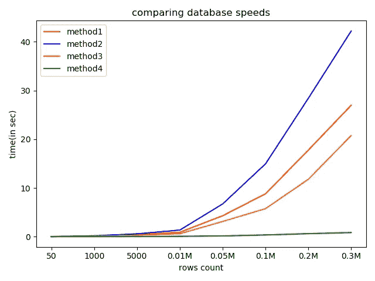

# 使用 Pandas 和 Python 加速 SQL db 的批量插入

> 原文：<https://medium.com/analytics-vidhya/speed-up-bulk-inserts-to-sql-db-using-pandas-and-python-61707ae41990?source=collection_archive---------0----------------------->


米卡·鲍梅斯特在 [Unsplash](https://unsplash.com?utm_source=medium&utm_medium=referral) 上的照片

本文详细介绍了:

1.  使用 pandas 和 pyodbc 将数据帧写入数据库的不同方式
2.  如何使用 python 加速对 sql 数据库的插入
3.  每个方法写入数据库所花费的时间
4.  比较使用不同方法写入数据库所需的时间

## 方法 1:

这里的方法是:

1.  数据帧中的每一行都被转换成元组
2.  然后使用 pyodbc 将每条记录插入到表中

```
 p*arams = 'DRIVER='+driver + ';SERVER='+server + ';PORT=1433;DATABASE=' + database + ';UID=' + username + ';PWD=' + password**#df_op is the dataframe that needs to be written to database and test is the table name in database and col_name1, col_name2,... are the respective column names**cnxn = pyodbc.connect(params)
cursor = cnxn.cursor()
for row_count in range(0, df_op.shape[0]):
      chunk = df_op.iloc[row_count:row_count + 1,:].values.tolist()
      tuple_of_tuples = tuple(tuple(x) for x in chunk)
      cursor.executemany("insert into test" + " ([col_name1],   col_name2],[col_name3],[col_name4],[col_name5],[col_name6],[col_name7],[col_name8],[col_name9],[col_name10]) values   (?,?,?,?,?,?,?,?,?,?)",tuple_of_tuples)*
```

请使用此方法，
*找到一个数据帧各自的行数和写入数据库所用的时间，rows_count=['50 '，' 1000 '，' 5000 '，' 0.01 米'，' 0.05 米'，' 0.1 米'，' 0.2 米']
time(sec)= [0.005，0.098，0.440，0.903，4.290，8.802，17.776，26.982]*

## 方法 2

现在让我们将 cursor.fast_executemany = True 添加到方法 1 中已经使用的函数中。突出显示了方法 1 和方法 2 之间的差异

```
*#df_op is the dataframe that needs to be written to database and test is the table name in database and col_name1, col_name2,... are the respective column names**cnxn = pyodbc.connect(params)
cursor = cnxn.cursor()* ***cursor.fast_executemany = True*** *for row_count in range(0, df_op.shape[0]):
   chunk = df_op.iloc[row_count:row_count + 1,:].values.tolist()
   tuple_of_tuples = tuple(tuple(x) for x in chunk)
   cursor.executemany("insert into test" + " ([col_name1],   col_name2],[col_name3],[col_name4],[col_name5],[col_name6],[col_name7],[col_name8],[col_name9],[col_name10]) values   (?,?,?,?,?,?,?,?,?,?)",tuple_of_tuples)*
```

请使用此方法找到一个数据帧中的行数和写入数据库所用的时间，
*rows_count =['50 '，' 1000 '，' 5000 '，' 0.01M '，' 0.05M '，' 0.1M '，' 0.2M ']
time(sec)=[0.009，0.179，0.574，1.35，6.718，14.949，28.422，42*

## 方法 3:

使用 pandas 'to_sql '函数、sql alchemy 和 python 将数据帧 df 写入 sql

```
*db_params = urllib.parse.quote_plus(params)
engine = sqlalchemy.create_engine("mssql+pyodbc:///?odbc_connect={}".format(db_params))**#df is the dataframe; test is table name in which this dataframe is #inserted
df.to_sql(test,engine,index=False,if_exists="append",schema="dbo")*
```

请使用此方法找到一个数据帧中的行数和写入数据库所用的时间，
*rows_count=['50 '，' 1000 '，' 5000 '，' 0.01M '，' 0.05M '，' 0.1M '，' 0.2M ']
time(sec)=[0.0230，0.081，0.289，0.589，3.105，5.74，11.769，20*

## **方法 4:**

现在让我们使用事件设置***cursor . fast _ execute many = True***并使用 to_sql 函数写入数据库。(突出显示了方法 3 和方法 4 之间的差异)

```
***from sqlalchemy import event******@event.listens_for(engine, "before_cursor_execute")
def receive_before_cursor_execute(
       conn, cursor, statement, params, context, executemany
        ):
            if executemany:
                cursor.fast_executemany = True*** *df.to_sql(tbl, engine, index=False, if_exists="append", schema="dbo")*
```

请使用此方法找出数据帧中的行数和写入数据库所用的时间，
*rows_count =['50 '，' 1000 '，' 5000 '，' 0.01M '，' 0.05M '，' 0.1M '，' 0.2M ']
time(sec)=[0.017，0.015，0.031，0.063，0.146，0.344，0.611，0.831*

现在，让我们比较不同方法写入数据库以插入不同大小(从 5000 万到 30 万条记录)的数据帧所用的时间。“行数”表示写入数据帧的行数，“时间”表示不同方法将相应行数插入数据库所用的时间



如你所见，与其他方法相比，方法 4 花费的时间更少。使用方法 4，插入速度至少会快 15 倍。

**参考文献**

[https://github.com/mkleehammer/pyodbc/issues/547](https://github.com/mkleehammer/pyodbc/issues/547)