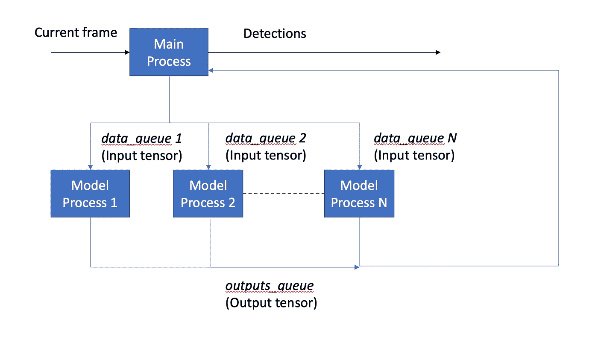
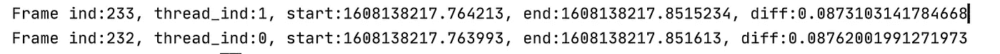
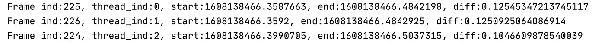
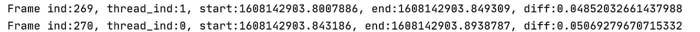

# 通过并行模型运行加速推理

> 原文：<https://medium.com/analytics-vidhya/speeding-up-inference-using-parallel-model-runs-d76dcf393567?source=collection_archive---------14----------------------->

## 增加系统吞吐量而不影响精度

照片由 Nathan Dumlao 在 Unsplash 上拍摄

在部署真实世界的应用程序时，准确性并不是深度学习模型的一切。许多边缘应用要求在不丢失任何帧的情况下尽可能快地处理视频帧。在现有模型的准确性和它们的推断时间之间存在固有的权衡，因为通常较大的模型更准确但是更慢。在这种情况下，我们如何利用最新的模型，尽管它们的推理时间很长？

**延迟和吞吐量**

首先，我们需要区分延迟和吞吐量。我们将延迟定义为将输入转换为输出所需的时间，例如，将输入图像转换为检测到的边界框。这意味着延迟是一个时间单位。另一方面，吞吐量代表处理新帧的频率，这意味着如果吞吐量低于传入帧的速率，一些帧将会丢失。因此，吞吐量是以每秒帧数(fps)来衡量的。根据应用程序的不同，区分两者的优先级可能很重要。

**使延迟和吞吐量独立**

在顺序流水线中，吞吐量是延迟的倒数(1 /延迟)，这是设计系统时通常的首选。然而，通过多进程或多线程系统使它们相互独立是可能的。一种解决方案是将所有传入的帧排队，并在单独的进程中逐个处理它们。但是，如果延迟高于传入的帧速率，延迟将随着时间的推移而增加，因为延迟将传播到每个新帧。虽然这在帧数有限并且不丢失帧比延迟更重要的情况下是可以的，但是在许多具有恒定输入帧流的情况下这是禁止的。

**多重处理帧队列**

这个问题的解决方案是让多个进程处理传入的帧队列。基本上，如果新帧每 30 毫秒出现一次，处理单个帧的延迟为 50 毫秒，那么让两个进程并行处理队列就足以处理队列，而不会产生传播延迟。在这种情况下，每个进程将有 60 ms 来处理每 2 帧，使得 50ms 延迟足够了(如果 50 ms 延迟对于系统来说确实是可接受的)。下面是该方案的框图:

**问题:**

以下是使用此解决方案在 TeslaV100 GPU 上运行的对象检测网络的一些结果，延迟约为 50 毫秒:

使用 1 个流程:

使用两种流程:

使用 3 个流程:

这里，*开始*和*结束*代表推理的开始和结束时间(以秒为单位)，而*差异*代表延迟。正如我们所看到的，这并没有真正发挥作用，因为单个进程的延迟对于 2 个进程来说是两倍，对于 3 个进程来说是 3 倍。为什么会这样？

经过一番研究，我发现这是因为 GPU 的设计方式。GPU 被划分为称为流多处理器(SM)的处理核心，这些核心被设计为尽可能被完全占用。这意味着网络中的单个层可以同时占用所有的 SM，从而在该层完成处理之前阻止任何计算。因此，并行运行的两个模型将竞争资源，并且很可能一起开始和结束，轮流使用资源。

**解决方案**

综上所述，解决方案是添加更多设备。如果每个进程都有自己的 GPU，它们就不会争夺资源。以下是在独立 GPU 上运行的两个进程的结果:

这清楚地证明了这些进程不再争夺资源，并且每个进程都显示了原始的延迟。

虽然这可能是一个经济上昂贵的解决方案，但它是一个不会损害系统准确性的解决方案，如更改为较小的模型或执行模型压缩，如量化或修剪。此外，如果吞吐量比延迟更重要，那么拥有几个功能较弱的 GPU 可能比单个快速 GPU 更好。