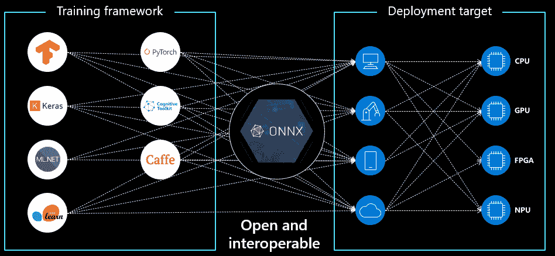

# 什么是 onnx

> 原文：<https://medium.com/analytics-vidhya/speedup-pytorch-inference-with-onnx-284d6a47936e?source=collection_archive---------4----------------------->

> 开放神经网络交换(ONNX)是一个开源的人工智能生态系统，允许我们交换深度学习模型。这有助于我们使模型便于携带。
> 
> 在高层次上，onnx 允许我们在不同的深度学习框架中移动我们的模型。目前，ONNX 中有对 PyTorch、CNTK、MXNet 和 Caffe2 的原生支持，但也有针对 TensorFlow 和 CoreML 的转换器。ONNX 还使访问硬件优化变得更加容易。
> 
> 在这个博客中，我们将看看如何将 pytorch 模型转换成 onnx 格式，并将推理转换成 cpu 系统。



## 知识

以下是根据您的硬件资源可以使用的提供商列表。我们将在此会话中使用 CPUExecutionProvider。

```
providers = [
  "CUDAExecutionProvider",
  "CPUExecutionProvider",            
  "TensorrtExecutionProvider",
  "DnnlExecutionProvider",          
]
```

**谨记**

*   当您将输入传递给 onnx 时，您必须使用您在导出时提供的名称来创建输入字典。
*   Onnx 采用 numpy 数组。

让我们编码…

从这里开始，博客是在 jupyter_to_medium 的帮助下完成的。对于 jupyter 笔记本和博客创作者来说，这是一个很棒的包。如果你在代码方面遇到任何困难，这是我的 [colab 笔记本](https://colab.research.google.com/drive/1oQuUp7g1dj5dfjfo0BIcuZUHOVgQsV08?usp=sharing)

## 火车模型

```
from __future__ import print_function
import argparse
import sys
import torch
import torch.nn as nn
import torch.nn.functional as F
import torch.optim as optim
from torchvision import datasets, transforms
from torch.optim.lr_scheduler import StepLR

class Net(nn.Module):
    def __init__(self):
        super(Net, self).__init__()
        self.conv1 = nn.Conv2d(1, 32, 3, 1)
        self.conv2 = nn.Conv2d(32, 64, 3, 1)
        self.dropout1 = nn.Dropout2d(0.25)
        self.dropout2 = nn.Dropout2d(0.5)
        self.fc1 = nn.Linear(9216, 128)
        self.fc2 = nn.Linear(128, 10)

    def forward(self, x):
        x = self.conv1(x)
        x = F.relu(x)
        x = self.conv2(x)
        x = F.relu(x)
        x = F.max_pool2d(x, 2)
        x = self.dropout1(x)
        x = torch.flatten(x, 1)
        x = self.fc1(x)
        x = F.relu(x)
        x = self.dropout2(x)
        x = self.fc2(x)
        output = F.log_softmax(x, dim=1)
        return output

def train(args, model, device, train_loader, optimizer, epoch):
    model.train()
    for batch_idx, (data, target) in enumerate(train_loader):
        data, target = data.to(device), target.to(device)
        optimizer.zero_grad()
        output = model(data)
        loss = F.nll_loss(output, target)
        loss.backward()
        optimizer.step()
        if batch_idx % args.log_interval == 0:
            print('Train Epoch: {} [{}/{} ({:.0f}%)]\tLoss: {:.6f}'.format(
                epoch, batch_idx * len(data), len(train_loader.dataset),
                100\. * batch_idx / len(train_loader), loss.item()))
            if args.dry_run:
                break

def test(model, device, test_loader):
    model.eval()
    test_loss = 0
    correct = 0
    with torch.no_grad():
        for data, target in test_loader:
            data, target = data.to(device), target.to(device)
            output = model(data)
            test_loss += F.nll_loss(output, target, reduction='sum').item()  # sum up batch loss
            pred = output.argmax(dim=1, keepdim=True)  # get the index of the max log-probability
            correct += pred.eq(target.view_as(pred)).sum().item()

    test_loss /= len(test_loader.dataset)

    print('\nTest set: Average loss: {:.4f}, Accuracy: {}/{} ({:.0f}%)\n'.format(
        test_loss, correct, len(test_loader.dataset),
        100\. * correct / len(test_loader.dataset)))

def main():
    # Training settings
    parser = argparse.ArgumentParser(description='PyTorch MNIST Example')
    parser.add_argument('--batch-size', type=int, default=64, metavar='N',
                        help='input batch size for training (default: 64)')
    parser.add_argument('--test-batch-size', type=int, default=1000, metavar='N',
                        help='input batch size for testing (default: 1000)')
    parser.add_argument('--epochs', type=int, default=14, metavar='N',
                        help='number of epochs to train (default: 14)')
    parser.add_argument('--lr', type=float, default=1.0, metavar='LR',
                        help='learning rate (default: 1.0)')
    parser.add_argument('--gamma', type=float, default=0.7, metavar='M',
                        help='Learning rate step gamma (default: 0.7)')
    parser.add_argument('--no-cuda', action='store_true', default=False,
                        help='disables CUDA training')
    parser.add_argument('--dry-run', action='store_true', default=False,
                        help='quickly check a single pass')
    parser.add_argument('--seed', type=int, default=1, metavar='S',
                        help='random seed (default: 1)')
    parser.add_argument('--log-interval', type=int, default=10, metavar='N',
                        help='how many batches to wait before logging training status')
    parser.add_argument('--save-model', action='store_true', default=True,
                        help='For Saving the current Model')
    args = parser.parse_args()
    use_cuda = not args.no_cuda and torch.cuda.is_available()

    torch.manual_seed(args.seed)

    device = torch.device("cuda" if use_cuda else "cpu")

    kwargs = {'batch_size': args.batch_size}
    if use_cuda:
        kwargs.update({'num_workers': 1,
                       'pin_memory': True,
                       'shuffle': True},
                     )

    transform=transforms.Compose([
        transforms.ToTensor(),
        transforms.Normalize((0.1307,), (0.3081,))
        ])
    dataset1 = datasets.MNIST('../data', train=True, download=True,
                       transform=transform)
    dataset2 = datasets.MNIST('../data', train=False,
                       transform=transform)
    train_loader = torch.utils.data.DataLoader(dataset1,**kwargs)
    test_loader = torch.utils.data.DataLoader(dataset2, **kwargs)

    model = Net().to(device)
    optimizer = optim.Adadelta(model.parameters(), lr=args.lr)

    scheduler = StepLR(optimizer, step_size=1, gamma=args.gamma)
    for epoch in range(1, args.epochs + 1):
        train(args, model, device, train_loader, optimizer, epoch)
        test(model, device, test_loader)
        scheduler.step()

    if args.save_model:
        torch.save(model.state_dict(), "mnist_cnn.pt")

if __name__ == '__main__':    
    sys.argv = " "
    main()Train Epoch: 14 [57600/60000 (96%)]	Loss: 0.009900
Train Epoch: 14 [58240/60000 (97%)]	Loss: 0.005598
Train Epoch: 14 [58880/60000 (98%)]	Loss: 0.017147
Train Epoch: 14 [59520/60000 (99%)]	Loss: 0.004029

Test set: Average loss: 0.0257, Accuracy: 9916/10000 (99%)
```

加载训练好的模型，并用它进行预测

```
## load the model
model = Net()
state_dict = torch.load("mnist_cnn.pt")
model.load_state_dict(state_dict)##<All keys matched successfully>transform=transforms.Compose([
        transforms.ToTensor(),
        transforms.Normalize((0.1307,), (0.3081,))
        ])
dataset2 = datasets.MNIST('../data', train=False,
                       transform=transform)image, label = dataset2[100]
image = image.unsqueeze(0)
output = model(image)
output =torch.argmax(output)
print(output, label, output == label)##tensor(6) 6 tensor(True)
```

让我们借助 torch.onnx 原生支持，将 Mnist 训练好的模型转换成 onnx

```
torch.onnx.export(
    model, ## pass model
    (image), ## pass inpout example
    "mnist.onnx", ##output path
    input_names = ['input'], ## Pass names as per model input name
    output_names = ['output'], ## Pass names as per model output name
    opset_version=11, ##  export the model to the  opset version of the onnx submodule.
    dynamic_axes = { ## this will makes export more generalize to take batch for prediction
        'input' : {0: 'batch', 1: 'sequence'},
        'output' : {0: 'batch'},        
    }
)
```

为了进行推断，我们将使用 Onnxruntime 包，它将根据我们的硬件为我们提供提升。

```
!pip install onnxruntime
# !pip install onnxruntime-gpu #for gpu
from onnxruntime import InferenceSession, SessionOptions, get_all_providers
```

为了从 onnx 模型中进行预测，我们必须使用与您的硬件兼容的提供程序创建推理会话。这里我们使用的是 CPUExecutionProvider。您可以通过在选项中提供更多属性来改进它。

```
def create_model_for_provider(model_path: str, provider: str) -> InferenceSession: 

  assert provider in get_all_providers(), f"provider {provider} not found, {get_all_providers()}"

  # Few properties than might have an impact on performances (provided by MS)
  options = SessionOptions()
  options.intra_op_num_threads = 1

  # Load the model as a graph and prepare the CPU backend 
  return InferenceSession(model_path, options, providers=[provider])
cpu_model = create_model_for_provider("mnist.onnx", "CPUExecutionProvider")
```

让我们比较 pytorch 和 onnx 的预测时间

```
%%time
out = model(image) # Pytorch model**CPU times: user 3.5 ms, sys: 36 µs, total: 3.54 ms
Wall time: 6.59 ms**#onnx model
%%time
inputs_onnx= {'input':image.numpy()} ## same name as passes in onnx.export
output = cpu_model.run(None, inputs_onnx) ## Here first arguments None becuase we want every output sometimes model return more than one output**CPU times: user 783 µs, sys: 982 µs, total: 1.76 ms
Wall time: 1.3 ms**
```

我们可以在上面看到 onnx 做出更快的预测。推理会话中的选项越多，预测时间可能会比上面看到的更长。

确保我们的模型给出正确的预测。

```
output =torch.argmax(torch.tensor(output))
print(output, label, output == label)tensor(6) 6 tensor(True)
```

## Alexnet 预训练模型

在这一节中，我们将看到如何将预训练的模型转换成 onnx 并使用它

```
!wget [https://s3.amazonaws.com/deep-learning-models/image-models/imagenet_class_index.json](https://s3.amazonaws.com/deep-learning-models/image-models/imagenet_class_index.json)!wget [https://www.learnopencv.com/wp-content/uploads/2019/05/dog.jpg](https://www.learnopencv.com/wp-content/uploads/2019/05/dog.jpg)import json
idx2label = []
cls2label = {}
with open("imagenet_class_index.json", "r") as read_file:
    class_idx = json.load(read_file)
    idx2label = [class_idx[str(k)][1] for k in range(len(class_idx))]
    cls2label = {class_idx[str(k)][0]: class_idx[str(k)][1] for k in range(len(class_idx))}!pip install torchvision
from torchvision import models
import torch
alexnet = models.alexnet(pretrained=True)
from torchvision import transforms
transform = transforms.Compose([            #[1]
 transforms.Resize(256),                    #[2]
 transforms.CenterCrop(224),                #[3]
 transforms.ToTensor(),                     #[4]
 transforms.Normalize(                      #[5]
 mean=[0.485, 0.456, 0.406],                #[6]
 std=[0.229, 0.224, 0.225]                  #[7]
 )])
from PIL import Image
img = Image.open("dog.jpg")
img_t = transform(img)
batch_t = torch.unsqueeze(img_t, 0)
alexnet.eval()
out = alexnet(batch_t)

_, index = torch.max(out, 1)
percentage = torch.nn.functional.softmax(out, dim=1)[0] * 100print(idx2label[index[0]], percentage[index[0]].item())Labrador_retriever 41.58518600463867torch.onnx.export(
    alexnet, ## pass model
    (batch_t), ## pass inpout example
    "alexnet.onnx", ##output path
    input_names = ['input'], ## Pass names as per model input name
    output_names = ['output'], ## Pass names as per model output name
    opset_version=11, ##  export the model to the  opset version of the onnx submodule.
    dynamic_axes = { ## this will makes export more generalize to take batch for prediction
        'input' : {0: 'batch', 1: 'sequence'},
        'output' : {0: 'batch'},        
    }
)!pip install onnxruntime
from onnxruntime import InferenceSession, SessionOptions, get_all_providersdef create_model_for_provider(model_path: str, provider: str) -> InferenceSession: 

  assert provider in get_all_providers(), f"provider {provider} not found, {get_all_providers()}"

  # Few properties than might have an impact on performances (provided by MS)
  options = SessionOptions()
  options.intra_op_num_threads = 1

  # Load the model as a graph and prepare the CPU backend 
  return InferenceSession(model_path, options, providers=[provider])
cpu_model = create_model_for_provider("alexnet.onnx", "CPUExecutionProvider")
```

Pytorch 模型

```
%%time
out = alexnet(batch_t)**CPU times: user 56.1 ms, sys: 1.72 ms, total: 57.8 ms
Wall time: 61.1 ms**
```

onnx 模型

```
%%time
inputs_onnx= {'input':batch_t.numpy()} ## same name as passes in onnx.export
output = cpu_model.run(None, inputs_onnx) ## Here first arguments None becuase we want every output sometimes model return more than one output**CPU times: user 42.9 ms, sys: 60 µs, total: 42.9 ms
Wall time: 43.3 ms**output = torch.tensor(output[0])
_, index = torch.max(output, 1)
percentage = torch.nn.functional.softmax(output, dim=1)[0] * 100
print(idx2label[index[0]], percentage[index[0]].item())**Labrador_retriever 41.58515167236328**
```

## 伯特拥抱脸 QAModel

```
!pip install --upgrade git+https://github.com/huggingface/transformersfrom transformers import BertTokenizer, BertForQuestionAnswering
import torch

tokenizer = BertTokenizer.from_pretrained('bert-base-uncased')
model = BertForQuestionAnswering.from_pretrained('bert-large-uncased-whole-word-masking-finetuned-squad')question = "what is google specialization"
text = "Google LLC is an American multinational technology company that specializes in Internet-related services and products, which include online advertising technologies, a search engine, cloud computing, software, and hardware."
encoding = tokenizer.encode_plus(question, text)
input_ids, attention_mask, token_type_ids = encoding["input_ids"],encoding["attention_mask"], encoding["token_type_ids"]%%time 
start_scores, end_scores = model(torch.tensor([input_ids]), token_type_ids=torch.tensor([token_type_ids]))**CPU times: user 564 ms, sys: 26.8 ms, total: 591 ms
Wall time: 689 ms**all_tokens = tokenizer.convert_ids_to_tokens(input_ids)
print(tokenizer.convert_tokens_to_string(all_tokens[torch.argmax(start_scores) : torch.argmax(end_scores)+1]))an american multinational technology company that specializes in internet - related services and products
```

## 用普通方法转换人脸模型

```
input_ids = torch.tensor([input_ids])
attention_mask = torch.tensor([attention_mask])
token_type_ids = torch.tensor([token_type_ids])torch.onnx.export(
    model,
    (input_ids,attention_mask, token_type_ids),
    "qa.onnx",
    input_names = ['input_ids','attention_mask', 'token_type_ids'], ## Be carefule to write this names
    output_names = ['qa_outputs'], ## Be carefule to write this names
    opset_version=11,
    dynamic_axes = {
        'input_ids' : {0: 'batch', 1: 'sequence'},
        'attention_mask' : {0: 'batch', 1: 'sequence'}, 
        'token_type_ids' : {0: 'batch', 1: 'sequence'}, 
        'qa_outputs': {0: 'batch'}
    }
)
```

让我们做预测

```
!pip install onnxruntime
from onnxruntime import InferenceSession, SessionOptions, get_all_providersdef create_model_for_provider(model_path: str, provider: str) -> InferenceSession: 

  assert provider in get_all_providers(), f"provider {provider} not found, {get_all_providers()}"

  # Few properties than might have an impact on performances (provided by MS)
  options = SessionOptions()
  options.intra_op_num_threads = 1

  # Load the model as a graph and prepare the CPU backend 
  return InferenceSession(model_path, options, providers=[provider])cpu_model = create_model_for_provider("qa.onnx", "CPUExecutionProvider")inputs_onnx= {
    'input_ids' : input_ids.numpy(),
    'attention_mask' : attention_mask.numpy(), 
    'token_type_ids' : token_type_ids.numpy(),
}%%time
start_scores, end_scores = cpu_model.run(None, inputs_onnx)**CPU times: user 629 ms, sys: 1.2 ms, total: 631 ms
Wall time: 632 ms**all_tokens = tokenizer.convert_ids_to_tokens(input_ids[0])
print(tokenizer.convert_tokens_to_string(all_tokens[torch.argmax(torch.tensor(start_scores)) : torch.argmax(torch.tensor(end_scores))+1]))an american multinational technology company that specializes in internet - related services and products
```

## 将 huggingface 模型转换为具有本机 huggingface 支持的 Onnx

```
tokenizer.save_pretrained("qa2/")
model.save_pretrained("qa2/")from pathlib import Path
path = Path("onnx/qa2.onnx")!rm -rf onnx/
from transformers.convert_graph_to_onnx import convert

# Handles all the above steps for you
convert(framework="pt",  ## pt for pytorch
        model="qa2",     ## model path
        output=path, 
        opset=11,
        pipeline_name = "question-answering") ## pipeline_name is most important when you use this functioncpu_model = create_model_for_provider("onnx/qa2.onnx", "CPUExecutionProvider")%%time
start_scores, end_scores = cpu_model.run(None, inputs_onnx)CPU times: user 655 ms, sys: 857 µs, total: 655 ms
Wall time: 658 msall_tokens = tokenizer.convert_ids_to_tokens(input_ids[0])
print(tokenizer.convert_tokens_to_string(all_tokens[torch.argmax(torch.tensor(start_scores)) : torch.argmax(torch.tensor(end_scores))+1]))an american multinational technology company that specializes in internet - related services and products
```

**有用链接**

[](https://github.com/onnx/onnx) [## onnx/onnx

### 开放神经网络交换(ONNX)是一个开放的生态系统，使人工智能开发者能够选择正确的工具作为他们的…

github.com](https://github.com/onnx/onnx) [](/microsoftazure/accelerate-your-nlp-pipelines-using-hugging-face-transformers-and-onnx-runtime-2443578f4333) [## 使用拥抱面转换器和 ONNX 运行时加速你的 NLP 管道

### 编辑描述

medium.com](/microsoftazure/accelerate-your-nlp-pipelines-using-hugging-face-transformers-and-onnx-runtime-2443578f4333) [](https://blog.paperspace.com/what-every-ml-ai-developer-should-know-about-onnx/) [## 关于 ONNX，每个 ML/AI 开发者都应该知道的

### 开放神经网络交换格式(ONNYX)是交换深度学习模型的新标准。它承诺…

blog.paperspace.com](https://blog.paperspace.com/what-every-ml-ai-developer-should-know-about-onnx/) 

如果你喜欢这篇文章，点击给我买杯咖啡！感谢阅读。

[](https://www.payumoney.com/paybypayumoney/#/147695053B73CAB82672E715A52F9AA5)

你的每一个小小的贡献都会鼓励我创造更多这样的内容。