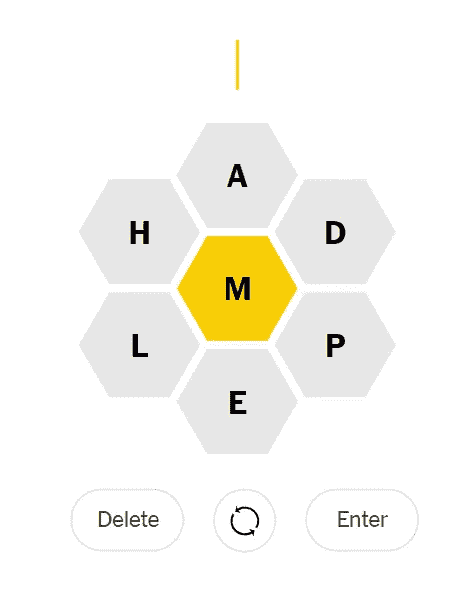
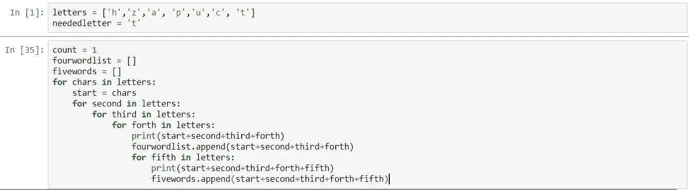
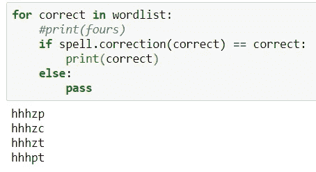
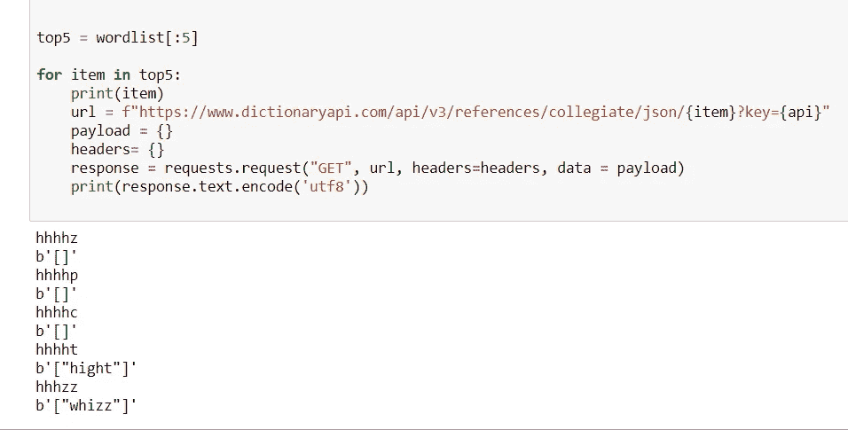

# Python 中的拼写检查

> 原文：<https://medium.com/analytics-vidhya/spellcheck-in-python-2cbd7474f73f?source=collection_archive---------16----------------------->

最近，我在做一个项目，作为精神测试。我在看《纽约时报》的拼字比赛，我对自己说，“我敢打赌，编写一个 Python 脚本会很容易，它可以给我拼写比赛中所有的单词。”现在，我知道，开发一个能打败这个游戏的代码破坏了脑力锻炼的目的，但是我想我还是要试试。

拼字比赛布局

对于那些不熟悉拼字比赛的人，你有七个字母可以用来造字。在列表的中间，你有一个必须在每个单词中使用的字符。每个单词至少需要四个字符长。

这是一个简单的概念，但我认为我可以加快这个过程。我想我可以得到字符的每一次迭代，然后将它们与某种拼写检查器进行比较，以验证它们确实是单词。从那里我可以快速输入单词，然后就可以收工了。

创建迭代部分并不困难。我用一种公认的效率低下的方式做了我的脑力练习，而且只是对单词做了嵌套循环。

现在，就像我说的，这是一个非常过度编码的方法，但我尝试使用一些迭代工具，如使用迭代库和导入组合函数。然而，这只会给我最少的迭代次数，不会达到我需要的水平。例如，我用组合函数只能得到大约 300 个组合。然而，当我对这四种字符组合使用循环时，我发现了 2401 种组合。五个单词的组合找到了 16807。

现在，作为测试的一部分，一旦我有了组合列表，我需要找出哪些组合实际上是单词。尽管为了提高计算效率，我首先删除了没有必要字母的所有组合。在我的测试案例中，字母“T”。这使我们的名单从大约 19000 人减少到大约 14000 人。

现在，讨论的关键是。如何发现哪些单词是实际单词！我的第一个想法是，“嘿，我打赌有一个拼写检查 Python 库。”我是对是错。首先，我找到了[拼写检查器](https://pypi.org/project/pyspellchecker/)，我喜欢这个主意。然而，它并没有完全给我我所寻找的。它告诉我这个单词可能是什么，但是它没有给出正确拼写的布尔值 True 或 False。据我所知，没有 Python 库这样做。所以，我的逻辑测试是看 Pyspellchecker 建议的单词是否等于已有的单词，我弄得一团糟。

天啊，这对我的工作来说真是一团糟。如果组合词和一个单词很接近，拼写检查会做得很好，但是如果你只是给它一个混乱的组合，你不会得到一个连贯的答案。筛选这是一个巨大的头痛，我想看看实际的文字大使。梅里亚姆-韦伯斯特词典。韦氏词典幸好有一个 [API](https://dictionaryapi.com/) ！然而，免费版本的 API 一天只允许 1000 个请求，这对我的测试来说是不够的。[牛津词典](https://developer.oxforddictionaries.com/#plans)也为他们的 API 设定了类似的价格。

我想广告[邮递员](https://www.postman.com/)真快！我喜欢使用它来获得 API 响应，如果你还没有使用过它，但对 API 请求感到沮丧，你必须现在开始！(他们无论如何都不给我报酬，但他们很棒！

现在，当我使用 Postman 并为我的请求编写脚本时，我从韦氏词典得到了这些结果:

这样更好，但是像“Hight”(意思是“被命名”并且不使用必要的字母)这样的罕见单词仍然出现，并且混淆了我正在经历的练习。

因此，根据我的经验，如果你试图做简单的拼写纠正，请随意使用 PySpellChecker，但如果你试图在成千上万的组合中找到一致的结果，你可能需要为 API 付费，这也可能不会带来你想要的结果。