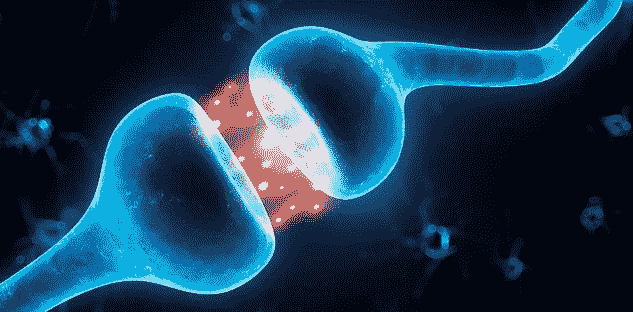
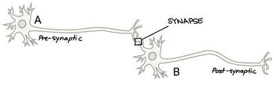
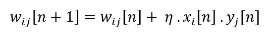
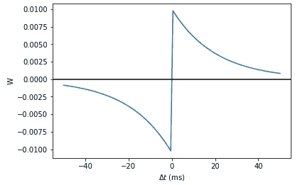
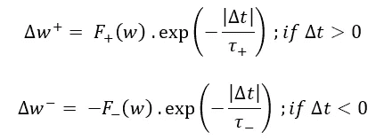

# 尖峰时间相关可塑性

> 原文：<https://medium.com/analytics-vidhya/spike-time-dependent-plasticity-eef34fe0ce8f?source=collection_archive---------14----------------------->

**什么是尖峰时间依赖性可塑性？**

梯度下降反向传播是人工神经网络的基本学习规则。该规则依赖于损耗函数，并试图通过使用损耗的导数作为反馈来最小化网络的总损耗。尽管人工神经网络的直觉来自我们大脑中的自然神经网络，但这两者之间存在许多差异，学习规则就是其中之一。自然神经网络的基本学习规则与反向传播有很大不同。

大多数具有反向传播的神经网络聚焦于固定目标。这意味着，一旦神经网络被训练用于一个特定的任务，它会覆盖旧的权重并忘记它被训练的旧模式。在人工神经网络中，这种现象被称为灾难性遗忘。自然神经网络不容易受到灾难性学习的影响，并且它们能够利用新的输入进行连续学习(大部分在整个生命周期中)。为了将人工神经网络提高到这样的水平，需要一个动态的学习规则。

自然神经网络具有简单的学习规则，其中一个特定连接/突触的权重动态仅取决于连接神经元的活动，而不取决于整个网络的活动。

神经突触

**赫布边法则**

最简单和最古老的学习算法之一，据称存在于自然神经网络中。假设从神经元 A 到神经元 B 有一个连接，在大脑中，这个连接，神经元 A(发送者)和神经元 B(接收者)分别称为突触、突触前神经元和突触后神经元。根据 Hebbian 学习规则，如果两个神经元被一起激发，这两个神经元之间的突触权重可以增加。

在数学中，赫比规则表达如下。

这里，***w ij【n】***是在时间步***【n】******η***是学习规则系数***Xi【n】***和 ***是从突触前神经元**到 ***j*** 的突触上的权重*****

**但是，赫比规则的一些性质使它不适合作为生物学习规则。**

**最主要的因素是没有一个合适的方法来降低突触重量。当两个神经元一起放电时，突触重量只能增加。尽管一些研究已经提出了扩展版的赫布边法则来减轻突触重量，但它们在生物学上并不合理。Hebbian 的另一个问题是，没有考虑突触前锋电位和突触后锋电位的时间差。两个神经元不可能同时放电。这两者之间应该有一个时间上的差异，并且它不被认为是这个学习规则的一个重要因素。**

****尖峰时间相关可塑性****

**STDP 规则的出现为这些问题提供了答案。这里，突触权重更新依赖于前后尖峰的时间差异的符号和大小。根据 STDP 的观点，在突触后锋电位发放之前，突触前锋电位的重复发放可以导致突触重量的长期增加，而在突触前锋电位发放之前，突触后神经元的重复发放可以导致突触重量的减少。**

****

**STDP 规则中更新的权重 w.r.t .时间差异**

****

*****δt = ti—TJ***是突触后和突触前棘波之间的时间差 ***F(w)*** 描述了更新对突触当前权重的依赖性。**

**一些生物学研究表明，如果时间差太小，无论锋电位前后的顺序如何，突触变化都将是正的(体重增加)。结果，频繁放电的神经元之间的连接强度总是增强。**

**然而，实现这个 STDP 规则被认为是计算上昂贵的任务，因为为了更新突触权重，我们必须跟踪每个神经元的尖峰时间来计算时间差。“突触痕迹”是研究人员用来实现 STDP 相同效果的更有效的方法。如果你想用 STDP 作为你的神经网络的学习规则，参考更多关于这个主题的内容。**

**希望这对你有帮助。**

**谢谢你。**