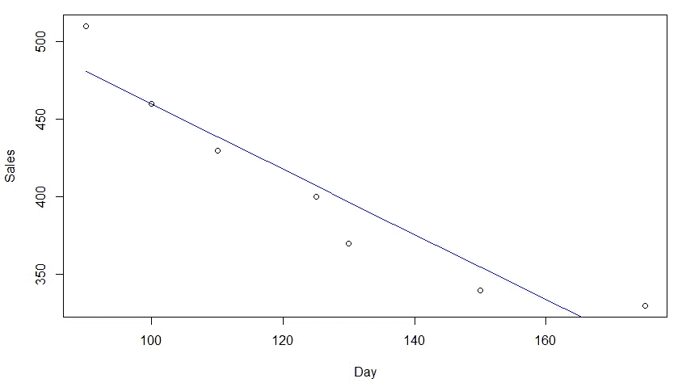

# R 中的样条回归

> 原文：<https://medium.com/analytics-vidhya/spline-regression-in-r-960ca82aa62c?source=collection_archive---------0----------------------->

当回归这个词出现时，我们只能回忆起线性回归和逻辑回归。这两种回归是最流行的模型，尽管在不同的情况下有不同类型的回归模型是有用的和有用的。

今天让我们讨论使用 r 的样条回归。在进一步回归之前，你应该对样条有基本的了解。

样条是由多项式分段定义的特殊函数。术语“样条”用来指在需要数据插值和/或平滑的应用中使用的一大类函数。数据可以是一维的，也可以是多维的。

样条回归是**非参数回归技术**的一种。在这种技术中，数据集被分成间隔或点的仓，我们称之为结。这个箱子也有单独的配件。我们将通过一个简单的例子来理解使用 r 实现样条回归。

我创建了一个虚拟数据，如下所示:

数据可视化

让我们将我们的数据绘制成，如下图所示:

天数与销售图

现在，我们将对我们的数据进行简单的线性回归，看看它是如何工作的。直线的方程式是:

直线方程

拟合简单线性模型

简单线性模型综述

让我们用回归线来拟合我们的模型:

绘图回归线

回归线

我们可以看到，我们的模型非常适合我们的数据，而且 R 平方和调整后的 R 平方值非常差。

现在让我们尝试 2 次多项式回归，并分析模型的性能。所以，直线方程变成了:

直线方程

二次多项式回归

多项式回归综述

绘图回归线

回归线

我们可以看到，这不是一个坏的适合，但也不是一个伟大的。多项式回归也有各种缺点，容易过度拟合。随着功能数量的增加，这可能会导致复杂性的增加。

多项式回归的缺点可以通过使用样条回归来克服。多项式回归仅捕获非线性关系中的一定量的曲率。另一种通常更好的非线性关系建模方法是使用样条。

样条曲线提供了一种在固定点(称为结)之间平滑插值的方法。在结之间计算多项式回归。换句话说，样条是一系列串在一起的多项式段，在节点处连接。

在样条回归的情况下，我们将数据集分成多个箱。对于我们的情况，让我们将数据集分成两个箱。所以，我们假设在第 90 天左右。一个在第 90 天出现的峰值的左侧，另一个在其右侧。现在让我们相应地绘图。

现在我们需要将上述两幅图像合并成一个方程，并使用阶跃函数执行样条回归或分段回归。让我们看看它是怎么做的。为此，我们首先需要创建一个新的分类变量，如果 Day > 90，则 1 否则为 0。

创建分类变量

操作后的数据

让我们根据这些数据来拟合这个模型。

拟合线性模型

摘要

我们可以看到，R 平方和调整后的 R 平方值增加了很多。现在让我们看看我们的回归线是如何拟合的。

情节线索

回归线

现在，让我们介绍 R 中的 **spline** 包，它包括用于在回归模型中创建 b 样条项的函数 **bs** 。我将介绍一个使用 **Ecdat** 包和**服装**数据集的新例子。

加载库

现在让我们来拟合我们的模型。我们必须标明结的数量和位置。最常用下降值在第 25、50 和 75 百分位。

拟合模型

模型摘要

我们已经使用 lm()函数建立了简单的线性模型。然而，我们还使用了 bs()函数，它允许我们创建样条回归模型。

记住，R 中默认的样条模型是一个三次多项式。这是因为肉眼很难发现结处的不连续性。

我们现在准备绘制我们的模型。下面的代码绘制了模型，包括回归线(红色)、置信区间(绿色)以及每个结的位置(蓝色)。

回归样条图

# **如何选择结的数量和位置？**

当我们拟合样条曲线时，我们应该在哪里放置节点？回归
样条在包含大量节点的区域中最为灵活，因为在
这些区域中，多项式系数可能会快速变化。

因此，一种选择是在我们认为函数变化最快的地方放置更多的结，而在看起来更稳定的地方放置更少的结。
虽然这个选项可以很好地工作，但实际上以统一的方式放置结是很常见的。

一种方法是指定所需的自由度，然后让软件在数据的统一分位数上自动放置相应数量的结。

# **我们的样条曲线应该包含多少个自由度？**

一种选择是尝试不同数量的结，看看哪种结能产生最好看的曲线。更客观的方法是使用交叉验证。

使用这种方法，我们删除一部分数据(比如 10 %)，用一定数量的节点拟合剩余数据，然后使用样条对保留的部分进行预测。

我们重复这个过程多次，直到每个观察值都被忽略一次，然后计算总的交叉验证 RSS(残差平方和)。对于不同的节数 K，可以重复这个过程。然后选择给出最小 RSS 的 K 值。

因此，我想结束这篇文章。在这篇博客中，我们能够理解样条回归及其工作原理。样条回归还有很多要研究的，如光滑样条、三次样条等。让我们在我的下一篇博客中看到这些。

希望你们能够理解并抓住样条回归的思想。