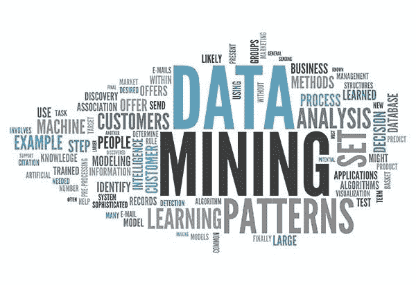

# 数据挖掘的分离-应用-组合策略

> 原文：<https://medium.com/analytics-vidhya/split-apply-combine-strategy-for-data-mining-4fd6e2a0cc99?source=collection_archive---------0----------------------->

在典型的探索性数据分析中，我们通过在某个粒度级别划分数据集，然后在该粒度聚合数据来理解中心趋势。同样， [Hadley Wickham](https://www.jstatsoft.org/article/view/v040i01) 的一篇著名(必读)论文将拆分-应用-组合策略概括为数据分析中最常见的策略之一。无论是市场细分，还是任何行为研究…