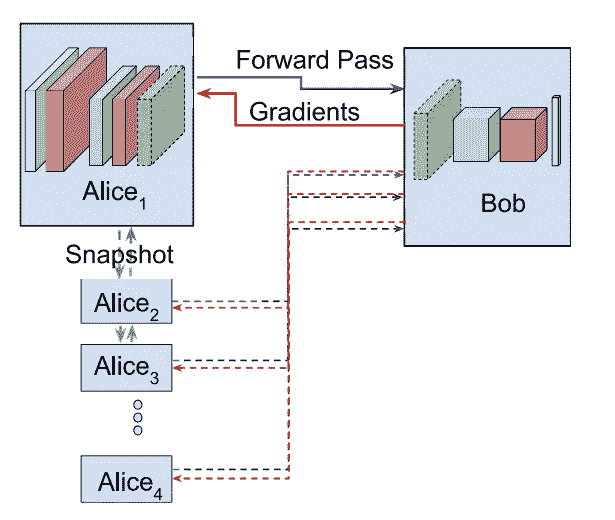
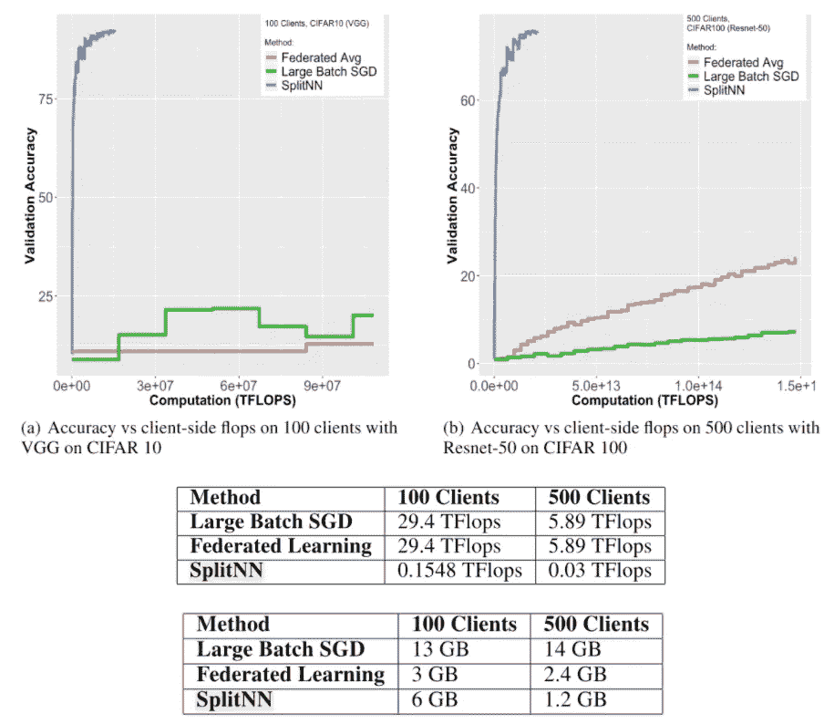
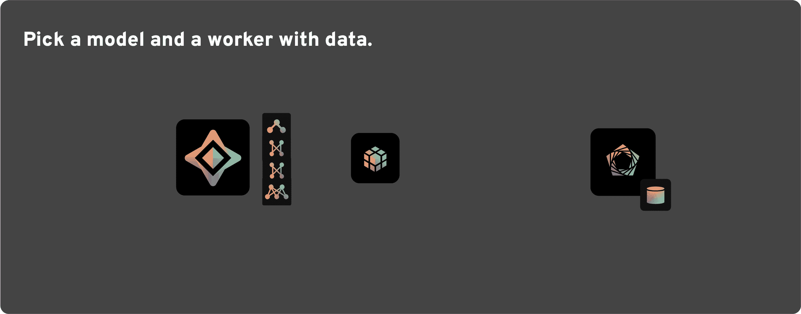
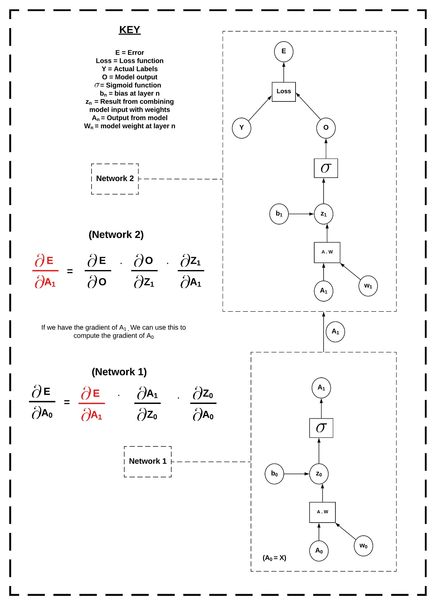

# PySyft 上的分裂神经网络

> 原文：<https://medium.com/analytics-vidhya/split-neural-networks-on-pysyft-ed2abf6385c0?source=collection_archive---------2----------------------->


**摘要:**在这篇博客中，我们将介绍一种新的分散式学习方法，叫做“分裂神经网络”。我们将研究一些理论，然后深入一些代码，让我们能够在 PySyft 上运行它们。

# 隐私和数据产业

从历史上看，机器学习架构建立在所有机器学习算法都将被集中的假设之上，其中训练数据和模型都在相同的位置，并且为研究人员所知。然而，越来越多的人希望将学习技术应用于数据传统上敏感或隐私的领域，如医疗保健、运营物流或金融。在医疗保健领域，这些类型的应用有能力通过增强诊断准确性和通过使用合格的临床决策支持系统增加医生对患者的时间效率来改善患者的结果。

然而，直到最近这种创新的道路上还存在一个障碍，数据隐私*。*目前，数据所有者不可能*真正*知道他们的数据没有被出售，没有被用于他们之前不同意的事情，也没有被保留超过预期的时间。这导致了数据处理者和数据所有者之间的信任问题。当数据被收集后，充分管理其所有者的同意就更加困难了。这使得传统的、集中的行业模式不可能应用于 GDPR 会议后的数据实践。

出于这些原因，集中式学习架构要么成为创新的障碍，要么成为相关数据所有者的隐私风险。对私人数据的研究要么因隐私分歧而受阻，要么继续进行，给数据主体带来潜在的灾难性社会和政治后果。

科技行业仍在努力追赶我们这个时代的标志性创新之一；区块链。然而，尽管分布式账本技术将成为下一代互联网的核心，但它只是标志着系统架构更大变革的开始。离开瓶子的精灵是**去中心化**。

采用这一原则是为了建立工具，使资源分散化和多所有者治理体现公民的隐私权和安全权。这通过以前无法获得的信息资源打开了创新之门；私人数据。处于这一转变前沿的一个社区是露天开采的。他们的私人 AI 工具叫做 [PySyft](https://www.openmined.org/) 。

# 分裂神经网络

传统上， [PySyft](https://www.openmined.org/) 已经被用来促进[联邦学习](https://blog.openmined.org/upgrade-to-federated-learning-in-10-lines/)。然而，我们也可以利用这个框架中包含的工具来实现分布式神经网络。这使得研究人员能够处理远程保存的数据，并以一种完全分散的方式计算预测。SplitNNs 由麻省理工学院于 2018 年 12 月首次推出，代表了一种全新的架构机制，供隐私保护的 ML 研究人员使用。

## 什么是分裂？

神经网络(NN)的训练在两台或多台主机上“分开”进行。每个模型段都是一个独立的神经网络，它为前面的模型段提供信息。在这个例子中，Alice 具有未标记的训练数据和网络的底部，而 Bob 具有相应的标签和网络的顶部。下图显示了这个训练过程，其中 Bob 拥有所有标签，并且有多个带有 *X* 数据[【1】](https://arxiv.org/abs/1810.06060)的 Alices。一旦第一个 Alice 训练完毕，她会将她的底层模型副本发送给下一个 Alice，一旦所有 Alice 都训练完毕，训练就完成了。



[https://arxiv.org/abs/1810.06060](https://arxiv.org/abs/1810.06060)

## 为什么使用 SplitNN？

SplitNN 已被证明可以显著降低训练的计算负担，同时在训练大量客户端时保持较高的精度[ [2](https://arxiv.org/abs/1812.00564) ]。在下图中，蓝线表示使用 splitNN 的分布式深度学习，红线表示联邦学习(FL)，绿线表示大批量随机梯度下降(LBSGD)。



[https://arxiv.org/abs/1812.00564](https://arxiv.org/abs/1812.00564)

表 1 显示了在 VGG 上空训练 CIFAR 10 时消耗的计算资源。这些只是 FL 和 LBSGD 资源的一小部分。表 2 显示了在 ResNet 上训练 CIFAR 100 时的带宽使用情况。少于 100 个客户端的联合学习对带宽的要求较低。然而，随着客户端数量的增长，SplitNN 优于其他方法。

## 训练分裂



训练分裂

用 SplitNN 作出的预测非常简单。我们所要做的就是得到我们的数据，使用底部的部分进行预测，并将预测发送到下一个模型部分。当分段器接收到预测时，我们使用先前预测作为我们的输入数据来进行新的预测。然后，我们将它发送给下一个模型。我们一直走，直到到达最后一层。在预测的最后，我们有最终的预测和每个模型的计算图。计算图表记录了从输入数据到预测的转换，在反向投影阶段非常有用。

在 PyTorch 中，计算图允许自动签名的函数快速区分函数中使用的变量和损失函数。自动签名产生梯度，然后我们可以用它来更新模型。然而，在 PyTorch 中，这个方法并没有被设计成分布式的。为了进行这种自动计算，我们没有将计算图中的所有变量放在一个地方。在我们的方法中，我们通过在每个模型段上执行部分反向投影来解决这个问题，因为我们向后处理损失。我们通过在进行过程中发回相关梯度来实现这一点。

考虑下面的计算图的例子。我们想计算一直回到 *W₀* 和 *B₀* 的梯度，它们是*网络 1* 中的权重和偏差。然而，我们的模型在 A₁.分裂这是*网络 1* 的输出和*网络 2* 的输入。为了解决这个问题，我们计算网络 2 的输出 *O* 的损耗，并计算回到 *A₁、W₁* 和 *B₁* 的梯度。然后，我们将计算出的 *A₁* 的梯度发送回*网络 1* ，并使用它们继续该位置的梯度计算。一旦我们有了梯度，所有的权重和偏差都回到了 *W₀* 和*b₀*，我们就可以朝着这些梯度的方向前进。



我们在各个时期重复这一过程来训练模型。一旦我们训练了足够多的时期，我们就把模型片段送回给研究者。然后，研究人员可以汇总更新的片段，并保留训练好的模型。

# 实现拆分 NN

接下来，我们将进入一个小代码示例，其中我们使用 splitNN 对 MNIST 数据集进行预测。首先我们定义 SplitNN 类。它将一组模型及其链接的优化器作为其输入。

```
**class** **SplitNN**:
    **def** __init__(self, models, optimizers):
        self.models = models
        self.optimizers = optimizers

    **def** forward(self, x):
        a = []
        remote_a = []

        a.append(models[0](x))
        **if** a[-1].location == models[1].location:
            remote_a.append(a[-1].detach().requires_grad_())
        **else**:
            remote_a.append(a[-1].detach().move(models[1].location).requires_grad_())

        i=1    
        **while** i < (len(models)-1):

            a.append(models[i](remote_a[-1]))
            **if** a[-1].location == models[i+1].location:
                remote_a.append(a[-1].detach().requires_grad_())
            **else**:
                remote_a.append(a[-1].detach().move(models[i+1].location).requires_grad_())

            i+=1

        a.append(models[i](remote_a[-1]))
        self.a = a
        self.remote_a = remote_a

        **return** a[-1]

    **def** backward(self):
        a=self.a
        remote_a=self.remote_a
        optimizers = self.optimizers

        i= len(models)-2   
        **while** i > -1:
            **if** remote_a[i].location == a[i].location:
                grad_a = remote_a[i].grad.copy()
            **else**:
                grad_a = remote_a[i].grad.copy().move(a[i].location)
            a[i].backward(grad_a)
            i-=1

    **def** zero_grads(self):
        **for** opt **in** optimizers:
            opt.zero_grad()

    **def** step(self):
        **for** opt **in** optimizers:
            opt.step()
```

然后，我们用 PySyft 导入我们所有的常规导入来进行训练，设置一个 torch 钩子，并拉入 MNIST 数据。

```
**import** **numpy** **as** **np**
**import** **torch**
**import** **torchvision**
**import** **matplotlib.pyplot** **as** **plt**
**from** **time** **import** time
**from** **torchvision** **import** datasets, transforms
**from** **torch** **import** nn, optim
**import** **syft** **as** **sy**
**import** **time**
hook = sy.TorchHook(torch)
```

接下来，我们定义将要分布的网络。在这里，我们要建立一个简单的三层网络。然而，我们可以对任何大小或形状的网络进行此操作。每个部分都有自己的独立网络。重要的是一段与下一段连接处的层的形状。发送层的输出形状必须与接收层的输入形状相同。有关如何为这个特定数据集选择模型参数的更多信息，请阅读这篇精彩的教程。

```
torch.manual_seed(0)  *# Define our model segments*input_size = 784
hidden_sizes = [128, 640]
output_size = 10models = [
    nn.Sequential(
                nn.Linear(input_size, hidden_sizes[0]),
                nn.ReLU(),
    ),
    nn.Sequential(
                nn.Linear(hidden_sizes[0], hidden_sizes[1]),
                nn.ReLU(),
    ),
    nn.Sequential(
                nn.Linear(hidden_sizes[1], output_size),
                nn.LogSoftmax(dim=1)
    )
]*# Create optimisers for each segment and link to them*
optimizers = [
    optim.SGD(model.parameters(), lr=0.03,)
    **for** model **in** models
]
```

现在是时候定义一些工人来管理我们的模型，并将模型发送到他们的位置。

```
*# create some workers*
alice = sy.VirtualWorker(hook, id="alice")
bob = sy.VirtualWorker(hook, id="bob")
claire = sy.VirtualWorker(hook, id="claire")

*# Send Model Segments to model locations*
model_locations = [alice, bob, claire]
**for** model, location **in** zip(models, model_locations):
    model.send(location)
```

接下来，我们建立 splitNN。要做到这一点，所需要做的就是让模型段处于它们的起始位置，并与它们各自的优化器配对。

```
*#Instantiate a SpliNN class with our distributed segments and their respective optimizers*
splitNN =  SplitNN(models, optimizers)
```

接下来，我们定义一个训练函数。splitNN 的用法与传统模型非常相似。所需要的只是第二个反向投影阶段，以将梯度推回到片段上。

```
**def** train(x, target, splitNN):

    *#1) Zero our grads*
    splitNN.zero_grads()

    *#2) Make a prediction*
    pred = splitNN.forward(x)

    *#3) Figure out how much we missed by*
    criterion = nn.NLLLoss()
    loss = criterion(pred, target)

    *#4) Backprop the loss on the end layer*
    loss.backward()

    *#5) Feed Gradients backward through the network*
    splitNN.backward()

    *#6) Change the weights*
    splitNN.step()

    **return** loss
```

最后，我们进行训练，在训练过程中向起始位置发送数据。

```
**for** i **in** range(epochs):
    running_loss = 0
    **for** images, labels **in** trainloader:
        images = images.send(models[0].location)
        images = images.view(images.shape[0], -1)
        labels = labels.send(models[-1].location)
        loss = train(images, labels, splitNN)
        running_loss += loss.get()

    **else**:
        print("Epoch **{}** - Training loss: **{}**".format(i, running_loss/len(trainloader)))
```

[完整的例子可以在 PySyft Github 上看到。](https://github.com/OpenMined/PySyft/blob/master/examples/tutorials/advanced/Split%20Neural%20Network/Tutorial%202%20-%20MultiLayer%20Split%20Neural%20Network.ipynb)

# 结论

现在你有了它，一个在准确性、计算复杂性和网络资源方面与联邦学习竞争的新工具。关注与隐私保护方法相关的更多更新，如同态加密和安全多方计算。

如果你喜欢这样，那么你可以通过多种方式为 OpenMined 做贡献。

## GitHub 上的 Star PySyft

帮助我们的社区的最简单的方法就是启动存储库！这有助于提高我们正在构建的酷工具的知名度。

*   [明星 PySyft](https://github.com/OpenMined/PySyft)

## 试试我们在 GitHub 上的教程吧！

我们制作了非常好的教程，以更好地理解保护隐私的机器学习以及我们为使其易于实现而创建的构建模块！

*   [查看 PySyft 教程](https://github.com/OpenMined/PySyft/tree/master/examples/tutorials)

## 加入我们的队伍！

了解最新进展的最佳方式是加入我们的社区！

*   [加入 slack.openmined.org](http://slack.openmined.org/)

## 加入一个代码项目！

为我们的社区做贡献的最好方式就是成为代码贡献者！如果你想开始“一次性”的迷你项目，你可以去 PySyft GitHub 问题页面搜索标有`Good First Issue`的问题。

*   [先发行好门票](https://github.com/OpenMined/PySyft/issues?q=is%3Aopen+is%3Aissue+label%3A%22good+first+issue%22)

## 捐赠

如果您没有时间为我们的代码库做出贡献，但仍然愿意提供支持，您也可以成为我们开放集体的支持者。所有捐款将用于我们的虚拟主机和其他社区开支，如黑客马拉松和聚会！

*   [通过 OpenMined 的开放集体页面捐赠](https://opencollective.com/openmined)