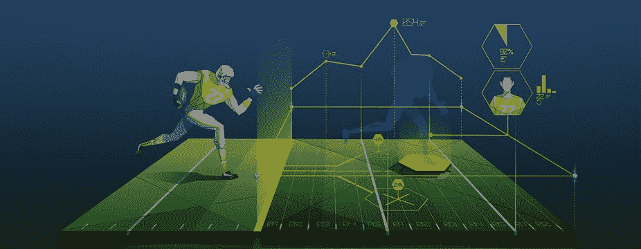
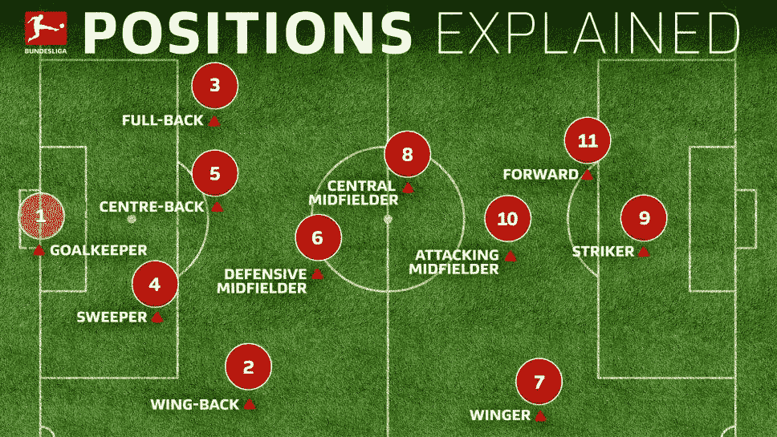
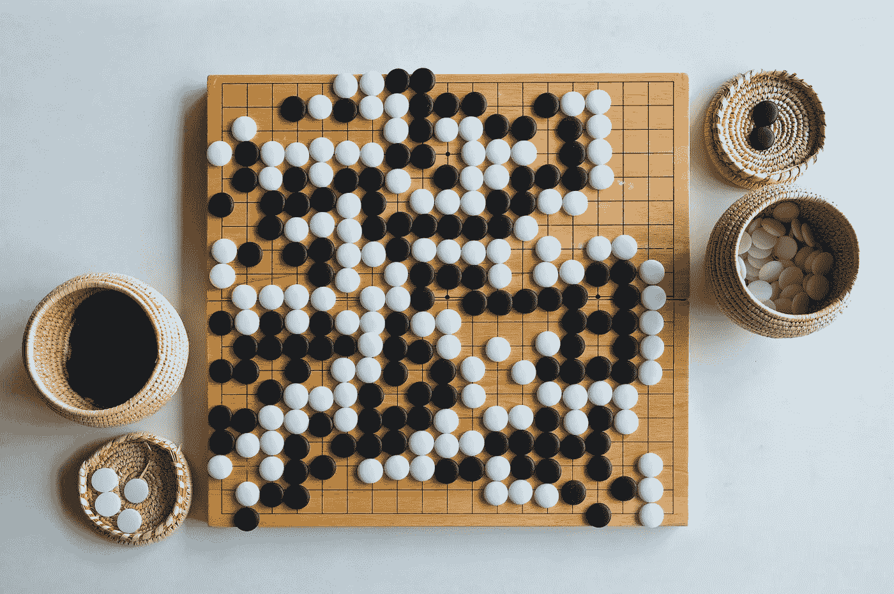
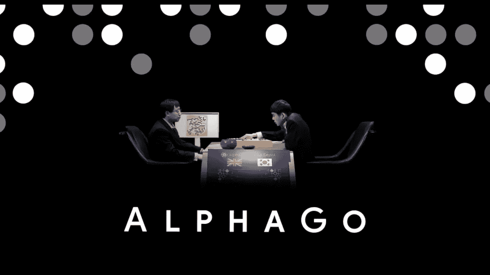
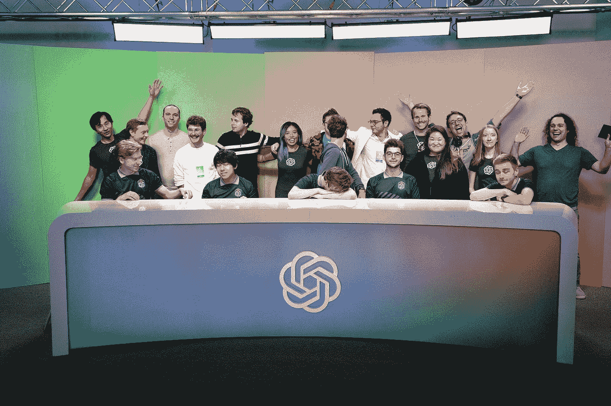
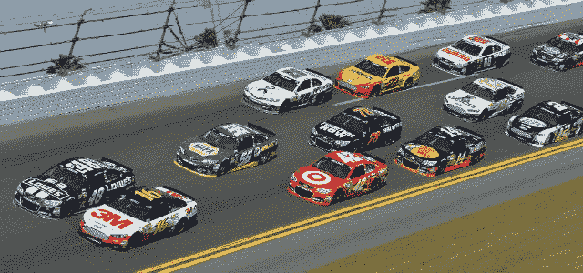
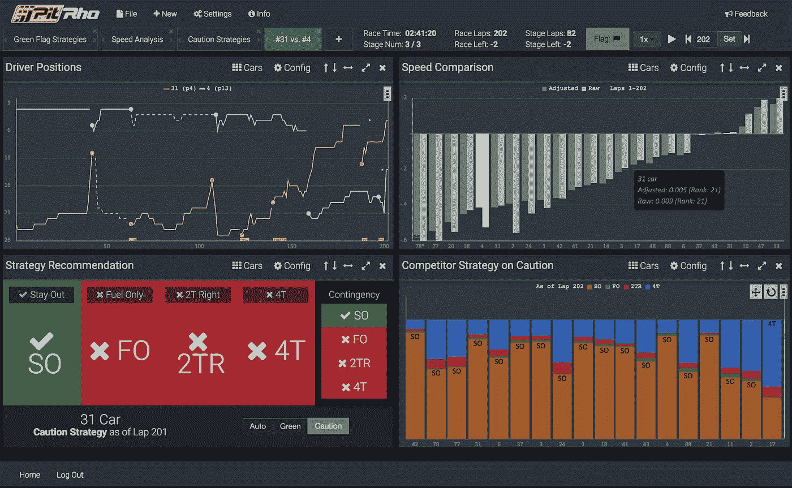

# 人工智能制胜战略:体育分析！

> 原文：<https://medium.com/analytics-vidhya/sports-analytics-ai-in-sports-5ea645d2e0af?source=collection_archive---------11----------------------->

我们都喜欢运动，运动是人类创造的令人兴奋的东西，它不仅对健康有益，而且对许多人来说，它已经成为独立的职业。现在你问人工智能和田径运动有什么关系？所以系好你的安全带，因为我们开始了！。

体育不仅仅是你在比赛中坚持比赛，还包括决定如何比赛。所以基本上，如果你想赢得任何比赛，你需要打好比赛。简单？是的，一种。但是你不需要在整个比赛中打得很好，它只是在比赛的关键时刻打得最好，这一切都改变了一切，就像板球比赛一样，每个队都需要进行防守/投球和击球。一个球队不需要在击球和投球上都表现完美。一个体面的击球与伟大的击球或体面的击球与严密的防守将使球队赢得这场比赛。

不仅仅是计划的决定，球员的位置也会对比赛产生影响，比如足球。哪些球员应该在前锋位置？所有球员都应该防守，中锋，甚至守门员都会有所不同。

所以我想你明白了。体育就是战略规划和适时执行。就拿足球本身来说，尽可能多地尝试防守，努力在规定时间内进球，这些对于赢得比赛都很重要，那么伟大的战略计划到底需要什么呢？回答经验，等等你听说过“**经验**”吗？是的，做出好的决定需要经验。

那么经验到底是什么意思呢？经验是先前采取的产生最佳结果的行动，无论是教练还是球员在考虑情况时采取的行动。这听起来像任何机器学习概念吗？没错就是**强化学习**。强化是机器学习的一个领域，在这里一个*代理*将被训练来自我学习，其中*根据*环境*奖励*自己每一个好的/正确的动作，而*惩罚*每一个坏的/正确的动作，并且每一个*状态*都被记录为经验*。*

所以现在你知道人工智能和游戏是如何联系在一起的了。像这样在这个领域使用这项技术被称为**体育分析**。人工智能会在已经存在大量数据的领域中创造奇迹，未来的结果会让人工智能变得如此特别，以至于在某个时候，只需几个小时的训练，预测就会比任何有几十年经验的领域专家好得多。

先说两个让人们瞠目结舌的最佳球员。**谷歌 AlphaGo** 和 **OpenAI** 是机器学习系统，它们在游戏中击败了最好的玩家。

AlphaGo 是英国 DeepMind Technologies 公司开发的计算机程序，后来被谷歌收购。AlphaGo 被编程为玩围棋棋盘游戏，这种游戏看起来最简单，但玩起来和计划起来却很复杂。这是一个简单的两个玩家的游戏，游戏中会有两个白棋和两个黑棋，你需要比你的对手占据更多的地盘。正如所说的简单而复杂

到目前为止，世界上最好的人类围棋冠军是李·塞多尔，他在 2016 年与 AlphaGo 进行了比赛，AlphaGo 在一次比赛中击败了李，赢得了 18 个世界冠军。AlphaGo 已经经历了许多次迭代，它自己预测人类在特定情况下会做什么以及如何处理它。永远不要忘记，这个程序从完全空白的随机移动开始，后来以这种方式训练，得到了数百万种发挥它的模式。AlphaGo 神经网络使用白板。

围棋棋盘游戏是一种古老的游戏，所以现在让我们来谈谈现代和更具战略性的游戏**DOTA 2**，这是一种在线游戏，5 人小组互相对抗，击败对手团队每个成员的头像/角色，并征服高塔。比赛将在某个特定的竞技场进行，所有的动作都在这里发生，同样，队员的位置在这里非常重要，因为这个区域的自由空间比其他密集区域有更多的进攻空间。

以下是 OpenAI 团队如何成为 DOTA 2 世界冠军的，但在此之前，OpenAI 是 2015 年在加利福尼亚州旧金山成立的独立研究组织，埃隆·马斯克是创始人之一。简而言之，这是一家很酷的公司。好的，继续，公司再次使用强化学习来训练系统。该模型在同一个竞技场上用 5 个变量(玩家)从随机移动到更具战略性的移动反复训练了数千次。

到目前为止，OG(原始黑帮)团队已经连续两次赢得 DOTA 冠军，但在 2019 年，OpenAI Five 通过覆盖大多数安全区域的伟大战略计划击败了他们，这让世界震惊于具有伟大时代和庞大数据集的神经网络的能力。OpenAI Five 的每个网络都有一个单层的 1024 LSTM( *长短期记忆*)，可以通过 Valve 的 bot API 看到当前的游戏状态。

到目前为止，你已经了解了室内游戏和电子竞技中的人工智能，那么像老式赛车这样的室外游戏呢(*这基本上是在椭圆形赛道上的赛车，在一定时间内跑固定的圈数，用更少时间跑完所有圈数的最快的车将赢得比赛*)现在你将了解为什么要进行赛车，有什么要决定或计划去赢得比赛，这都是关于速度的。是的，你是对的，这是关于速度的问题，但是有很多因素会决定赛车的速度，比如什么时候进站？(*跑几圈后给车换轮胎、加油等*)什么时候加速追上对手？什么时候减速才能顺利转弯？保持什么速度？。这份清单还在继续，每件事都很重要，像很快点蚀汽车是不必要的，因为眼泪会很好，燃料会在那里，或者点蚀汽车晚了会导致磨损，耗尽燃料。这些可能会因为轮胎爆裂或最坏情况下的撞车而输掉比赛，这对车手来说是非常危险的。直到现在，讨论都是由车手或教练根据他们的直觉进行的，但现在 AI 得到了支持。

著名的纳斯卡赛车成为全球范围内的超级粉丝之一，迄今为止已经有数千场比赛，这又创造了巨大的数据。众所周知，数据越多，模型越好。因此，使用机器学习，一家名为“Rho AI”的公司建立了一个名为“Pit Rho”的软件，该软件是基于所有 NASCAR 以前比赛的所有巨大数据的训练而建立的系统，并且还跟踪特定汽车当前正在进行的比赛，并预测在那场比赛中获胜。

维修站 Rho 只是建议赛车维修，而不是什么时候维修？维修站仅仅是为了加油还是为了轮胎？如果是轮胎问题，是两个轮胎还是四个轮胎？还是什么都坑？这些讨论是由一个软件通过查看汽车的转向，制动和节流记录下来的，基于这些讨论将在屏幕上弹出，完全是实时的。机器的预测被发送到主要工作人员的首席进行进一步的讨论，因为在 NASCAR 中的点蚀是获胜的关键，因为如果你点蚀轮胎，例如将需要更多的时间进行研磨，但在用新轮胎点蚀汽车后，速度将再次提高，这是困难的，并且比以前的轮胎更安全。

Pit Rho 软件的界面。

就像我们看到的一些统计知识和一些庞大的数据会使体育分析在获胜方面如此有效，今天体育分析正在板球、足球、篮球、足球等领域出现。在这个领域，机器的预测和有几十年经验的专家一样准确。同样，所有体育行业对体育分析角色的需求也在呈指数级增长。