# 体育分析——使用板球解说产生可操作的见解

> 原文：<https://medium.com/analytics-vidhya/sports-analytics-generating-actionable-insights-using-cricket-commentary-9cd2fc341d87?source=collection_archive---------21----------------------->

# 概观

1.什么是体育分析？体育分析有哪些不同的用例？我们在这里回答这些问题

2.了解体育分析如何影响板球、足球和网球等运动

3.我们将研究一个有趣的体育分析用例——使用板球解说数据分析印度的表现！

# 介绍

多年来，职业体育的范围已经发生了变化。我记得我看了 2003 年板球世界杯的每一分钟，醒着的每一分钟都在跟踪统计数据，比如总得分、最高得分、最高得分率等等。

这是相当基本的东西，但足以让我粘在屏幕上。从那时起，时代发生了多么大的变化！

体育分析正迅速成为主流。媒体和领先的体育网站定期整理统计数据，产生深刻的技术见解，并添加我们以前从未见过的全新水平的分析。


我们现在可以非常自信地回答如下问题:

*   板球中的体育分析:当一垒和二垒击球时，球队赢得比赛的概率是多少？
*   足球中的体育分析:从禁区左侧射门的预期结果是什么？
*   网球运动分析:根据对手的回球统计，你应该把你的发球放在哪里

诸如此类。老实说，当谈到体育分析用例时，天空是无限的。我是一名体育爱好者，我一直在寻找可以应用我的分析和机器学习知识来改善团队战略和粉丝体验的应用程序。

在本文中，我将向您介绍令人惊叹的体育分析世界。我们将了解不同类型的体育分析，为什么这一领域如此重要，我们还将研究体育分析的一个用例——分析板球评论以产生见解。

# 目录

1.什么是体育分析？

2.体育分析的重要性

3.体育分析案例研究:分析板球评论

*   团队绩效
*   击球表演
*   保龄球表演
*   边界分析

# 什么是体育分析？

***体育分析是指从体育数据中分析和提取有用的见解***

我将体育分析大致分为两类:

1.  描述性体育分析
2.  预测体育分析

让我们在这里讨论每一类。

# 描述性体育分析

描述性体育分析是关于**以数字的形式总结体育数据**。换句话说，得出重要的统计数据。这听起来可能是一个简单的概念，但它是一个非常强大的概念。

描述性体育分析背后的思想在团队战术中起着至关重要的作用。

让我们以板球为例。在这里，我们可以分析击球手出局给特定投球手的频率。这个数字将决定一个队的保龄球策略。

这里有一个很棒的视频，分析了 Virat Kohli 对 Adam Zampa 的解雇:

这就是为什么在 2020 年澳大利亚的印度之旅中，每当 Virat Kohli 在折痕时，Adam Zampa 都会被带回来进行攻击。在这个系列赛中，Virat Kohli 在三场比赛中有两场输给了 Zampa！

板球中另一个有趣的用例是**分析球队在第一棒和第二棒击球时赢得比赛的概率。**这影响了赢得掷币的队长，他必须做出决定——先用球棒还是先用碗。


# 预测体育分析

预测体育分析是关于**利用体育数据**做出预测。板球中的一个这样的用例是**预测击球手在特定比赛中对对手得分**的次数。这将有助于球队管理层和队长为每场比赛选择最佳球队。

在足球这样的运动中，预测体育分析有助于了解在球场上任何位置进球的机会。

你可以为你最喜欢的运动想出类似的用例，并在文章下面的评论部分告诉我。

# 体育分析的重要性

体育分析是游戏规则的改变者——没有别的说法了。在体育领域使用分析会直接影响球队的决策，并可能改变球队或俱乐部(或国家)的未来。它可以轻易地改变比赛的结果。

> 体育分析可以改变游戏规则

体育领域的分析有很大的空间。在这一部分，我将讨论不同运动中的一些分析用例，如板球、足球和网球。

# 板球运动分析

在板球比赛中，我们可以**分析一名球员的强弱区域。这将有助于对手和玩家了解他的强项和弱项。**

*   对手可以制定一个策略来对付一个玩家(就像亚当·赞帕对付维拉特·科利一样)
*   玩家可以在他的弱点上投入更多的时间来改进他的游戏

这是一个很棒的视频，展示了 Virat Kohli 的薄弱环节:

# 足球运动分析

足球世界一直在缓慢地采用分析，但现在它正在迅速加快步伐。我们看到主流媒体使用分析数字，如预期进球和预期助攻，来分析球员和比赛。

您绝对应该关注预期目标(xG)指标。xG 基本上告诉我们一次射门转化为进球的概率。这因球员和拍摄位置的不同而不同。这是一个非常有趣的概念，你可以在这里[了解更多。](https://thelastlibero.net/2019/07/16/beginners-guide-football-analytics-terms/)

足球分析的另一个例子是在比赛进行时分析球队的阵型。这将有助于对手理解团队战略，并根据它进行比赛。

# 网球运动分析

在网球比赛中，我们可以确定一名球员通常为赢得一分而打出的击球组合。这对于准备对付对手的策略也非常有用。


我相信你一定看过网球大满贯赛每局结束后屏幕上出现的统计数据。诸如第一次发球的数量、发球的位置、发球的反弹以及对手捡起球的位置等特征——这些都是网球运动分析的例子。

# 体育分析案例研究:分析板球评论

现在让我们进行一个真实世界的案例研究，以了解体育分析是如何工作的。在这个案例研究中，我将深入研究我的个人爱好——板球。

我是板球比赛文字解说的狂热追随者。一个有洞察力的评论员详细描述了现场发生的事件，对吗？在许多体育网站上有很多在线板球评论，如 CricBuzz、ESPN·克里奇信息等。这是一个金矿，可以揭示一个团队和球员的许多有趣和有价值的见解。

**关于体育分析数据集:**

我收集了过去 4 年印度 T20 比赛的评论。点击从[下载样本数据集。是时候分析评论并找到一些有吸引力的见解了。我们开始吧！](https://drive.google.com/open?id=1gkQ_IoqJBGIpqdWqBTdEc9umh-Tal8Rh)

# 团队绩效

学完本节后，您将能够回答以下问题:

1.  一垒和二垒击球时的全队平均水平是多少？
2.  印度队多长时间赢一场比赛？
3.  印度赢得与某支球队比赛的概率有多大？
4.  印度队要赢得这场比赛的目标是什么？
5.  印度队防守过几次低分球？
6.  印度队哪一年最成功？

准备好了吗？现在让我们把手弄脏吧！

```
The total number of T20s India played in the last 4 years: 54
```

**印度每年参加 T20s 的人数**:

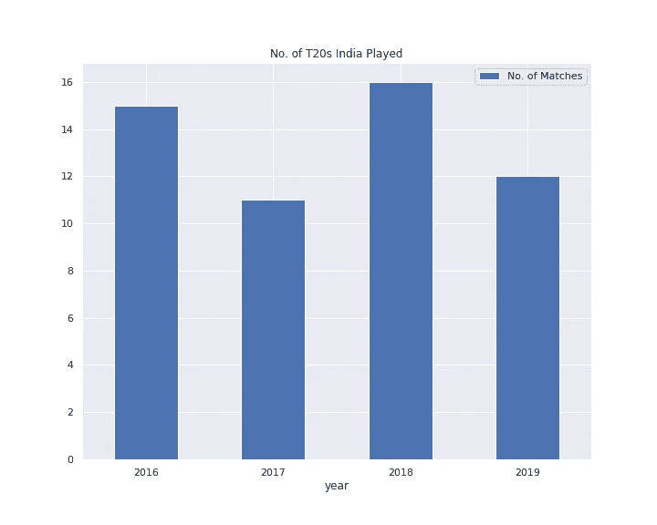

**推论**:

*   2018 年印度打 t20 次数最多，2017 & 2019 年打 t20 次数最少。这是因为 17 年的国际商会冠军奖杯和 19 年的国际商会世界杯

**全队平均水平(击球第一&第二):**

```
Batting First Team Average: 180.0
Batting Second Team Average: 156.0
```

**球队历年平均局数:**

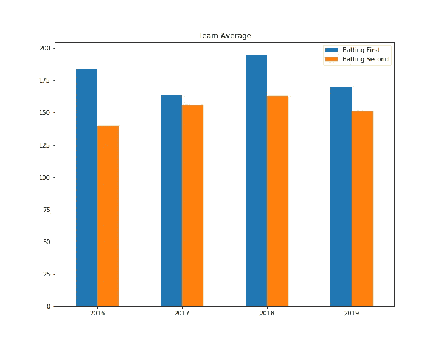

**推论**:

1.  2018 年最高击球第一平均接近 180。在 2018 年第一次击球时，印度平均得分为 180+分。因此，我们可以推断，印度在 2018 年拥有**最佳击球阵容**
2.  多年来，第二次击球的平均成绩总是低于第一次击球的平均成绩。由此可以推断，印度队定下的目标高于对手

**总胜率%(击球第一名&第二名):**

```
Over all Winning %      : 66.66 
Batting First Winning % : 59.0 
Batting Second Winning %: 76.0
```

**不同队伍的胜率:**

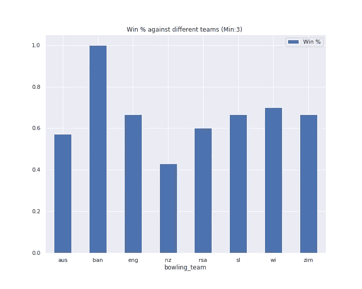

**推论**:

1.  印度几乎每场比赛都赢，对手是孟加拉国
2.  该队对新西兰队的胜率最低。印度输掉了 60%的比赛，因为新西兰是众所周知的最好的旋转球队

**击球第一胜得分:**

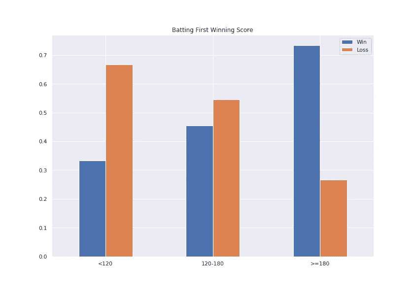

**推论**:

1.  印度得分后赢得比赛的概率:

*   少于 120 次运行(<120) is around 0.33
*   Between 120 and 180 runs (120–180) is around 0.4
*   Greater than 180 runs (> 180 次)为 0.75

1.  很高兴看到印度也为低得分比赛辩护

**历年获奖百分比:**

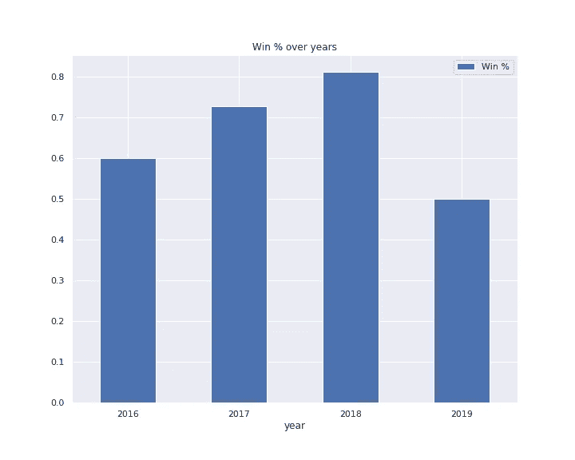

**推论**:

1.  团队绩效多年来一直在增长，然后在 2019 年下降
2.  印度在 2018 年创下最高胜率(82%)。该队赢得了 2018 年期间的大部分比赛
3.  2019 年打的 t20，印度输了一半。因此，2019 年的胜率最低(50%)。一个可能的原因可能是由于缺乏资深球员，因为球队在 2019 年国际刑事法院世界杯后为年轻人敞开了大门

# 击球表演

**在这一部分，我将从击球率的角度重点介绍印度队的击球表现。我们还将讨论印度的表现在一段时间内是如何演变的。**

**击球率**可以定义为每 100 个球得分的平均跑垒次数。击球率越高，击球手越好。

让我们找出印度队可以改进击球的阶段。

```
The strike rate of Indian team is 138.66
```

**球队历年击球命中率:**

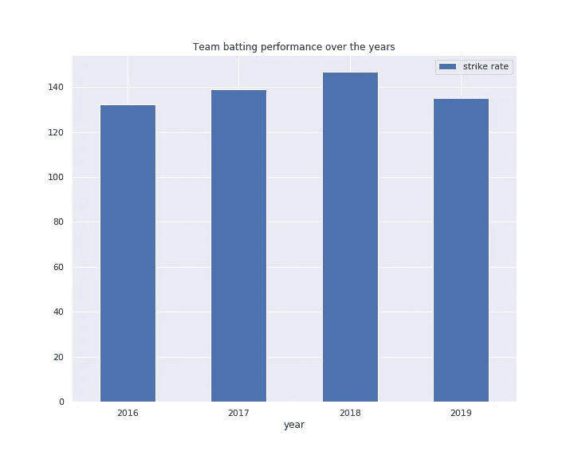

**推论**:

*   印度在 2018 年拥有最高的击球命中率。击球手接触得很好！

**一场比赛不同阶段的全队击球命中率:**

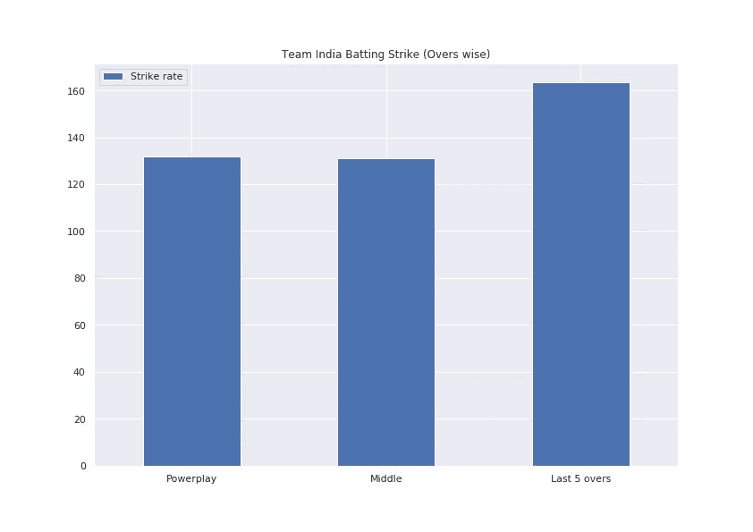

**推论**:

*   印度队最后 5 回合的命中率达到**150+**左右。在动力玩法和中音玩法中约为 **125+**

**历年比赛不同阶段的团队击球命中率**

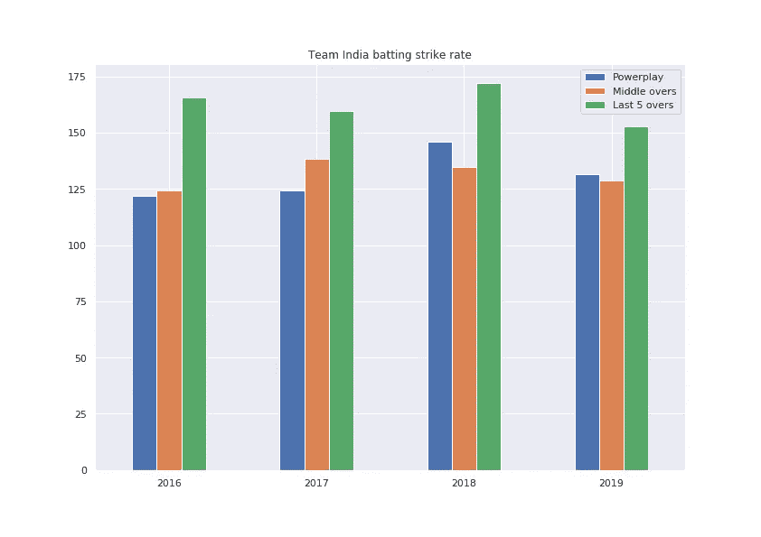

**推论**:

1.  2018 年，印度在所有 3 个阶段(强力击球、中间击球和最后 5 次击球)都创下了最高的击球命中率
2.  在 2018 年的最后 5 场比赛中，记录了最高的击球命中率，接近 175。让我想起了多尼的强有力的打击

# 保龄球表演

在这一部分，让我们从**经济率、保龄球命中率和保龄球平均水平**方面释放印度队的保龄球表现。以及性能如何随着时间的推移而演变。

*   **经济率**被定义为每场比赛的平均失球次数
*   **保龄球击球率**可以定义为一个三柱门的平均失球数
*   保龄球平均得分是三柱门失球的平均得分

是时候分析一下印度队的保龄球表现了。

**印度队在比赛不同阶段的经济率:**

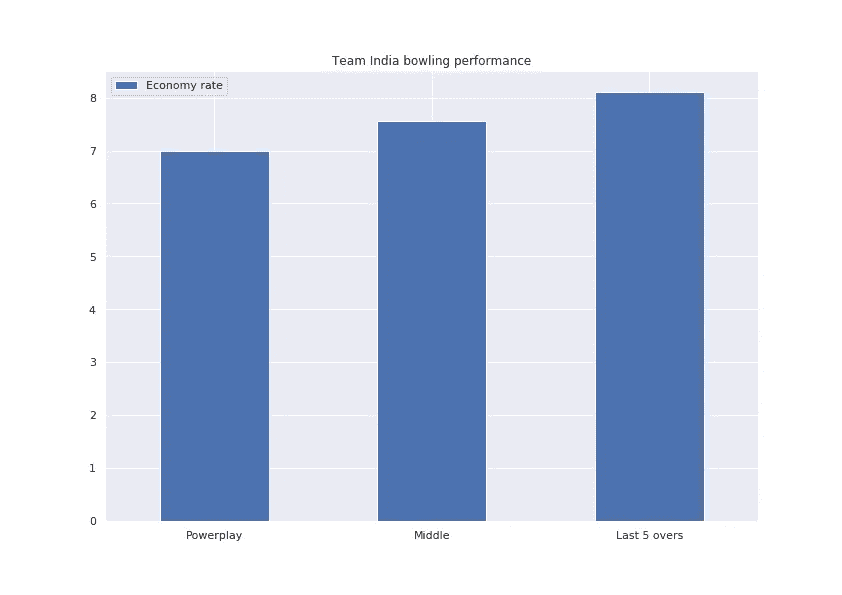

**推论**:

*   印度投球手每回合认输约 7-8 分。如此健康的数字都归功于印度保龄球手！

**印度队在比赛不同阶段的保龄球表现:**

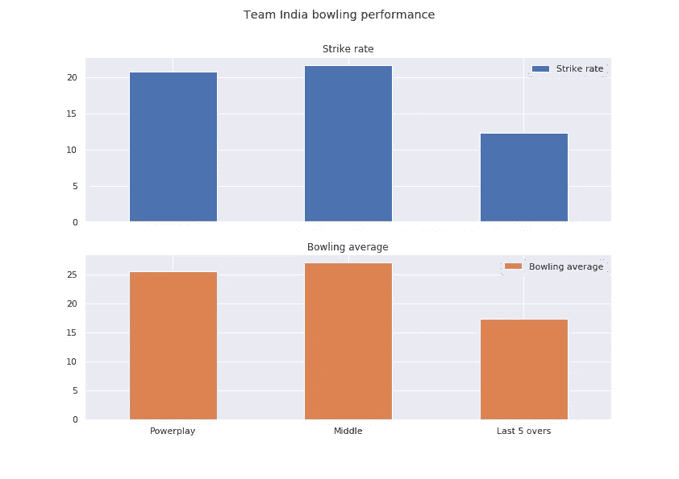

**推论**:

1.  平均来说，印度保龄球手在最后 5 局比赛中选择 2 个小门，每个小门让出大约 13 个球
2.  印度保龄球手承认大约 27+运行在中间的三柱门可以改进

**历年比赛不同阶段的团队保龄球命中率:**

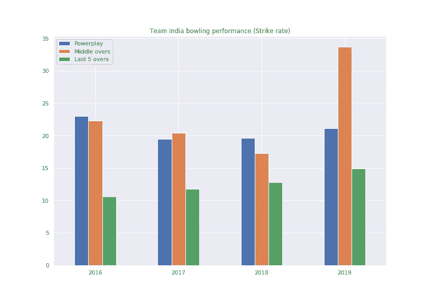

**推论**:

1.  **印度队在 2019 年的保龄球表现很差**，因为保龄球手平均认为 33+球才能在中途进入三柱门
2.  印度在 2016 年拥有最好的死亡保龄球攻击

# 边界分析

在这一部分，我们将分析印度队得分的平均失球数及其多年来的演变。

```
Avg no. of balls to hit 4: 9 
Avg no. of balls to hit 6: 19
```

**历年平均得分界限球数:**

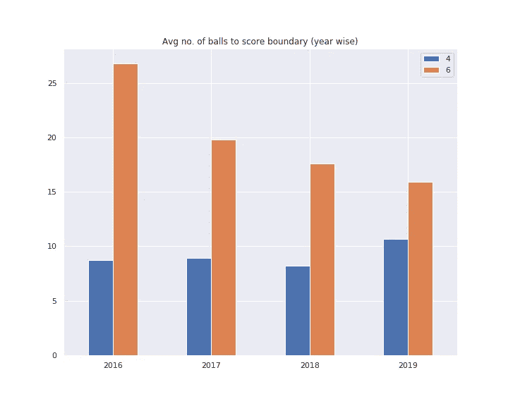

**推论:**

*   印度队**在过去几年里提高了力量打击**。2019 年，该团队每 16 个球清除 6 个

**比赛不同阶段得分边界的平均球数:**

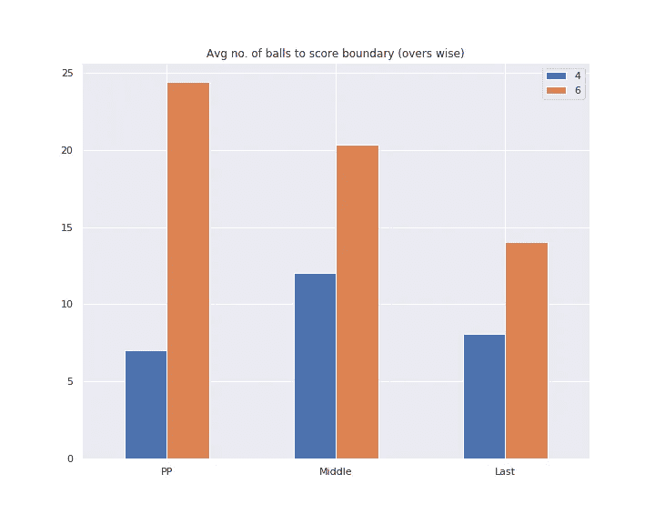

**推论:**

1.  印度在力量比赛和最后 5 场比赛中每场比赛中净胜 4 分
2.  印度队在强攻中只打了 16 分，因为击球手为了 6 分让出了 24+个球

**历年不同阶段得分 4 的平均球数:**

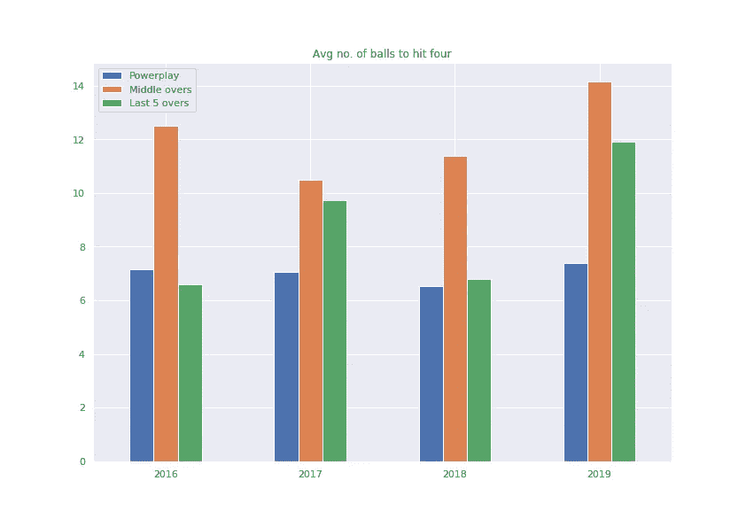

**推论**:

*   2019 年，印度在中场休息时让出了最多的球(约 14 个)，达到了 4 个

**历年不同阶段得分 6 的平均球数:**

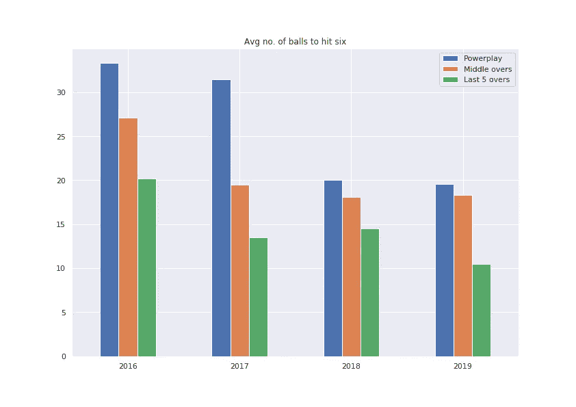

**推论**:

*   在过去的几年里，印度的开局、中盘和终点线提高了清除六个障碍的能力。太神奇了！

# 结束注释

毫无疑问，与预测性体育分析相比，**描述性体育分析**在团队获胜战略中发挥着深远的作用。在本文中，您了解了体育分析的重要性，以及分析如何影响不同的体育项目。我们还分析了印度队过去 4 年在 T20 板球赛中的表现。

为你最喜欢的运动实现这些想法吧！