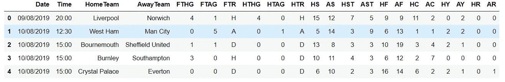
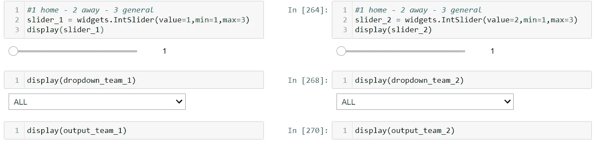
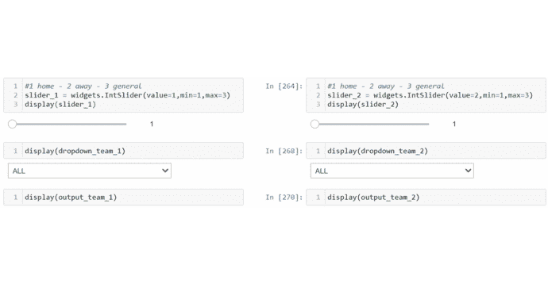

# Python 中的体育分析框架(第 1 部分)

> 原文：<https://medium.com/analytics-vidhya/sports-analytics-in-python-part-1-12e4907da227?source=collection_archive---------11----------------------->

## 一个数据驱动的系统，可以做出更明智的选择

托马斯·塞勒在 [Unsplash](https://unsplash.com/s/photos/soccer?utm_source=unsplash&utm_medium=referral&utm_content=creditCopyText) 上的照片

足球是全世界最受欢迎的运动。这是一个全球性的游戏，几乎把这个星球上的每一个人都联系在一起。从小就是我生活的一部分。到目前为止，我几乎看了每一场比赛。

在过去的几个月里，我一直在做一个名为体育(足球)比赛博彩分析的项目。我想用 Python 实现一个简单的赌博框架。它由数据预处理和探索性数据分析两部分组成。( [Part- 2](/analytics-vidhya/exploratory-data-analysis-in-sports-analytics-part-2-5ba6aa50cd5) )在这一部分，我想通过如何预处理足球数据来变成动作。

## **什么是体育(博彩)分析和用例？**

体育分析实际上是一个广泛的领域，体育分析专业人员可以扮演许多不同类型的角色。我想接触数据分析和博彩分析。

## 查找数据集

可能很难找到一个特定的足球比赛数据集，但我发现有一个网站提供最新的和历史的足球结果，其中包括 27 个赛季的结果和 20 个赛季的比赛统计“[http://football-data.co.uk/data.php](http://football-data.co.uk/data.php)”。所有单词联盟都可以。

数据集有 22 个变量。只有英超有裁判专栏。数据字典中有“[http://football-data.co.uk/notes.txt](http://football-data.co.uk/notes.txt)”。下面是一些变量字典表；

*   FTHG =全职主队目标
*   FTAG =全职客队目标
*   FTR =全职成绩(H =主场胜，D =平局，A =客场胜)
*   HS =主队投篮
*   HST =主队击中目标

英超联赛数据集示例(1)

最受欢迎的足球博彩类型，其目的是预测比赛的最终结果，要么是主队获胜(1)，平局(X)，要么是客队获胜(2)。但是，现在你有很多选择。下面我做了一个流行的列举。例如，在 2.5 目标市场上下注超过/低于 2.5 目标。这是你选择两个目标中的一个发生的地方，低于 2.5 个目标意味着两个或更少，超过 2.5 个目标意味着三个或更多。

## 编码部分

我可以展示一些如何对下注选项进行编码的示例，如使统计低于/高于 2.5 目标成为一半或最终目标、共同目标、MS_1_under_1_5，以及更改每个团队策略的数字列。

数据预处理部分(2)

您可以应用相同的格式编码。59 个变量正在创造。预处理数据集后，下面的 gif 正在创建。

数据集 gif (3)

## 团队分析部分

在数据角力完成后，创建一个名为“概率”的函数。这是一个为每个团队创建信息卡的功能。这些函数详细显示了输赢的百分比和其他下注选项。您可以找到一定百分比的带有排序样式的下注类型。

I [pywidgets](https://ipywidgets.readthedocs.io/en/latest/) 是用于 Jupyter 笔记本的交互式 HTML 小部件，可以方便地访问信息。用户可以控制他们的数据，并可以看到数据的变化。我有一个滑块和下拉菜单，你可以很容易地管理团队列表。

每个团队的实施信息卡(4)

仪表板示例(5)

当您运行代码时，您将在代码末尾看到 ipywidgets

*   第一个选项是 1(主场)2(客场)3(所有比赛)分析。
*   选择你的第一个团队分析师
*   选择你的第二组分析人员
*   最后，你会看到两个团队的结果来分析决定哪一个是最好的选择。下面的 gif 解释了这个系统是如何工作的。

您将看到这样的示例仪表板。(注意:您可以将拆分单元格笔记本扩展垂直拆分，以防止 Jupyter 笔记本右侧出现额外的空白，这有助于 [nbextensions](https://jupyter-contrib-nbextensions.readthedocs.io/en/latest/install.html) ) (6)

**总结**

在本文中，我们介绍了如何用 Python 实现数据驱动的博彩分析。我的 [Github](https://github.com/yssefunc/sport_analytics) 账户里的所有代码。感谢您的阅读。如果您有任何反馈，请告诉我。

对于感兴趣的人，请继续阅读本系列的第 2 部分，在上面的链接中，我通过使用数据可视化来研究探索性数据分析，以找出分析足球数据的变量。

第 2 部分:点击下面的链接。

 [## 体育分析中的探索性数据分析(下)

### 做出更明智、“更好”的决策

medium.com](/analytics-vidhya/exploratory-data-analysis-in-sports-analytics-part-2-5ba6aa50cd5) 

**G .附录**

**G.1 参考文献**

 [## 足球结果，统计和足球博彩赔率数据

### 历史足球结果和投注赔率数据 27 个赛季的结果| 20 个赛季的投注赔率| 20 个赛季的比赛统计…

football-data.co.uk](http://football-data.co.uk/data.php)  [## 分析学

### Opta 致力于推动媒体、专业团队、管理机构和整个体育界使用体育数据…

www.optasports.com](https://www.optasports.com/services/analytics/)  [## 明智地下注:使用泊松分布预测足球比赛的比分

### 这篇文章作为数据科学博客的一部分发表。“世界上最大的宗教甚至不是…

www.analyticsvidhya.com](https://www.analyticsvidhya.com/blog/2020/10/predicting-the-scoreline-of-a-football-match-using-poisson-distribution/)