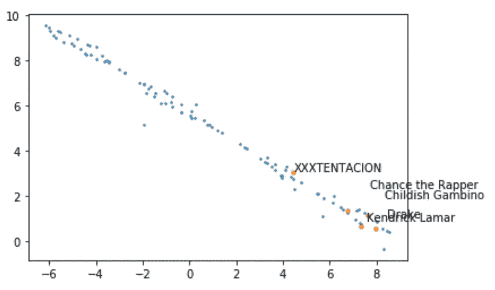

# Spotify 表示:从我高中同学的角度来看，菲律宾人的音乐品味

> 原文：<https://medium.com/analytics-vidhya/spotify-says-music-tastes-of-filipinos-through-the-lens-of-my-high-school-classmates-f815a0262016?source=collection_archive---------9----------------------->

马尼拉有一个有趣的音乐场景——西方流行音乐、老派菲律宾经典音乐、新一波韩国流行音乐(以及随之而来的疯狂粉丝)的大熔炉，偶尔还有一些古典音乐，当然，独立音乐领域的本土人才基础也在迅速扩大。

庆祝 Mow's 周年的“生日”演出，Mow ' s 是一家酒吧，在马尼拉的独立音乐舞台上占据了很大一部分

我的高中生活尤其有趣，因为人们的音乐品味差异很大。从那些痴迷于近乎前卫的默默无闻的美国乐队，到那些如此投入当地音乐舞台以至于最终成为艺术家和组织者的人，再到一群在走廊上无所畏惧地随着 K-pop 跳舞的人，我的音乐品味随着我遇到的每个人而增长和变化。尽管我们的高中不能代表马尼拉年轻人的总体音乐品味，但它绝对是一项有趣的研究。本质上，我想看看嵌入模型如何根据高中同学的口味推荐歌曲。

2018 年我们高中的乐队之战

# 方法

我在 Spotify 上收集了我高中同学的 URI，并使用 **Spotify API** 和 **Spotipy** 包，提取了他们公开关注或创建的所有播放列表。然后，每个播放列表都被转换成艺术家列表。

**嵌入**

当我们的手机对信息中的下一个单词给出建议时，它们实际上是在寻找“给定我刚刚收到的单词，哪个单词最有可能出现在它后面？”为了做到这一点，模型分析以前的短信，并根据他们看到的模式生成概率。

宋的推荐工作也是如此。通过分析一系列播放列表，Spotify 等应用程序根据用户在播放列表中已经选择的歌曲来预测下一首歌曲。

**gensim** 包中的 **word2vec** 函数方便地为我们完成了所有这些工作。Word2vec 使用称为嵌入的数字向量来表示每个单词，然后使用余弦相似度来确定哪些向量彼此最接近。我们可以将其细分如下:

*   **嵌入** : Word2vec 首先给每个单词分配一个随机向量。我们给单词对**单词 1 后跟单词 2** 的概率“得分”计算如下:

*   **余弦相似度**:通过取单词 1 和单词 2 的点积，我们在计算矢量 1 和 2 之间的夹角余弦。注意，当两个向量彼此靠近时(即它们之间的角度θ更接近 0)，cosθ接近 1，因此分子变大。相反，当两个向量相差很大时(即角度θ很大)，cosθ接近 0，因此分子较小。**简而言之，两个词越接近，概率得分越高。**

因为我们希望模型给频繁出现的词对分配较高的分数，给不经常出现的词对分配较低的分数，所以 word2vec 更新每个词向量中的值，优化它，直到它产生导致相似词高分的向量。

# 结果

我收集了超过 800 个播放列表，其中包含超过 1，070 位艺术家的歌曲在所有播放列表中至少出现了 5 次。在使用 word2vec 时，我能够根据余弦相似度找到艺术家——1 表示最相似，0 表示最不相似。这些是菲律宾独立艺术家 **crwn** 的结果

你说你想让我留下来
是的，你想让我在这里等
我不想再这样下去了

一些建议似乎很中肯:

韩国流行音乐(K-Pop):韩国流行音乐播放列表可能只包含其他韩国流行音乐，因此当我们放置“BTS”或“TWICE”时，该模型也会推荐其他韩国流行音乐艺术家。

所有这些缩写

**美国流行音乐:**著名的美国艺术家也被安排在彼此相邻的位置。新老美国艺术家混合在一起，艾薇儿·拉维尼和清洁盗贼，麦可·布雷和杜阿·利帕，但一般美国流行行为被放在一起。

**美国说唱**:与美国和韩国流行音乐类似，创作者泰勒和肯德里克·拉马尔与许多其他著名说唱歌手被放在一起，而 XXXTENTACION 则与其他几位流行音乐艺术家被放在一起。

坐下来
谦虚一点

使用 TSNE 可视化结果，我们得到以下图表

**菲律宾经典:**对于比较老的菲律宾歌曲(当我们的 titos 和 titas 去蹦迪的时候)，它认定为‘相似’的艺人其实没那么相似。既有来自旧时代的英文歌曲，也有更现代的菲律宾歌曲，这也显示了我高中的人们是如何将这些类别混合在一起的。

puno ang langit ng bituin
At Kay lamig pa ng hangin
Sa ' Yong ting in akoy naba baliw giliw

加了 Ang Bandang Shirley 供参考

独立的菲律宾音乐:最后但绝对不是最不重要的，还有独立的 OPM 音乐。这是最有趣的一个类别，因为预测是多么的混杂，它反映了独立 OPM 是如何与国际/西方独立音乐一起演奏的。看看有趣的配对

生锈的机器&玻璃动物，Munimuni & Lizzo，她才十六岁，FM 静电？

毫无疑问，这些可能是由于模型训练不良造成的，但这是需要重新审视的。接下来的步骤包括考虑如何评估模型，并希望从其他人那里收集更多的数据。

# 附录

点击查看代码[！](https://github.com/ljyflores/Spotify-Analysis)