# Spotisis-我的 Spotify 流媒体历史分析

> 原文：<https://medium.com/analytics-vidhya/spotisis-analysis-of-my-spotify-streaming-history-50dc1dbbb6c?source=collection_archive---------18----------------------->

你们可能想知道 Spotify 是如何为其每个用户完成 2020 年总结的。读完这篇文章后，你会发现它很容易，任何人都可以用他们的 Spotify 帐户做到这一点。我将向您展示我的 Spotify 流媒体历史的详细信息，并将我的音乐与我的一个朋友 Sreelekshmy 进行比较。Spotify 允许你下载你的数据，你所要做的就是进入仪表盘中的隐私设置，然后点击请求数据。即使他们告诉你可能需要 30 天，它也将在 3-4 天内可用。我将使用他们为这个项目提供的 JSON 文件“Streaming History0.json”。您可以在文章末尾提供的 GitHub 链接中找到源代码。所以让我们开始吧。

这些就是我要分析的东西

*   我的流媒体历史时间表
*   日偏好
*   最喜欢的艺术家
*   最喜欢的歌曲
*   多样性
*   歌曲的精神

第一部分

我从 Spotify 听到的第一首歌是《老城路》(杰西·詹姆斯·德克尔版)，这是我 JSON 中的第一个对象。尽管我在去年 11 月听到了我的第一首歌，但我并不经常使用 Spotify。所以我要分享的第一件事是我每天的流播时间。你可以看到从 2020 年 3 月 25 日开始上升的峰值。你们知道原因:d . 2020 年 8 月 28 日。图表显示我已经流了大约 260 分钟。

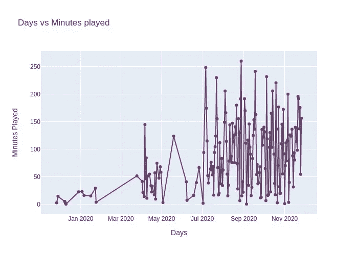

流式历史

我主要在工作的时候使用 Spotify，它能让我更快地完成工作。你可以从下面的饼状图中看到。

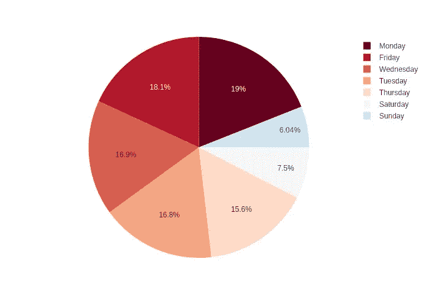

最喜欢的艺术家——所有认识我的人都知道，我是 A.R .拉赫曼和单向乐队的超级粉丝。我弹了 352 次单向乐队的歌曲和 254 次拉赫曼的歌曲。但说到歌曲的独特性，我演奏了 61 首 A.R. Rahman 的不同歌曲，而单向乐队演奏了 41 首。圆圈越大表示歌曲的独特性越大。

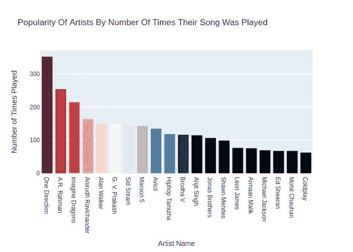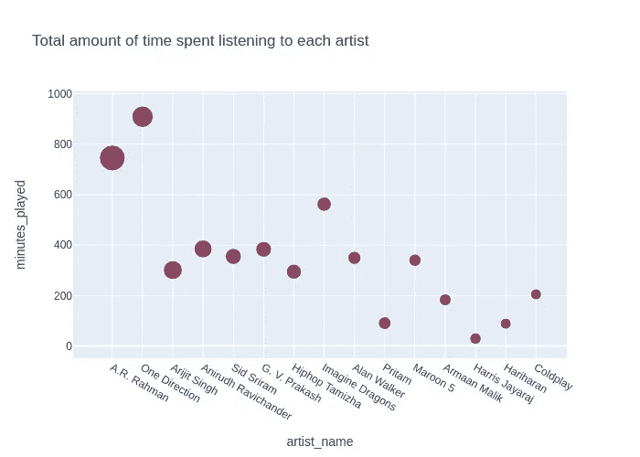

较大的圆圈表示该艺术家歌曲的独特性

最喜欢的歌曲-
在图表中，你可以看到一首歌曲遥遥领先于其他歌曲。《黑夜》。这是我最喜欢的。我第一次听到这首歌是在我大学一年级的时候。我这辈子可能已经听过一千多次了。

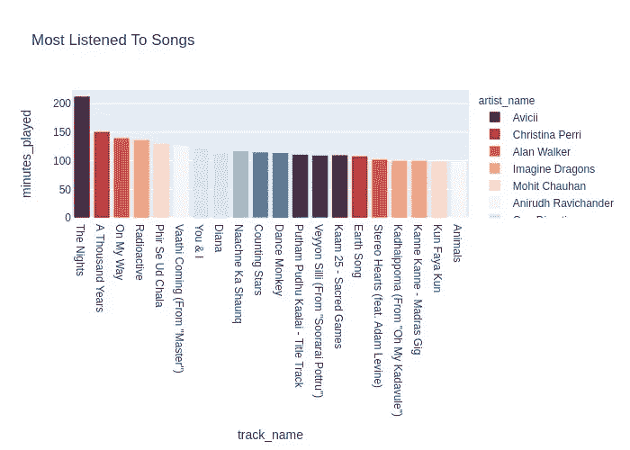

Spotify 为每首歌曲提供了特定的属性，如果你是一名音乐家，你可能对其中的一些属性很熟悉。Spotify 为一首歌证明的属性如下:

可跳舞性——根据音乐元素的组合，包括速度、节奏稳定性、节拍强度和整体规律性，描述一首曲目适合跳舞的程度。值 0.0 最不适合跳舞，1.0 最适合跳舞。
能量——能量是一个从 0.0 到 1.0 的量度，代表强度和活动的感知量度。通常，高能轨道感觉起来很快，很响，很嘈杂。
乐器性——预测音轨是否不包含人声。“Ooh”和“aah”在这种情况下被视为乐器。乐器度值越接近 1.0，轨道不包含人声内容的可能性就越大。
活跃度—检测录音中是否有观众。
响度——轨道的整体响度，单位为分贝(dB)。响度是声音的质量，是与体力(振幅)相关的主要心理因素。值的典型范围在-60 和 0 dB 之间。
语音识别——语音识别检测音轨中是否存在口语单词。
效价——从 0.0 到 1.0 的一个量度，描述一首曲目所传达的音乐积极性。
速度—轨道的总体估计速度，单位为每分钟节拍数(BPM)。在音乐术语中，速度是给定作品的速度或节奏，直接来源于平均节拍持续时间
模式——模式表示轨道的模态(大调或小调),其旋律内容来源于音阶类型。大调用 1 表示，小调用 0 表示。
Key——音轨的估计整体 Key。

我将比较我最喜欢的五首歌的五个特征:舞蹈性、乐器感、语感、活力、响度。

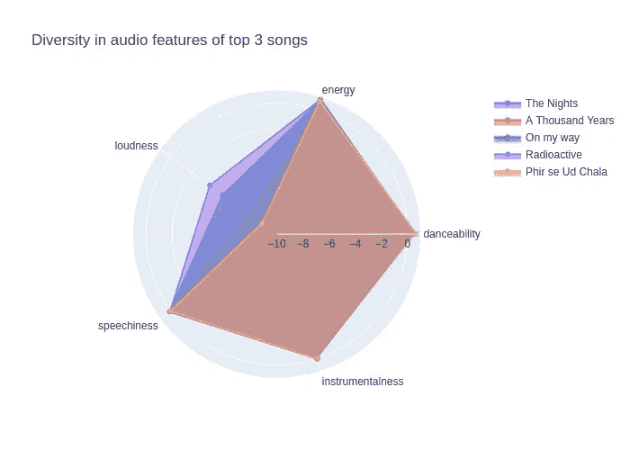

歌曲多样性

*我听积极向上的歌吗？*

Spotify 还提供了一个名为 valence 的属性。效价范围是从 0 到 1，1 是在音轨中传达的最积极的信息。

当我绘制我最喜欢的 50 首歌曲的直方图时，它显示我听不太积极的歌曲。当我绘制维恩图时，它说有 28 首歌是低沉的(valence <0.5).

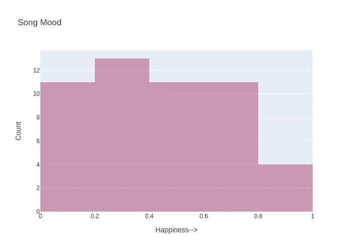

Histogram of the valence of my top 50 songs

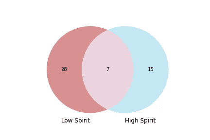

Venn diagram

Part B

In this Part, I’ll be comparing my top 50 songs with one of my friend Sreelekshmy’s playlist. I hear more energetic songs but she hears songs having a positive mood than me. and danceability of my songs is higher than her. I have also compared tempo and other audio features of our playlist.

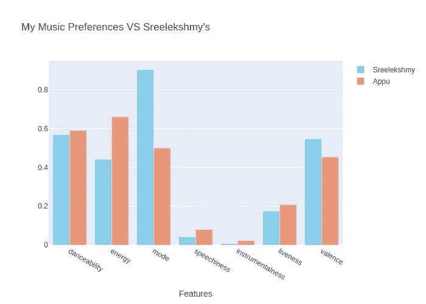

audio feature comparison

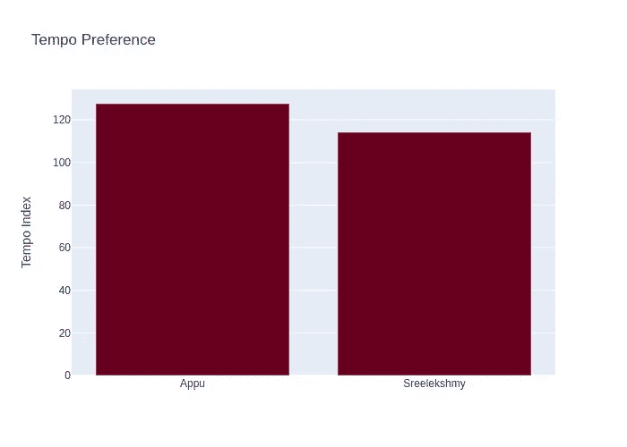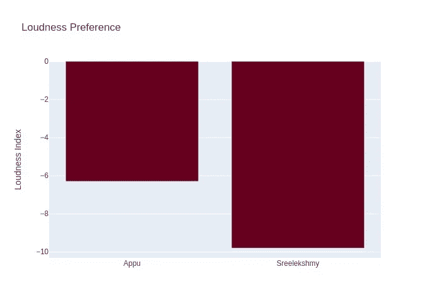

Tempo and loudness preference

This was my first time using Plotly to analyse data I was able to learn a lot from doing this project. Hoping to do more in Future. This is the link to [GitHub repo](https://github.com/Appuaravind98/Spotify-data-Analysis) 我分享了我的笔记本和我上面给你看的图表的交互形式。