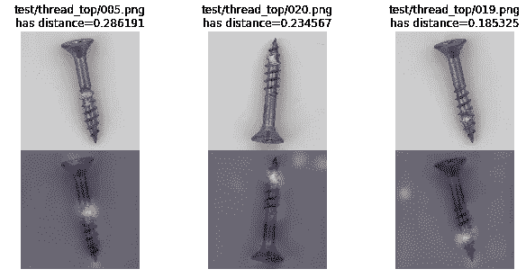

# 发现缺陷！—针对 MVTec 异常检测数据集的深度度量学习解决方案

> 原文：<https://medium.com/analytics-vidhya/spotting-defects-deep-metric-learning-solution-for-mvtec-anomaly-detection-dataset-c77691beb1eb?source=collection_archive---------1----------------------->

来自 MVTec 异常检测数据集的螺钉图像中的斑点缺陷。

每天我们都在检查视觉上是否有问题，这在我们的生活中很自然地发生了。例如，当你从冰箱里拿出食物时，你会无意识地瞥一眼，看看它是否可以。

在商业中，目视检查广泛应用于生产的最终过程。这将是机器学习异常检测的主要应用。

# MVTec 异常检测数据集(MVTec AD)

[https://www.mvtec.com/company/research/datasets/mvtec-ad/](https://www.mvtec.com/company/research/datasets/mvtec-ad/)

一家德国公司 [MVTec 软件有限公司](https://www.mvtec.com)最近发布了一个新颖的 [MVTec 异常检测数据集](https://www.mvtec.com/company/research/datasets/mvtec-ad/)【1】，它拥有来自 15 个类别的真实数据。

图来自 MVTec 广告网站:来自 6 个类别的好的(绿色)和坏的(红色)例子。

从工业到农业的各种类别，每个不同领域的缺陷，图像中的各种对齐，甚至注释中的缺陷区域的分段数据——这是一个很棒的数据集。

> "就我们所知，没有可比较的数据集存在于无监督的异常检测任务中."

引入 MVTec AD 是为了在无监督异常检测(和分割)研究领域扮演 MNIST、CIFAR10 或 ImageNet 的角色。

该数据集附有一篇论文[1]，其中不仅介绍了数据集，还评估了基线方法，如 GAN、autoencoder 或其他传统方法。

# 深度度量学习

本文利用该数据集进行了一些实验，将深度度量学习应用于异常检测任务。主要的深度度量学习如 ArcFace[3]/ CosFace[4]在人脸验证/识别任务中比较流行，这些方法可以度量数据间的 ***距离*** 。例如，该距离然后被用于确定两张照片中的人脸是否具有相同的身份。

这些深度度量学习方法的一大好处是它们的简单性。

*   它们非常简单，只需再利用传统的 CNN 模型，增加一些小的插件层。
*   修改后的 CNN 可以照常在分类任务中进行训练，甚至在训练过程中不做任何改变，然后就完成了。
*   CNN 的主体现在准备好输出可用于计算数据之间距离的特征。

# 经过测试的深度度量学习方法

图一。来自 CosFace[4]:提议的 CosFace 框架的概述。

在所有实验中，测试了以下方法:

*   L2 约束的软最大损失[2]
*   弧面[3]
*   CosFace[4]
*   球面[5]
*   中心丢失[6]
*   和传统的 CNN 一样，它的功能也适用于测量距离

# 实验

已经测试了 3 个不同的分类问题设置。一个失败了，下一个失败了，最后一个用新发明的技术成功了。

1.  实验一:传统的监督多类分类。
2.  实验 2:正常和异常(缺陷)类别之一之间的二元分类。
3.  实验 3:自监督从正常样本生成异常样本。
4.  这里还有一个尝试:所有类别的 AUC 都超过 90%。

# 实验 1:传统的监督多类分类

正如 MVTec 广告论文所声称的，许多先前的工作使用主要的图像数据集进行评估，例如 MNIST、CIFAR10。问题设置是:

*   在训练之前，为异常检测任务分配一些原始类为正常，而其他类为异常。

显示 CIFAR-10 分类拆分示例的图。

*   仅分配给*正常*的训练类样本。不使用*异常*样本，然后模型将被训练来区分*正常*类中的一个。
*   训练后，通过测量距离对所有测试样本进行评估。
    (这个后面有描述。)

因此，这里应用了类似的设置:

*   训练集由来自以下 4 个类别的无缺陷(正常)样本组成:*“胶囊”、“地毯”、“皮革”、“电缆”。*所以训练是这 4 个类的多类分类问题。
*   测试按类别进行。评估每个类别中的所有测试样品，最后计算 AUC 以评估性能。
*   注意，测试班和培训班不一样。测试样本包括*正常*‘良好’样本以及各种类型的*异常*缺陷样本。

训练批次的示例图。这是一个 4 级分类问题。

训练成功完成后，很容易将看起来非常不同的图像分类。

但与通常的 CNN 分类不同，这实际上训练了具有度量学习功能的 CNN 来学习度量样本之间的距离。

# 测量距离和异常识别

在测试阶段，通过以下步骤测量所有测试样品与正常等级的距离:

1.  从训练好的模型中剪切最后一层，然后模型将输出 512-D 特征。(此处使用 ResNet18，它在最终 FC 层之前输出 512-D 特征)
2.  提前获取所有 *N* 训练实例 *x_n* 的特征 *e_n* 。
    (将所有 *x_n* 馈入模型，并从其输出中获取特征)
3.  现在得到第 *m* 个测试样本 *x_m* 的特征 *e_m* ，然后用所有训练样本 *e_n* 计算 [*余弦距离*](http://cosine distance) 。现在我们有了从测试样本 *x_m* 到所有训练样本的 *N* 个距离。
4.  然后从 *N* 距离中选择最小值。该最小距离是试样 *x_m* 与正常*的距离 *d_m* 。*
5.  重复步骤 3 和 4，直到我们获得所有的 *M* 测试样品距离。
6.  然后，我们可以设置任何阈值，将距离分为正常或异常类别。距离较短的样本是正常的，其他距离较长的样本被检测为异常。

# 传统监督多类分类的结果

在多类分类设置中训练的模型的 AUC 结果。

学习指标的训练模型失败(小于 0.5；比随机回答更糟)，测量的距离几乎是不正确的。这很自然:

*   受过训练，能辨别非常不同的物体，如“胶囊”和“电缆”。
*   在非常相似的物体之间进行测试；_ 正常 _ '胶囊'对 _ 异常'胶囊'有缺陷，这些看起来比'胶囊'对'电缆'更接近。

因此，度量学习评价的传统问题设置在现实场景中不起作用…

> 我们需要激励模型去**学会衡量*小差异*** 。猫和车没有区别，甚至黑猫和灰猫也没有区别。
> *在干净的螺丝和有微小划痕的螺丝之间！*

# 实验 2:正常和异常(缺陷)类别之一之间的二元分类

模型应该能发现正常样本的微小差异。为了做到这一点，

*   从测试集中选出一个缺陷类(只有测试集有缺陷类)，然后将其样本作为异常类放入训练集。
*   现在训练模型是正常/异常二元分类任务。

既有“好”(正常)又有“坏 _ 大”(异常)的训练批次示例图。

但也失败了，大概 0.5 接近随机答。

二元分类设置中训练的模型的 AUC 结果。

基本上，异常样本量太小；正常样本量在 200+左右，缺陷异常样本量在 10 左右，非常不平衡。以下是为了减轻这个问题，虽然这些没有工作。

*   过采样缺陷类别，具有增强功能，以及类似于[混合](https://forums.fast.ai/t/mixup-data-augmentation/22764)的训练技术。

*训练模型以便它们能辨别微小的“错误”的旅程还在继续…*

# 实验 3:自监督从正常样本生成异常样本

这是基于一个简单的想法。

*现在我们需要的是与正常样本有微小差异的异常样本。然后，我们可以简单地从正常样本中生成异常样本。*

一旦异常样本准备就绪，我们就可以训练模型，使它们能够区分与原始正常样本的微小差异。这个训练问题就是二元分类。我们只使用正常样本，这也是自我监督的训练。

这个实验发明了一个新的数据集类(实际上是 fast.ai 库的 ImageList 类[7]):

*   双打训练*正常*样本。
*   为偶数样本分配正常标签，为奇数样本分配异常标签。那么所有的原始样本现在都有了“异常孪生”样本。
*   当使用图像时，所有标记为*异常*的图像将在其上随机绘制一条线。这是一条与普通样本不同的细线。画线时的随机性也有助于数据扩充。

训练批次的示例图。它既有“正常”又有“异常”，所有异常样本都生成一条彩色线作为缺陷“疤痕”。

这个结果是有意义的。

在自我监督设置中训练的模型的 AUC 结果。改进了。

AUC 结果详情表。在这种情况下，CosFace 或 ArcFace 是稳定的。

让我们用 grad-CAM 激活热图检查样本。成功案例表明，热图捕捉到了图像上的缺陷部分:

AUC 为 99%的榛子 ArcFace 的示例结果。测试样本及其热图(上图和中图)以及用于距离计算的最接近的对应训练样本(下图)。

下面的失败案例表明，模型没有考虑缺陷。模型没有正确地学习来发现这些类型的缺陷。像这样的例子还有很多，说明它还有很多需要改进的地方。

在 AUC 62.3%处具有螺钉的 ArcFace 的示例结果，热图显示模型被背景分散了注意力。它未能发现螺丝尖端的缺陷。

# 还有一个:所有类别的 AUC 都超过 90%

作为最终结果，以下是调整模型以实现 AUC 90%后的 grad-CAM 热图。这很容易调整，我们可以调整如何创建异常孪生样本，使其模拟缺陷模式。

但这意味着什么呢？这是通过使用测试样本中发生的缺陷模式的知识来完成的。就像作弊一样。

*   因此，这不适用于没有先前缺陷模式可用的用例。
*   但是在很多情况下，很多缺陷模式是已知的。(通常在生产线上，主要缺陷通过其百分比或 ppm 进行分类。)
    那么这对于自动检测已知或可能的故障模式仍然是有用的。

带有螺钉的 ArcFace 的示例结果为 AUC 91%，比 62.3%有所提高。该模型在螺钉尖端发现缺陷。

ArcFace 的示例结果，晶体管的 AUC 为 95.8%，比 89%有所提高。模型发现有缺陷的腿。

ArcFace 的示例结果，网格的 AUC 为 99.9%，比 79.8%有所提高。热图显示缺陷零件。

ArcFace 的要素(嵌入)分布示例，栅格的 AUC 为 99.9%。“好的”(正常的)特征是在左下角形成一个圆，远离右上角的其他缺陷样本。

服用避孕药的 ArcFace 结果示例 AUC 为 93.5%，比 70%有所改善。一些缺陷被正确地发现，但是正确的两个例子表明模型被分散了注意力(未来可能的例子失败的风险)。

# 与纸张的比较

原始 MVTec 广告论文[1]上的所有结果都基于分段输出。然后基本上很难比较。

*   纸上的 AUC 结果显示低于 90%，如“地毯”、“电缆”、“金属螺母”和“拉链”。
*   但它是基于分割像素 TPR/FPR 计算的。这将是一个比基于图像距离更困难的问题。
*   只要简单地判断图像是正常的还是异常的，深度度量学习可能是有用的，因为它简单，相比于本文讨论的需要复杂阈值确定的基于分割的检测。

# 最后的想法

本文的实验表明:

*   深度度量学习方法可以用作 MVTec AD 数据集的自监督异常检测；
*   其 grad-CAM 可用于在成功的情况下引导有缺陷的零件，
*   或者至少可以用 AUC 90%或更高的性能来区分缺陷与否。
*   基于分割和基于深度度量学习的组合/集成使用可以获得更好的性能，或者为一些潜在的应用开辟新的可能性。

# 源代码

在这里找到示例代码:[https://github . com/daisukelab/metric _ learning/tree/master/MVTecAD](https://github.com/daisukelab/metric_learning/tree/master/MVTecAD)

非常感谢 [fast.ai 库](https://github.com/fastai/fastai)【7】将开发实验的时间减到最少。

# 资源

*   [1]保罗·博格曼、迈克尔·福瑟、大卫·萨特勒格、卡斯滕·斯特格。[**MVTec AD——无监督异常检测的综合真实数据集**](https://www.mvtec.com/fileadmin/Redaktion/mvtec.com/company/research/mvtec_ad.pdf)；2019 年 6 月，IEEE 计算机视觉和模式识别大会(CVPR)
*   [2] R. Ranjan、C. D. Castillo 和 R. Chellappa。用于鉴别性人脸验证的 L2 约束软最大损失。arXiv 预印本 arXiv:1703.09507，2017。[https://arxiv.org/pdf/1703.09507.pdf](https://arxiv.org/pdf/1703.09507.pdf)
*   [3]邓俊杰、郭俊杰和 S. Zafeiriou。Arcface:深度人脸识别的附加角裕度损失。arXiv 预印本 arXiv:1801.07698，2018。[https://arxiv.org/pdf/1801.07698.pdf](https://arxiv.org/pdf/1801.07698.pdf)
*   [4] H. Wang，Y. Wang，Z. Zhou，X. Ji，D. Gong，J. Zhou，Z. Li，和 W. Liu，CosFace:用于深度人脸识别的大幅度余弦损失，arXiv 预印本 arXiv:1801.09414，2018 .【https://arxiv.org/pdf/1801.09414.pdf 号
*   [5]刘文伟、温、于、李、拉杰和宋。用于人脸识别的深度超球面嵌入。2017 年在 CVPR。【https://arxiv.org/pdf/1704.08063.pdf 
*   [6]文，张，李，乔，一种用于深度人脸识别的判别特征学习方法，“欧洲计算机视觉会议.斯普林格，2016 年，第 499–515 页。[https://ydwen.github.io/papers/WenECCV16.pdf](https://ydwen.github.io/papers/WenECCV16.pdf)
*   [7]杰瑞米·霍华德等人(2018 年)。fast.ai 深度学习库，[https://github.com/fastai/fastai](https://github.com/fastai/fastai)。