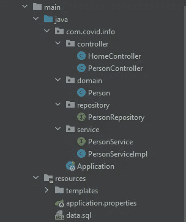

# Spring Boot —使用 JPA Hibernate 和 PostgreSQL 访问数据

> 原文：<https://medium.com/analytics-vidhya/spring-boot-accessing-data-with-jpa-hibernate-and-postgresql-af68386363a4?source=collection_archive---------0----------------------->


你好！我将讲述如何使用 Hibernate 和 PostgreSQL 创建一个 Spring Boot 项目。首先我想解释一下什么是 ORM，JPA，Hibernate。

ORM(对象关系映射): ORM 是一种编程技术，它允许我们的模型类匹配关系数据库中的表。它可以被认为是应用程序和关系数据库之间的桥梁。

**JPA (Java 持久性 API):** JPA 是一种规范。它是将大量数据持久存储到数据库中的类和方法的集合。它为 ORM 工具提供了通用的原型和功能。通过实现相同的规范，所有 ORM 工具(如 Hibernate、TopLink..)遵循共同标准。

**Hibernate:** Hibernate 是 JPA 的一个实现。它是用于 Java 环境的 ORM(对象关系映射)解决方案。它遵循 JPA 提供的通用标准。

很快，由于有了 **Hibernate** ，我们将不用编写冗长的 SQL 查询就能进行数据库操作。

现在让我们创建一个名为 Covid 信息系统的简单应用程序。使用 **hibernate** 将患者添加到 **PostgreSQL** 数据库，列出所有患者并更新患者状态。

你可以在这里找到完整的代码:[**https://github.com/minnela/SpringBootHibernateJPA**](https://github.com/minnela/SpringBootHibernateJPA)


首先，您应该在 PC 上设置 PostgreSQL。你可以在这里下载:[https://www.postgresql.org/download/](https://www.postgresql.org/download/)

项目结构将是这样的:



这里是 **pom.xml** 文件 **:**

```
<?xml version="1.0" encoding="UTF-8"?>
<project 
         xmlns:xsi="http://www.w3.org/2001/XMLSchema-instance"
         xsi:schemaLocation="http://maven.apache.org/POM/4.0.0 http://maven.apache.org/xsd/maven-4.0.0.xsd">
    <modelVersion>4.0.0</modelVersion>
    <parent>
        <groupId>org.springframework.boot</groupId>
        <artifactId>spring-boot-starter-parent</artifactId>
        <version>2.3.2.RELEASE</version>
        <relativePath/> <!-- lookup parent from repository -->
    </parent>
    <groupId>org.example</groupId>
    <artifactId>covidInformationSystem</artifactId>
    <version>1.0-SNAPSHOT</version>

    <properties>
        <java.version>1.8</java.version>
    </properties>

    <dependencies>
        <dependency>
            <groupId>org.springframework.boot</groupId>
            <artifactId>spring-boot-starter-data-jpa</artifactId>
        </dependency>
        <dependency>
            <groupId>org.springframework.boot</groupId>
            <artifactId>spring-boot-starter-web</artifactId>
        </dependency>
        <dependency>
            <groupId>org.springframework.boot</groupId>
            <artifactId>spring-boot-starter-thymeleaf</artifactId>
        </dependency>
        <dependency>
            <groupId>org.postgresql</groupId>
            <artifactId>postgresql</artifactId>
            <version>42.2.17</version>
        </dependency>
        <dependency>
            <groupId>org.springframework.boot</groupId>
            <artifactId>spring-boot-starter-test</artifactId>
            <scope>test</scope>
            <exclusions>
                <exclusion>
                    <groupId>org.junit.vintage</groupId>
                    <artifactId>junit-vintage-engine</artifactId>
                </exclusion>
            </exclusions>
        </dependency>
        <dependency>
            <groupId>javax.validation</groupId>
            <artifactId>validation-api</artifactId>
            <version>1.1.0.Final</version>
        </dependency>
        <dependency>
            <groupId>junit</groupId>
            <artifactId>junit</artifactId>
            <scope>test</scope>
        </dependency>
        <dependency>
            <groupId>junit</groupId>
            <artifactId>junit</artifactId>
            <scope>test</scope>
        </dependency>
    </dependencies>

    <build>
        <plugins>
            <plugin>
                <groupId>org.springframework.boot</groupId>
                <artifactId>spring-boot-maven-plugin</artifactId>
            </plugin>
        </plugins>
    </build>

</project>
```

现在在 **application.properties** 文件中，我们将连接 PostgreSQL 并配置 hibernate 和 jpa:

```
server.port = 4567
spring.jpa.database=*POSTGRESQL* spring.datasource.platform= postgres
spring.datasource.url=jdbc:postgresql://localhost:5432/postgres
spring.datasource.username=postgres
spring.datasource.password=admin
spring.jpa.show-sql=true
spring.jpa.generate-ddl=true
spring.jpa.hibernate.ddl-auto=update
spring.jpa.properties.hibernate.jdbc.lob.non_contextual_creation= true
```

# **型号**

让我们创建我们的实体类。 **@Entity** 注释会让 Spring Boot 创建我们的实体表。我们将创建 **Person** 类，Person 表将自动添加到 postgreSQL 中。

```
@Entity
public class Person {

    @Id
    @GeneratedValue(strategy = GenerationType.*AUTO*)
    @Column(name="id")
    private int id;

    @Column(name="firstname")
    private String name;

    @Column(name= "surname")
    private String surname;

    @Column(name="age")
    private int age;

    @Column(name="covidinfo")
    private String covidInfo;
```

在 Person 类中添加构造函数、getter 和 setter 方法。

# **储存库**

现在是时候创建一个人员存储库了。这个存储库包含每个要添加到系统中的人。我们将创建一个 PersonRepository 接口，它将扩展 JPA Repository 类。JPA repository 有很多功能可以用于数据库操作。

```
@Repository
public interface PersonRepository extends JpaRepository<Person, Integer> {}
```

# 服务

服务是我们创建的一个层，用于封装控制器中的业务逻辑，它是控制器和模型之间的桥梁。

让我们创建**人员服务:**

```
public interface PersonService {
    void addPerson(Person person);
    List<Person> getAllPatients();
    Person getPersonById(int id);
    void updatePersonCovidInfo(int id);
    void deletePersonById(int id);

}
```

让我们创建它的实现 **PersonServiceImpl。**我们创建一个 PersonRepository 对象。要将一个人添加到数据库中，只需编写**person repository . save(person)**即可。如您所见，我们不使用长 SQL 查询来保存人员:

```
@Service
public class PersonServiceImpl implements PersonService{

    PersonRepository personRepository;

    @Autowired
    public PersonServiceImpl(PersonRepository personRepository) {
        this.personRepository = personRepository;
    }

    @Override
    public void addPerson(Person person) {
        personRepository.save(person);
    }

    @Override
    public List<Person> getAllPatients() {
       List<Person> peopleList = personRepository.findAll();
       return peopleList;
    }

    @Override
    public Person getPersonById(int id) {
        return personRepository.getOne(id);
    }
```

# **控制器**

为了将患者注册到系统中，我们将创建一个 PersonController 类并添加 PersonService 方法:

```
@Controller
public class PersonController {
   PersonService personService;

   @Autowired
    public PersonController(PersonService personService) {
        this.personService = personService;
    }

    @RequestMapping("/register")
    public ModelAndView getRegisterPage(){
       return new ModelAndView("addUser", "person", new Person());
    }
    @RequestMapping(value="/register", method= RequestMethod.*POST*)
    public String handleRegisterForm(@Valid @ModelAttribute("person") Person person, BindingResult bindingResult) throws SQLException {
        if(bindingResult.hasErrors()){
            return "addUser";
        }
        personService.addPerson(person);

        return "redirect:/";
    }

    @RequestMapping("/patients")
    public ModelAndView getUsersPage(){
        return new ModelAndView("patients","patients",personService.getAllPatients());
    }
```

现在，我们可以在资源文件下添加一些可视化的视图。添加完视图 html 文件后，我们开始**localhost:4567/register**address:


我们可以在这里向系统添加一名患者，该患者将保存在 **PostgreSQL** 数据库中。然后我们可以在 **localhost: 5678/patient 列出数据库中的所有患者。**

现在，我们将为所有患者添加一个更新按钮，以更改他们的 covid 状态。为此，我们将在 PersonRepository 类中使用 **@Query** 注释:

```
@Repository
public interface PersonRepository extends JpaRepository<Person, Integer> {
    @Transactional
    @Modifying
    @Query("update Person p set p.covidInfo = :covidInfo where p.id = :id")
    void setCovidInfo(@Param("covidInfo") String covidInfo, @Param("id") int id);

    Person findByName(String name);
}
```

这里我们在 JPA 存储库中写一个更新方法。我们创建一个查询来更新患者的 covid 状态。让我们将其添加到服务、控制器和患者视图中:

# 服务

```
@Override
public void updatePersonCovidInfo(int id) {
    personRepository.setCovidInfo("Negative",id);
}
```

# 控制器

Spring Boot html 不允许我们使用 PUT 方法，所以这里我使用 POST 方法来更新患者的 covid 状态:

```
@RequestMapping(value="/updateCovidInfo/{id}", method= RequestMethod.*POST*)
public String updateStatus(@PathVariable("id") int id){
    personService.updatePersonCovidInfo(id);
    return "redirect:/patients";
}
```

# 视角

```
<tr th:each="patient : ${patients}">
    <td th:text="${patient.name}">Patient name</td>
    <td th:text="${patient.surname}">Patient surname</td>
    <td th:text="${patient.age}">Patient age</td>
    <td th:text="${patient.covidInfo}">Patient covid information</td>
    <td>
        <form action="#" th:action="@{'/updateCovidInfo/'+${patient.id}}" th:method="post" >
            <input type="hidden" name="_method" value="post" />
            <button type="submit" id="Approve" name="Approve">Update Covid Info </button>
        </form>
    </td>

    <td>
        <form action="#" th:action="@{'/deletePatient/'+${patient.id}}" th:method="post" >
            <button type="submit" >Delete Patient </button>
        </form>
    </td>
</tr>
```

因此，我用一个简单的项目向您解释了 Spring Boot Hibernate 的结构。有关更多详细信息，您可以检查项目的源代码:

[](https://github.com/minnela/SpringBootHibernateJPA) [## 明尼拉/斯普林布提伯纳特耶帕

### 带有 Hibernate GitHub 的 Covid 信息 Spring Boot 系统是 5000 多万开发人员的家园，他们共同努力…

github.com](https://github.com/minnela/SpringBootHibernateJPA) 

感谢您的阅读:)