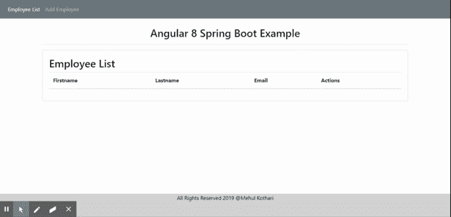
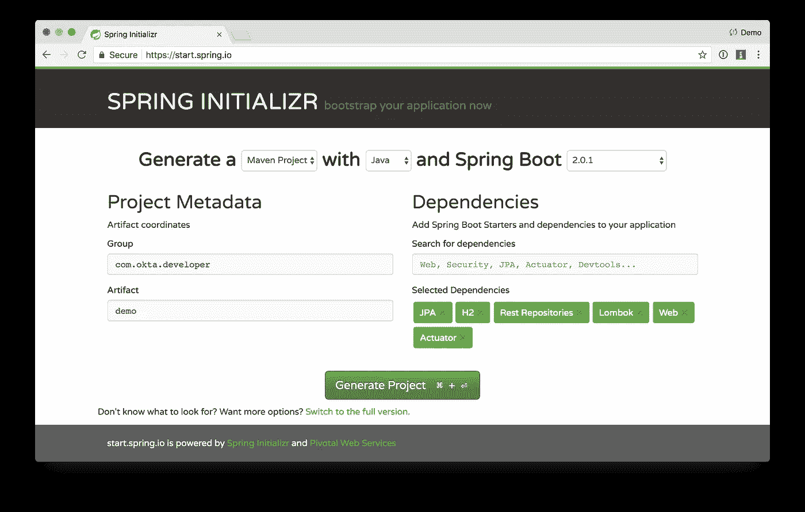
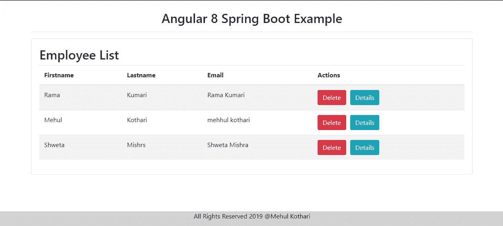
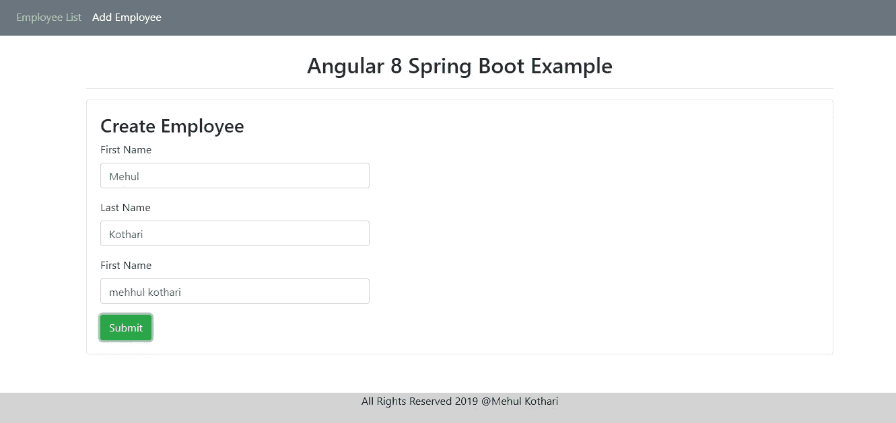
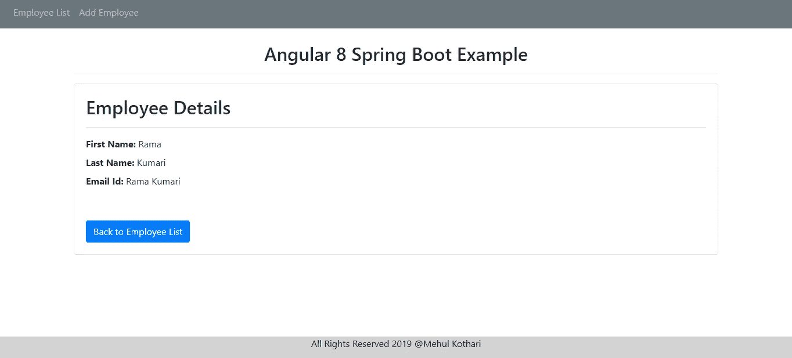

# Spring Boot +角度 8 CRUD 示例

> 原文：<https://medium.com/analytics-vidhya/spring-boot-angular-8-crud-example-8aeafd47b54?source=collection_archive---------0----------------------->

## Github 链接:[https://github . com/mehulk 05/Spring-Boot-Angular-8-CRUD-Example](https://github.com/mehulk05/Spring-Boot-Angular-8-CRUD-Example)

**Github 链接:**[**https://Github . com/mehulk 05/Spring-Boot-Angular-8-CRUD-Example**](https://github.com/mehulk05/Spring-Boot-Angular-8-CRUD-Example)



**工作演示**

在开始之前，我从 Java 指南中学习并获得了写这篇文章的灵感。你可以参考教程[这里](https://www.javaguides.net/2019/06/spring-boot-angular-7-crud-example-tutorial.html)

# **简介**

很多人问 angular 如何与 Spring Boot 应用程序一起工作。这是用非常简单的语言编写的教程。在本文中，我将向您展示如何使用 Angular 8 和 Spring Boot 开发一个 CRUD(创建读取更新删除)web 应用程序。该应用程序包含雇员表单，该表单具有 CRUD 操作，如添加、查看、删除和更新。对于前端，我们将使用 Angular 并消费服务。而后端将在春季启动，这将为我们提供一些数据

## **后端技术**

*   跳羚 2
*   休眠 5
*   春季数据 JPA

## 前端技术

*   Angular8
*   引导程序
*   Jquery

**因此，我们将分 5 部分创建它**

> 1.创建 SpringBoot 项目
> 
> 2.使用 Spring Boot 创建 Rest API
> 
> 3.创建一个角度应用程序
> 
> 4.在 angular 中创建组件、服务和模式文件
> 
> 5 配置要运行的应用

# 1.创建 SpringBoot 项目

*   **1.1 创建一个 Spring 项目**

要创建一个 spring boot 项目，你可以进入[**spring Initializer**](https://start.spring.io/)**。**你可以从默认设置开始，生成一个项目，然后解压并在任何 IDE 中打开(首选 Spring tool suite 或 Eclipse)。下图是你可以添加如下依赖项的图像



*   **1.2 更新 POM.xml**

下一步是你需要转到 pom.xml 中的包结构和 aa 下面的依赖项

```
<?xml version="1.0" encoding="UTF-8"?>  
<project ae ix" href="http://maven.apache.org/POM/4.0.0" rel="noopener ugc nofollow" target="_blank">http://maven.apache.org/POM/4.0.0" xmlns:xsi="[http://www.w3.org/2001/XMLSchema-instance](http://www.w3.org/2001/XMLSchema-instance)"  
    xsi:schemaLocation="[http://maven.apache.org/POM/4.0.0](http://maven.apache.org/POM/4.0.0) [http://maven.apache.org/xsd/maven-4.0.0.xsd](http://maven.apache.org/xsd/maven-4.0.0.xsd)">  
    <modelVersion>4.0.0</modelVersion>  
    <parent>  
        <groupId>org.springframework.boot</groupId>  
        <artifactId>spring-boot-starter-parent</artifactId>  
        <version>2.1.4.RELEASE</version>  
        <relativePath/> <!-- lookup parent from repository -->  
    </parent>  
    <groupId>com.main</groupId>  
    <artifactId>Employee</artifactId>  
    <version>0.0.1-SNAPSHOT</version>  
    <name>Employee</name>  
    <description>Demo project for Spring Boot</description>  

    <properties>  
        <java.version>1.8</java.version>  
    </properties>  

    <dependencies>  

        <dependency>  
            <groupId>org.springframework.boot</groupId>  
            <artifactId>spring-boot-devtools</artifactId>  
            <optional>true</optional>  
        </dependency>  

        <dependency>  
            <groupId>org.springframework.boot</groupId>  
            <artifactId>spring-boot-starter-data-jpa</artifactId>  
        </dependency>  
        <dependency>  
            <groupId>org.springframework.boot</groupId>  
            <artifactId>spring-boot-starter-web</artifactId>  
        </dependency>  

        <dependency>  
            <groupId>mysql</groupId>  
            <artifactId>mysql-connector-java</artifactId>  
            <scope>runtime</scope>  
        </dependency>  
        <dependency>  
            <groupId>org.springframework.boot</groupId>  
            <artifactId>spring-boot-starter-test</artifactId>  
            <scope>test</scope>  
        </dependency>  
    </dependencies>  

    <build>  
        <plugins>  
            <plugin>  
                <groupId>org.springframework.boot</groupId>  
                <artifactId>spring-boot-maven-plugin</artifactId>  
            </plugin>  
        </plugins>  
    </build>  

</project>
```

*   **1.3 配置数据库属性**

配置数据库以存储值

```
spring.datasource.url = jdbc:mysql://localhost:3306/employeedb?useSSL=false
spring.datasource.username = yourchoice of user name //root
spring.datasource.password = your choice of password //root## Hibernate Properties
# The SQL dialect makes Hibernate generate better SQL for the chosen database
spring.jpa.properties.hibernate.dialect = org.hibernate.dialect.MySQL5InnoDBDialect

# Hibernate ddl auto (create, create-drop, validate, update)
spring.jpa.hibernate.ddl-auto = update
```

# 2.使用 Spring Boot 创建 Rest API

*   创建员工
*   更新员工
*   删除员工
*   列出员工
*   通过 id 获取单个雇员
*   **2.1 创建实体类(Employee.java)**

这里，我们正在创建一个实体/POJO(普通旧 Java 对象)类。employee.java 的代码可以在我的回购协议中找到

[*https://github . com/mehulk 05/Spring-Boot-Angular-8-CRUD-Example/tree/master/Spring Boot 2-JPA-CRUD-Example/src/main/Java/net/guides/Spring Boot 2/Spring Boot 2 jpacrudexample/model*](https://github.com/mehulk05/Spring-Boot-Angular-8-CRUD-Example/tree/master/springboot2-jpa-crud-example/src/main/java/net/guides/springboot2/springboot2jpacrudexample/model)

```
package mehulk05.springboot2.springboot2jpacrudexample.model;

import javax.persistence.Column;import javax.persistence.Id;
import javax.persistence.Table;
import javax.persistence.GeneratedValue;
import javax.persistence.Entity;

import javax.persistence.GenerationType;

@Entity
@Table(name = "Emp")
public class Employee {

    private long id;
    private String fname;
    private String lname;
    private String email;

    public Employee() {

    }

    public Employee(String firstName, String lastName, String emailId) {
         this.fname= firstName;
         this.lname= lastName;
         this.email= emailId;
    }

    @Id
    @GeneratedValue(strategy = GenerationType.AUTO)
        public long getId() {
        return id;
    }
    public void setId(long id) {
        this.id = id;
    }

    @Column(name = "first_name", nullable = false)
    public String getFname() {
        return fna;
    }
    public void setFirstName(String firstName) {
        this.fname= firstName;
    }

    @Column(name = "last_name", nullable = false)
    public String getLname() {
        return lname;
    }
    public void setLastName(String lastName) {
        this.lname= lastName;
    }

    @Column(name = "email_address", nullable = false)
    public String getEmail() {
        return email;
    }
    public void setEmailId(String emailId) {
        this.email= emailId;
    }

    @Override
    public String toString() {
        return "Employee [id=" + id + ", first-Name=" + fname+ ", last-Name=" + lname+ ", email-Id=" + email
       + "]";
    }

}
```

*   **2.2 创建 DAO 接口(EmployeeRepository.java)**

这里，我们创建 DAO 接口来执行数据库相关的操作。下面是 GitHub 链接

```
package mehulk05.springboot2.springboot2jpacrudexample.repository;
import org.springframework.stereotype.Repository;
import org.springframework.data.jpa.repository.JpaRepository;

import mehulk05.springboot2.springboot2jpacrudexample.model.Employee;

@Repository
public interface EmployeeRepository extends JpaRepository<Employee, Long>{

}
```

*   **2.3 创建控制器类**

这里，我们正在创建控制器类，以便在不同的路径上进行通信。下面是 GitHub 链接

[*https://github . com/mehulk 05/Spring-Boot-Angular-8-CRUD-Example/tree/master/Spring Boot 2-JPA-CRUD-Example/src/main/Java/net/guides/Spring Boot 2/Spring Boot 2 jpacrudexample/controller*](https://github.com/mehulk05/Spring-Boot-Angular-8-CRUD-Example/tree/master/springboot2-jpa-crud-example/src/main/java/net/guides/springboot2/springboot2jpacrudexample/controller)

```
package mehulk05.springboot2.springboot2jpacrudexample.controller;

import java.util.HashMap;
import java.util.List;
import java.util.Map;

import javax.validation.Valid;

import org.springframework.beans.factory.annotation.Autowired;
import org.springframework.http.ResponseEntity;import org.springframework.web.bind.annotation.PathVariable;
import org.springframework.web.bind.annotation.DeleteMapping;
import org.springframework.web.bind.annotation.GetMapping;import org.springframework.web.bind.annotation.PutMapping;
import org.springframework.web.bind.annotation.PostMapping;

import org.springframework.web.bind.annotation.RequestBody;
import org.springframework.web.bind.annotation.RequestMapping;
import org.springframework.web.bind.annotation.RestController;

import mehulk05.springboot2.springboot2jpacrudexample.exception.ResourceNotFoundException;
import mehulk05.springboot2.springboot2jpacrudexample.model.Employee;
import mehulk05.springboot2.springboot2jpacrudexample.repository.EmployeeRepository;

@RestController @CrossOrigin(origins = "http://localhost:4200")
@RequestMapping("/api/path1")
public class EmployeeController {
    @Autowired
    private EmployeeRepository employeeRepository;

    @GetMapping("/employee")
    public List<Employee> getAllEmployees() {
        return employeeRepository.findAll();
    }

    @GetMapping("/employees/{id}")
    public ResponseEntity<Employee> getEmployeeById(@PathVariable(value = "id") Long employeeId)
        throws ResourceNotFoundException {
        Employee employee = employeeRepository.findById(employeeId)
          .orElseThrow(() -> new ResourceNotFoundException("Employee not found for this id :: " + employeeId));
        return ResponseEntity.ok().body(employee);
    }

    @PostMapping("/employee")
    public Employee createEmployee(@Valid @RequestBody Employee employee) {
        return employeeRepository.save(employee);
    }

    @DeleteMapping("/employees/{id}")
    public Map<String, Boolean> deleteEmployee(@PathVariable(value = "id") Long employeeId)
         throws ResourceNotFoundException {
        Employee employee = employeeRepository.findById(employeeId)
       .orElseThrow(() -> new ResourceNotFoundException("Employee not present for the id :: " + employeeId));

        employeeRepository.delete(employee);
        Map<String, Boolean> response = new HashMap<>();
        response.put("deleted", Boolean.TRUE);
        return response;
    } @PutMapping("/employees/{id}")
    public ResponseEntity<Employee>          updateEmployee(@PathVariable(value = "id") Long employeeId,
         @Valid @RequestBody Employee employeeDetails) throws    ResourceNotFoundException {
        Employee employee = employeeRepository.findById(employeeId)
        .orElseThrow(() -> new ResourceNotFoundException("Employee not found for this id :: " + employeeId));

        employee.setEmailId(employeeDetails.getEmail());
        employee.setLastName(employeeDetails.getLname());
        employee.setFirstName(employeeDetails.getFname());
        final Employee updatedEmployee = employeeRepository.save(employee);
        return ResponseEntity.ok(updatedEmployee);
    }
}
```

*   **2.4 处理错误**

错误处理可以参考我的 GitHub 链接。我跳过了这一部分

# 3.创建一个角度应用程序

```
ng new Employe-Crud
```

因此，我们将在 angular app 中添加什么

## 组件:

*   创建-员工
*   员工列表
*   员工-详细信息

## 服务

*   员工服务

## 情态的

*   员工. ts

'要安装 jquery 和 bootstrap，您可以参考任何外部资源'

# 4.在 angular 中创建组件、服务和模式文件

## **4.1 模态类(Employee.ts)**

```
export class Employee {
    id: number;
    fname: string;
    lname: string;
    email: string;
    active: boolean;
}
```

## **4.2 员工列表组件(Employee-List . Component . ts)**

下面是 Github 链接

[*https://github . com/mehulk 05/Spring-Boot-Angular-8-CRUD-Example/tree/master/Angular 8-Spring Boot-client/src/app/employee-list*](https://github.com/mehulk05/Spring-Boot-Angular-8-CRUD-Example/tree/master/angular8-springboot-client/src/app/employee-list)

```
import { EmployeeDetailsComponent } from '../employee-details/employee-details.component';
import { Observable } from "rxjs";import { Employee } from "../employee";import { Router } from '@angular/router';
import { Component, OnInit } from "@angular/core";import { EmployeeService } from "../employee.service";

@Component({
  selector: "app-employee-list",
  templateUrl: "./employee-list.component.html",
  styleUrls: ["./employee-list.component.css"]
})
export class EmployeeListComponent implements OnInit {
  employee: Observable<Employee[]>;

  constructor(private es: EmployeeService,
    private router: Router) {}

  ngOnInit() {
    this.reloadData();
  }

  reloadData() {
    this.employees = this.es.getEmployeesList();
  }

  deleteEmployee(id: number) {
    this.es.deleteEmployee(id)
      .subscribe(
        data => {
          console.log(data);
          this.reloadData();
        },
        error => console.log(error));
  }

  employeeDetails(id: number){
    this.router.navigate(['details', id]);
  }
}
```

**employee-component.html**

```
<div  class="panel panel-primary">
  <div  class="panel-heading">
    <h2>Employees List</h2>
  </div>
  <div class="panel-body main">
    <table class="table table-hover table-striped">
      <thead>
        <tr>
          <th>First-name</th>
          <th>Last-name</th>
          <th>Email-Id</th>
          <th>Actions </th>
        </tr>
      </thead>
      <tbody>
        <tr *ngFor="let emp of employees | async">
          <td>{{emp.firstName}}</td>
          <td>{{emp.lastName}}</td>
          <td>{{emp.emailId}}</td> <td><button (click)="deleteEmployee(emp.id)" class="btn btn-danger btn-delete">Delete</button> <button (click)="employeeDetails(emp.id)" class="btn btn-info btn-detail" style="margin-left: 10px">Details</button>
          </td>
        </tr>
      </tbody>
    </table>
  </div>
</div>
```

## **4.3 创建雇佣组件**

在这里，我们将编写创建雇员的代码。你可以在这里找到 Github 链接

**create-employee . component . ts**

```
import { Component, OnInit } from '[@angular/core](http://twitter.com/angular/core)';
import { Employee } from '../employee';
import { Router } from '[@angular/router](http://twitter.com/angular/router)';
import { EmployeeService } from '../employee.service';[@Component](http://twitter.com/Component)({
  selector: 'app-create-employee',
  templateUrl: './create-employee.component.html',
  styleUrls: ['./create-employee.component.css']
})
export class CreateEmployeeComponent implements OnInit {employee: Employee = new Employee();
  submitted = false;constructor(private es: EmployeeService,
    private router: Router) { }ngOnInit() {
  }newEmployee(): void {
    this.submitted = false;
    this.employee = new Employee();
  }save() {
    this.es.createEmployee(this.employee)
      .subscribe(data => console.log(data), error => console.log(error));
    this.employee = new Employee();
    this.gotoList();
  }onSubmit() {
    this.submitted = true;
    this.save();    
  }gotoList() {
    this.router.navigate(['/employees']);
  }
}
```

**create-employee.component.html**

```
<h3>New Employe Clickk here to create</h3>
<div [hidden]="submitted" style="width: 500px;">
  <form (ngSubmit)="onSubmit()">
    <div class="form-group">
      <label for="fname">First Name</label>
      <input type="text" class="form-control" id="fname" required [(ngModel)]="employee.fname" name="firstName">
    </div>

    <div class="form-group">
      <label for="name">Last Name</label>
      <input type="text" class="form-control" id="lastName" required [(ngModel)]="employee.lname" name="lastName">
    </div>

    <div class="form-group">
      <label for="name">First Name</label>
      <input type="text" class="form-control" id="emailId" required [(ngModel)]="employee.email" name="emailId">
    </div>

    <button type="submit" class="btn btn-success">Submit</button>
  </form>
</div>

<div [hidden]="!submitted">
  <h4>You submitted successfully!</h4>
  <!-- <button class="btn btn-success" (click)="newEmployee()">Add</button> -->
</div>
```

## **4.4 更新员工组件**

这里我们将编写角度代码来更新组件

[*https://github . com/mehulk 05/Spring-Boot-Angular-8-CRUD-Example/tree/master/Angular 8-Spring Boot-client/src/app/update-employee*](https://github.com/mehulk05/Spring-Boot-Angular-8-CRUD-Example/tree/master/angular8-springboot-client/src/app/update-employee)

update-employee.component.html

```
<h3>Click here to Update  Employee</h3>
<div [hidden]="submitted" style="width: 400px;">
  <form (ngSubmit)="onSubmit()">
    <div class="form-group">
      <label for="name">First Name</label>
      <input type="text" class="form-control" id="firstName" required [(ngModel)]="employee.fname" name="firstName">
    </div>

    <div class="form-group">
      <label for="name">Last Name</label>
      <input type="text" class="form-control" id="lastName" required [(ngModel)]="employee.lname" name="lastName">
    </div>

    <div class="form-group">
      <label for="name">First Name</label>
      <input type="text" class="form-control" id="emailId" required [(ngModel)]="employee.email" name="emailId">
    </div>

    <button type="submit" class="btn btn-primary">Submit</button>
  </form>
</div>
```

**更新组件. ts**

```
import { Employee } from '../employee';
import { Component, OnInit, Input } from '@angular/core';
import { EmployeeService } from '../employee.service';
import { EmployeeListComponent } from '../employee-list/employee-list.component';
import { Router, ActivatedRoute } from '@angular/router';

@Component({
  selector: 'app-employee-details',
  templateUrl: './employee-details.component.html',
  styleUrls: ['./employee-details.component.css']
})
export class EmployeeDetailsComponent implements OnInit {

  id: number;
  employee: Employee;

  constructor(private route: ActivatedRoute,private router: Router,
    private es: EmployeeService) { }

  ngOnInit() {
    this.employee = new Employee();

    this.id = this.route.snapshot.params['id'];

    this.es.getEmployee(this.id)
      .subscribe(data => {
        console.log(data)
        this.employee = data;
      }, error => console.log(error));
  }

  employee_list(){
    this.router.navigate(['employees']);
  }
}
```

## 4.5 员工详细信息

这里我们将编写角度代码来显示雇员的详细信息。这是我的 Github 链接

**employee-detail.component.html**

```
<h2>Employee Details</h2> 

<hr/>
<div *ngIf="employee">
  <div>
    <label><b>First Name: </b></label> {{employee.fname}}
  </div>
  <div>
    <label><b>Last Name: </b></label> {{employee.lname}}
  </div>
  <div>
    <label><b>Email Id: </b></label> {{employee.email}}
  </div>  
</div>

<br>
<br>
<button (click)="Employee_list()" class="btn btn-primary">Back to Employee List</button><br>
```

**employee-detail . component . ts**

```
import { Employee } from '../employee';
import { Component, OnInit, Input } from '@angular/core';
import { EmployeeService } from '../employee.service';
import { EmployeeListComponent } from '../employee-list/employee-list.component';
import { Router, ActivatedRoute } from '@angular/router';

@Component({
  selector: 'app-employee-detail',
  templateUrl: './employee-detail.component.html',
  styleUrls: ['./employee-detail.component.css']
})
export class EmployeeDetailComponent implements OnInit {

  id: number;
  employee: Employee;

  constructor(private route: ActivatedRoute,private router: Router,
    private es: EmployeeService) { }

  ngOnInit() {
    this.employee = new Employee();

    this.id = this.route.snapshot.params['id'];

    this.es.getEmployee(this.id)
      .subscribe(data => {
        console.log(data)
        this.employee = data;
      }, error => console.log(error));
  }

  Employee_list(){
    this.router.navigate(['employees']);
  }
}
```

# 服务

员工服务将包含所有方法，并向所有组件提供数据。 **EmployeeService** 将用于从 spring-boot 本地服务器(后端)获取数据。下面是 Github 的链接。

[*https://github . com/mehulk 05/Spring-Boot-Angular-8-CRUD-Example/blob/master/Angular 8-Spring Boot-client/src/app/employee . service . ts*](https://github.com/mehulk05/Spring-Boot-Angular-8-CRUD-Example/blob/master/angular8-springboot-client/src/app/employee.service.ts)

## 4.7 员工服务

```
import { Injectable } from '@angular/core';
import { HttpClient } from '@angular/common/http';
import { Observable } from 'rxjs';

@Injectable({
  providedIn: 'root'
})
export class EmployeeService {

  private url= 'http://localhost:8080/springboot-crud-rest/api/path1/employees';

  constructor(private http: HttpClient) { }

  getEmployee(id: number): Observable<any> {
    return this.http.get(`${this.url}/${id}`);
  }

  createEmployee(employee: Object): Observable<Object> {
    return this.http.post(`${this.url}`, employee);
  }

  updateEmployee(id: number, value: any): Observable<Object> {
    return this.http.put(`${this.url}/${id}`, value);
  }

  deleteEmployee(id: number): Observable<any> {
    return this.http.delete(`${this.url}/${id}`, { responseType: 'text' });
  }

  getEmployeesList(): Observable<any> {
    return this.http.get(`${this.url}`);
  }
}
```

# 5 配置要运行的应用

在本节中，我们将配置应用程序，以便运行它。首先，我们将添加路由

## 5.1 路由:

路由用于调用或导航我们 Angular 应用程序中的不同组件。下面是 Github 的链接

**App.routing.modue.ts**

```
import { NgModule } from '[@angular/core](http://twitter.com/angular/core)';
import { Routes, RouterModule } from '[@angular/router](http://twitter.com/angular/router)';
import { EmployeeListComponent } from './employee-list/employee-list.component';
import { CreateEmployeeComponent } from './create-employee/create-employee.component';
import { UpdateEmployeeComponent } from './update-employee/update-employee.component';
import { EmployeeDetailsComponent } from './employee-details/employee-details.component';const routes: Routes = [{ path: '', redirectTo: 'employee', pathMatch: 'full' },
  { path: 'employees', component: EmployeeListComponent },
  { path: 'add-emp', component: CreateEmployeeComponent },
  { path: 'update-emp/:id', component: UpdateEmployeeComponent },
  { path: 'emp-detail/:id', component: EmployeeDetailsComponent },
];[@NgModule](http://twitter.com/NgModule)({
  imports: [RouterModule.forRoot(routes)],
  exports: [RouterModule]
})
export class AppRoutingModule { }
```

## **5.2 应用组件**

App component 是在 index.html 中执行的 app-root 文件。为了使我们的组件可访问，我们需要在 app.component.html 中添加一些代码

[*https://github . com/mehulk 05/Spring-Boot-Angular-8-CRUD-Example/blob/master/Angular 8-Spring Boot-client/src/app/app . component . html*](https://github.com/mehulk05/Spring-Boot-Angular-8-CRUD-Example/blob/master/angular8-springboot-client/src/app/app.component.html)

**app.component.html**

```
<nav class="navbar navbar-expand-sm bg-primary navbar-dark">

  <ul class="navbar-nav">
    <li class="nav-item">
        <a routerLink="employees" class="nav-link" routerLinkActive="active">Employee List</a>
    </li>
    <li class="nav-item">
        <a routerLink="add-emp" class="nav-link" routerLinkActive="active">Add Employee</a>
    </li>
  </ul>
</nav>
<div class="container">
  <br>
  <h2 style="text-align: center;">{{title}}</h2>
  <hr>  
  <div class="card">
    <div class="card-body">
  <router-outlet></router-outlet>
    </div>
  </div>
</div>
```

# 6 运行应用程序和弹簧启动应用程序

**第一步**:首先运行 spring boot app。一旦您在 spring boot 的控制台中看到成功消息，请转到步骤 2

**步骤 2** :现在通过运行命令运行 angular 应用程序

```
ng serve -o
```

如果您发现一些端口冲突问题，您可以手动指定端口号

```
ng serve --port 5000
```

## 屏幕上显示程序运行的图片



**员工名单**



**添加员工**



**员工详细信息**

我的 GitHub 存储库中的源代码

[](https://www.buymeacoffee.com/mehulkothar)[](https://github.com/mehulk05/Spring-Boot-Angular-8-CRUD-Example) [## mehulk 05/Spring-Boot-Angular-8-CRUD-示例

### 我们将学习如何使用 Angular 8 作为前端来开发一个 CRUD(创建、读取、更新、删除)Web 应用程序

github.com](https://github.com/mehulk05/Spring-Boot-Angular-8-CRUD-Example) 

如果你有任何疑问，请随时提问。我将非常感激能帮助你。如果你喜欢我的博客，请在[https://paypal.me/mehulk05?country.x=IN&locale . x = en _ GB](https://paypal.me/mehulk05?country.x=IN&locale.x=en_GB)表示支持