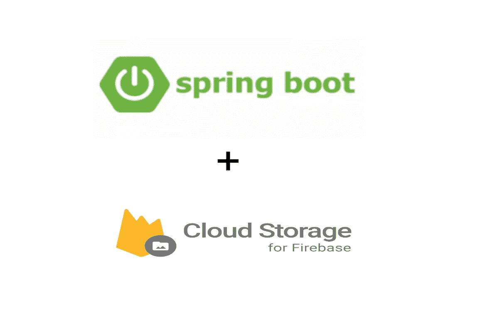

# 带燃料库的 Spring Boot

> 原文：<https://medium.com/analytics-vidhya/spring-boot-with-firebase-storage-73f574af8c4?source=collection_archive---------2----------------------->

Firebase 提供了一个强大、简单且经济高效的对象云存储服务。此外，Firebase SDK 为文件上传和下载增加了谷歌安全性。SDK 可用于存储图像、文件、视频和其他用户生成的内容。

本文旨在实现以下目标:

*   利用 Firebase 存储在现有的 spring boot 服务器中上传和下载文件…