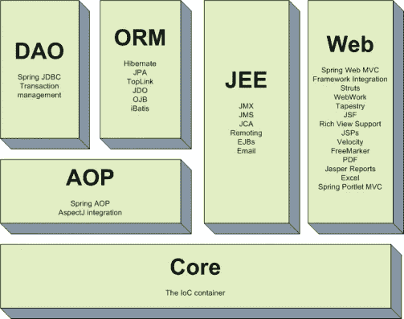
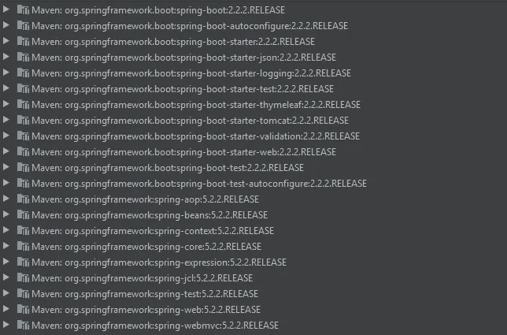
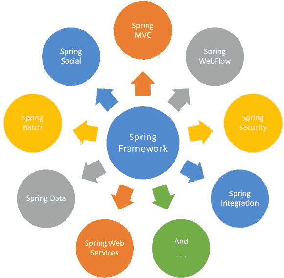

# Spring vs Spring Boot:框架的比较

> 原文：<https://medium.com/analytics-vidhya/spring-vs-spring-boot-a-comparison-of-frameworks-b6615816155d?source=collection_archive---------9----------------------->


什么是 Spring Boot？什么是 Spring 框架？他们的目标是什么？怎么比较呢？你脑子里一定有很多疑问。在这篇博客的结尾，你会有所有这些问题的答案。随着对 Spring 和 Spring Boot 框架的了解越来越多，你会逐渐理解它们各自解决不同类型的问题。更多关于 [**Spring Boot 在线培训**](https://onlineitguru.com/spring-boot-training.html) 的附加信息

# 春天是什么？Spring 解决的核心问题是什么？

Spring 框架是最流行的 Java 应用程序开发框架之一。Spring 最好的特性之一是它有**依赖注入(DI)** 或**控制反转(IOC)**，这允许我们开发松散耦合的应用程序。而且，松散耦合的应用程序可以很容易地进行单元测试。

# 没有依赖注入的例子

考虑下面的例子— `MyController`依赖于`MyService`来执行某个任务。因此，要获得 MyService 的实例，我们将使用:

`MyService service = new MyService();`

现在，我们已经为`MyService`创建了实例，我们看到两者是紧密耦合的。如果我在`MyController`的单元测试中为`MyService`创建一个模拟，我如何让`MyController`使用这个模拟？这有点难，不是吗？

```
@RestController
public class MyController {
    private MyService service = new MyService();   @RequestMapping("/welcome")
   public String welcome() {
        return service.retrieveWelcomeMessage();
    }
}
```

# 依赖注入的例子

只需要借助两个注释，我们就可以很容易地得到`MyService`的实例，它不是紧耦合的。Spring 框架做了所有艰苦的工作来使事情变得更简单。

*   `@Component`只是在 Spring 框架中用作*一个 bean，您需要在自己的 BeanFactory(工厂模式的一个实现)中管理它。*
*   `@Autowired`简单地用在 Spring 框架中，为这个特定类型找到正确的匹配，并自动连接它。

因此，Spring 框架将为`MyService`创建一个 bean，并自动将其连接到`MyController`。

在单元测试中，我可以要求 Spring 框架将`MyService`的模拟自动连接到`MyController`。

```
@Component
public class MyService {
    public String retrieveWelcomeMessage(){
        return "Welcome to InnovationM";
  }}@RestController
public class MyController {    @Autowired
    private MyService service;    @RequestMapping("/welcome")
    public String welcome() {
        return service.retrieveWelcomeMessage();
    }
```

Spring 框架还有很多其他特性，分为二十个模块来解决很多常见问题。以下是一些更受欢迎的模块:



spring 框架中的一些特性

面向方面编程(AOP)是 Spring 框架的另一个优势。面向对象编程中的关键单元是**类**，而在 AOP 中，关键单元是**方面**。例如，如果您想在项目中添加安全性、日志记录等。，您可以只使用 AOP，将这些作为横切关注点，远离您的主要业务逻辑。您可以在方法调用之后、方法调用之前、方法返回之后或异常出现之后执行任何操作。

# 如果春天能解决这么多问题，我们为什么还需要 Spring Boot？

现在，如果你已经使用过 Spring，想想你在开发一个功能齐全的 Spring 应用程序时遇到的问题。想不出一个？让我告诉你——设置 Hibernate 数据源、实体管理器、会话工厂和事务管理有很多困难。开发人员使用 Spring MVC 建立一个功能最少的基本项目需要花费大量时间。

# Spring Boot 是如何解决这个问题的？

1.  Spring Boot 使用`AutoConfiguration`完成所有这些工作，并且会处理你的应用程序需要的所有内部依赖——你需要做的就是运行你的应用程序。如果 Spring `jar`在类路径中，Spring Boot 将自动配置 Dispatcher Servlet。如果 Hibernate `jar`在类路径中，它将自动配置数据源。Spring Boot 给了我们一组预配置的启动项目，作为我们项目的一个依赖项。
2.  在 web 应用程序开发期间，我们需要我们想要使用的 jar，使用 jar 的哪个版本，以及如何将它们连接在一起。所有的 web 应用程序都有类似的需求，例如，Spring MVC、Jackson Databind、Hibernate core 和 Log4j(用于日志记录)。因此，我们必须选择所有这些罐子的兼容版本。为了降低复杂性，Spring Boot 引入了我们所谓的 **Spring Boot 启动器。**

# Spring Web 项目的依赖项

```
<dependency>
   <groupId>org.springframework.boot</groupId>
   <artifactId>spring-boot-starter-thymeleaf</artifactId>
</dependency><dependency>
   <groupId>org.springframework.boot</groupId>
   <artifactId>spring-boot-starter-web</artifactId>
</dependency>
```

Starters *是一组方便的依赖项，您可以将它们包含在您的 Spring Boot 应用程序中。为了使用 Spring 和 Hibernate，我们只需要在项目中包含 spring-boot-starter-data-jpa 依赖项。*

# Spring Boot Starter Web 的依赖项

```
<dependency>
   <groupId>org.springframework.boot</groupId>
   <artifactId>spring-boot-starter-thymeleaf</artifactId>
</dependency>
```

下面的屏幕截图显示了添加到我们的应用程序中的单个依赖项下的不同包:



起动机腹板弹簧

这就是 spring 和 spring boot 在框架中的区别。



弹簧框架

[](http://linkedin.com/in/ashan-lakmal) [## Ashan Lakmal -软件工程师实习- Axiata 数字实验室| LinkedIn

### 查看 Ashan Lakmal 在全球最大的职业社区 LinkedIn 上的个人资料。亚山有 4 份工作列在他们的…

linkedin.com](http://linkedin.com/in/ashan-lakmal)