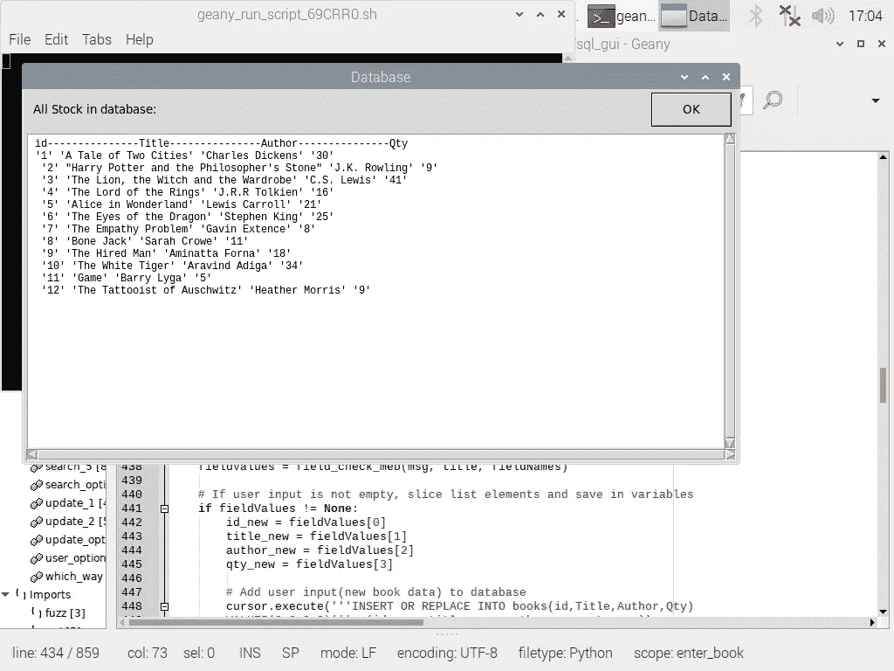

# 基于 Python 和 SQLite3 的图书管理系统

> 原文：<https://medium.com/analytics-vidhya/sql-based-book-management-system-in-python-1f7e20c2bced?source=collection_archive---------1----------------------->


在这篇文章中，我将介绍如何用 Python 构建一个基于 SQL(结构化查询语言)的图书管理系统，并提供一个集成的图形用户界面。

您需要为此程序导入一些 python 库:

*   numpy
*   sqlite3
*   json
*   easygui
*   平台
*   模糊的
*   一团

现在，在我继续之前，让我给你一个简短的介绍。你可能想知道…为什么是 easygui？为什么不选择 Tkinter 或 PyQt 来制作 GUI 呢？良好的..大约一年前，我无法用 python IDE 打印“hello world ”,也不知道 IDE 是什么。大约在 2019 年底，在没有任何领域知识的情况下，我参加了一个数据科学训练营，并开始熟悉 python 编程语言，所以我仍然非常缺乏经验。

当您构建一个为最终用户设计的程序时，通常他们不喜欢通过 cli(命令行)环境来操作它。用户想按下按钮，看起来很好，程序必须最好是直观和易于导航。

由于我的经验有限，我偶然发现了 easygui 库，我发现它非常容易使用。这可能是我关于使用 easygui 的最后一篇文章，因为我不想停滞在这个库上，但是我想向那些没有什么经验的人展示用 easygui 围绕一个程序构建一个 gui 是多么容易。事不宜迟，让我们开始吧:

我们将在这个程序中使用的数据是我自己编译的一个. json 文件。虽然很少，但也够用了。如果你愿意的话，可以随意编译和使用你自己的，只要确保格式不变。你可以随便给它起什么名字。小心保存。py 和。json 文件放在同一个位置。下面是 books.json 文件的快速视图:


书籍. json

JSON 键是不言自明的，但是让我们快速浏览一下:

id:图书 id(例如，这也可以更改为 ISBN)

标题:书名

作者:图书作者

数量:账面数量

好了，现在让我们启动 IDE，开始导入上面提到的 python 库:


该程序由 27 个函数组成。当你运行程序时，只有一个名为‘which _ way()’的函数被调用。从那里开始，根据用户输入，从其他函数中调用替代函数。我不会在这里一一介绍，因为有一些相似之处，但是我会把它们都包含在源代码中。

让我们看看第一个:


这个函数产生图书管理器的主菜单。因为这个程序只包含函数，所以我们将一些变量声明为全局变量，以便它们在被其他函数引用时可用。

为了简单起见，在测试 GUI 时，我将登录名设置为“admin ”,密码设置为“1234 ”,如上面第 26/27 行所示。你可以随意改变。在保存登录，密码和初始化'布尔'变量为'真'之后，我们定义 easygui choicebox 参数，它设置显示文本和选项。

用户输入(文本(字符串)或用户点击的选项)保存在“字段值”变量中。如果用户选择从一个. json 文件上传创建一个新的数据库，布尔变量被设置为‘False ’, log in _ window(布尔)函数被调用。

或者，如果用户选择从上一个会话停止的地方继续，他们可以通过选择“在现有数据库上继续”选项来加载 existing _db 文件，这将调用 login_window(boolean)函数，并将布尔变量设置为 True。然而，如果用户按下取消，程序终止。

以下是运行程序时 GUI 主菜单的快照:


对，所以无论用户在主菜单中点击哪个选项(除了取消)… login_window(boolean)都会被调用，下面的窗口会出现，提示用户输入登录名和密码:


让我们来看看“登录窗口(布尔)”函数:


login_window(布尔值)

首先，在这种情况下，GUI(easygui multpasswordbox)需要定义其显示参数。这就是第 54-56 行的内容。然后我们调用一个名为‘field _ check _ MPB(msg，title，field names)’的函数。这个坏男孩所做的是它产生了一个登录许可窗口，用户需要在这里输入登录名和密码，它还会检查缺失的字段条目。让我们快速浏览一下:


field_check-mpb()

这个特定函数的内容(第 385–394 行)来自 easygui 文档。首先，easygui 'multpasswordbox()'被调用，它产生登录/密码输入框，其参数在前面的 login_window(boolean)函数中定义。如果用户将登录或密码字段留空，基本上他们将陷入一个循环，并被要求输入缺少的字段，如下图所示:


如果两个字段都被输入，并且用户按下 OK，用户输入将被保存为 fieldValues 变量中的列表，并且将被返回到先前的 login_window(boolean)函数，以便在第 63 行进一步处理。


login_window(布尔值)

如果按下 easygui multpasswordbox 中的 cancel 按钮，将返回‘None ’,因此条件语句位于第 63 行。如果用户没有按 cancel，并且布尔变量被设置为“True ”,那么作为列表返回的用户输入(字段值)将被切片并保存在变量中，然后在被调用时传递给 login_permission(登录，密码)函数。

相同的逻辑应用于第 68–71 行，不同之处在于，如果布尔值被设置为‘False’…这意味着用户希望从. json 文件加载一个新数据库，而不是继续在现有的 _db 文件上加载，那么将调用 db_permission(login，password)而不是 login_permission(login，password)。else…用户按了 cancel，然后将返回到原来的窗口。

让我们来看看 login_permission(登录，密码)函数:


像灰姑娘的脚一样又短又甜，这个函数检查三件事:如果' file_search()'函数返回' yes '；如果输入的登录名和密码正确无误。如果全部检查完毕，将调用 restore_db()函数和 main_menu()函数。否则…“book store _ db”文件不存在和/或登录/密码不正确，用户将收到警告并返回到原始窗口。

“file_search()”函数的快速概要。第 93 行到第 94 行我们调用平台库来检索操作系统名称，并将其保存在变量“system”中。然后，我们使用 fuzzywuzzy 库来确定它是否是 Windows 操作系统。我们将“系统”变量(可能是 Linux、Microsoft Windows 或其他什么)与“Windows”字符串进行匹配，以获得一个分数。


根据分数，我们使用适当的路径细节(对于 Windows 使用\，对于其余的使用/来确定 bookstore_db 文件是否已经存在。如果是，该函数将变量“yes_no”设置为“yes”并返回它。

好的，让我们看看 restore_db():


这是我们连接到数据库并打开 existing _db 文件的地方。我们需要将“db”和“cursor”变量设置为全局变量，以便在使用相同变量的其他函数中与数据库进行交互。

现在，在我们查看“user_options()”和“main_menu()”函数之前，让我们快速返回来查看通过 db_permission(登录，密码)函数调用的 load_db()函数。它具有与 login_permission(login，password)相同的逻辑，唯一的区别是当用户想要从. json 文件上传创建新的数据库文件时，调用' load_db()'而不是' restore_db()'。好吧…下面是调用 load_db()时的样子:


在这里您可以选择。要导入数据库(_db)文件的 json 文件。

我会尽量保持对 load_db()的解释简短，因为它是一个冗长的函数，所以我删除了对快照的注释。所有的注释都在源代码中。让我们看看下面的 load_db()。

在前几行中，我们定义了 easygui fileopenbox 参数，然后第 242 行生成了 gui。这个 easygui fileopenbox 返回一个包含 1 个元素的列表，该元素是。用户在所述 fileopenbox 中选择的 json 文件。第 244 到 246 行我们从这个文件路径中分离出每个字符，并把它放到一个新的列表中。然后我们在第 248 行反转这个列表。接下来的两行我们检索运行这个程序的机器的系统 OS，并把它保存在变量' system '中。在第 251 行，我们将变量 dash 初始化为“/”。


然后，我们调用 fuzzywuzzy，通过字符串匹配来确定它是否是 Windows 操作系统，如果是，我们希望将破折号变量从'/'更改为' \ '，因为 Windows 使用反斜杠作为文件路径。然后在第 256 行，我们需要从文件路径中找到最后一个‘破折号’的索引。一旦我们有了它，我们就在 numpy 的帮助下把它变成底片。

这一切的原因是我们不知道。json 文件名，我们需要从文件路径中截取文件名。第 259 行…如果用户没有在文件打开框中按下取消，将文件名切片并保存为变量‘文件名’。我们现在可以获取这个文件名，并转到 populate_db2(filename)，或者，如果用户按下 cancel，他们将返回到原来的窗口。让我们快速地看一下 populate_db2(filename ),然后我们再回到前面-->“restore _ db()/user _ options()/main _ menu”第 263 行。

好的，下面我们有函数‘populate _ DB2(filename)’。我们首先打开。json 文件，文件名是我们从前面的函数中获取的，我们将文件内容保存为变量‘data’。这里将 db 和 cursor 设置为全局的原因也是因为我们不知道用户将选择哪条路线。


然后，我们连接到数据库，在第 212 到 219 行中，我们为我们在。json 文件。第 222 到 224 行我们解析了。json 文件并将数据通过 JSON 键插入到匹配的表列中。最后，我们可以访问 user_options()和 main_menu()函数；)

当调用 user_options()时，用户会看到以下选项列表:


你猜对了！是时候看看“user_options()”函数了:

第 338 到 341 行产生了选项菜单。第 344–352 行我们从 books 表中检索元数据(列名),稍后我们将使用它进行显示。我们将 user_choice 设置为全局的，并将其初始化为 fieldValues 值。所以无论用户在选项菜单中点击什么，都会保存为 user_choice。然后我们调用 main_menu()函数，该函数需要在每次调用 user_options 时运行。


现在让我们看看“main_menu()”函数:


这可以被认为是主选项菜单的主干，并且它是不言自明的。只要用户没有按 Exit 或 cancel(返回‘None’)，循环就不会中断，选项菜单应该继续做它最擅长的事情。显示选项。此外，每个选项(当然除了退出)都有一个子选项菜单，点击时会调用这个菜单。当 sub option 函数完成时，user_options()再次被调用，用户返回到 options 菜单。

首先，让我们转到“搜索图书”选项，看看数据库中目前有什么，因为如果用户进入选项菜单…那么要么是加载了现有的数据库文件，要么是用户刚刚从. json 文件加载了一个新的文件。


哦，我的…更多的选择。现在，让我们选择“查看全部”,看看我们会得到什么:



好的，这就是。json 文件内容没有改变，因为我刚刚通过第一个菜单中的“加载新数据库**”选项进行了一次全新的上传。这个选项执行它所声明的，它将从数据库中检索所有唯一的记录并显示出来。既然我们点击了“搜索书籍”和“查看所有”选项，我想我们应该快速了解一下它们的功能:


搜索选项()

该函数以 easygui choicebox 的形式生成搜索书子菜单。用户输入保存为 fieldValues 变量，然后在第 661 到 670 行的条件语句中使用。在上面的例子中，我们点击“查看全部”，search_5()被调用。其余部分的逻辑是一样的。

search_5():


search_5()

第 833 到 834 行我们查询数据库，从名为 books 的表中返回所有唯一的条目。

然后，我们遍历所有行，并将数据保存在一个名为“all_stock”的变量中。Easygui 不喜欢从查询中获取数据，所以我们将它改为一个 numpy 数组，对它进行整形，使它有 4 列和所需的行数。我们用 air 替换括号，然后放到 easygui 代码盒中进行显示。现在我们剩下 4 个“搜索书”选项。

*   按身份证号搜索；-按标题搜索；-按作者搜索&-低库存检查。

除了“低库存检查器略有不同”之外，前 3 个在语法上都非常相似。让我们看看“低库存检查器”在被选中时会产生什么结果:


你可能已经猜到了，它显示的是库存不足的书，所以图书管理员不会在没有意识到的情况下对缺货的书措手不及。俗话说:“一天盘点一次，让愤怒的顾客远离”。该函数将图书过滤为“低库存”的低分可在“search_4()”函数中进行调整，我们将快速了解一下:


search_4()

第 805 行我们定义“低分”并将其保存为变量“低分”,然后在第 807 到 808 行将其添加到数据库查询中。所有搜索功能都遵循相同的逻辑和语法:

查询→转换为数组→整形和显示

我将快速浏览其他搜索功能，并快速显示每个功能。首先..“按 id 号搜索”，向上滚动一点，回到我们查看所有记录的地方，查找:爱丽丝梦游仙境-图书 id = 5。

让我们试试“按身份证号码搜索”，看看它是否有效:


太好了，它看起来像预期的那样工作。快速浏览其背后的功能:


快速浏览…第 682 到 684 行，我们定义了 easygui 显示参数，在第 688 行，我们调用了字段检查函数，该函数生成 gui，检查并控制丢失的用户输入，并将用户输入作为“字段值”变量返回。然后我们返回到上面第 691 行的函数，如果用户没有按 cancel，我们从 fieldValues 变量中截取用户输入(图书 id)。之后，我们查询数据库，将保存的查询响应转换成一个 numpy 数组，对其进行整形，并通过 easygui codebox 显示出来。

转到“按标题搜索”选项。我在书单上看到了一本《哈利·波特》,所以让我们继续寻找罗琳的作品:


太棒了。这背后的函数称为“search_2”，它遵循与“search_1()”相同的逻辑，所以我不会深入讨论它，请随意查看源代码。这里值得一提的是，我在用户需要输入内容的任何地方都使用了字段检查功能，否则如果用户输入一个空字段，GUI 就会出错或中断，这是我们现在不想看到的，不是吗？

在我们进入“进入图书”选项之前，让我们快速地看一下“按作者搜索”选项是如何工作的。会是什么…..那么搜索“J.R.R .托尔金”的书怎么样:


很棒的东西。现在让我们转到“输入图书”选项:


哎哟..我真傻，完全忘记输入书号和数量了。幸运的是，现场检查员正在做它的工作。


让我们再试一次:


现在，理论上在输入所有字段并按下 OK 后，新条目应该在数据库中。要验证，请转到“查看全部”选项:


酷，在那里。快速浏览其背后的功能:


第 432 到 434 行我们定义了 easygui multenterbox 显示参数，在第 438 行我们调用了 field check 函数，该函数返回一个包含用户输入的列表。如果用户没有按 cancel，我们从列表中分割每个字段条目:id、标题、作者、数量，并将其插入到表中。如果您还记得 main_menu()函数及其 while 循环的样子，您可能还记得，现在我们将通过调用 user_options()函数返回到用户选项菜单。

现在我们回到主菜单，让我们看看“更新书籍”选项是怎么回事:


好了，这里我们有两个选项，更新整个字段或更新数量。让我们先试试更新数量。如果你向上滚动，你会看到 id: 1 是查尔斯狄更斯的“双城记”，还有 30 本书。出版商刚刚推出了一船新的股票，所以我们需要相应地更新它:


让我们看看更新是否有效:


确实如此。现在让我们试试另一个“更新整个字段”选项，把我们之前做的愚蠢的条目(“图书 id 15”)改成更明智的:


因此，我们正在更改第一个条目的所有字段，让我们看看它是否有效:


它做到了！；)语法和逻辑与“enter_book()”函数几乎相同，所以我不会详细介绍它，如果您愿意，请查看源代码。让我们转到最后一个选项，即“删除图书”选项:


让我们尝试第一个选项:


让我们去-游戏由巴里 Lyga 图书 id 11:


现在通过“查看全部”选项快速检查一下它是否被删除:


它确实不见了..现在是-按 id 号删除选项:

让我们去掉查尔斯·狄更斯的《双城记》(图书编号 1):


没了吗？


绝对的。

后两个选项背后的逻辑和语法非常相似，所以让我们快速看一下其中一个:


上面的函数' delete_1 '()负责按 id 号删除图书条目。第 582 到 584 行我们定义了 easygui 参数，然后我们使用返回用户输入的字段检查函数。然后我们在第 591 行继续这个函数。如果用户没有按下 cancel，我们将输入切片，然后从数据库中删除指定的条目。

删除选项菜单上的最后一个选项是:格式化数据库***

这是一个不太可能的场景，但我还是把它包括在内了。不过，如果你点击这个选项，你将被要求输入你的登录名和密码，因为图书管理员不应该能够删除数据库表的内容:


如果登录名和密码正确，则数据库表内容被成功销毁。让我们通过“查看全部”选项进行验证:


那么，图书管理员现在要做一些解释了。

就这些了，我想这已经涵盖了大部分内容。如果你坚持到这里没有睡着，我祝贺你。请随意摆弄这个程序，如果我犯了什么错误，请告诉我。

我没有测试。json 文件上传功能在 windows 系统上，但我在 Linux 上操作，所以如果它产生一个错误，请让我知道！我相信它应该可以工作。下面是。json 文件内容，后跟源代码。谢谢你的时间，干杯！

书籍. json

```
[
    {
 "id": "1",
 "Title": "A Tale of Two Cities",
 "Author": "Charles Dickens",
 "Qty": "30"
    },
    {
 "id": "2",
 "Title": "Harry Potter and the Philosopher's Stone",
 "Author": "J.K. Rowling",
 "Qty": "9"
    },
    {
 "id": "3",
 "Title": "The Lion, the Witch and the Wardrobe",
 "Author": "C.S. Lewis",
 "Qty": "41"
    },
    {
 "id": "4",
 "Title": "The Lord of the Rings",
 "Author": "J.R.R Tolkien",
 "Qty": "16"
    },
    {
 "id": "5",
 "Title": "Alice in Wonderland",
 "Author": "Lewis Carroll",
 "Qty": "21"
    },
    {
 "id": "6",
 "Title": "The Eyes of the Dragon",
 "Author": "Stephen King",
 "Qty": "25"
    },
    {
 "id": "7",
 "Title": "The Empathy Problem",
 "Author": "Gavin Extence",
 "Qty": "8"
    },
    {
 "id": "8",
 "Title": "Bone Jack",
 "Author": "Sarah Crowe",
 "Qty": "11"
    },
    {
 "id": "9",
 "Title": "The Hired Man",
 "Author": "Aminatta Forna",
 "Qty": "18"
    },
    {
 "id": "10",
 "Title": "The White Tiger",
 "Author": "Aravind Adiga",
 "Qty": "34"
    },
    {
 "id": "11",
 "Title": "Game",
 "Author": "Barry Lyga",
 "Qty": "5"
    },
    {
 "id": "12",
 "Title": "The Tattooist of Auschwitz",
 "Author": "Heather Morris",
 "Qty": "9"
    }
]
```

书店. py

```
# Importing necessary libraries
from easygui import *
from fuzzywuzzy import fuzz 
from fuzzywuzzy import process 
import easygui as gui
import sqlite3
import numpy as np
import json
import platform
import globdef which_way():
    '''
    First function of program which gets executed when running the program. 
    This functions as a cross roads, either you start with a new .json database 
    file which you can import as user, or you can continue on an existing .db file.
    Login and Password gets defined in this function too and set as global variables

    '''

    global master_login
    global master_pass
    master_login = 'admin'
    master_pass = '1234'
    boolean = True

    msg = "Choose an option:"
    title = "Main Menu"
    choices = ["Continue on existing database","Load new database**"]
    fieldValues = choicebox(msg,title, choices)# fieldValues variable is the user input which gets returned from the gui
    # conditional statement to guide user to the next interface based on input
    if fieldValues == "Load new database**":
        boolean = False
        login_window(boolean)

    elif fieldValues == "Continue on existing database":
        login_window(boolean)def login_window(boolean):
    '''
    This function prompts the user to enter login and password, calls on
    the field_check_mpb() function to check for missing input fields and
    sets the stage to call on either login_permission(), db_permission() 
    or which_way() depending on user input.Parameters: 

    boolean(bool)
    '''

    msg = "Enter login information"
    title = "Permission Required"
    fieldNames = ["User id","Password"]

    # calling on field_check_mpb() to check for missing user input and to
    # save user input as fieldValues variable
    fieldValues = field_check_mpb(msg, title, fieldNames)

    # If user input is not empty, slice list elements and save in variables
    if (fieldValues != None)and(boolean == True):
        login = fieldValues[0]
        password = fieldValues[1]
        login_permission(login, password)

    elif (fieldValues != None)and(boolean == False):
        login = fieldValues[0]
        password = fieldValues[1]
        db_permission(login, password)

    else:
        which_way()def file_search():
    '''
    This function checks if a bookstore_db file already exists on the
    system, if so, then user can continue to user options menu. If no
    such file exists, user should be bounced back to the first window 
    and be forced to either choose to import a file or to exit. Because 
    if user gets to continue with no bookstore_db file, the program will
    yield an error once the file which does not exist get queried. 
    '''yes_no = ""
    # calling on platform library to determine system OS saving result in "system"
    uname = platform.uname()
    system = uname.system
    # matching 'system for similarity against "Windows" saving result in "score"
    score = fuzz.WRatio('Windows', system)

    if score > 70: # If OS = Windows look for '\bookstore_db' and if found set yes_no to 'yes'
        db_file = glob.glob('**\bookstore_db', recursive=True)
        if db_file == ['bookstore_db']:
            yes_no = 'yes'

    else: # If OS is not Windows look for 'bookstore_db' and if found set yes_no to 'yes'
        db_file = glob.glob('**/bookstore_db', recursive=True)
        if db_file == ['bookstore_db']:
            yes_no = 'yes'

    return yes_nodef login_permission(login, password):
    '''
    This function checks validity of login and password, as a means
    to add a layer of security so only permitted users can load a new database.

    Parameters: 

    login, password

    '''

    # Conditionals to determine if file exists, login and password entered is correct,
    # if so, restore_db() will be called, existing database file will be 
    # opened and main menu will appear, else warning & back to previous menu.
    if (file_search() == 'yes')and(login == master_login)and(password == master_pass):
        restore_db()

    else:
        msgbox('Incorrect login/password and/or file does not exist')
        which_way()def db_permission(login, password):
    '''
    This function checks validity of login and password, as a means
    to add a layer of security so only permitted users can load a new database.

    Parameters: 

    login, password

    '''# Conditionals to determine if login and password entered is correct,
    # if so, load_db() will be called, new database will be opened and 
    # main menu will appear, else back to previous menu.
    if (login == master_login)and(password == master_pass):
        load_db()

    else:
        msgbox('Incorrect login/password')
        which_way()def delete_permission():
    '''
    This function prompts the user to enter login and password, as a means
    to add a layer of security so only permitted users can format the database.

    '''

    msg = "Enter login information"
    title = "Permission Required"
    fieldNames = ["User id","Password"]

    # calling on field_check_mpb() to check for missing user input and to
    # save user input as fieldValues variable
    fieldValues = field_check_mpb(msg, title, fieldNames)

    # If user input is not empty, slice list elements and save in variables
    if fieldValues != None:
        login = fieldValues[0]
        password = fieldValues[1]

    # Conditionals to determine if login and password entered is correct,
    # if so, new database will be formatted and main menu will appear, else back
    # to previous menu.
    if (login == master_login)and(password == master_pass):
        delete_3()

    else:
        msgbox('Incorrect login/password')def populate_db2(filename):
    '''
    If the user chooses to import new data from a .json file, this
    function dumps the contents into a new .db file and creates a table 
    named books ready for usage, granted the contents of the.json file 
    is correct.

    Parameters: 

    .json filename which user chose in the interface 

    '''

    # opening, saving and closing .json file and saving contents as data
    with open(filename, 'r+') as f:
        data = json.load(f)
    # setting db and cursor as global variables to be used troughout
    # the script without redefining every time.
    global db
    global cursor
    # Creating db file
    db = sqlite3.connect('bookstore_db')
    cursor = db.cursor()
    # Creating table named books with columns as seen below
    cursor.execute('''
        CREATE TABLE IF NOT EXISTS books (
        "id" INTEGER,
        "Title" TEXT,
        "Author" TEXT,
        "Qty" INTEGER)''')

    db.commit()

    # Parsing through .json file and dumping data into matching columns
    for child in data:
        cursor.execute('''INSERT OR REPLACE INTO books VALUES (?,?,?,?)''',
        (child['id'], child['Title'], child['Author'], child['Qty'],))db.commit()
    # Once the .db file is set, time to offer the user some options
    # which is produced in the functions below
    user_options()def restore_db():
    '''
    If the user chooses to continue work on an existing .db file, this
    function does just that. It uses the restored .db file from the
    previous session which includes all updates made since the original 
    .json import.'

    '''

    # setting db and cursor as global variables to be used troughout
    # the script without redefining every time.
    global db
    global cursor
    # Connecting to the db file
    db = sqlite3.connect('bookstore_db')
    cursor = db.cursor()
    # Once the .db file is set, time to offer the user some options
    # which is produced in the functions below
    user_options()def load_db():
    '''
    This funtion spawns a file-open window where the user should select 
    an appropriate .json file which will be imported into a new .db file
    The filename gets sliced from the file path in this function and it 
    then gets passed on to populate_db_2()
    '''

    # This variables below defines the parameters of the fileopenbox GUI
    # and the _file variable is where user input is stored
    msg = "Choose (.json) database file:"
    title = ".db_spawn"
    default = ''
    filetypes = ["*.json"]
    file_ = fileopenbox(msg,title, default, filetypes)

    # converting directory as string to list
    file_1 = []
    for i in file_:
        file_1.append(i)

    # reversing directory
    file_2 = file_1[::-1]

    # getting OS name and saving it in 'system' variable
    uname = platform.uname()
    system = uname.system

    # Initialize dash to /  ,if system OS is window, change dash to \ 
    dash = '/'
    score = fuzz.WRatio('Windows', system)
    if score > 70:
        dash = '\\' 

    # finding the index of the last '/' in the file directory to isolate
    # the.json file no matter its filename length
    index_ = file_2.index(dash)
    # transforming the index to negative
    index_1 = np.negative(index_)
    # Conditional statement to import the correct .json file

    # This conditional makes sure the right file gets imported by slicing
    # the directory after the last '/'  
    if file_ != None:

        global filename
        filename = file_[index_1:]

        #calling function to import .json data into new .db file
        populate_db2(filename)
    # else if user chooses to cancel importing process, then revert
    # back to previous menu     
    else:
        which_way()def user_options():
    '''
    Once the user has the .db file set, this function then acts as the
    main menu, each with its own sub menus/enter fields except for the
    exit function, which terminates the process and closes the database
    This function also retrieves the meta data(column names) from the
    table and saves it as a global variable to be used in the search 
    functions.

    '''

    msg = "Choose an option:"
    title = "Menu - Book Manager"
    choices = ["Enter book", "Update book", "Delete book","Search book", "Exit"]
    fieldValues = choicebox(msg,title, choices)# sorting by primary key and returning all books from database
    cursor.execute('''SELECT DISTINCT * FROM books''')
    db.commit()
    # setting col_names variable as global to be used throughout the other
    # search functions. 
    global col_names 
    # Retrieving meta data from table(column names)
    col_names = [tuple[0] for tuple in cursor.description]
    # changing col_names from list to string and seperating with dashes for readability.
    col_names = '---------------'.join(col_names)# Setting user choice as global variable to be used in other 
    # functions as defined via user input in the main menu
    global user_choice
    user_choice = fieldValues
    main_menu()def main_menu():
    '''
    This function consists of a loop and within it conditional statements
    which directs the user to sub menus[functions] of the main menu based on 
    user input. If the user presses cancel or exit instead of choosing one of 
    the other options the loop breaks, database will close and the window will 
    terminate. 

    '''

    while user_choice != 'Exit':
        if user_choice == 'Enter book':
            enter_book()
            user_options()

        elif user_choice == 'Update book':
            update_options()
            user_options()elif user_choice == 'Delete book':
            delete_options()
            user_options()elif user_choice == 'Search book':
            search_options()
            user_options()elif user_choice == ('Exit')or('None'):
            db.close()else:
            user_options()def field_check_meb(msg, title, fieldNames):
    '''
    This function checks for missing user input values in the multienterbox
    and returns the user input as fieldValues variable

    Parameters:

    msg, title and fieldnames of the multi-enterbox GUI

    '''

    fieldValues = multenterbox(msg, title, fieldNames)# Loop with conditionals to make sure that none of the user input 
    # fields are left blank
    while 1:
        if fieldValues is None: break
        errmsg = ""
        for i in range(len(fieldNames)):
            if fieldValues[i].strip() == "":
                errmsg += ('"%s" is a required field.\n\n' % fieldNames[i])
        if errmsg == "":
            break # if no empty fields found, proceed with next codeblock
        # Saving user input as list in fieldValues variable
        fieldValues = multenterbox(errmsg, title, fieldNames, fieldValues)

    return fieldValuesdef field_check_mpb(msg, title, fieldNames):
    '''
    This function checks for missing user input values in the 
    multpassword-box and returns the user input as fieldValues variable

    Parameters:

    msg, title and fieldnames of the multpassword-box GUI

    '''

    fieldValues = multpasswordbox(msg, title, fieldNames)# Loop with conditionals to make sure that none of the user input 
    # fields are left blank
    while 1:
        if fieldValues is None: break
        errmsg = ""
        for i in range(len(fieldNames)):
            if fieldValues[i].strip() == "":
                errmsg += ('"%s" is a required field.\n\n' % fieldNames[i])
        if errmsg == "":
            break # if no empty fields found, proceed with next codeblock
        # Saving user input as list in fieldValues variable
        fieldValues = multpasswordbox(errmsg, title, fieldNames, fieldValues)

    return fieldValuesdef enter_book():
    '''
    This function spawns a multi-enterbox interface where new book details
    can be entered which then gets added to the database.

    '''

    msg = "Enter book information:"
    title = "Enter new book"
    fieldNames = ["Book id:","Book title:","Book Author:","Book Quantity:"]

    # calling on field_check_meb() to check for missing user input and to
    # save user input as fieldValues variable
    fieldValues = field_check_meb(msg, title, fieldNames)

    # If user input is not empty, slice list elements and save in variables
    if fieldValues != None:
        id_new = fieldValues[0]
        title_new = fieldValues[1]
        author_new = fieldValues[2]
        qty_new = fieldValues[3]

        # Add user input(new book data) to database
        cursor.execute('''INSERT OR REPLACE INTO books(id,Title,Author,Qty) 
        VALUES(?,?,?,?)''', (id_new, title_new, author_new, qty_new))
        db.commit()def update_options():
    '''
    Sub function of the main menu update option.
    Here we prompt the user for further input, which will determine if
    the entire book entry gets updated or if the quantity only gets updated

    '''

    msg = "Choose an option:"
    title = "Update Menu"
    choices = ["Update quantity","Update entire field"]
    fieldValues = choicebox(msg,title, choices)# If user hits the cancel button, pass, else direct to next function
    # where user will be prompted to enter book update values.
    if fieldValues == None:
        pass
    elif fieldValues == "Update quantity":
        update_1()
    else:
        update_2()def update_1():
    '''
    This function prompts the user to enter the book id which is to be updated 
    as well as the new book quantity, it then updates the .db file 
    accordingly. 

    '''

    msg = "Fill in the fields"
    title = "Quantity editor"
    fieldNames = ["Book id","Book Quantity"]

    # calling on field_check_meb() to check for missing user input and to
    # save user input as fieldValues variable
    fieldValues = field_check_meb(msg, title, fieldNames)

    # If user input is not empty, slice list element and save in variable
    if fieldValues != None:
        book_id = fieldValues[0]
        qty_update = fieldValues[1]

        # Add user input(updated book data[quantity]) to database
        cursor.execute('''UPDATE books SET Qty =? WHERE id =?''', 
        (qty_update, book_id))
        db.commit()def update_2():
    '''
    This function prompts the user to enter the book id which is to be updated 
    as well as the new book id, title, author and quantity, it then updates 
    the .db file accordingly. 

    '''

    msg = "Fill in the fields"
    title = "Quantity editor"
    fieldNames = ["Book id","New book id","Book Title","Book Author","Book Quantity"]

    # calling on field_check_meb() to check for missing user input and to
    # save user input as fieldValues variable
    fieldValues = field_check_meb(msg, title, fieldNames)

    # If user input is not empty, slice list elements and save in variables
    if fieldValues != None:
        book_id = fieldValues[0]
        new_id = fieldValues[1]
        new_title = fieldValues[2]
        new_author = fieldValues[3]
        new_qty = fieldValues[4]

        # Add user input(updated book data) to database
        cursor.execute('''UPDATE books SET id =?,Title =?,Author =?,Qty =? 
        WHERE id =?''',(new_id, new_title, new_author, new_qty, book_id))
        #cursor.execute('''SELECT * FROM books ORDER BY id''')
        db.commit()def delete_options():
    '''
    This functions serves as a sub menu of the main menu -> Delete book 
    option. It prompt the user via an interface with 3 options, delete
    book by id number,by author, or alterternatively the user has the option
    to format the database granted he has permission.

    '''

    msg = "Choose an option:"
    title = "Delete Menu"
    choices = ["Delete by id number","Delete all books of Author from database",
               "Format database***"]
    fieldValues = choicebox(msg,title, choices)# Conditional statement which will call the appropriate function based
    # on user input/choice.
    if fieldValues == "Delete by id number":
        delete_1()
    elif fieldValues == "Delete all books of Author from database":
        delete_2()
    elif fieldValues == "Format database***":
        delete_permission()def delete_1():
    '''
    This function is a sub function of the delete menu, this is where
    the removal of the database entry occurs based on user input[book id]

    '''

    msg = "What is the book id?"
    title = "Book Remover"
    fieldNames = ["Book id"]

    # calling on field_check_meb() to check for missing user input and to
    # save user input as fieldValues variable
    fieldValues = field_check_meb(msg, title, fieldNames)

    # If user input is not empty, slice list element and save in variable
    if fieldValues != None:
        delete_id = fieldValues[0]

        # removing requested entry, defined by book id from database
        cursor.execute('''DELETE FROM books WHERE id =?''', (delete_id,))
        db.commit()def delete_2():

    '''
    This function is a sub function of the delete menu, this is where
    the removal of the database entry occurs based on user input[book author]

    '''

    msg = "Who is the author of the book?"
    title = "Book Remover"
    fieldNames = ["Book Author"]

    # calling on field_check_meb() to check for missing user input and to
    # save user input as fieldValues variable
    fieldValues = field_check_meb(msg, title, fieldNames)

    # If user input is not empty, slice list element and save in variable
    if fieldValues != None:
        delete_author = fieldValues[0]

        # removing requested entry, defined by book author from database
        cursor.execute('''DELETE FROM books WHERE Author =?''', (delete_author,))
        db.commit()def delete_3():
    '''
    This functions formats the database if the user chooses to do so'''

    cursor.execute('''DELETE FROM books''')
    db.commit()def search_options():
    '''
    This is u sub function of the search book option from the main menu
    It prompts the user to chooce whether they would like to search a book
    by its id, title or author. Alternatively the user can choose to view
    all the books in the database or only the books which are low on stock

    '''

    msg = "Choose an option:"
    title = "Search Menu"
    choices = ["View all","Search by id number","Search by Title",
               "Search by Author","Low stock checker: { < 10 }"]
    fieldValues = choicebox(msg,title, choices)

    # Conditional statement which will call the appropriate function based
    # on user input/choice.
    if fieldValues == "View all":
        search_5()
    elif fieldValues == "Search by id number":
        search_1()
    elif fieldValues == "Search by Title":
        search_2()
    elif fieldValues == "Search by Author":
        search_3()
    elif fieldValues == "Low stock checker: { < 10 }":
        search_4()def search_1():
    '''
    This function is a sub function of the search book menu, this is where
    the retrieval of the database entry occurs based on user input[book id]

    '''

    msg = "What is the book id?"
    title = "Book Search"
    fieldNames = ["Book id"]

    # calling on field_check_meb() to check for missing user input and to
    # save user input as fieldValues variable
    fieldValues = field_check_meb(msg, title, fieldNames)

    # If user input is not empty, slice list element and save in variable
    if fieldValues != None:
        search_id = fieldValues[0]

        # Return database entry to user based on input[book id]
        cursor.execute('''SELECT DISTINCT id,Title,Author,Qty FROM books WHERE id =?''', 
        (search_id, ))
        # In order to display the row in an easily readable manner, we change the
        # list to a numpy array, reshape it and remove the brackets.
        books = cursor.fetchone()
        a = np.array(books, dtype = str)
        new = a.reshape(-1,4)
        new = str(new).replace('[','').replace(']','')
        new = str(new)
        # Displaying row retrieved from database in easygui textbox interface
        gui.codebox(msg='All Stock in database:',text=(col_names,'\n',new),
        title='Database')def search_2():
    '''
    This function is a sub function of the search book menu, this is where
    the retrieval of the database entry occurs based on user input[book Title]

    '''

    msg = "What is the book Title?"
    title = "Book Search"
    fieldNames = ["Book Title"]

    # calling on field_check_meb() to check for missing user input and to
    # save user input as fieldValues variable
    fieldValues = field_check_meb(msg, title, fieldNames)

    # If user input is not empty, slice list element and save in variable
    if fieldValues != None:
        search_id2 = fieldValues[0]

        # Return database entry to user based on input[book Title]
        cursor.execute('''SELECT DISTINCT id,Title,Author,Qty FROM books WHERE Title =?''', 
        (search_id2, ))

        # Looping through database rows and saving all title matches in
        # books variable and change the list to a numpy array, reshape 
        # it and remove the brackets for readability.
        books = []
        for row in cursor:
            books += row
        a = np.array(books, dtype = str)
        new = a.reshape(-1,4)
        new = str(new).replace('[','').replace(']','')
        new = str(new)
        # Displaying row/s retrieved from database in easygui textbox interface
        gui.codebox(msg='Database Title match:',text=(col_names,'\n',new),
        title='Database')def search_3():
    '''
    This function is a sub function of the search book menu, this is where
    the retrieval of the database entry occurs based on user input[book Author]

    '''

    msg = "Who is the Author of the book?"
    title = "Book Search"
    fieldNames = ["Book Author"]# calling on field_check_meb() to check for missing user input and to
    # save user input as fieldValues variable
    fieldValues = field_check_meb(msg, title, fieldNames)

    # If user input is not empty, slice list element and save in variable
    if fieldValues != None:
        search_id3 = fieldValues[0]

        # Return database entry to user based on input[book Title]
        cursor.execute('''SELECT DISTINCT id,Title,Author,Qty FROM books WHERE Author =?''', 
        (search_id3, ))

        # Looping through database rows and saving all author matches in
        # books variable and change the list to a numpy array, reshape 
        # it and remove the brackets for readability.
        books = []
        for row in cursor:
            books += row
        a = np.array(books, dtype = str)
        new = a.reshape(-1,4)
        new = str(new).replace('[','').replace(']','')
        new = str(new)
        # Displaying row/s retrieved from database in easygui textbox interface
        gui.codebox(msg='Database Author Match:',text=(col_names,'\n',new),
        title='Database')def search_4():
    '''
    This functions checks the database for any books that has a stock/quantity
    level of less than 10 and displays it to the user.

    ''' 

    # low_mark variable is the Quantity to be checked for against database quantities    
    low_mark = 10
    # Return database entry/s to user based on low_mark
    cursor.execute('''SELECT DISTINCT id,Title,Author,Qty FROM books WHERE Qty <?''', 
    (low_mark, ))
    # loop through database entries and and return all rows where quantity is <10
    low_stock = []                            
    for row in cursor:
        low_stock += row

    # change the list to a numpy array, reshape it and remove the brackets for readability.
    a = np.array(low_stock, dtype = str)
    new = a.reshape(-1,4)
    new = str(new).replace('[','').replace(']','')
    new = str(new)
    # Displaying row/s retrieved from database in easygui textbox interface
    gui.codebox(msg='Low Stock in database:',text=(col_names,'\n',new),
    title='Database')def search_5():
    '''
    This function returns all the books on the database and displays it
    to the user
    '''

    # sorting by primary key and returning all books from database
    cursor.execute('''SELECT DISTINCT * FROM books ORDER BY id''')
    db.commit()

    # loop through database entries and return all rows with unique entries
    all_stock = []
    for row in cursor:
        all_stock += row

    # change the list to a numpy array, reshape it and remove the brackets for readability.    
    a = np.array(all_stock, dtype = str)
    new = a.reshape(-1,4)
    new = str(new).replace('[','').replace(']','')
    # Displaying row/s retrieved from database in easygui textbox interface
    gui.codebox(msg='All Stock in database:',text=(col_names,'\n',new),
    title='Database')if __name__ == '__main__':
    which_way() 
```