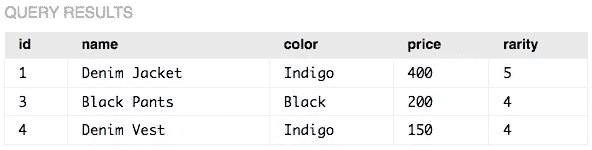

# SQL 基础知识

> 原文：<https://medium.com/analytics-vidhya/sql-basics-b8bfed56c0c3?source=collection_archive---------34----------------------->


[活动发起人](https://unsplash.com/@campaign_creators?utm_source=medium&utm_medium=referral)在 [Unsplash](https://unsplash.com?utm_source=medium&utm_medium=referral) 上的照片

结构化查询语言(SQL)是数据科学家使用的基本语言之一。它旨在管理和查询关系数据库(如 MySQL 和 PostgreSQL)中的数据。这也是数据相关工作要求中最常见的技能之一。因此，我认为讲述 SQL 中使用的最基本的方法将使您理解关系数据库的基础，并开始您的数据科学之旅。我们将从创建一个简单的表开始，并使用不同的方法来操作和查询数据。

这些是我们开始使用 SQL 时将涉及的 7 个主要语句:

```
**CREATE TABLE** **INSERT INTO****UPDATE****DELETE****SELECT****ORDER BY**
```

## 创建表格并插入

生成数据库的第一步是创建一个表。SQL 中的表是行和列的集合。表用于存储信息以对不同类型的数据进行排序，从信用卡交易到商店的库存。我们将创建一家复古服装店，并使用桌子查看他们在卖什么:

```
CREATE TABLE vintage_store (id INTEGER PRIMARY KEY, name TEXT, color TEXT, price INTEGER, rarity INTEGER);
```

我们使用 *CREATE TABLE* 语句创建名为 *vintage_store* 的表，在括号内，我们初始化列名，后跟列类型。两种主要的列类型将会是*整数*和*文本*。请注意 *id* 的类型为*整数主键。*这将用于索引将放入表中的每个项目，以便我们知道它们是唯一的。


现在我们已经创建了表，我们可以开始插入项目了。让我们从 10 个项目开始:

```
INSERT INTO vintage_store VALUES (1, 'Denim Jacket', 'Indigo', 400, 5);
INSERT INTO vintage_store VALUES (2, 'Denim Pants', 'Indigo', 350, 5);
INSERT INTO vintage_store VALUES (3, 'Black Pants', 'Black', 200, 4);
INSERT INTO vintage_store VALUES (4, 'Denim Vest', 'Indigo', 150, 4);
INSERT INTO vintage_store VALUES (5, 'Jumper', 'Black', 70, 1);
INSERT INTO vintage_store VALUES (6, 'Jumper', 'Indigo', 70, 1);
INSERT INTO vintage_store VALUES (7, 'Jumper', 'Gray', 70, 2);
INSERT INTO vintage_store VALUES (8, 'Chore Jacket', 'Indigo', 150, 3);
INSERT INTO vintage_store VALUES (9, 'Chore Jacket', 'Black', 150, 3);
INSERT INTO vintage_store VALUES (10, 'Blazer', 'Indigo', 200, 3);
```

SQL 语法遵循与英语相似的规则，因此理解每条语句的功能相当简单。 *INSERT INTO* 语句后面是表名，然后是*值，*我们将在括号内指定。里面的值必须与我们在表中定义的类型相匹配。例如，唯一的 id 号、物品的名称、颜色、价格和稀有程度。然后，我们可以简单地对其他项目重复这个过程。我们现在有了一个完整的表，表中有项目！

需要注意的是，分号(*；*)用在每条语句的末尾，并且*文本*类型必须用单引号(*“”*)括起来。

## 更新和删除

现在我们有了一个完整的表，我们可以开始操作它了。我们可以从 *UPDATE* 开始，它完全是这样做的，并从给定的表中更新我们的任何项目的值。比方说，我们的老式牛仔布裤子卖得不好，因为它的价格太高。我们决定降低它。

```
UPDATE vintage_store SET price=300 WHERE id=2;
```

按照与前面的语句相同的逻辑，我们更新我们的 vintage store，并用 id #2(牛仔布裤子)设置商品的价格。这里使用了两个与更新相关的新关键字。SET 用于设置我们价格的新值，而 WHERE 用于定位我们的项目。这就是为什么拥有唯一的 id 号很重要，这样我们就可以很容易地识别我们想要更新的项目。

更新了我们牛仔裤的价格后，有人决定买了。降价毕竟是个好主意！我们现在可以使用 DELETE 将其从表中删除。

```
DELETE FROM vintage_store WHERE id=2;
```

*DELETE* 语句将项目从您的表中完全删除，因此在执行此操作时要小心。请始终记住将 *WHERE* 添加到该语句中，因为如果没有指定，您可能会意外删除整个表。

## 挑选

很容易忘记我们的表中发生了什么，尤其是如果有很多数据的话。如果我们在寻找特定的东西，我们也不想无休止地滚动我们的数据库。 *SELECT* 语句帮助我们查询数据，只看到我们此刻需要的数据。另一方面，如果我们想看到表格的全部内容，我们也可以使用*选择*。

```
SELECT * FROM vintage_store;
```

星号( *** )后跟 *SELECT* 查询 *vintage_store* 中的所有内容。


请注意，牛仔布裤子，项目#2，自从我们删除它们后就不见了。我们还可以使用*来限制我们的查询结果，其中*后跟一个条件语句(=、<、>)。例如，如果我们只想查看稀有度超过 3 的项目，我们可以执行以下操作:

```
SELECT * FROM vintage_store WHERE rarity > 3;
```



## 以...排序

除了查询我们的数据，我们还可以以排序的方式查看我们的表。也许，我们想查看商店的库存，按价格从低到高排序。我们可以使用语句 *ORDER BY* 来完成这个任务:

```
SELECT * FROM vintage_store ORDER BY price;
```


我们还可以使用语句的组合来使我们的查询更加具体。如果我们想得到稀有度超过 3 的所有商品，并按价格排序，我们可以这样做:

```
SELECT * FROM vintage_store WHERE rarity > 3 ORDER BY price;
```


## 结论

还有许多其他方法可以查询和操作数据，但这些是 SQL 的基础。通过我们所学的 7 条语句，我们能够创建一个表，插入商品，并像真正的古董店一样使用 SQL 来操作它们。掌握查询的最好方法和掌握任何事情的方法一样，就是简单地练习。我在下面添加了资源，这样你就可以阅读和练习我们在这里学到的内容，并继续学习其他高级方法。

**其他资源:**

我发现这两个网站对练习 SQL 最有帮助！

 [## SQLZOO

### 跳转到导航跳转到搜索新教程:新冠肺炎国际数据。如何从数据库中读取数据？2…

sqlzoo.net](https://sqlzoo.net/) [](https://www.khanacademy.org/computing/computer-programming/sql) [## SQL 简介:查询和管理数据|可汗学院

### 了解如何使用 SQL 来存储、查询和操作数据。SQL 是一种专用编程语言，专为…

www.khanacademy.org](https://www.khanacademy.org/computing/computer-programming/sql)