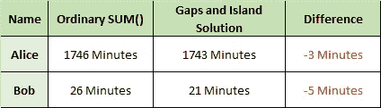

# SQL 经典问题:识别重叠日期范围内的间隙和孤岛

> 原文：<https://medium.com/analytics-vidhya/sql-classic-problem-identifying-gaps-and-islands-across-overlapping-date-ranges-5681b5fcdb8?source=collection_archive---------0----------------------->

A lice 和 Bob 在一家服务型公司担任客户支持，每次他们处理客户的询问时，他们采取的任何行动都会被记录在某种数据集中。

他们的经理 Charlie 必须制定一个人力规划计划，以确定他们每个月需要多少人来回答客户的询问。因此，他需要找出爱丽丝和鲍勃在处理客户询问上花费的**实际时间。但是 Charlie 的眼睛在数据上发现了一些奇怪的东西，由于该公司拥有的技术，Alice 和 Bob 可以**同时处理 3 个查询**，导致捕获的数据奇怪:**


如果 Charlie 简单地使用 *ElapsedTimeInMins* 列中的`SUM()`来找出 Alice 和 Bob 用于解决客户询问的时间，结果将不会反映他们实际花费的时间，因为他们每个人可以同时处理 3 个询问。因此，为了找出他们的**实际时间**有多少花费在处理客户上，Charlie 必须将这个问题视为差距和孤岛问题，以便相应地对数据进行分组。

间隙和孤岛是 SQL 中的一个经典问题，它涉及到识别序列中缺失值的范围和现有值的范围。目标是识别连续数据序列组(岛)和序列缺失的数据组(缺口)。

差距和孤岛问题的实际例子包括可用性报告、不活动期和活动期报告等等。

我最近在我的数据集中遇到了这个特殊的问题，但是有一个有趣的转折，因为数据中每一行的日期范围可能是完全离散的，完全封闭的，或者它们可能在两端相互重叠，所以:

> Charlie 有什么方法可以确定具有重叠日期范围的数据缺口和孤岛吗？

# 重叠的日期范围

首先让我们从之前的样本数据开始，以全面掌握 Charlie 目前面临的情况。如前所述，该问题的特点是每一行的日期范围可能是完全离散的、完全封闭的，或者它们可能在两端相互重叠:

```
DROP TABLE IF EXISTS **OverlappingDateRanges**;CREATE TABLE **OverlappingDateRanges** 
   (**Name** STRING, 
    **StartDate** DATETIME, 
    **EndDate** DATETIME,
    **ElapsedTimeInMins** INT64);

INSERT INTO **OverlappingDateRanges**
SELECT ('Alice', '2019-10-29 03:26:58', '2019-10-29 03:27:02', '1') UNION ALL
SELECT ('Alice', '2019-10-29 05:42:05', '2019-10-30 10:44:30', '1742') UNION ALL
SELECT ('Alice', '2019-10-29 06:51:08', '2019-10-29 06:51:12', '1') UNION ALL
SELECT ('Alice', '2019-10-29 09:59:48', '2019-10-29 09:59:52', '1') UNION ALL
SELECT ('Alice', '2019-10-30 02:05:49', '2019-10-30 02:05:52', '1') UNION ALL
SELECT ('Bob', '2019-10-01 07:13:02', '2019-10-01 07:21:58', '9') UNION ALL
SELECT ('Bob', '2019-10-01 07:22:39', '2019-10-01 07:25:18', '3') UNION ALL
SELECT ('Bob', '2019-10-01 07:24:17', '2019-10-01 07:24:19', '1') UNION ALL
SELECT ('Bob', '2019-10-01 07:41:03', '2019-10-01 07:42:38', '2') UNION ALL
SELECT ('Bob', '2019-10-01 07:46:35', '2019-10-01 07:50:49', '4') UNION ALL
SELECT ('Bob', '2019-10-01 07:48:44', '2019-10-01 07:55:17', '7') UNION ALLSELECT * FROM **OverlappingDateRanges**;
```


表格输出

这里有趣的是，当一些行的结束日期与其他行的开始日期匹配时(例如，行 1 和 2)，其他行的一些行的日期范围要么完全包含在其他行中(例如，行 3 包含在行 2 中)，而其他行仅重叠一个边界(例如，行 11 的*结束日期*不与任何其他行重叠，但其*开始日期*在行 10 的*结束日期*之前)。

# 解决办法

虽然有几种方法可以解决间隙和孤岛问题，但这里是使用窗口函数的解决方案，它将满足 Charlie 的需求。

首先，我们需要根据开始和结束日期的顺序创建一个行号列，并将前一行的*结束日期*带到当前行:

```
SELECT
  ROW_NUMBER () OVER (ORDER BY **Name**, **StartDate**, **EndDate**) AS **RN**,
  **Name**,
  **StartDate**,
  **EndDate**,
  MAX(**EndDate**) OVER (PARTITION BY **Name** ORDER BY **StartDate**, **EndDate** ROWS BETWEEN UNBOUNDED PRECEDING AND 1 PRECEDING) AS **PreviousEndDate**,
FROM
  **OverlappingDateRanges**
```


表格输出

接下来，我们再添加两个字段:

*   **IslandStartInd** :通过查看当前行的 *StartDate* 是否出现在前一行的 *EndDate* 之后来指示新孤岛何时开始。我们*并不真的*需要这个专栏来举例，但是我发现看看下一个专栏会有什么帮助。
*   **IslandId** :表示当前行属于哪个岛号。

```
SELECT
 *,
 CASE WHEN **Grouping.PreviousEndDate** >= **StartDate** THEN 0 ELSE 1 END AS **IslandStartInd**,
 SUM (CASE WHEN **Grouping.PreviousEndDate** >= **StartDate** THEN 0 ELSE 1 END) OVER (ORDER BY **Grouping.RN**) AS **IslandId**
FROM
 (SELECT
  ROW_NUMBER () OVER (ORDER BY **Name**, **StartDate**, **EndDate**) AS **RN**,
  **Name**,
  **StartDate**,
  **EndDate**,
  MAX(**EndDate**) OVER (PARTITION BY **Name** ORDER BY **StartDate**, **EndDate** ROWS BETWEEN UNBOUNDED PRECEDING AND 1 PRECEDING) AS **PreviousEndDate**,
 FROM
  **OverlappingDateRanges**) Grouping
```


表格输出

*IslandId* 字段只是 *IslandStartInd* 的一个`SUM()`，类似于[窗口函数运行总和](https://bertwagner.com/2017/07/18/heres-a-quick-way-to-generate-a-running-total-in-sql-server/)。

我们的最后一步是使用一个老式的`GROUP BY`来聚合我们的行，分别返回我们每个岛屿的最小和最大开始和结束日期:

```
SELECT
 *,
 **IslandStartDate** - **IslandEndDate** AS **ActualTimeSpent**
FROM
 (SELECT
  **Name**,
  **IslandId**,
  MAX (**StartDate**) AS **IslandStartDate**,
  MIN (**EndDate**) AS **IslandEndDate**
 FROM
  (SELECT
   *,
   CASE WHEN **Grouping.PreviousEndDate** >= **StartDate** THEN 0 ELSE 1 END AS **IslandStartInd**,
   SUM (CASE WHEN **Grouping.PreviousEndDate** >= **StartDate** THEN 0 ELSE 1 END) OVER (ORDER BY **Grouping.RN**) AS **IslandId**
  FROM
   (SELECT
    ROW_NUMBER () OVER (ORDER BY **Name**, **StartDate**, **EndDate**) AS **RN**,
    **Name**,
    **StartDate**,
    **EndDate**,
    MAX(**EndDate**) OVER (PARTITION BY **Name** ORDER BY **StartDate**, **EndDate** ROWS BETWEEN UNBOUNDED PRECEDING AND 1 PRECEDING) AS **PreviousEndDate**,
   FROM
    **OverlappingDateRanges**
   ) **Grouping**
  ) **Islands**
 GROUP BY
  **Name**,
  **IslandId**
 ORDER BY
  **Name**, 
  **IslandStartDate**
 )
GROUP BY
 **Name**,
 **IslandId**
ORDER BY
 **NAME**,
 **IslandStartDate**
```


表格输出

瞧啊。Alice 和 Bob 的数据已经相应地分组，现在 Charlie 可以简单地使用`SUM()`来查找他们的**实际时间**花在回答客户询问上的时间。

让我们看看使用这种方法对我们的数据产生的不同:



所述方法的结果差异

普通总和()与缺口和岛解导致总共 8 分钟的差异。这可能看起来很小，但是请记住，这个数据集只记录了两个人和他们几天的活动。将其扩大到数千人和数月的活动中，差异可能会激增并影响许多其他计算(例如客户服务中的人力规划计算)，导致每天损失数千美元。

# 结论

不管一个岛内的日期范围有多混乱，这种技术都可以清楚地识别数据中的缺口，并返回每个岛的日期范围的开始和结束。这种技术可以用在我们需要聚合一些基于日期的事务数据的场景中，否则这些数据很难单独用聚合函数进行汇总。

来源:

[1]瓦格纳，伯特。 [*跨越日期范围的缺口和孤岛*](https://bertwagner.com/2019/03/12/gaps-and-islands/) 。2019.访问时间:2019 年 12 月 05 日。

[2]本-甘，伊齐克。 [*用增强的窗口函数*](https://www.itprotoday.com/sql-server/solving-gaps-and-islands-enhanced-window-functions) *解决缝隙和孤岛。* 2012。访问时间:2019 年 12 月 05 日。