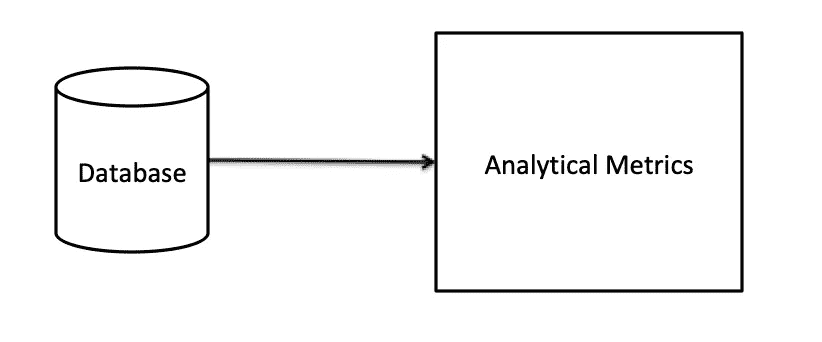
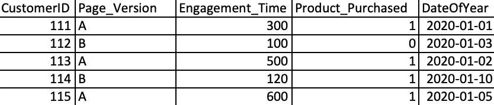

# 分析角色的 SQL 概念

> 原文：<https://medium.com/analytics-vidhya/sql-concepts-for-analytics-role-92a5fe07cb64?source=collection_archive---------20----------------------->



**数据到洞察**

想要进入分析角色的候选人经常会想，对于他们来说，什么样的 sql 概念才是真正重要的，才能让他们准备好从数据中提取有价值的见解。

以下是我想分享的一些关键概念或疑问，它们将帮助您加快分析之旅。我们将使用 Amazon Redshift SQL 语法(根据您选择的数据库随意修改 SQL)。

**业务场景:**

要求分析网站 A/B 测试的结果，管理层希望了解网站的哪个版本(A 或 B)运行良好。A/B 测试的各种细节存储在一个名为 test_results(假数据)的表中，该表的结构如下所示。



表:测试结果

大多数分析性问题解决的第一步是了解我们正在处理哪种类型的数据，我们可以使用以下查询:

```
**Select** * 
**from** test_results 
**limit** 2
```

上述查询将从表中获取所有列(*表示所有列)及其数据值，要显示的记录数将由 limit 函数后指定的数量来限制。如果只想获取几列，可以用逗号分隔列名，例如:Select CustomerID，DateofYear

现在，我们可以开始对数据进行切片和切块，以获得一些聚合度量，例如:在一年的特定时间段内，每个页面版本购买的产品数量。下面是一个查询，它将获得 2020 年 1 月期间每个页面版本类型购买的产品总数。

```
**Select** Page_Version, sum(Product_Purchased) as num_products_purchased 
**from** test_results 
**where** DateOfYear >= TO_DATE('20200101','YYYYMMDD')
and DateOfYear <= TO_DATE('20200131','YYYYMMDD')
**Group By** Page_Version
```

比方说，如果我们想知道客户最后一次访问我们的网站是否成功购买，我们可以使用下面的 sql 代码。我们将在子查询中使用秩函数来实现这一点。

```
Select * from (
**Select** Distinct CustomerID, Page_Version, Engagement_Time, Product_Purchased, DateOfYear, **rank() over (partition by CustomerID order by DateOfYear Desc)** as rank
from test_results
)
Where rank = 1
```

通过使用 rank 函数，我们将根据客户的网站访问日期为他们的记录分配等级，并将结果放在一个子查询中，并为每个客户仅提取 1 条记录，这是他们的最新记录。现在，在许多现实世界的场景中，我们可能有相同客户的多个记录，为了处理这样的场景，您可能需要仔细阅读一下 **row_number()、dense_rank()** 函数。此外，distinct 不应该是必要的，但是 distinct 的目的是删除任何重复的记录。

如果我们想了解当客户访问网站时，他们的参与时间是增加还是减少，我们可以构建如下查询:

```
Select *, (Engagement_Time - prev_engagement_time) as diff_engagement
from(
Select CustomerID, Page_Version, Engagement_Time, Product_Purchased, DateOfYear, **lag(Engagement_Time,1) over (partition by CustomerID order by DateOfYear)** as prev_engagement_time
from test_results)
```

使用上面的查询，我们对客户的访问进行升序排序，并使用 lag 函数获得以前的参与时间，然后我们可以检查 Engagement_Time 和 prev_engagement_time 之间的差异，以获得增量或减量。也可查看**引线功能。**

现在，假设我们有一个新的营销活动，我们需要获得每个客户的电子邮件 ID，这些 ID 存储在不同的表(EmailIDInfo)中，有些客户可能没有电子邮件 ID，而只是一个电话号码，该号码再次存储在不同的表(phoneinfo)中。我们将使用 join 构建一个查询来获取这些数据

PhoneInfo 包含列—客户 ID、电话号码

电子邮件信息包含列—客户 ID、电子邮件 ID

```
Select Distinct t1.CustomerID, t2.EmailID, t3.PhoneNumber
from test_results t1
**left join** EmailIDInfo t2
on t1.CustomerID = t2.CustomerID
**left join** PhoneNumber t3
on t1.CustomerID = t3.CustomerID
```

使用上述带左连接的查询，我们确保从 test_results 表中获取所有客户 id，并从 EmailIDInfo 表中获取可用的电子邮件 id，从 PhoneNumber 表中获取可用的电话号码。

以上是一些基本到高级的功能，将有助于您的分析之旅。我建议使用其他聚合函数，如 max、min、median、avg，join，如 right join、full outer join，创建临时表，并在临时表和连接中插入数据记录。