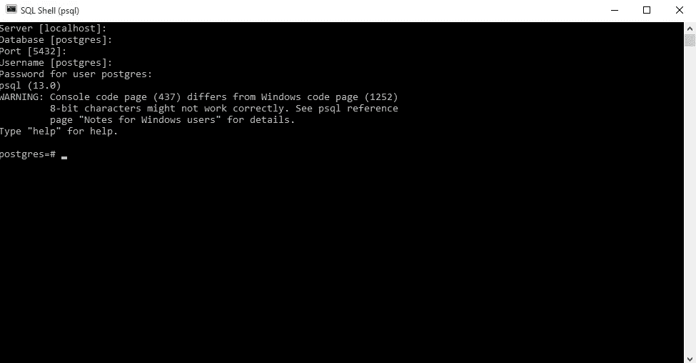

# 面向数据科学的 SQL 数据库与 Python 集成

> 原文：<https://medium.com/analytics-vidhya/sql-data-base-integration-with-python-for-data-science-8aefcc25a47f?source=collection_archive---------14----------------------->


[来源](https://www.andreafiori.net/)

**PostgreSQL**

在您的数据科学之旅中，您不会收到 excel 表格中的数据。数据将主要在数据库中，我们必须从那里提取必要的数据。在这里，我们将看到 SQL 数据库 postgresql 以及如何在您的 python 代码中为您的 AI 或数据科学活动访问它。

***什么是数据库？***

数据库是通过列相互关联的表的集合。对于大多数现实世界的项目，数据库是必不可少的。我们可以使用 SQL(结构化查询语言)来创建、访问和操作数据。我们还可以利用标准化来避免数据冗余。

对于数据库编程，Python 支持很多数据库服务器-
MySQL、Oracle、PostgreSQL、SQLite、Sybase、Microsoft SQL Server、mSQL、Microsoft Access 等等。它还支持数据查询语句、数据定义语言(DDL)和数据操作语言(DML)。

***如何连接 PostgreSQL？***

我们将看到如何通过这些工具连接到 PostgreSQL

*   psql—PostgreSQL 数据库服务器的基于终端的前端。
*   pg admin—PostgreSQL 数据库服务器的基于 web 的前端。

***第 1 部分:使用 psql 连接到 PostgreSQL 数据库服务器***

首先，启动 psql 程序，并使用 postgres 用户连接到 PostgreSQL 数据库服务器:

您可以单击 enter，它将进入下一步。在密码部分给出你输入的密码，所有其他细节服务器，数据库，端口默认值。



PSQL 命令外壳连接到 postgresql 服务器

检查 PostgreSQL 的版本

```
**SELECT** **version**();
```


postgresql 版本

请不要忘记以分号(；).按下 **Enter** 后，psql 将返回您系统上当前的 PostgreSQL 版本。

***第 2 部分:使用 pgAdmin*** 连接到 PostgreSQL 数据库服务器

首先，启动 pgAdmin 应用程序。

pgAdmin 应用程序将在 web 浏览器上启动，如下图所示


要创建数据库，右键单击 Servers 节点并选择 **Create > Server…** 菜单来创建服务器


您可以指定数据库名称，输入 **postgres** 用户的主机和密码，点击**保存**按钮


我创建了一个名为 course_data 的数据库。通过选择菜单项**工具>查询工具**或点击“对象”正下方的第一个图标，选择数据库打开查询工具。


在查询工具中测试 postgresql 的版本。


***PostgreSQL 数据库到 Python 的连接***

打开 vscode 或 pycharm，选择您最喜欢的 Python IDE。

在终端中使用 pip 安装名为 psycogp2 的模块。

```
pip install psycopg2
```

要连接到 course_data 数据库，可以使用 psycopg2 模块的 connect()函数。

connect()函数创建一个新的数据库会话，并返回连接类的一个新实例。通过使用 connection 对象，您可以创建一个新的游标来执行任何 SQL 语句。

要调用`connect()`函数，需要如下指定 PostgreSQL 数据库参数:

```
conn = psycopg2.connect(     
host="localhost",              #give your host where postgresql   
database="coursedata_db",      #give your db name    
user="postgres",               #give your username   
password="password")           #give your password to db
```

***数据库*** *:您要连接的数据库的名称。* ***用户*** *:用于认证的用户名。* ***密码*** *:用于认证的密码。* ***主机*** *:数据库服务器地址如 localhost 或 IP 地址。* ***端口*** *:不提供默认为 5432 的端口号。*

通过游标对象和执行函数，我们可以从数据库中提取列或行

execute():执行 SQL 语句
fetchall():读取结果
close():关闭与服务器的通信和连接


vscode python 连接到 postgresql 数据库

使用 python 代码编写的 SQL 语句，我们可以从 SQL 数据库中提取数据用于数据分析。

与我保持联系[*链接*](https://www.linkedin.com/in/arun-purakkatt-mba-m-tech-31429367/) 。

***演职员表&参考文献:***

1.  [https://www.postgresql.org/](https://www.postgresql.org/)
2.  [https://www.postgresqltutorial.com/](https://www.postgresqltutorial.com/)