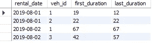

# 面向分析师的 SQL:每天的挑战—第 1 部分

> 原文：<https://medium.com/analytics-vidhya/sql-for-analysts-a-challenge-a-day-part-1-71ed725156e0?source=collection_archive---------23----------------------->

> 嗨伙计们！欢迎来到面向分析师的“*SQL*”系列。本系列将通过真实的场景来练习分析师面临的常见挑战/问题。本系列将涵盖中级到高级的挑战，因此如果您不精通 SQL 的基础知识或语法，我建议您使用一些其他资源来逐步提高。我将使用 MySQL 来应对这些挑战，所以我建议您也使用 MySQL。该系列没有任何特定的顺序，所以你可以从任何部分开始，并尝试解决挑战。
> 
> 也就是说，让我们开始吧。快乐学习！

## **挑战:**

每辆车每天的第一次和最后一次行程持续多长时间？

下面是我们正在处理的数据的快照:


此外，下面是创建表并将上述数据添加到表中的代码:

```
create table rental (
 rental_id int,
 veh_id int,
 rental_date date,
 rental_start_time time,
 rental_duration int);

 insert into rental 
 values (1, 1, ‘2019–08–01’, ‘12:00:00’, 19),
 (2,2,’2019–08–01',’14:00:00',22),
 (3,1,’2019–08–01',’14:30:00',15),
 (4,3,’2019–08–02',’05:00:00',42),
 (5,3,’2019–08–02', ‘19:00:00’,57),
 (6,1,’2019–08–02', ‘20:30:00’,67),
 (7,1,’2019–08–01',’16:00:00', 12);
```

## **解决方案:**

下面的快照显示了解决方案需要的样子:



在这个场景中，我们想要找出第一次和最后一次乘坐的旅行持续时间。我们将使用以下概念:

1.  First_value 和 last_value 窗口函数可用于确定数据子集的第一个和最后一个值。
2.  在这种情况下，我们按照 veh_id 和租赁日期进行划分，因为我们需要找到每辆自行车和日期组合的第一个和最后一个
3.  我们按租赁开始时间排序，以获得 first_value 和 last_value 函数的正确排序
4.  一旦数据被排序和分区，我们将把 rental_duration 列传递给函数，以获得第一次和最后一次旅行的持续时间。
5.  对于 last_value，我们使用“无界在前和无界在后之间的范围”，因为我们想要整个分区子集的第一个和最后一个值。这给了我们以下片段:

```
first_value(rental_duration) over (partition by veh_id, rental_date order by rental_start_time) as first_duration,last_value(rental_duration) over (partition by veh_id, rental_date order by rental_start_time range between unbounded preceding and unbounded following) as last_duration
```

最后，我们对整个表进行分组，以删除重复的信息行。这给了我们最后一个问题:

```
with cte as (
select *,
first_value(rental_duration) over (partition by veh_id, rental_date order by rental_start_time) as first_duration,
last_value(rental_duration) over (partition by veh_id, rental_date order by rental_start_time range between unbounded preceding and unbounded following) last_duration
from rental
order by veh_id, rental_date, rental_start_time)
select rental_date, veh_id, first_duration, last_duration from cte 
group by 1,2,3,4
order by 1,2;
```

就是这样！希望你能跟上！

如果您有兴趣解决更多问题，您可以在以下位置找到更多挑战:

下一个挑战—[https://medium . com/analytics-vid hya/SQL-for-analysts-a-challenge-a-day-part-2-FCC 549 f 10 CB 9](/analytics-vidhya/sql-for-analysts-a-challenge-a-day-part-2-fcc549f10cb9)