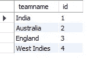
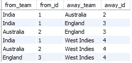

# 面向分析师的 SQL 每天的挑战—第 2 部分

> 原文：<https://medium.com/analytics-vidhya/sql-for-analysts-a-challenge-a-day-part-2-fcc549f10cb9?source=collection_archive---------18----------------------->


由[马丁·桑切斯](https://unsplash.com/@martinsanchez?utm_source=medium&utm_medium=referral)在 [Unsplash](https://unsplash.com?utm_source=medium&utm_medium=referral) 上拍摄的照片

> 嗨伙计们！欢迎来到“*分析师 SQL*”系列。本系列将通过真实的场景来练习分析师面临的常见挑战/问题。本系列将涵盖中级到高级的挑战，因此如果您不精通 SQL 的基础知识或语法，我建议您使用一些其他资源来逐步提高。我将使用 MySQL 来应对这些挑战，所以我建议您也使用 MySQL。该系列没有任何特定的顺序，所以你可以从任何部分开始，并尝试解决挑战。
> 
> 也就是说，让我们开始吧。快乐学习！

**挑战:**

创建一个循环赛，每个队只和其他队比赛一次。

下面是我们正在处理的数据的快照:



最终输出应该是这样的:



此外，下面是创建表并将上述数据添加到表中的代码:

```
create table team_list (
 teamname varchar(20),
 id int);

 insert into team_list values
 (‘India’, 1),
 (‘Australia’,2),
 (‘England’,3),
 (‘West Indies’, 4);
```

**解决方案:**

在这个问题中，我们将创建一个装置，每个队只与其他队比赛一次。下面是我们将应用的逻辑:

*   自我加入数据集，让两组队伍一起玩- `from_team` 和`away_team`
*   然而，这将意味着球队最终只能自己比赛。因此，我们必须确保团队使用的 id 不是他们自己的 id。这给了我们:

```
select 
a.teamname as from_team,a.id as from_id, 
b.teamname as away_team, b.id as away_id 
from 
team_list a join team_list b 
where a.id<>b.id;
```

*   然而，在这种情况下，由于顺序的原因，这两个队仍然会每隔一个队进行两次比赛，一次是作为起点队，一次是作为终点队。因此，我们可以通过确保来自团队的 id 始终小于离开团队的 id 来防止这种情况。

使用一个公共表表达式来封装步骤 2 中的结果，我们可以将最终查询写成:

```
with cte as (
 select 
 a.teamname as from_team,a.id as from_id, 
 b.teamname as away_team, b.id as away_id 
 from 
 team_list a join team_list b 
 where a.id<>b.id
 )
select * from cte 
where from_id<away_id;
```

正如你从结果中看到的，因为我们有 4 支球队，所以在循环赛中只有 6 场比赛。

如果您有兴趣解决更多问题，您可以在以下位置找到更多挑战:

往期挑战—[https://medium . com/analytics-vid hya/SQL-for-analysts-a-challenge-a-day-part-1-71ed 725156 E0？](/analytics-vidhya/sql-for-analysts-a-challenge-a-day-part-1-71ed725156e0)

下一个挑战—[https://medium . com/analytics-vid hya/SQL-for-analysts-a-challenge-a-day-part-3-f 46 c 0 df 54 ce 8](/analytics-vidhya/sql-for-analysts-a-challenge-a-day-part-3-f46c0df54ce8)