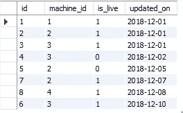
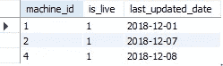

# 面向分析师的 SQL 每天的挑战—第 3 部分

> 原文：<https://medium.com/analytics-vidhya/sql-for-analysts-a-challenge-a-day-part-3-f46c0df54ce8?source=collection_archive---------17----------------------->


由[马丁·桑切斯](https://unsplash.com/@martinsanchez?utm_source=medium&utm_medium=referral)在 [Unsplash](https://unsplash.com?utm_source=medium&utm_medium=referral) 上拍摄的照片

> 嗨伙计们！欢迎来到“*分析师 SQL*”系列。本系列将通过真实的场景来练习分析师面临的常见挑战/问题。本系列将涵盖中级到高级的挑战，因此如果您不精通 SQL 的基础知识或语法，我建议您使用一些其他资源来逐步提高。我将使用 MySQL 来应对这些挑战，所以我建议您也使用 MySQL。该系列没有任何特定的顺序，所以你可以从任何部分开始，并尝试解决挑战。
> 
> 也就是说，让我们开始吧。快乐学习！

**挑战:**

下表保存了机器状态的快照。只有当状态发生变化时，才会在表中创建一个条目。哪些机器在 12 月 9 日处于运行状态？

下面是我们正在处理的数据的快照:



最终输出应该是这样的:



此外，下面是创建表并向其中添加上述数据的代码:

```
create table machine_log(
id int,
machine_id int,
is_live BOOLEAN,
updated_on Date
);insert into machine_log values
(1,1,TRUE,’2018–12–01'),
(2,2,TRUE, ‘2018–12–01’),
(3,3, TRUE, ‘2018–12–01’),
(4,3,FALSE, ‘2018–12–02’),
(5,2,FALSE,’2018–12–05'),
(7, 2, TRUE, ‘2018–12–07’),
(8,4,TRUE,’2018–12–08'),
(6,3,TRUE, ‘2018–12–10’);
```

**解决方案:**

这个问题的诀窍是找出一种方法来找出每台机器的活动和非活动状态的窗口。

我们可以使用窗口函数来创建另一个列，该列主要捕获下一个状态更改日期。这是通过使用 lead 函数将`updated_on`列中的值偏移 1 来实现的。请注意，我们还提供了`curdate()`作为默认值，以防 lead 函数产生空值

```
select *,
lead(updated_on,1,curdate()) over( partition by machine_id order by updated_on asc) as next_update_date 
from machine_log;
```

接下来，使用 next_update_date 和 updated_on 列，我们可以确定 12 月 9 日是否在这两个日期范围内，以及机器在此期间是否处于活动状态。

这为我们提供了最终的查询:

```
with cte as(
select *,
lead(updated_on,1,curdate()) over(partition by machine_id order by updated_on asc) as next_update_date
from machine_log)
select machine_id, is_live, updated_on as last_updated_date 
from cte 
where updated_on <=’2018–12–09' 
and next_update_date > ‘2018–12–09’
and is_live=1;
```

这为我们提供了 12 月 9 日所有处于活动状态的机器的列表。

如果您有兴趣解决更多问题，您可以在以下位置找到更多挑战:

之前的挑战—[https://medium . com/analytics-vid hya/SQL-for-analysts-a-challenge-a-day-part-2-FCC 549 f 10 CB 9](/analytics-vidhya/sql-for-analysts-a-challenge-a-day-part-2-fcc549f10cb9)