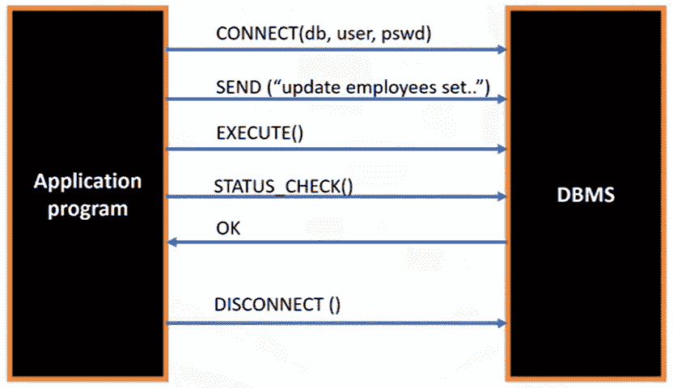
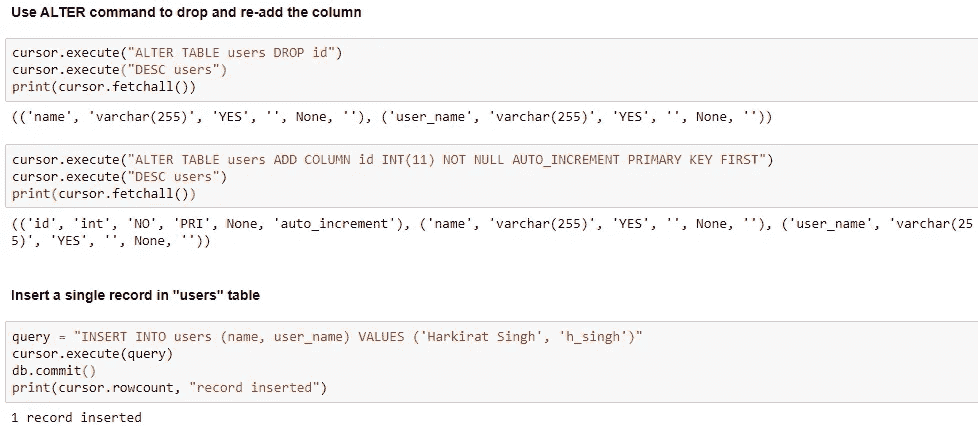

# 用于数据科学的 SQL

> 原文：<https://medium.com/analytics-vidhya/sql-for-data-science-259298a10b0d?source=collection_archive---------7----------------------->

没有数据库，**数据科学**毫无意义。数据科学家必须能够检索数据。数据科学家也可能使用 SQL 做一些分析。然而，他们使用 SQL 的主要目的是为了数据检索。在这里，我们将介绍 SQL 的基本概念、基本 SQL 查询以及如何在 Python 语言中访问和使用它们。如果你已经了解 SQL，你可以直接跳到本文的底部，看看如何在 Python 中访问 SQL。

# 什么是 SQL？

SQL 是一种用于关系数据库查询或从数据库中获取数据的语言。并且是其原名 **S** 结构化**Q**uery**L**language 的简称。

所以 SQL 是一种用于数据库查询数据的语言。

# 什么是关系数据库？

数据库是数据的储存库。当数据以表格形式存储时，数据像电子表格一样被组织在表格中，表格由列和行组成。那是一个**关系数据库**。关系数据库中的表也称为实体。实体属性将是表的列。

表是相关事物的集合，如雇员列表或书籍作者列表。在关系数据库中，您可以在表之间形成关系。

**RDBMS** ，关系数据库管理系统，是一套控制数据存取、数据组织、数据存储等功能的软件工具。关系数据库管理系统的例子有 mySQL、Oracle、DB2 等。

# 什么是云上数据库？

云数据库是通过云平台构建和访问的数据库服务。它提供许多与传统数据库相同的功能，并增加了云计算的灵活性。用户在云基础设施上安装软件来实现数据库。

云数据库的一个实例作为一种服务运行，它处理所有应用程序请求，以处理数据和由该实例管理的任何数据库。

使用云数据库的优势在于

**易用性**:用户可以使用供应商的 API 或 web 界面从几乎任何地方访问云数据库。

**可扩展性**:云数据库可以在运行时扩展其存储容量，以适应不断变化的需求，组织只需为其使用的内容付费。

**灾难恢复**:在发生自然灾害设备故障或停电的情况下，数据通过远程服务器上的备份保持安全。

您可以使用云数据库，就像使用任何数据库软件一样，但是没有硬件、设置或软件安装和维护的开销和费用。

云 SQL 数据库的几个例子是 IBM Db2 on Cloud、Compose for PostgreSQL、Oracle Database Cloud、Microsoft Azure Cloud SQL 数据库、Amazon 关系数据库服务，它们可以在云中运行，可以在虚拟机中运行，也可以作为服务运行，具体取决于供应商。

# 基本 SQL 命令

*   **创建** —创建数据库和表格。CREATE TABLE 语句是数据定义语言语句之一。数据定义语言语句或 DDL 语句用于创建数据库对象，如表。表格列被分配一个数据类型，例如 *char* 或 *varchar* 。 *Char* 是固定长度的字符串。 *Varchar* 是一个可变长度的字符串。该命令还使用了一些约束，如**主键**和**不为空**。关系表的主键唯一标识表中的每个元组或行。它还可以防止表中出现重复值。Not null 确保这些字段不能包含空值。

> 创建表用户
> 
> (id INT(11) NOT NULL AUTO_INCREMENT 主键，
> 
> 名称 VARCHAR(255)，
> 
> 用户名 VARCHAR(255))

*   **插入** —将数据插入表格。INSERT 语句用于向表中添加新行。INSERT 语句是数据操作语言语句之一。数据操作语言语句或 DML 语句用于读取和修改数据。在此命令的语法中，表名标识表，列名列表标识表中的每一列，values 子句指定要添加到表中各列的数据值。values 子句中提供的值的数量必须等于列名列表中指定的列名的数量，这一点很重要。这确保了每一列都有一个值。表不需要一次填充一行，可以通过在 values 子句中指定每一行来插入多行。在 values 子句中，每行由逗号分隔。

> 插入作者(作者 ID，姓氏，名字，电子邮件，城市，国家)值
> 
> (' A1 '，'冲'，'劳尔'，' RFC@XYZ。COM '，' TORONTO '，' CA')('A2 '，' AHUJA '，' RAV '，' RA@XYZ)。COM '，'多伦多'，'加州')

*   **ALTER** — 是一个 DDL(数据定义语言)语句。它用于更新表的结构(添加/删除字段/索引等)。下面的语句用于删除作者 ID 列。

> 更改表作者 DROP AUTHOR_ID

*   **选择** —从表格中选择数据。数据库管理系统的主要目的不仅仅是存储数据，而且还要便于数据的检索。因此，在创建关系数据库表并将数据插入表中之后，我们希望看到数据。为了查看数据，我们使用 SELECT 语句。SELECT 语句是一个数据操作语言语句。数据操作语言语句或 DML 语句用于读取和修改数据。SELECT 语句被称为**查询**，我们执行该查询得到的输出被称为结果集或结果表。在其最简单的形式中，SELECT 语句是 *select * from 表名*，即检索所有列的所有行。但是如果需要，您可以只检索列的子集和行的子集。关系操作通过允许我们使用**子句 WHERE** 来帮助我们限制结果集。WHERE 子句总是需要一个谓词。谓词被条件评估为真、假或未知。WHERE 子句的搜索条件中使用了谓词。

> select book_id，书名 from book where book_id = 'B1 '

*   **更新** —修改表格中的数据。为了改变或修改表中的数据，我们使用 UPDATE 语句。在语法中，TableName 标识表。ColumnName 标识要更改的列值，如< WHERE【条件】>中所指定。请注意，如果不指定 WHERE 子句，表中的所有行都将被更新。让我们看一个例子。在本例中，您希望用 AUTHOR_ID A2 更新作者的名字和姓氏。我们首先从 author 表中选择所有行来查看值。要更改名字和姓氏，请输入 UPDATE 语句。现在，要查看更新的结果，请再次从 Author 表中选择 all rows，您将看到第行中的 name 从 Rav Ahuja 更改为 Lakshmi Katta。

*   **删除** —从表格中删除数据。使用 DELETE 语句删除这些行。DELETE 语句是数据操作语言语句之一。请注意，如果不指定 WHERE 子句，表中的所有行将被删除。让我们看一个例子。我们希望删除 AUTHOR_ID A2 和 A3 的行。

# 内置函数

使用数据库函数可以显著减少需要从数据库中检索的数据量。也就是说，它们减少了网络流量和带宽的使用。当处理大型数据集时，使用内置函数可能会更快，而不是首先将数据检索到应用程序中，然后对检索到的数据执行函数。

**聚合函数** —它们接受值的集合或整个列来输出单个值。示例包括 COUNT()、SUM()、MIN()、MAX()、AVG()等。分别输出行数、值的总和、最小值、最大值和平均值。

*   示例-检索奖章获得者来自加拿大的行数

> 从国家= '加拿大'的奖牌中选择计数(国家)

*   示例-查找最大数量

> 从 PETSALE 中选择 MAX(数量)

*   示例-查找平均销售价格

> 从 PETSALE 中选择 AVG(SALEPRICE)

**标量函数** —它们对单个值执行运算。例子包括 ROUND()、UCASE()、LCASE()、LENGTH()等。分别输出舍入值、大写字符串、小写字符串和字符串长度。

*   示例-查找销售价格的舍入值

> 从 PETSALE 中选择 ROUND(SALEPRICE)

*   示例—找出宠物绳的长度

> 从宠物商店选择长度(动物)

*   示例-以大写形式显示宠物字符串值

> 从 PETSALE 中选择 UCASE(动物)

*   示例-在转换为小写字母后，查找宠物值为“cat”的所有行

> select * from PETSALE 其中 LCASE(ANIMAL)= ' cat '；

**日期和时间函数** —大多数数据库包含日期和时间的特殊数据类型。存在提取日、月、月中的日、周中的日、年中的日、周、小时、分钟和秒的函数。

*   示例—获取涉及卡特彼勒的每个销售日期的天数部分。

> 从 PETSALE 中选择日期(销售日期)，其中 ANIMAL = "Cat "

*   示例—获取五月份的销售额

> select COUNT(*)from pet sale where MONTH(sale date)= ' 05 '

例如，假设您想知道每个销售日期三天后的日期，因为每个订单都需要在三天内处理。

> 从 PETSALE 中选择(销售日期+3 天)

例如，假设您想知道从每个销售日期到现在已经过了多少天。

> 从 PETSALE 中选择(当前日期-销售日期)

**DISTINCT** —检索列中的唯一值。不显示重复值。

*   示例-检索获得金牌的唯一国家的列表。

> 从奖牌中选择不同的国家，奖牌类型= '金牌'

**限制** —用于限制从数据库中检索的行数。这对于通过查看几行来检查结果集非常有用，而不是检索可能非常大的整个结果集。

*   例如，只检索表中的前 10 行。

> select * from tablename 限制 10

*   例如，只检索特定年份的奖牌榜中的几行。

> 从奖牌中选择*其中年份= 2018 限制 5

# 先进的技术

在其最简单的形式中，SELECT 语句是 *select * from table name* 。但是如果我们不知道在 WHERE 子句中具体指定什么值呢？WHERE 子句总是需要一个谓词，它是一个计算结果为 true、false 或 unknown 的条件。但是如果我们不知道谓词的确切值呢？比如我们记不住作者的名字，但是记得他们的名字是 R 开头的怎么办？

**字符串模式** — 在关系数据库中，我们可以使用字符串模式来搜索匹配某个条件的数据行，在这个条件下，我们使用下面的技术不知道确切的谓词值。

*   Like——如果我们记不起作者的名字，但我们记得他们的名字以 R 开头，我们就用带有 like 谓词的 WHERE 子句。在 WHERE 子句中使用 like 谓词来搜索列中的模式。
*   % —百分号用于定义缺少的字母。百分号可以放在图案之前、图案之后，或者同时放在图案之前和之后。在本例中，我们在模式后使用百分号，即字母 r。百分号称为通配符。通配符用于替换其他字符。

例如，下面的查询将返回地址在伊利诺伊州埃尔金的雇员的姓名。

> select F_NAME，L_NAME from 地址为' %Elgin，IL% '的员工

**范围** —我们使用运算符之间的*表示数值范围，使用*运算符中的*表示分类范围。*

Between —我们不使用大于或等于的比较运算符，而是使用“Between”比较运算符。“Between”比较两个值。范围内的值包括端值。

例如，下面的查询将显示工资在 60000 到 70000 之间的雇员的详细信息。

> select * from 薪金介于 EN 60000 和 70000 之间的雇员

IN—IN 运算符允许我们在 WHERE 子句中指定一组值。该操作符接受要比较的表达式列表。

例如，下面的查询将显示国家在澳大利亚或巴西的雇员的姓名。

> select F_NAME，L _ NAME from EMPLOYEES where COUNTRY IN(' AU '，' BR ')

**排序** —为了按顺序显示结果集，我们使用“order by”子句。order by 子句在查询中用于按指定的列对结果集进行排序。默认情况下，结果集按升序排序。要按降序排序，请使用关键字“desc”

**分组**—“group by”子句将结果分组为一个或多个列具有匹配值的子集。在此示例中，使用 count 函数对国家/地区进行分组和计数。

我们可以通过传递一些条件来进一步限制行数。“having”子句与“group by”子句结合使用。需要注意的是,“where”子句适用于整个结果集，但是“having”子句只适用于“group by”子句。为了检查来自同一个国家的作者是否超过四个，我们将以下内容添加到 select 语句中，使 count count country 大于四。

**子查询**

子查询或子选择类似于常规查询，但放在括号内并嵌套在另一个查询中。这允许您形成比其他方式更强大的查询。

这些子查询可用于

*   WHERE 子句
*   列列表
*   FROM 子句。

为什么是子查询？

1.  它们帮助我们处理多个表，因为一个表的一个查询可以嵌套在另一个表的另一个查询中。
2.  它们帮助我们使用聚合函数。

比方说，我们想要检索收入高于平均工资的员工列表。为此，我们可以尝试以下代码。

> Select * from employees，其中薪金> AVG(薪金)→将给出错误

然而，上面的查询将**返回一个** **错误**，如下所示，表明聚合函数的无效使用。像 average 函数这样的内置聚合函数的局限性之一是，它们不能总是在 WHERE 子句中进行计算。

因此，为了评估 WHERE 子句中的 average 这样的函数，我们可以使用如下所示的子选择表达式。注意，AVG 函数是在子查询的第一部分计算的，这使得我们可以避开在 WHERE 子句中直接计算它的限制。

> Select * from employees，where salary >(从雇员中选择 AVG(薪金))

子选择不一定要放在 WHERE 子句中。它也可以出现在查询的其他部分，比如要选择的列的列表中。这种子查询称为列表达式。现在，让我们来看一个场景，我们可能想要使用列表达式。假设我们想要将每个员工的工资与平均工资进行比较。我们可以尝试这样的查询

> select 雇员标识，薪金，AVG(薪金)作为 AVG _ 薪金 from 雇员→将给出错误

运行上面的查询将**导致一个** **错误**，表明没有指定 group by 子句。我们可以通过在列列表中的子查询中使用 average 函数来避免这种错误。举个例子，

> 选择员工标识，薪金，(从员工中选择 AVG(薪金))作为员工中的 AVG 薪金

另一种选择是让子查询成为 FROM 子句的一部分。像这样的子查询有时被称为派生表或表表达式。因为外部查询使用子查询的结果作为数据源。这些类型的子查询在更复杂的情况下非常强大，比如在处理多个表和进行连接时。下面我们来看一个例子。

> select * from (select EMP_ID，F_NAME，L_NAME，DEP_ID from employees)作为 EMP4ALL

# 连接

为了合并两个表中的数据，我们使用连接操作符。联接根据两个或多个表中某些列之间的关系来组合这些表中的行。因此，您需要做的第一件事是确定这些表之间的关系。即每个表中用作表间链接的一列或多列。SQL 为您提供了几种不同类型的连接。

1.  内部连接
2.  左外连接
3.  右外连接
4.  全外连接

**内部连接**:这是最常见的连接类型。内部联接匹配两个表的结果，并且只显示与查询中指定的条件相匹配的结果集。内部联接只返回两个表中匹配的行。

这是内部联接的 select 语句的语法。在 from 子句中，我们将 employees 表标识为 E，将 Job History 表标识为 JH。对于这个连接，我们从作业历史表中选择雇员的名字、姓氏和作业开始日期，条件是雇员表中的雇员 ID 等于作业历史表中的雇员 ID。员工 ID 是员工表中的主键，是职务历史表中的外键。所以它被用来连接两个表。

> 选择 E . F . NAME，E . L . NAME，JH。员工的起始日期
> 为 E
> 内部加入 JOB_HISTORY 为 E.EMP_ID=JH 上的 JH。EMPL_ID
> 其中 E.DEP_ID ='5 '

另外，请注意，每个列名都以字母 E 或 JH 为前缀。这有助于指示每一列与哪个表相关联。字母 E 和字母 JH 的这种用法被称为别名。使用别名比用整个表名作为每个列名的前缀要容易得多。

通过添加额外的 Inner Join 语句，可以使用 inner join 来组合两个以上的表。下面的语法显示了三个表的组合。

> 选择 E . F . NAME，E . L . NAME，JH。START_DATE，J . JOB _ TITLE
> from EMPLOYEES as E
> INNER JOIN JOB _ HISTORY as JH on E . EMP _ ID = JH。EMPL_ID
> 在 E.JOB_ID=J.JOB_IDENT
> 上作为 J 的内部联接作业，其中 E.DEP_ID ='5 '

**Left-Outer Join** :该连接匹配两个表的结果，显示左侧表中的所有行，并将信息与右侧表中符合查询中指定条件的行相结合。

在外部联接中，用 sequel 语句在 form 子句中指定的第一个表称为左表，其余的表称为右表。下面是左连接的 select 语句的语法。

> select B .借款人 ID，B .姓氏，B .国家，L .借款人 ID，L .贷款日期
> from 借款人 B
> LEFT JOIN LOAN L ON B .借款人 ID=L .借款人 ID

在本例中，借款人表是 select 语句的 form 子句中指定的第一个表。所以借款人表是左表，贷款表是右表。请注意，在 form 子句中，我们将借款人表标识为 B，将贷款表标识为 L。在这个连接中，每个列名都以字母 B 或 l 为前缀。

当使用左连接时，如果右表没有相应的值，则在右表的列中返回空值，如下所示。空值表示未知值。在下面的示例中，Left Join 显示了左表中的所有行，并将信息与右表中的行相结合。左边的表包含 ID 为 D8、D6 和 D7 的行。但是，右边的表不包含这些 id 的行。因此，结果集显示空值。

**右外连接**:该连接匹配两个表的结果，显示右表中的所有行，并将信息与左表中符合查询中指定标准的行相结合。

下面是我们右边连接的 select 语句的语法。在本例中，借款人表是 select 语句的 from 子句中指定的第一个表。因此，借方表是左边的表，而贷方表是右边的表。对于右连接，我们将从贷款表中选择以下列、借款人 ID 和贷款日期，并且我们还将从借款人表中选择以下列；借款人 ID、姓氏和国家，其中贷款表中的借款人 ID 与借款人表中的借款人 ID 相匹配

> select B .借款人 ID，B .姓氏，B .国家，L .借款人 ID，L .贷款日期
> from 借款人 B
> RIGHT JOIN LOAN L ON B .借款人 ID=L .借款人 ID

**全外连接**:该连接返回两个表中的所有行，即左表中的所有行和右表中的所有行。因此，完全连接可能会返回一个非常大的结果集。

下面是完整连接的 select 语句的语法。我们希望选择借款人表中的所有行，以及贷款表中的所有行。我们通过识别每个表中的列来链接这些表。在本例中，我们通过匹配借款人 ID 来实现这一点。两个表中都存在借款人 ID 列。在 from 子句中，我们将借款人表标识为 B，将贷款表标识为 l。

> select B .借款人 ID，B .姓氏，B .国家，L .借款人 ID，L .贷款日期
> from 借款人 B
> 完全加入贷款 L ON B .借款人 ID=L .借款人 ID

# 如何使用 Python 访问数据库？

Python 数据库 API(通常称为 DB API)的出现使得编写访问数据库的 Python 代码变得更加容易。

为了将 SQL 语句传递给 DBMS，应用程序调用 API 中的函数，并调用其他函数从 DBMS 中检索查询结果和状态信息。

典型的 SQL API 的基本操作如下所示。

1.  应用程序通过一个或多个将程序连接到 DBMS 的 API 调用开始其数据库访问。
2.  为了将 SQL 语句发送到 DBMS，程序在缓冲区中将语句构建为文本字符串
3.  进行 API 调用，将缓冲区内容传递给 DBMS。
4.  应用程序进行 API 调用以检查其 DBMS 请求的状态并处理错误。
5.  应用程序通过一个 API 调用结束其数据库访问，该 API 调用将其与数据库断开连接

每个数据库系统都有自己的库。正如您所看到的，该表显示了一些数据库和连接到 Python 应用程序的相应 d b-API 的列表。

Python DB-API 中有两个主要概念。

1.  连接对象-使用连接对象连接到数据库并管理事务。
2.  游标/查询对象—游标对象用于运行查询。您打开一个游标对象，然后运行查询。游标的工作方式类似于文本处理系统中的游标，在文本处理系统中，您可以在结果集中向下滚动，并将数据输入到应用程序中。游标用于浏览数据库的结果。

以下是连接对象使用的方法。

*   cursor()方法使用连接返回一个新的 cursor 对象。
*   commit()方法用于将任何挂起的事务提交给数据库。
*   rollback()方法使数据库回滚到任何挂起事务的开始。
*   close()方法用于关闭数据库连接。

以下是游标对象使用的方法。这些用于管理提取操作。

*   调用过程()
*   执行()
*   executemany()
*   费特乔内()
*   费奇曼尼()
*   fetchall()
*   下一集()
*   数组大小()
*   关闭()

从同一连接创建的游标不是孤立的，即一个游标对数据库所做的任何更改都会被另一个游标立即看到。

根据事务支持的实现方式，从不同连接创建的游标可以被隔离，也可以不被隔离。

**使用 DB-API 编写代码**

#导入库

> 从数据库模块导入连接

#创建连接对象

> connection = connect('服务器名'，'用户名'，'密码'，'数据库名')

#创建光标对象

> 游标= connection.cursor()

#运行查询

> cursor . execute(' select * from table-name ')
> 
> results = cursor.fetchall()

#关闭连接和光标对象

> cursor.close()
> 
> connection.close()

# 在 Jupyter 笔记本中使用 Python 的 MySQL

首先安装 MySQL 安装程序

记下 root 用户名和密码，因为您将需要它来使用 python 创建连接对象。

然后安装和导入必要的库，并在创建连接和游标对象后执行 SQL 命令。

敬请关注更多博客。:)

# 参考资料:

*   用于数据科学的 SQL—IBM Coursera
*   数据营
*   Dataquest