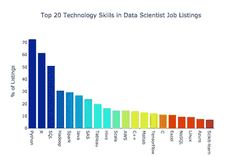
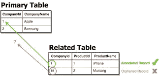
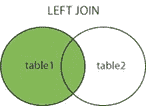
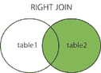
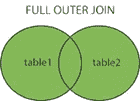

# 用于数据科学的 SQL

> 原文：<https://medium.com/analytics-vidhya/sql-for-data-science-3d9b7b888802?source=collection_archive---------21----------------------->

除了 R、Python 之外，对于所有在数据科学领域工作/寻找工作的人来说，掌握 SQL 知识现在需要一个小时。到 2025 年，全球每天生成的数据量预计将达到 463。为了存储如此大量的数据，掌握数据库知识是绝对必要的。

“数据是新的石油”也许是最受欢迎的流行语之一，它可以描述使我们日益互联的世界运转的燃料。

让我们看看 SQL 的一些基础知识。

**简介**

SQL 代表结构化查询语言。SQL 用于与关系数据库通信。一个*关系数据库*是一个[数据库](https://www.oracle.com/in/database/what-is-database.html)，它存储并提供对彼此相关的数据点的访问。这是用表格表示数据的一种方式。表格的列包含数据的属性，这使得在数据点之间建立关系变得很容易。

数据库通常包含一个或多个表。表格是相关数据条目的集合，由列和行组成。

每个表都由一个名称标识(例如“客户”或“订单”)。表格包含带有数据的记录(行)。

表中的每一列都称为一个字段。例如，对于客户表:CustomerID、CustomerName、ContactName、Address、City、PostalCode 和 Country 是这里的字段。

记录也称为行，是表中存在的每个单独的条目。例如，在上面的 Customers 表中有 91 条记录。

存在许多不同的 SQL 数据库，如:SQLite、MySQL、Postgres、Oracle 和 Microsoft SQL Server。

**SQL 不是区分大小写的语言**

SQL 表由主键组成，主键是唯一标识符，不能包含空值。该键在其他表中用作外键，SQL 连接可以基于这些键完成，这在 SQL 中称为 [*引用*完整性](https://www.google.com/search?sxsrf=ALeKk03vMVrx7hCF_ZqKe2j9bqPHQpHn6g:1596885167554&q=referential+integrity&spell=1&sa=X&ved=2ahUKEwi_waLpvIvrAhU8ILcAHXZ_AZEQkeECKAB6BAgUECg)。

**开始吧**

在本文中，我将向您介绍一些基本的 SQL 命令。

**DDL(数据定义语言)命令:** DDL 或数据定义语言实际上由可用于定义数据库模式的 SQL 命令组成。它用于在数据库中创建和修改数据库对象的结构。

**创建** —用于创建数据库或其对象(如表、索引、函数、视图、存储过程和触发器)。

创建表 TableName(列 1 数据类型，列 2 数据类型，…);

**DROP** —用于从数据库中删除表格。

删除表 TableName

**ALTER**-用于改变数据库的结构。

更改表*表名*
增加*列名数据类型*；

**TRUNCATE**-用于从一个表中删除所有记录，包括所有分配给这些记录的空间都被删除。

截断表 TableName

**重命名**-用于重命名数据库中存在的对象。

将表名重命名为新名；

**DQL(数据查询语言):**

DML 语句用于对数据执行查询。

**选择** —用于从数据库中检索数据。

select */column list from tablename；

(*用于从表中选择所有列。为了选择一些列，列的名称用逗号(，)隔开

**DML(数据操作语言):**这些 SQL 命令处理数据库中的数据操作

**插入** —用于将数据插入表格。

**更新** —用于更新表格内的现有数据。

**删除** —用于从数据库表中删除记录。

从*表名*中删除*条件*；

**DCL(数据控制语言):** DCL 包括 GRANT、REVOKE 等命令，主要处理数据库系统的权限、许可等控制。

**授予**-授予用户对数据库的访问权限。

**撤销**-撤销使用授权命令授予的用户访问权限。

**SQL 连接**

SQL 联接用于根据两个或多个表之间的相关列来组合它们的行。

# 不同类型的 SQL 连接

*   **内部连接**:返回在两个表中都有匹配值的记录

在*表 1 . column _ name*=*table 2 . column _ name*上从*表 1*
表 2*表 2* 中选择*/*column _ name【s】*
；

*   **左连接**:返回左表所有记录，右表匹配记录

SELECT */*column _ name(s)*
从 *table1*
左连接 *table2* 上*table 1 . column _ name*=*table 2 . column _ name*；

*   **右连接**:返回右表中的所有记录，以及左表中匹配的记录

SELECT */*column _ name(s)*
从 *table1*
右连接*table 2* ON*table 1 . column _ name*=*table 2 . column _ name；*

**FULL JOIN** :当左(表 1)或右(表 2)表记录中有匹配时，FULL OUTER JOIN 关键字返回所有记录。

**一些需要知道的要点**

**联合运算符**

*   UNION 中的每个 SELECT 语句必须具有相同的列数和相似的数据类型
*   每个 SELECT 语句中的列顺序也必须相同。
*   UNION 运算符将消除输出结果中的重复项。

从*表 1* 中选择*列名*，从*表 2* 中选择*列名*；

**UNION ALL 运算符:**

默认情况下，UNION 运算符只选择不同的值。若要允许重复值，请使用 UNION ALL。

从*表 1* 中选择*列名*并全部
从*表 2* 中选择*列名*；

**按关键字排序:**

ORDER BY 关键字用于按升序或降序对结果集进行排序。默认情况下，ORDER BY 关键字按升序对记录进行排序。要按降序排列记录，请使用 DESC 关键字。

从 *table_name*
中选择 *column1* 、 *column2、…* 、
ORDER BY*column 1、column2、…*ASC | desc；

# SQL GROUP BY 语句

GROUP BY 语句将具有相同值的行分组到汇总行中。GROUP BY 语句通常与聚合函数(COUNT、MAX、MIN、SUM、AVG)一起使用，按一列或多列对结果集进行分组。

从*表名*
中选择*列名*
其中*条件*
分组依据*列名* 排序依据*列名；*

**HAVING 子句:**HAVING 子句被添加到 SQL 中，因为 WHERE 关键字不能与聚合函数一起使用。

这是关于如何开始使用 SQL 解决数据相关问题的简单介绍。在下一篇文章中，我将发布一篇关于如何使用 Python 中的数据库连接器将 CSV 文件插入 SQL 数据库的简短文章。

**结论:**

GROUP BY 语句将具有相同值的行分组到汇总行中。GROUP BY 语句通常与聚合函数(COUNT、MAX、MIN、SUM、AVG)一起使用，按一列或多列对结果集进行分组。

*希望这对你有帮助，感谢阅读！*