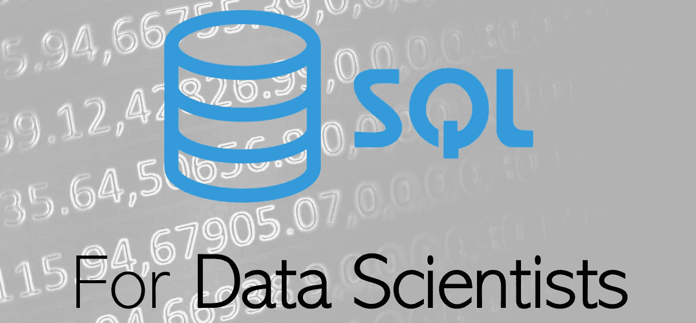

# 面向数据科学家的 SQL，不到 6 分钟

> 原文：<https://medium.com/analytics-vidhya/sql-for-data-scientists-in-6-minutes-or-less-6e11a377751f?source=collection_archive---------1----------------------->

背景图片: [Unsplash](https://unsplash.com/photos/Wpnoqo2plFA)

## 任何数据科学简历的必备技能

数据科学家经常使用数据框架，无论是 R 还是 Python。然而，大量数据——当今数据科学中的大量“大数据”——根本无法完全加载到一个数据帧甚至一个`.csv`文件中。这些数据存储在大型数据库中，其中最常见的是 SQL…