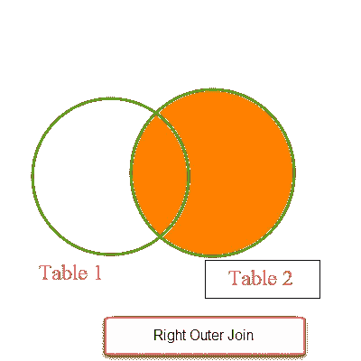
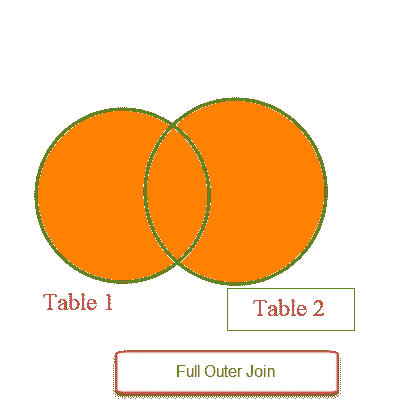

# SQL Join | Inner | Left | Right | Outer | Self | Cross Join 2019—Sagar Jaybhay

> 原文：<https://medium.com/analytics-vidhya/sql-join-inner-left-right-outer-self-cross-join-2019-sagar-jaybhay-c7b1214fcf70?source=collection_archive---------8----------------------->

Join 语句用于组合来自多个[表](https://sagarjaybhay.com/about-tables-in-database-by-sagar-jaybhay/)的数据或行，这些数据或行基于它们之间的公共字段。一般来说，2 个[表](https://sagarjaybhay.com/about-tables-in-database-by-sagar-jaybhay/)通过使用外键约束相互关联。

**有不同类型的连接** [**在此外连接分为 3 个子连接**。](https://docs.microsoft.com/en-us/sql/relational-databases/performance/joins)

1.  左连接或左外连接
2.  右外部联接或右联接
3.  完全联接或完全外部联接。


如下图所示，我们使用这两个表作为连接示例。在这两个表中，我们有 **departmentid** 是公共字段或列。

# 内部连接

Inner Join 将只返回两个表中匹配的行，其中一个条件是匹配的，不匹配的行将被删除。返回在两个表中都有匹配值的记录。仅选择两个表之间匹配的行。

**通用语法**

```
SELECT table1.column1,table1.column2,table2.column1,.... FROM table1 INNER JOIN table2 ON table1.matching_column = table2.matching_column;
```

**实际查询**

```
select * from Employee inner join Department on Employee.DepartmentID=Department.DepartmentID;
```


如果 id 不在 department 表中，或者反之亦然，则这些行不会填充到内部连接查询的结果中。

**内部连接的最终含义只是给出这两个表之间的匹配行。**

# 左外部联接或左联接

左连接返回左表中所有匹配的行+不匹配的行。在右侧没有匹配行的行中，结果集将包含 null。左连接也称为左外连接。

简而言之，我们得到一个完整的左表，只有右表中的匹配行。

**左连接的一般语法:**

```
SELECT table1.column1,table1.column2,table2.column1,.... FROM table1 LEFT JOIN table2 ON table1.matching_column = table2.matching_column;
```


**实际查询**

```
select * from Employee as e left join Department on e.DepartmentID=Department.DepartmentID;
```


# 右外部联接或右联接:

右连接返回右表中所有的**匹配行+不匹配行**

**通用语法:**

```
SELECT table1.column1,table1.column2,table2.column1,.... FROM table1 RIGHT JOIN table2 ON table1.matching_column = table2.matching_column;
```



右连接也称为右外连接。左侧没有匹配行的行，结果集将包含 null。

**实际查询**

```
select * from Employee as e right join Department on e.DepartmentID=Department.DepartmentID order by Department.DepartmentID desc;
```


# 完全外部连接或完全连接

完全连接返回左表和右表中的所有行，还包括不匹配的行。完全连接通过结合左连接和右连接来创建结果集。没有找到匹配行的行将给出空值。

**通用语法**

```
SELECT table1.column1,table1.column2,table2.column1,.... FROM table1 FULL JOIN table2 ON table1.matching_column = table2.matching_column;
```



**实际查询**

```
select * from Employee as e full join Department on e.DepartmentID=Department.DepartmentID order by Department.DepartmentID desc;
```


# 交叉连接

它产生两个表的笛卡尔积，这涉及到连接。在上面的例子中，我们有雇员表和部门表，雇员表中有 1001 行，部门表中有 11 行，那么这个连接的输出包含

11011 行。

在这种情况下，如果您使用 on 语法手段条件，它将抛出一个错误。


# 自连接

join 表示一个表连接到它自己，这叫做自连接。这对于查询分层数据或比较同一表中的行非常有用。自联接不是任何不同类型的联接。大多数情况下，当表有一个外键引用它自己的主键时。

自联接可以使用内部联接或左联接。当您为自连接编写查询时，请记住为表编写别名，否则将会引发错误。

用于创建表的 Create table 语句。

```
create table selfjoin (empid int,name varchar(300),managerid int)
```

创建表格后，我们可以向该表格添加行

```
insert into selfjoin values (1,'sagar',3); insert into selfjoin values (2,'ram',1); insert into selfjoin values (3,'ravi',3); insert into selfjoin values (4,'sham',1); insert into selfjoin values (5,'naga',6); insert into selfjoin values (6,'saga',5);
```

**通用语法**

```
SELECT column_name(s) FROM table1 T1, table1 T2 WHERE condition;
```

在我们的例子中，我们需要找出谁是谁的经理。

**实际查询**

```
select a.name,b.name from selfjoin as a inner join selfjoin as b on a.managerid=b.empid
```


*原载于 2019 年 12 月 9 日*[*https://sagarjaybhay.com*](https://sagarjaybhay.com/sql-join-inner-left-right-outer-self-join-2019/)*。*