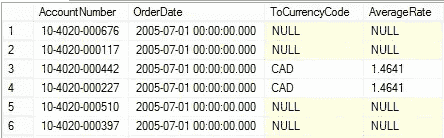

# SQL 连接—快速指南

> 原文：<https://medium.com/analytics-vidhya/sql-joins-a-refresher-7027ea5123e3?source=collection_archive---------12----------------------->

一个非技术人员学习数据科学的方式

大家好。我写这篇文章是我的 MySQL 之旅的一部分，因为连接在 SQL 中是一件令人困惑的事情，所以我尽可能用最简单的术语来解释。我从一个模式中提取数据，并在这里发布代码。我们将讨论 MySQL 中的每一个连接，让我们开始吧。首先，让我们看看什么是连接，然后是连接的类型及其示例解释。

注意:为了便于理解，我从 Sakila 数据集外包了一些数据和值，也从各种网站外包了一些定义。

**MySQL 加入:**

*   MySQL join 是一个连接两个或更多表的函数。
*   因为我们将来要处理多种数据，所以我们要链接很多表
*   这些表由表之间通用的列链接
*   在非公共列的情况下，使用不同类型的连接
*   有时，同一个表被联接或精确比较以获取值

**MySQL 加入的类型:**

在脑海中想象维恩图，这样就很容易掌握。一点点十标十一标肯定有帮助。让我们稍微更新一下我们在维恩的知识。维恩图很有趣，在我们的板上，它们帮助我们得到更多的分数。在这方面，我们将期待在这里使用它们。

**维恩函数—【并、交、集差】**

*   内部连接-类似于交集
*   右连接-设置差异(B-A)
*   左连接-设置差异(A-B)
*   外部联接—联合
*   交叉连接:这类似于嵌套 for 循环(引用 python)

**内部连接**:内部连接基本上是包括两个表中公共列的连接。这就像是我们数学中的一个交叉点。在交集(A 交集 B)中，结果采用 A 和 B 之间的公共值。同样，在内部联接或公共联接(ms access 中只有 3 种类型的联接)中，联接发生在公共列之间。让我们直接进入语法:

> **从表 1 中选择 table1.col1，table1.col2，table2.col1，table2.col2 在表 1 的公共列上连接表 2 =表 2 的公共列；**

注意:我们可以在此语法中使用 groupby 和 having 以及 orderby 和 where 子句。

**分解语法:**

> **选择** —常用的选择语法
> 
> **table1.col1，table1.col2，table2.col1，table2.col2** —此处 table1，table2 表示该列取自何处
> 
> **join** :这里 join 表示 Join 函数，表示这里发生了 Join
> 
> **on** — On 语句用于表示表格连接到哪一列

**例子**:在 MySQL 中使用 sakila 模式

突出显示的部分显示了连接发生的位置

我们将通过将客户和地址表分别连接为 c 和 ad 来找到客户的全名和地址。

**结果:**

我们可以看到这个人的全名和完整地址

我们还可以在各种表上进行多个内部连接，以获得所需的输出。

**使用多个表:**使用 Sakila 模式

这里我们加入了客户、地址、城市和国家

我们将从表 customer、address、city、country 中获取全名、地址和国家名称

**结果**:

我们在表格中得到国家名称

因此，通过这种方式，我们也可以连接多个表，我们可以包括各种语句和执行我们的块。确保我们在正确的列上连接，以避免错误。

**左右连接:**

*   右连接:在右连接中，顾名思义，它从右表中获取值，从左表中获取公共列。

> *RJ 开始从右侧表格中选择数据。它将右表中的每一行与左表中的每一行进行匹配。如果两个行都导致联接条件评估为* `*TRUE*` *，则它将列组合成一个新行，并将该新行包含在结果集中。*
> 
> *如果右表中的某一行与左表中的某一行不匹配，它会将右表中的行与右表中所有列的* `*NULL*` *值组合成一个新行，并将该行包含在结果集中。换句话说，* `*RIGHT JOIN*` *返回右表中的所有行，而不管左表中是否有匹配的行。*

*   左连接:在左连接中，值取自左表，公共列取自右表。

MySQL 教程

> *`*LEFT JOIN*`*子句从左侧表格开始选择数据。它根据* `*join_condition*` *将左表中的每一行与右表中的每一行进行匹配。**
> 
> **如果两个表中的行导致连接条件评估为* `*TRUE*` *，则* `*LEFT JOIN*` *将两个表中的行组合成一个新行，并将该新行包含在结果行中。**
> 
> **如果左表中的行与右表中的任何行都不匹配，则* `*LEFT JOIN*` *仍然会将两个表中的行组合成一个新行，并将该新行包含在结果行中。但是，它对右表中该行的所有列使用* `*NULL*` *。**
> 
> **换句话说，* `*LEFT JOIN*` *返回左表中的所有行，而不管左表中的行是否与右表中的行匹配。如果没有匹配，右表中该行的列将包含* `*NULL*` *。**

*示例:右连接*

***这里我们使用 sakila 模式:***

**

*获取值的语法*

*它返回大约 603 行。如果我们对 inner join 使用相同的方法，它将返回 599 行。*

**

*请注意空值*

**

*使用 inner 和 right join 查看生成的行数*

***示例:左连接***

**

*我们现在留下了加入地址和客户 c*

*这里，与 customer 列匹配的某些行的邮政编码值为 null 或没有值。所以，这给出了结果:*

**

*左表中前四行的值为 0*

***外部联接:***

*有三种类型的外部联接:*

*   ***左外连接** —包括左表中的所有行，右表中不匹配的行用空值替换。[像左连接一样工作]*
*   ***右外连接** —包括右表中的所有行，左表中不匹配的行用空值替换。[像右连接一样工作]*
*   ***完全外部连接** —包含两个表中的所有行，空值填充不匹配的行。*

*全外连接:在全外连接中，我们使用 union 函数连接两个表。当左(表 1)或右(表 2)表记录中有匹配项时，FULL OUTER JOIN 关键字返回所有记录。完全外部连接和完全连接是相同的。*

**

> **一个* ***全外连接*** *是左右外连接结果的组合。这种类型的联接返回的结果包括两个表中的所有行。出现匹配的地方，值是相关的。如果两个表都不匹配，则返回 NULL。**

*[例子:为此，我们从 Essentialsql.com 借用数据集](https://www.essentialsql.com/get-ready-to-learn-sql-server-14-introduction-to-outer-joins/)*

**

*通过选择上述值并将它们连接为完全外部连接*

*因此，结果如下:*

**

*交叉连接:交叉连接或笛卡尔积连接的工作方式类似于嵌套的 for 循环。例如:*

> ****为我在一:****
> 
> ****为 b 中的 J:****

*就像 j 值如何遍历 I 中的每个组件一样，sql 交叉连接也以同样的方式工作。*

*数据库借用自:[https://www.mysqltutorial.org/mysql-cross-join/](https://www.mysqltutorial.org/mysql-cross-join/)*

*这里我们将使用交叉连接和内部连接来计算每个商店的利润。希望大家一定对 inner join 没意见，现在我们跳到 cross + inner。*

**

*首先，我们使用交叉连接来获取一个值。*

*价值:*

**

*对于循环，我们得到嵌套的值*

*现在，在另一个代码中使用它:*

**

*这样我们就能得到每个地区的利润销售额！*

**

*这就是交叉连接的工作方式。它很少在实际应用中使用，但在面试中非常有用。他们问“解释笛卡尔连接？”。这里的交叉连接是笛卡尔连接。*

***自连接**:被自身连接的表称为自连接。例如，我们使用模式 hr，找到雇员工资和经理工资，以便更好地理解它。嗯，这只涉及到一个表，并且是一个常规连接，但是这个表是与它自己连接的。*

> **自联接常用于查询* ***层次数据*** *或比较同一表中的某一行与其他行。**
> 
> **要执行自连接，您必须使用表别名，以避免在一个查询中两次重复相同的表名。请注意，在查询中引用一个表两次或更多次而不使用表别名将会导致错误。**

*注意这个词，等级。这是用来表示两个人之间的关系，比如谁是经理，谁在他手下工作等等。*

*让我们来看看这个例子:*

**

*我们将在员工标识上加入经理标识*

*答案给出了:*

**

*这就是我所说的等级制度。！*

*一些罕见的联接类型:*

*   *自然连接 [:](https://www.w3resource.com/mysql/advance-query-in-mysql/mysql-natural-join.php) 在 MySQL 中，自然连接是这样一种连接，它执行与内连接或左连接相同的任务，其中 ON 或 USING 子句引用要连接的表共有的所有列。MySQL 自然连接的结构是这样的，关联表中同名的列只出现一次。*

*快速指南:*

**

*鸣谢:史蒂夫·斯特德曼*

*我附上关于 MySQL 的其他问题:*

*   *内部联接和外部联接有什么区别？*
*   *[右外连接和左外连接的区别是什么/](https://www.essentialsql.com/what-is-the-difference-between-a-right-and-left-outer-join/)*

> ****1。什么是 MySQL？****
> 
> **MySQL 是由 MySQL AB(现已被 Oracle 收购)构建、支持和发布的开源 DBMS】**
> 
> ****2。MySQL 的技术特点是什么？****
> 
> **MySQL 数据库软件是一个客户端或服务器系统，包括**
> 
> **支持各种客户端程序和库的多线程 SQL server**
> 
> **不同的后端**
> 
> **广泛的应用编程接口和**
> 
> **行政工具。**
> 
> ****3。为什么用 MySQL？****
> 
> *MySQL 数据库服务器可靠、快速且非常易于使用。这个软件可以免费下载，也可以从网上下载。*
> 
> **4。****MySQL 与 Oracle 相比有什么优势？****
> 
> *MySQL 是一款开源软件，随时可用，没有任何成本。*
> 
> **MySQL 可移植**
> 
> **带命令提示符的 GUI。**
> 
> **使用 MySQL 查询浏览器支持管理**
> 
> **5。* ***区分 FLOAT 和 DOUBLE？****
> 
> **以下是浮点型和双精度型的区别:**
> 
> **浮点数以八位精度存储在 FLOAT 中，有四个字节。**
> 
> **浮点数以双精度 18 位存储，有 8 个字节。**
> 
> **6。****CHAR 和 VARCHAR 的区别？****
> 
> **以下是 CHAR 和 VARCHAR 的区别:**
> 
> **CHAR 和 VARCHAR 类型在存储和检索上有所不同**
> 
> **CHAR 列长度固定为创建表格时声明的长度。长度值范围从 1 到 255**
> 
> **当存储字符值时，使用空格将其右填充至特定长度。检索 CHAR 值时，将删除尾随空格。**

*更多信息请访问:[https://career . guru 99 . com/top-50-MySQL-interview-questions-answers/](https://career.guru99.com/top-50-mysql-interview-questions-answers/)*

*这些问题在许多网站上都有，但我想把它贴在这里，因为它可能会给你一个想法，看看更多的问题，这样你就可以破解面试，如果使用 SQL 的话。*

*一定要看看我关于数据科学的其他帖子:)*