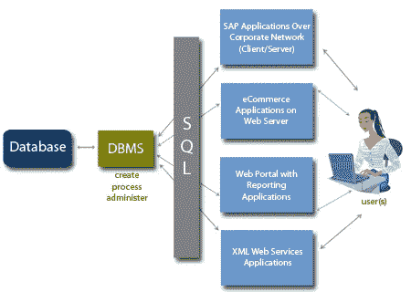

# 每个初学者都应该知道的 SQL 查询

> 原文：<https://medium.com/analytics-vidhya/sql-queries-every-beginner-should-know-8a5ae2f27bdb?source=collection_archive---------16----------------------->

结构化查询语言或 SQL(读作“ess-que-el”)是每一个从事技术工作的人在生活中的某个时候都会遇到的语言。这篇文章给出了每个初学者应该开始的查询的想法！

图片来源:谷歌

> 结构化查询语言或 SQL 是一种特定于领域的语言，用于设计、编程和与关系数据库管理系统(RDBMS)中保存的数据通信

[斯科特·格雷厄姆](https://unsplash.com/@sctgrhm?utm_source=medium&utm_medium=referral)在 [Unsplash](https://unsplash.com?utm_source=medium&utm_medium=referral) 上拍照

# 1.从表中查询数据:

*a)从表*中查询 column_1、column_2 列中的数据

>从 tablename 中选择 column_1，column _ 2；

*b)查询表格中的所有行和列*

> SELECT * FROM tablename

*c)查询数据，过滤符合条件的行*

> SELECT column_1，column_2 FROM tablename WHERE 条件；

*d)从表中查询不同的行*

> SELECT DISTINCT column _ 1 FROM tablename WHERE 条件；

*e)按升序或降序对结果集进行排序*

> SELECT column_1，column _ 2 FROM tablename ORDER BY column _ 1 ASC[desc]；

*f)跳过行的偏移并返回下 n 行*

> SELECT column_1，column _ 2 FROM tablename ORDER BY column _ 1 LIMIT n OFFSET OFFSET；

*g)使用聚合函数对行进行分组*

> SELECT column_1，aggregate(column _ 2)FROM tablename GROUP BY column _ 1；

*h)使用“HAVING”子句过滤组*

> SELECT column_1，aggregate(column _ 2)FROM tablename GROUP BY column _ 1 HAVING 条件；

照片由[沙哈达特·拉赫曼](https://unsplash.com/@hishahadat?utm_source=medium&utm_medium=referral)在 [Unsplash](https://unsplash.com?utm_source=medium&utm_medium=referral) 上拍摄

## 2) SQL 聚合函数:

a) AVG: *返回列表的平均值*

b)计数:*返回列表中元素的数量*

c) SUM: *返回列表*的总和

d)最大值:*返回列表*中的最大值

e) MIN: *返回列表*中的最小值

罗马卡夫在 [Unsplash](https://unsplash.com?utm_source=medium&utm_medium=referral) 上拍摄的照片

## 3)从多个表中查询:

*a)两个表 table_1 和 table_2 的内部连接*

> SELECT column_1，column _ 2 FROM table _ 1 INNER JOIN table _ 2 ON 条件；

*b)左连接两个表 table_1 和 table_2*

> SELECT column_1，column _ 2 FROM table _ 1 LEFT JOIN table _ 2 ON 条件；

*c)在两个表 table_1 和 table_2 中加入右键*

> SELECT column_1，column _ 2 FROM table _ 1 RIGHT JOIN table _ 2 ON condition；

*d)两个表 table_1 和 table_2 的全外连接*

> SELECT column_1，column_2 FROM table_1 全外连接 table_2 ON 条件；

*e)两个表 table_1 和 table_2 中的行的笛卡尔乘积*

>从 table_1 交叉连接 table_2 中选择 column_1、column _ 2；

照片由[普里西拉·杜·普里兹](https://unsplash.com/@priscilladupreez?utm_source=medium&utm_medium=referral)在 [Unsplash](https://unsplash.com?utm_source=medium&utm_medium=referral) 上拍摄

## 4)管理表格:

*a)创建一个包含三列的表格*

>创建表 tablename (id INT 主键，name VARCHAR 不为 NULL，price INT 默认为 0)；

*b)从数据库中删除表格*

> DROP TABLE tablename

*c)在表格中添加一个新列*

> ALTER TABLE tablename 添加列；

*d)从表格中删除一列*

> ALTER TABLE tablename DROP COLUMN name；

添加一个约束

> ALTER TABLE tablename 添加约束；

*f)删除一个约束*

> ALTER TABLE tablename DROP 约束；

*g)重命名表格*

>将表 tablename 重命名为 newtablename

*h)重命名一列*

> ALTER TABLE tablename 将 columnname 重命名为 newcolumnname

*i)从表格中删除所有数据*

>截断表格 tablename

由[马库斯·斯皮斯克](https://unsplash.com/@markusspiske?utm_source=medium&utm_medium=referral)在 [Unsplash](https://unsplash.com?utm_source=medium&utm_medium=referral) 上拍摄的照片

## 5)修改数据:

*a)在表格中插入一行*

*>* 插入到 tablename(column_list)值(values_list)中；

*b)将多行插入表格*

*>* 插入到 tablename(column_list)值(value_list)，(value_list)，…。；

*c)从表 _2 到表 _1 插入行*

*>* 插入到 table_1(column_list)从 table_2 中选择 column _ list；

*d)删除表格中行的子集*

*>* 从表名中删除 WHERE 条件；

*e)删除表格中的所有数据*

*>* 从表名中删除；

*f)为所有行更新 column_1 中的新值*

*>* 更新表名设置 column _ 1 = new _ value

*g)更新符合条件*的列 column_1、column_2 中的值

> UPDATE tablename 设置 column_1=new_value，column_2=new_
value WHERE 条件；

*如有疑问，欢迎在评论中写下💬下面的部分。可以在* [*LinkedIn*](https://www.linkedin.com/in/ayantika-sarkar/) *上联系我！！*

*感谢您的阅读！祝你有美好的一天😃*