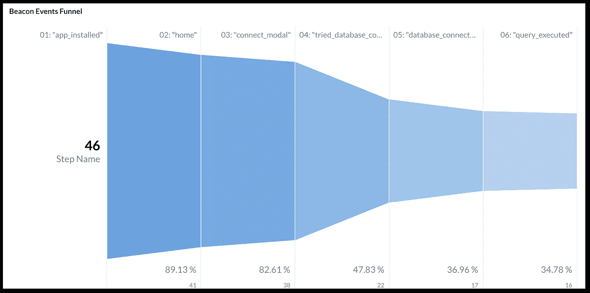
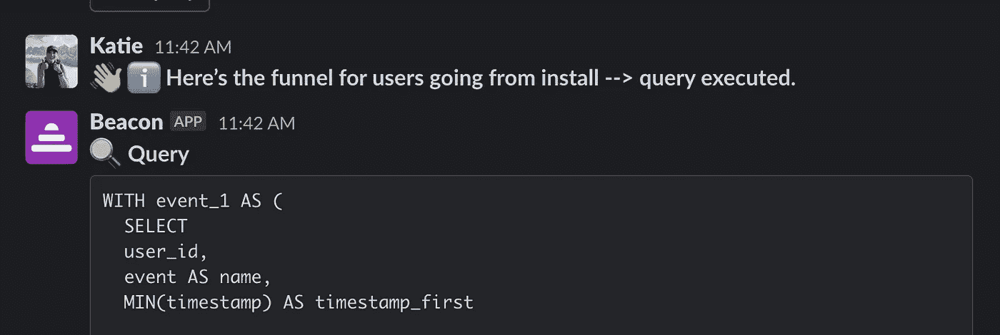
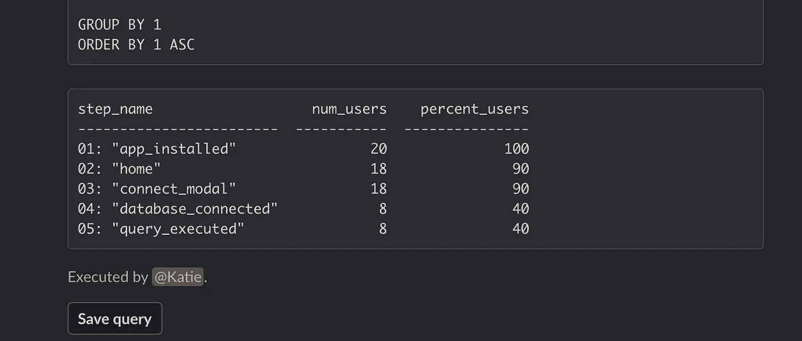
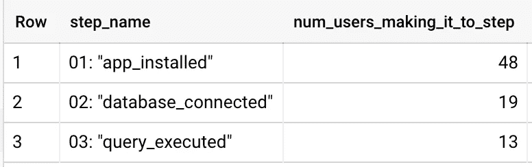
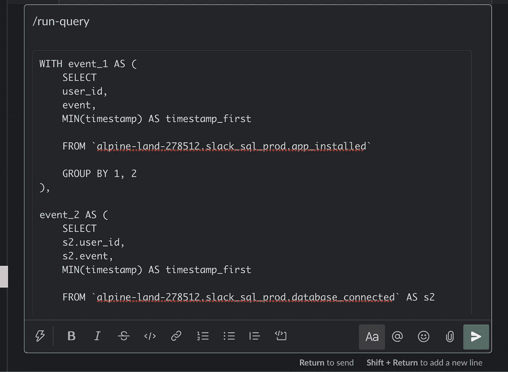
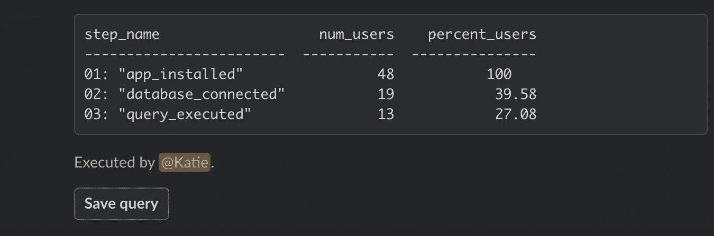

# SQL 查询我希望我从数据开始时就知道。第 1 部分:事件漏斗。

> 原文：<https://medium.com/analytics-vidhya/sql-queries-i-wish-id-known-when-i-started-in-data-part-1-the-event-funnel-3bd1de6a92ef?source=collection_archive---------6----------------------->

# 值得记忆的 SQL。

自从不到两个月前加入哈勃以来，我注意到我脑子里有多少 SQL 语句。这些是我发现自己在工作的每个地方反复使用的查询，一旦我使用了一次，我就不会忘记它们。

所以，我想也许值得分享这些问题，以防对其他人有用🤗这正是我在这一系列博客文章中要做的。

我将介绍一些最常见的 SQL 查询，这些查询是我在研究产品性能时突然想到的。我还将谈一谈如何利用这些数据来帮助你做出更好的产品决策。

因此，希望能对建筑有所了解:

-事件漏斗
-无缝日期网格
-让您对用户进行时间序列分析的表格

一旦您构建了这些公共查询，您就可以使用 Beacon 来保存它们，这样您的所有团队成员都可以访问它们，而无需编写 SQL。您还可以使用 Beacon 来分享您在 Slack 中的新查询结果！[你可以在这里查看灯塔](https://www.gethubble.io/beacon)。

成为一个“数据驱动”的公司有时会感觉像一个白日梦，但希望这些博客帖子可以帮助你的团队将它变成现实💪。

# 使用事件漏斗跟踪用户可以参加的一系列事件，并改善旅程！

我在首次发布产品时挖掘的最有用的数据之一是**事件漏斗**。

事件漏斗是一种工具，可让您测量一系列步骤(事件)的完成率。例如，您可以创建一个创建帐户所需步骤的漏斗，然后跟踪每个步骤的完成率。



通过这些漏斗，你可以看到哪些步骤是用户旅程中最大的落点。这些信息非常有用，因为:

1.你可以根据数据做出**决定**你需要改变产品的哪些部分来提高行动的完成度(而不是仅仅依靠你的直觉)。
2。您可以**估计您的变更对完成率的影响**，因为您可以比较变更前后的漏斗。

# 我们如何利用事件漏斗提高与 Beacon 的互动。

我们开发了一个产品， [Beacon](https://www.gethubble.io/beacon) ，它可以让你在 Slack 中编写、运行和共享你的 SQL(你可以[在这里把它添加到你的工作区](https://slack.com/oauth/v2/authorize?client_id=1207722259383.1462138656839&scope=commands,im:history,im:read,im:write,team:read,users:read,users:read.email,workflow.steps:execute,chat:write&user_scope=&state=medium.event_funnel)！)

一旦我们发布了它，我们想了解用户是如何参与到产品中的。具体来说，我们想弄清楚**为什么人们在安装 Beacon 后不使用它运行查询。**

因此，我们有一个操作(“执行查询”)，我们试图优化完成率，我们知道导致该操作的步骤。进入… *事件漏斗*。

我为用户建立了一个事件漏斗，从“我安装了应用程序”到“我执行了一个查询”。我使用我们令人敬畏的工具 [Beacon](https://slack.com/oauth/v2/authorize?client_id=1207722259383.1462138656839&scope=commands,im:history,im:read,im:write,team:read,users:read,users:read.email,workflow.steps:execute,chat:write&user_scope=&state=medium.event_funnel) 来运行查询，并直接与 Slack 中的团队分享结果:



…



这个事件漏斗非常清楚地表明，最大的落点在第 3 步和第 4 步之间:看到`connect modal`(即给出如何连接到数据库的指令的屏幕)并成功获得`database connected`。

因此，我们联系了一些在这一步陷入困境的用户，集思广益，想出了一些我们可以做出的改进，以帮助减少连接数据库时的摩擦。基本上，**事件漏斗向我们展示了如果我们想要推动用户参与度的最高增长，我们应该寻求改变产品的哪一部分。**

# 事件漏斗是我记忆中的 SQL 查询之一。

为了能够构建一个漏斗，您需要生成一个表格，在您的漏斗中每一步都有一行，然后统计完成该步骤的用户数量。



这些`step_name`值是我们在应用程序中跟踪的分析事件(如果您还没有设置事件跟踪，您可以使用类似 [Segment](https://segment.com/docs/protocols/tracking-plan/best-practices/) 或 [Rudderstack](https://docs.rudderstack.com/rudderstack-sdk-integration-guides) 的工具来设置事件跟踪！)

一旦你想好了你的漏斗中需要的步骤以及它们的顺序，你就可以使用下面的 SQL 模板来构建你的事件漏斗。我们的团队现在喜欢看到这些漏斗，它推动了我们的许多工作。我们使用 [Beacon](https://www.gethubble.io/beacon) 在我们的团队 Slack 中分享最新的事件漏斗数据。

我挖掘了 3 个事件，但是您可以遵循此模板中的模式，添加更多事件作为附加子查询(这些实际上称为“ [CTEs](https://www.essentialsql.com/introduction-common-table-expressions-ctes/) ”)，以满足您的漏斗需求！

# 这就是它的辉煌之处:事件漏斗。

要使用这个事件漏斗运行查询，您需要确保您已经整理了一些东西:

## 步骤 1:在下面的查询中插入正确的变量。

1.`user_id`字段需要是你的用户的标识符(或者是你在漏斗中计算的单位——例如`team_id`如果你想知道团队做某事的转化率)
2。`event`字段应该是您在每个子查询(CTE)中引用的步骤的**名称。
3。`timestamp`字段应表示事件发生的时间。
4。您需要更改`FROM project_name.dataset_name.event_name_1` 来引用为每个给定步骤存储事件数据的表。
5。我在底部注释掉了一些代码，让你为漏斗指定一个日期范围(见:`IF YOU WANT TO SPECIFY A RANGE OF DATES, YOU CAN DO THAT HERE`)。如果需要，您可以添加它，但是它不是查询工作所必需的！🙂**

```
WITH event_1 AS (
 SELECT
 user_id, — identifier of the thing you’re counting in your funnel
 ‘get_in_rocket’ AS event, — name of the step in your funnel
 MIN(timestamp) AS timestamp_first — timestamp of when the event occurred

 FROM `project_name.dataset_name.event_name_1` — table where your event data is stored for step 1

 GROUP BY 1, 2
 ),event_2 AS (
 SELECT
 s2.user_id,
 ‘push_button’ AS event,
 MIN(timestamp) AS timestamp_first

 FROM `project_name.dataset_name.event_name_2` AS s2

 INNER JOIN event_1 s1 ON s1.user_id = s2.user_id

 WHERE s2.timestamp >= s1.timestamp_first

 GROUP BY 1,2
 ),event_3 AS (
 SELECT
 s3.user_id,
 ‘blastoff’ AS event,
 MIN(timestamp) AS timestamp_first

 FROM `project_name.dataset_name.event_name_3` AS s3

 INNER JOIN event_2 s2 ON s2.user_id = s3.user_id

 WHERE s3.timestamp >= s2.timestamp_first

 GROUP BY 1,2
 ),all_events AS (
 SELECT CONCAT(’01: “‘, event, ‘“‘) as step_name, user_id, timestamp_first FROM event_1
 UNION ALL
 SELECT CONCAT(’02: “‘, event, ‘“‘) as step_name, user_id, timestamp_first FROM event_2
 UNION ALL
 SELECT CONCAT(’03: “‘, event, ‘“‘) as step_name, user_id, timestamp_first FROM event_3
 )SELECT
 step_name,
 COUNT(user_id) AS num_users_making_it_to_step,
 ROUND(COUNT(user_id) * 100 / (MAX(COUNT(user_id)) OVER(PARTITION BY NULL)), 2) AS percent_of_users_making_it_to_stepFROM all_events
 LEFT JOIN event_1 USING(user_id)— IF YOU WANT TO SPECIFY A RANGE OF DATES, YOU CAN DO THAT HERE
 — This is the “From” date:
 — WHERE event_1.timestamp_first >= ‘2020–12–01’— This is the “To” date:
 — AND event_1.timestamp_first <= ‘2020–12–03’GROUP BY 1
ORDER BY 1 ASC
```

## 第二步:使用 Beacon 分享你最喜欢的 Slack 频道的漏斗图！

一旦[将 Beacon](https://slack.com/oauth/v2/authorize?client_id=1207722259383.1462138656839&scope=commands,im:history,im:read,im:write,team:read,users:read,users:read.email,workflow.steps:execute,chat:write&user_scope=&state=medium.event_funnel) 安装到您的 Slack 工作空间中，并连接到您的数据库，只需键入`/run-query`，然后输入您的 SQL 查询并点击 enter。



## 步骤 3:保存您的查询，以便您团队的其他成员可以使用它！

一旦您的查询在 Slack 中发布，您就可以点击`Save Query`让您团队中的其他人都可以使用您的事件漏斗的 SQL 查询！



就是这样！

如果你有任何问题或反馈，请随时给我发消息，地址是 [katie@gethubble.io](mailto:katie@gethubble.io) ，还有[去看看 Beacon](https://slack.com/oauth/v2/authorize?client_id=1207722259383.1462138656839&scope=commands,im:history,im:read,im:write,team:read,users:read,users:read.email,workflow.steps:execute,chat:write&user_scope=&state=medium.event_funnel) ，这样你就可以直接在 Slack 上与你的团队分享你的新活动漏斗😊