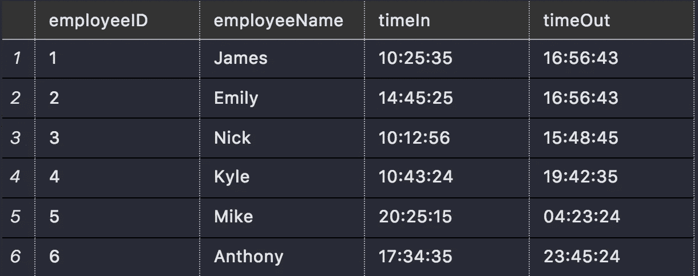
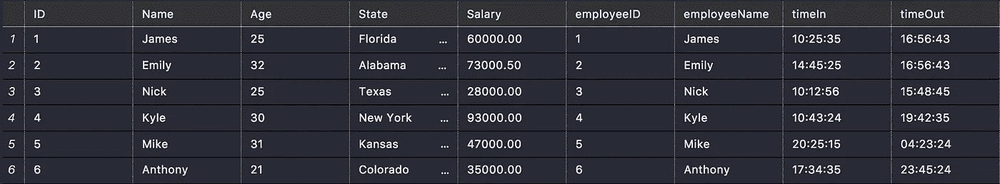

# SQL Server 联接

> 原文：<https://medium.com/analytics-vidhya/sql-server-joins-a6cedef552d?source=collection_archive---------34----------------------->

## 随时获取您想要的数据


由[布莱克·康纳利](https://unsplash.com/@blakeconnally?utm_source=medium&utm_medium=referral)在 [Unsplash](https://unsplash.com?utm_source=medium&utm_medium=referral) 上拍摄的照片

之前，我们学习了如何插入、选择和更新数据，基本上是 CRUD(创建、读取、更新、删除)的基础。如果你不太熟悉 SQL，我肯定会先读一读那篇文章。这将有助于你理解这一点。

[](/@J.Code/sql-server-introduction-9e172e5d66ba) [## SQL Server 简介

### 如何开始使用 SQL Server

medium.com](/@J.Code/sql-server-introduction-9e172e5d66ba) 

今天我们将学习 SQL 中更高级的概念，即如何连接表。

**什么是连接？**

当你想…连接多个表中的数据时，连接很有用，希望有所帮助。

联接用于组合两个或多个表中的行，这些行基于它们之间的相关列。您可以使用一个连接，通过一个查询从多个表中获取数据，而不必进行多次查询来查看您想要的数据。


为了真正正确地使用联接，您必须理解数据库的结构，并且真正理解表是如何相关的，如果您的项目有一个数据库图表，这将是查看这些关系的最简单的方法之一。

如果没有，那么你就必须用最难的方法来做，真正地浏览你所有的表，理解它们之间的关系……RIP

## 连接的类型

有多种类型的连接:

*内部连接* 这将返回在两个表中都有匹配值的记录

*左(外)连接*
返回左表中的所有记录和右表中匹配的记录

*右(外)连接*
返回右表中的所有记录和左表中匹配的记录。

*完全(外部)连接*
返回两个表中的所有记录。

**内部连接的语法**

所有连接的语法都是相似的，只是查询的结果不同，所以我只展示内部连接的语法。

```
Select *
from tableOne
    joinType join tableTwo
        on (tableOne.columnName = tableTwo.columnName)
```

*   你先用
    `from tableOne`说出你想正常查询哪个表

接下来是连接，您声明连接的类型，然后是第二个表名，以及来自两个表的相关数据。

`joinType join tableTwo on (tableOne.columnName = tableTwo.columnName)`

**创建额外表格**

在这个例子中，我们需要一个包含相关数据的新表，所以让我们创建一个表，简单地存储我们的员工上下班打卡的时间。该表将共享雇员表中的雇员 id 和雇员姓名。

因此，如果您继续阅读我之前创建雇员数据库的文章，您将需要添加另一个表。如果没有，您可以直接跳到连接示例。

下面的代码将创建一个表，我把我的数据库称为 JobDatabase，如果没有，请确保输入数据库名。

```
USE JobDatabase
GOCREATE TABLE TimeClock
(
    employeeID INT NOT NULL PRIMARY KEY,
    employeeName VARCHAR(50),
    timeIn time,
    timeOut Time
)
GOINSERT INTO TimeClock VALUES (1, ‘James’, ‘10:25:35’, ‘16:56:43’);
INSERT INTO TimeClock VALUES (2, ‘Emily’, ‘14:45:25’, ‘16:56:43’);
INSERT INTO TimeClock VALUES (3, ‘Nick’, ‘10:12:56’, ‘15:48:45’);
INSERT INTO TimeClock VALUES (4, ‘Kyle’, ‘10:43:24’, ‘19:42:35’);
INSERT INTO TimeClock VALUES (5, ‘Mike’, ‘20:25:15’, ‘04:23:24’);
INSERT INTO TimeClock VALUES (6, ‘Anthony’, ‘17:34:35’, ‘23:45:24’);
GO
```

该表中的数据如下所示:



时钟表

## 连接示例

对于我们的例子，我们需要所有的员工信息，包括他们上班打卡和下班打卡的时间。但是我不想做两次查询，因为那样我不能完全理解数据。我想要一个有所有数据的大桌子。

如果 employees 表中的 ID 与 TimeClock 表中的 employeeID 匹配，我们希望从 employees 表和 TimeClock 表中选择*列

注意:要访问特定表中的列，可以使用 tableName.columnName 语法

```
select *
from Employees
inner join TimeClock on Employees.ID = TimeClock.employeeID
```

**结果** 上述查询的结果如下:

请注意，这两个表被连接在一起，TimeClock 表被附加到我们现有的 Employees 表中。



左边是雇员表，右边是时钟


感谢阅读，我希望这有所帮助。我将发布更多关于 SQL Server 的文章，从基础到更高级的特性，如函数和存储过程，并在所有文章中保持一个更新的列表。