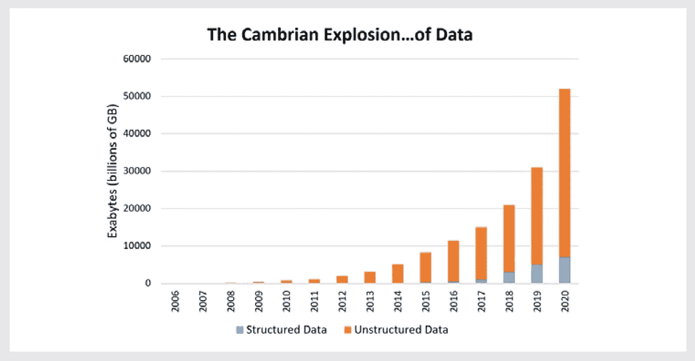

# 分析非表格数据，从 SQL 过渡到 NoSQL

> 原文：<https://medium.com/analytics-vidhya/sql-to-nosql-4dd15ab121b0?source=collection_archive---------0----------------------->

## 开始在 MongoDB 上编写查询，只知道 SQL


*Image via[*]T2*https://www . holistics . io**]*

几乎每个数据科学发烧友都听说过[DJ Patil 博士](https://obamawhitehouse.archives.gov/blog/2015/02/18/white-house-names-dr-dj-patil-first-us-chief-data-scientist)。他是美国白宫前首席数据科学家；像任何其他职业一样，我也很兴奋知道&跟随他的工作。去年我有机会在现场见到他，这让我对数据科学应用的思考有了一个新的视角。更令人兴奋的是，帕蒂尔博士[强调了](https://www.youtube.com/watch?v=9UNVZXNdvXE)技术创新&数据科学如何帮助制造颠覆&提升全球医疗保健水平。

医疗保健就是这样一个领域，整个行业都可以从电子病历的使用中受益，从而提高医疗保健的质量，同时降低成本。该行业面临的主要挑战之一是各种来源的数据不标准化，这使得医疗系统之间的[互操作性](https://www.forbes.com/sites/forbestechcouncil/2018/05/31/the-state-of-interoperability-in-healthcare/)本身就是一项艰巨的任务。随着技术的进步每天都在发生，我强烈地感到这个领域是可以解决的。接下来的帖子是我在这方面的小小努力。它涵盖了一些在解决用例时会派上用场的技能/技术知识。

# 我们从哪里开始？

*非结构化数据*

数据大致可以分为两类，即结构化数据和非结构化数据。非结构化数据的一个非常幼稚的定义是任何不能放入传统的行-列或表格数据库的数据。非结构化数据的常见示例有基于文本或文档的数据、网络或图形数据、图像数据、视频数据、音频数据、基于网络的日志、传感器数据等。

事实证明，在过去的几年里，数据量一直以指数级的速度增长。截至 2018 年，每天生成的数据量是数据库云服务器(100 万兆兆字节)的倍数。这一指数级增长主要归功于全球互联网用户和物联网设备的增加。有趣的是，这一数据量的激增主要是非结构化数据造成的，根据专家的说法，这超过了生成的整个数据的 80–85%。

*这种引入的想法是医疗保健数据的主要部分以非结构化格式存储，无论是图像、身体扫描还是患者症状等。*



来源:帕特里克·切斯曼

## ***好了，我明白了，非结构化数据已经够大了，但是接下来呢？***

*半结构化数据来拯救我们*

随着如此多的发展，第三类数据也在不断发展。这种新类型被称为半结构化数据。为了理解这意味着什么，钻研一下历史是很重要的。根据 Gartner & PwC 的独立研究，据说尽管数据量有了巨大的增长，但业务/企业仍然无法利用存储的全部数据并从中产生价值。这本身可能听起来非常反直觉，但同样的主要原因是难以从可用的数据集利用价值。

这让我们明白，尽管非结构化数据有着非常光明的未来，并且可能使用数据科学技术创造巨大的价值，但将数据转化为见解的过程需要简化。这是半结构化数据的核心，其中非结构化数据被转换，因此数据访问和分析变得不那么麻烦。半结构化数据的常见例子是基于文档的数据(*转换为键值对象*)或图像数据(*转换为向量*)或像 XML 或 JSON 这样的数据格式，它们构成了当今大多数基于 web 的应用程序的基础。


图片来自[[https://memegenerator.net/](https://memegenerator.net/)

*我们将介绍如何分析 MongoDB 上以 JSON 格式存储的数据。*

# **MongoDB 简介**

MongoDB 是技术领域中可用的开源文档数据库之一，也就是说它不是唯一可用的数据库。MongoDB 中的每条记录都是一个文档。文档类似于数据记录，而集合类似于 RDBMS 中的表。MongoDB 上加载的数据通常是 JSON/BSON 格式，用简单的语言来说就是 CSV/SQL 数据转储的非关系版本。

要快速浏览 MongoDB 和文档数据库，请参考[这个](https://slideplayer.com/slide/9859102/)资源。该数据集是来自 [FDA](https://open.fda.gov/tools/downloads/) 的药物数据的开源版本。一个更小的版本是 JSON(*Java Script Object Notation*)格式[这里](https://github.com/navneetgupta91/medium/blob/master/sql_to_nosql/FDADrugLabel.json)。


图片 via[[https://pix abay . com/en/pill-capsule-medicine-medical-1884775/](https://pixabay.com/en/pill-capsule-medicine-medical-1884775/)]

*请注意，用 MongoDB 编写的所有查询都没有使用 map reduce 概念，只是 SQL 的 MongoDB 等价物。*

# 编写查询—第 1 部分

在这一节中，我将浏览一些例子，这些例子为 SQL 和 MongoDB 查询提供了一对一的例子(*以同样的顺序*)。第 1 部分只有非聚集查询。

**1。从表/集合中获取所有记录**

```
select * from FDADrugLabel;db.FDADrugLabel.find({});
```

**2。获取表格/集合中记录/文档的数量**

```
select count(*) from FDADrugLabel;db.FDADrugLabel.find({})
    .count();
```

**3。从表/集合中获取前“n”条记录**

```
select * from FDADrugLabel
limit 10;db.FDADrugLabel.find({})
    .limit(10);
```

**4。使用一列/字段排序获取样本数据**

```
select * from FDADrugLabel
order by effective_time desc
limit 10;db.FDADrugLabel.find({})
    .sort({'effective_time':-1})
    .limit(10);
```

**5。用单个过滤器或 where 条件获取样本数据**

```
select * from FDADrugLabel
where openfda_product_type = 'HUMAN OTC DRUG'
limit 10;db.FDADrugLabel.find({
     'openfda.product_type' : 'HUMAN OTC DRUG'
}).limit(10);
```

*上述查询中类似‘A . b’的格式意味着‘b’是字典中的嵌套字段或键，或者是‘A’中的对象。这里的“openfda”是一个键，其值是一个字典列表，而“product_type”是“openfda”中字典的键之一*

**6。获取具有多个过滤条件的样本数据**

```
select * from FDADrugLabel
where openfda_product_type != 'HUMAN OTC DRUG'
and openfda_route in ('ORAL', 'TOPICAL')
limit 10;db.FDADrugLabel.find({
   $and : [ 
           {'openfda.product_type' : {$ne : 'HUMAN OTC DRUG' } },
           {'openfda.route' : {$in : {'ORAL', 'TOPICAL'} } }
         ]
}).limit(10);
```

7。从表/集合中获取选择的列/字段

```
select 
    active_ingredient, inactive_ingredient, effective_time
from FDADrugLabel
where product_type = 'HUMAN OTC DRUG'
limit 10;db.FDADrugLabel.find({
    'product_type' : 'HUMAN OTC DRUG'
},{
    'active_ingredient':1, 
    'inactive_ingredient':1,
    'effective_time':1
}).limit(10);
```

8。使用' null '获取带有过滤条件的样本数据

```
select *
from FDADrugLabel
where openfda_drug_interactions is not null
limit 10;db.FDADrugLabel.find({
  $and : [    
          {'openfda.drug_interactions' : {$exists : true} },
          {'openfda.drug_interactions' : {$ne : ""} }
        ]
}).limit(10);
```

9。使用通配符获取带有过滤条件的样本数据

```
select *
from FDADrugLabel
where openfda_manufacturer_name like '%Johnson%'
limit 10;db.FDADrugLabel.find({
  'openfda.manufacturer_name' : '/Johnson/'
}).limit(10);
**OR**
db.FDADrugLabel.find({
  'openfda.manufacturer_name' : { $regex : '/Johnson/'}
}).limit(10);
```

10。同时使用'与'&或'得到多个过滤条件的样本数据

```
select 
  openfda_brand_name, 
  openfda_generic_name, 
  openfda_product_type,
  openfda_route,
  openfda_manufacturer_name
from FDADrugLabel
where openfda_product_type = 'HUMAN OTC DRUG'
and (openfda_route = 'TOPICAL' 
      or openfda_manufacturer_name like '%Johnson%')
limit 10;db.FDADrugLabel.find({
  $and : [ 
          {'openfda.product_type' : 'HUMAN OTC DRUG'},
          { $or : [
                   { 'openfda.route' : 'TOPICAL' },
                   { 'openfda.manufacturer_name' : '/Johnson/' } ]
]},{
    'openfda.brand_name':1,
    'openfda.generic_name':1,
    'openfda.product_type':1,
    'openfda.route':1,
    'openfda.manufacturer_name':1
}).limit(10);
```

# 编写查询—第 2 部分

在这一节中，我们将更进一步，尝试在 SQL 和 MongoDB 上进行聚合查询(*以同样的顺序*)。

**1。对表/集合中的一列/字段进行计数聚合查询**

```
select 
  effective_time,
  count(*)
from FDADrugLabel
where effective_time is not null
group by effective_time
;db.FDADrugLabel.aggregate([
  {$match : 
       {$and :[ { 'effective_time' : {$exists:true} },
               { 'effective_time': "" }]
}},
  {"group":
       {_id:"$effective_time",
             count:{$sum:1}}
});
```

*在上面的查询中，‘_ id’就像是对数据进行分组的字段的别名，我们可以选择使用任何别名*

**2。对表/集合中的多个列/字段进行计数聚合查询**

```
select
  version as data_version,
  effective_time,
  count(*)
from FDADrugLabel
where effective_time is not null
and version is not null
group by version, effective_time
order by count(*) desc;db.FDADrugLabel.aggregate([
  {$match : 
       {$and :[ { 'version' : {$exists:true} },
                { 'version': "" },
                { 'effective_time' : {$exists:true} },
                { 'effective_time': "" }]
}},
  {"group":
       {_id: { data_version : '$version',
               effective_time : "$effective_time" },
               count : { $sum : 1 } } }
  {$sort : {"count" : -1 } }
]);
```

**3。表/集合中聚合值的过滤条件**

```
select
  version as data_version,
  count(*)
from FDADrugLabel
where effective_time is not null
and version is not null
group by version
having count(*) > 5;db.FDADrugLabel.aggregate([
  {$match : 
       {$and :[ { 'version' : {$exists:true} },
                { 'version': "" }]
}},
  {"group":
       {_id: { data_version : '$version'
               count : { $sum : 1 } } }
  {$match :
          { { count: { $gt : 5} } }
]);
```

**4。文档中具有嵌套字典/对象的聚合查询**

这有点棘手，因为我们需要对嵌套在数组中的东西进行计数。这里使用的方法是首先展开或反规范化数据，然后计算记录的数量。这个不断展开或取消字典嵌套的过程利用了管道。同样也可以通过 Map-Reduce 来实现。

```
select
  openfda_manufacturer_name as manufacturer_name,
  openfda_product_type as product_type,
  openfda_route as route,
count(openfda_unii)
from FDADrugLabel
where openfda_manufacturer_name is not null
and openfda_product_type is not null
and openfda_route is not null
group by openfda_manufacturer_name, openfda_product_type, openfda_route
having count(*)>2;db.FDADrugLabel.aggregate([
  {$match : 
       {$and :[ { 'openfda.manufacturer_name' : {$exists:true} },
                { 'openfda.manufacturer_name': "" },
                { 'openfda.product_type' : {$exists:true} },
                { 'openfda.product_type': "" },
                { 'openfda.route' : {$exists:true} },
                { 'openfda.route': "" }]
}},
  {$project : {
            "manufacturer_name" : "$openfda.manufacturer_name",
            "product_type" : "$openfda.product_type",
            "route" : "$openfda.route",
            "unii" : "$openfda.unii" 
}},
  {$unwind : {
            path : "$unii"
}},
  {"group":
       {_id: { manufacturer_name : '$manufacturer_name',
               product_type : "$product_type"
               route : "$route" },
               count : { $sum : 1 } 
}},
  {$match :
          { { count: { $gt : 2} } }
]);
```

MongoDB 中分析数据的范围并没有到此为止。随着 MongoDB 新版本的发布，社区推出了许多特性和功能。它现在支持一系列功能，比如放置连接、编写子查询、使用变量、类型转换数据等。

*对于对这个话题感兴趣的读者来说，我会推荐阅读 MongoDB 的官方* [*文档*](https://docs.mongodb.com/manual/reference/sql-comparison/) *。*

如果你已经阅读了这篇文章，我会非常感激。如果你发现它对你自己、同事或朋友有用，请随意分享，为让世界卫生保健变得更好做出贡献，并鼓掌支持👏。我也很想听到对这篇文章的反馈😃。

*PS:任何想联系的人都可以通过*[*LinkedIn*](https://www.linkedin.com/in/navneetguptapec/)*联系。*