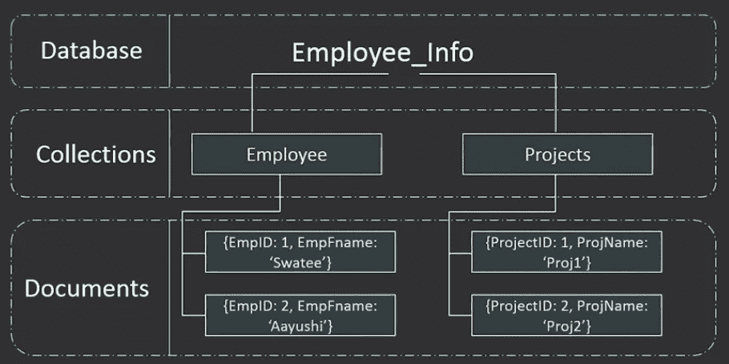
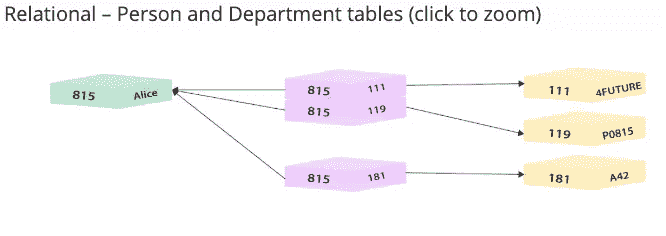
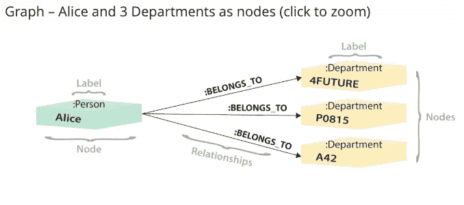
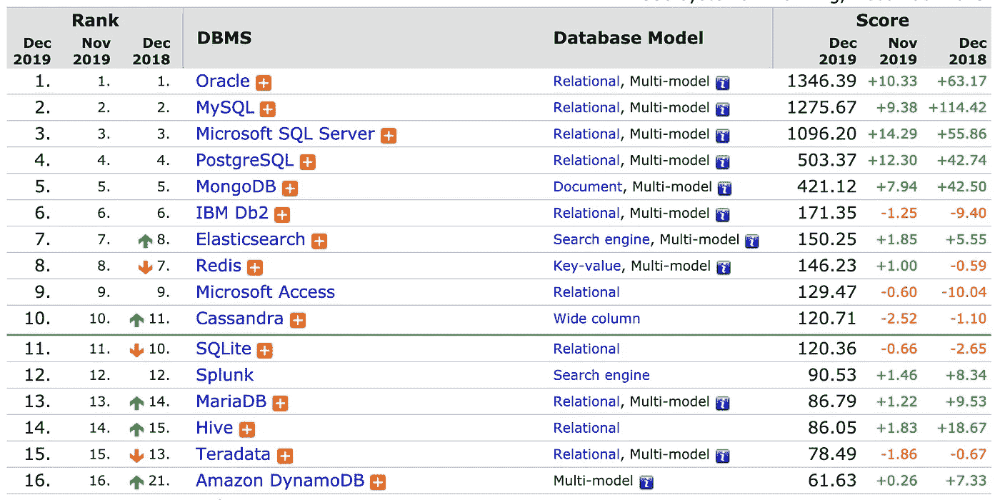

# SQL 与 NoSQL

> 原文：<https://medium.com/analytics-vidhya/sql-vs-nosql-3c948a459335?source=collection_archive---------9----------------------->

## 关系数据库与非关系数据库

SQL 数据库是关系型的。它们被分成一组行和列来存储表中的数据。每一行都有一个唯一的 ID，每条记录的每个属性通常都有一个值。模式是固定的和预定义的。

另一方面，NoSQL 数据库是非关系的和面向文档的，它们不需要任何稳定的结构，并且被设计成像 JSON 一样的文档来存储和查询数据。它们更容易使用，因为它们允许您在代码中使用相同的对象。



## 种类

SQL 数据库总是以表格为基础，包含行和列。

NoSQL 数据库:

*   文档数据库——每个键都有一个称为文档的复杂数据结构。许多不同的键值对。
*   键值存储-NoSQL 数据库的最简单形式。每一项都存储为带有键和值的属性名。



*   图形存储——图形数据库实际上非常类似于关系数据库中的关系。它们连接两个数据点。主要区别在于不需要模式。在关系数据库中，关系的性质存储在表定义(连接表)中，而在图形数据库中，它们存储在单个文档中。图形数据库更大，因为每个单独的记录需要存储它拥有的每个关系。它们通常在每个记录的关系有很多变化时使用。
*   宽列存储——宽列存储用在分布式数据库系统中，在这种系统中，内容非常多，需要分布在多台计算机上。

灵活性是 NoSQL 数据库的一大优势。在 SQL 数据库中，由于模式是固定的，要合并另一个属性(如图书数据库的作者),您需要创建一个表，其中包含作者的姓名和 author_id，还需要在图书表中包含一个 author 列，其中包含 author_id。在 NoSQL 数据库中，所有这些属性都将作为属性存储在单个文档中。如果您的 book 文档没有 rating 属性，您可以简单地添加它，而不必更改模式的其余部分以将它包含在所有其他文档中，然后重新启动数据库。

```
[
  {
    "year": 1988,
    "title": "Green Eggs and Ham",
    "info": {
      "author": "Dr. Seuss",
      "rating": 4.30,
      "genres": ["Childrens", "Classics", "Fiction"]
    }
  },
  {
    "year": 1961,
    "title": "Go Dog Go",
    "info": {
      "author": "Dr. Seuss"
    }
  }
]
```

## 用例



关系数据库是垂直扩展的，这意味着随着数据库的增长，创建更多的关系并变得更加复杂，您将需要更好的硬件来跟上。另一方面，非关系数据库是水平扩展的，这意味着随着数据库变大，您可以将文档分布在其他服务器上。像亚马逊这样的公司使用非关系型数据库，因为它更有效，成本更低。

来源:

[](https://aws.amazon.com/nosql/) [## 什么是 NoSQL？|非关系数据库，灵活的模式数据模型| AWS

### 具有灵活数据模型的高性能、非关系数据库 NoSQL 数据库是专为特定数据构建的…

aws.amazon.com](https://aws.amazon.com/nosql/)