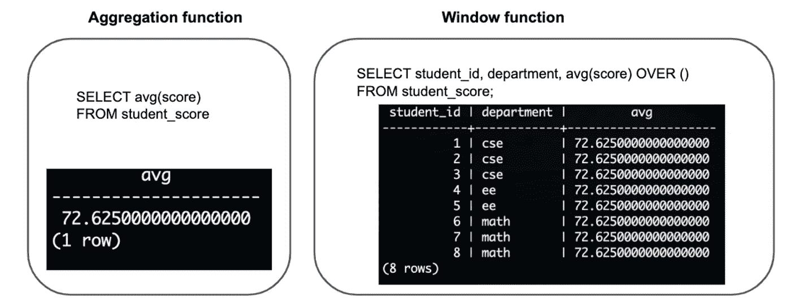
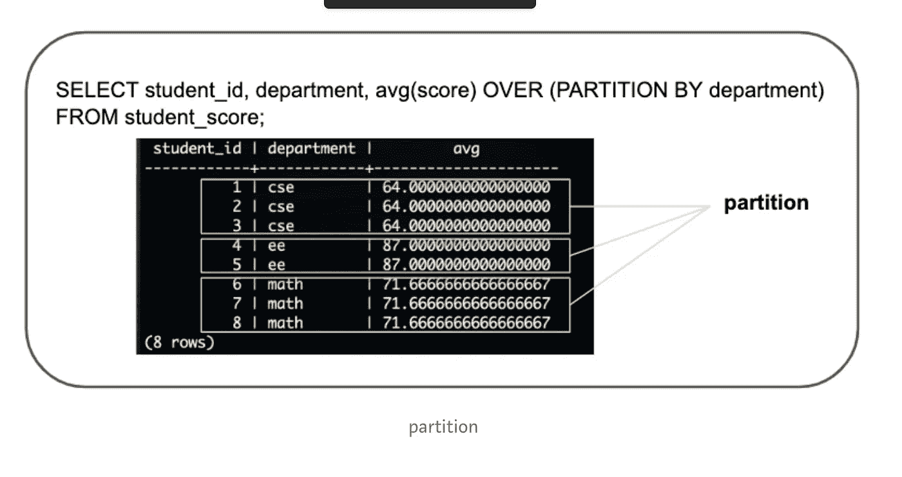
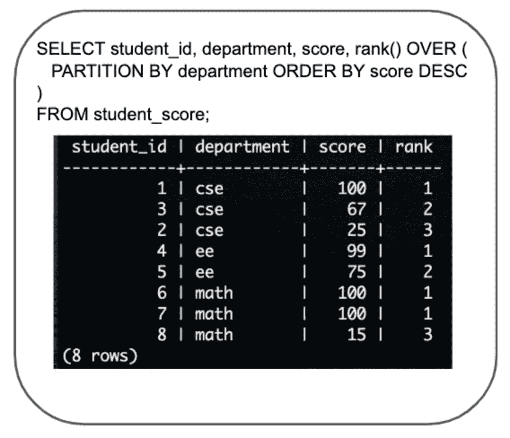
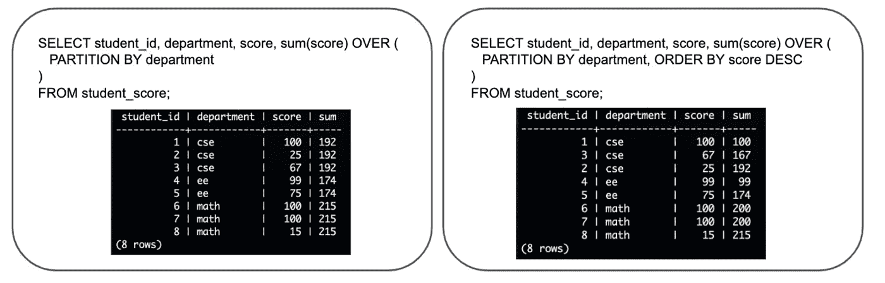
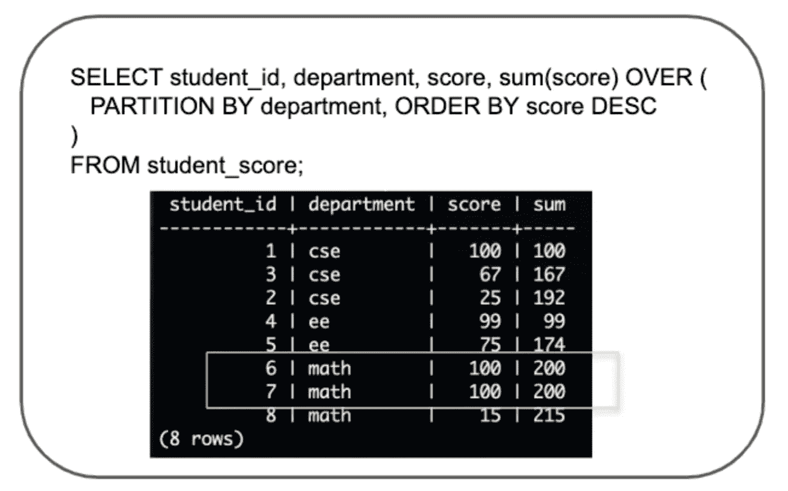
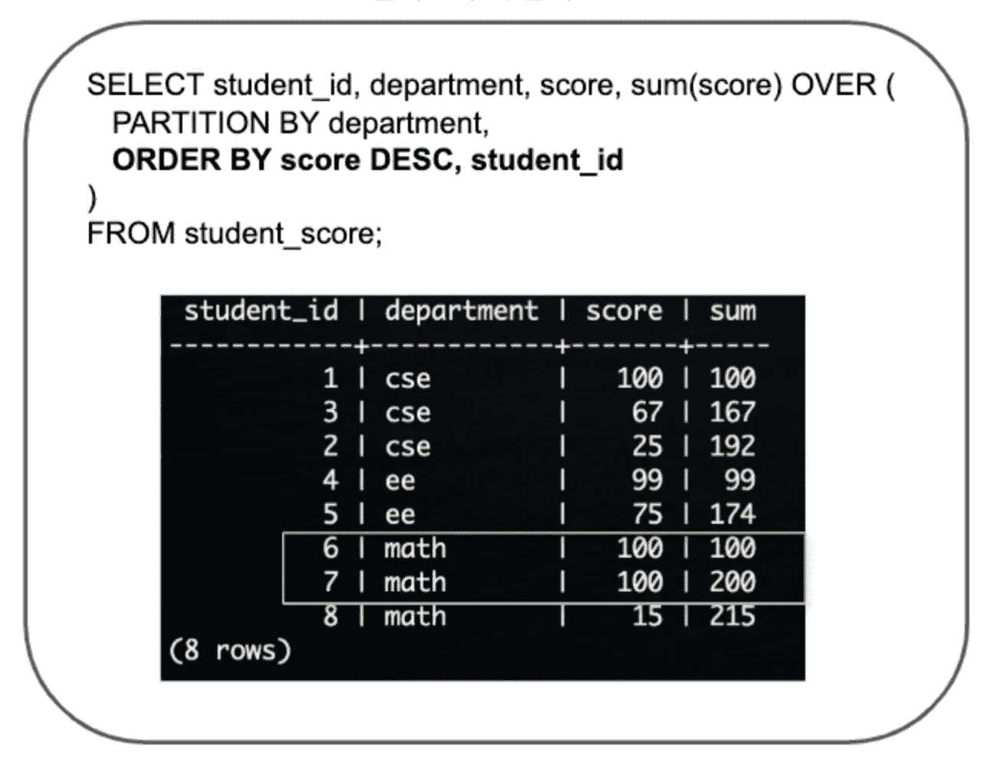
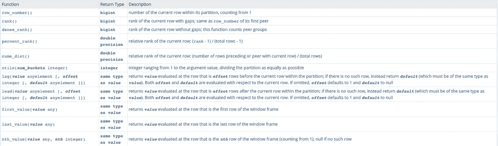

# SQL 窗口函数—冒险就在你的窗口之外

> 原文：<https://medium.com/analytics-vidhya/sql-window-functions-adventure-is-just-outside-your-window-f59edbd41850?source=collection_archive---------15----------------------->


我最近了解了一些我在编写查询的过程中没有很好使用的 SQL 语句。我想介绍一下 SQL 的窗口功能。最初窗口功能看起来很可怕，但是一旦你习惯了，它也是一个很大的帮助和时间节省者！！

# 什么是窗口功能？

窗口函数是具有一组特定行的函数。不要从第一行开始就害怕，前面有很多东西可以帮助你从这个窗口逃出去！！！

这感觉上和传统的聚合函数没什么区别，但是两者之间有很大的区别。

> **聚合函数将一组行的计算结果缩短为一个结果**，但 window 函数不会。它保持**计算结果中现有的行数。**

让我们用几个例子来看看这一点。有一个八行的表格，存储学生的考试成绩。

## 学生分数表



在上面的例子中，我们可以看到使用窗口函数的格式。以 OVER (…某物…)的形式，总是涉及 OVER 从句。

```
If you average the test score as an aggregate function, the result is one row, but if you use the window function, the result is eight rows.
```

> 示例 1 —分区依据

```
Just as you can use group by in an aggregate function, you can use PARTITION BY in a window function to specify the rows in a single partition ( or in other words the partition of rows over which you want to apply the function ) . If there is no partition by clause, the partition is an entire row of the table (as in above example) .
```



请注意使用部门作为分区如何只对该部门应用平均函数。还要注意，表中的所有 8 行都存在，这与按部门进行的常规聚合不同，常规聚合会折叠行。

> 示例 2 —排序依据

```
If the order must be given, the ORDER BY clause can be used.
```



请注意如何部门明智的排名是如此容易使用窗口功能。试着不使用窗口函数写同样的东西。还要注意，所有 8 行都是完整的。

在上述示例中，只有 FROM 子句出现在 SELECT 之后，但是如果在 WHERE、GROUP BY 和 HAVING 子句之后出现，则 window 函数将应用于通过 WHERE、GROUP BY 和 HAVING 对 FROM 子句中的表(子查询)进行筛选的结果。

在 PostgreSQL 文档中，窗口函数介绍如下:

> 窗口函数对一组与当前行有某种关系的表行执行计算。

注意“以某种方式与当前行相关”在句子的后面。

在窗口函数中，情况并非总是如此，但有时计算是基于当前行的。与此相关的概念是窗口框架。窗口框架是从分区的第一行到当前行的范围。窗口框架也是窗口函数中“窗口”的意思。

与没有 ORDER BY 时不同，ORDER BY 给出行的处理顺序时，当前行的概念是根据顺序创建的。当您有一个 ORDER BY 子句时，您可以看到累积和是基于从每个分区的第一行到当前行的窗口框架计算的。



与没有 ORDER BY 时不同，ORDER BY 给出行的处理顺序时，当前行的概念是根据顺序创建的。当您有一个 ORDER BY 子句时，您可以看到累积和是基于从每个分区的第一行到当前行的窗口框架计算的。
这里需要注意的另一点是，具有相同顺序的行被视为相同的对等行，从而导致相同的计算。如果你看看第六行和第七行的累积和，你可以看到 200 和 200 是一样的。



对等体具有相同的窗口函数计算结果

因为累积和可能计算不正确，所以可以修改 ORDER BY 子句，以便对每一行进行唯一处理，从而获得正确的累积和。



现在，在 order by 中引入 student_id 会将每一行视为唯一的，因此累积和是正确的。

下表列出了窗口功能。



正如我们已经看到的，当与 OVER 子句一起使用时，现有的聚合函数(如 sum()、agv()、…)也可以用作窗口函数

谢谢你。