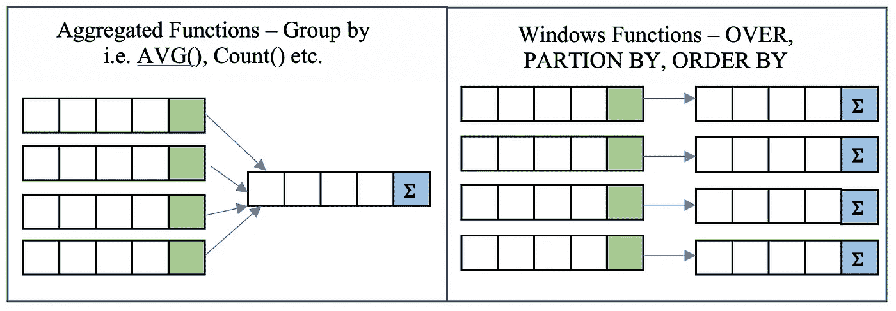
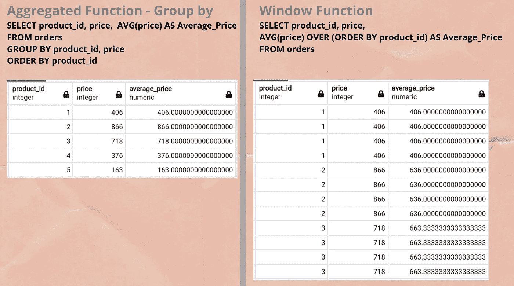
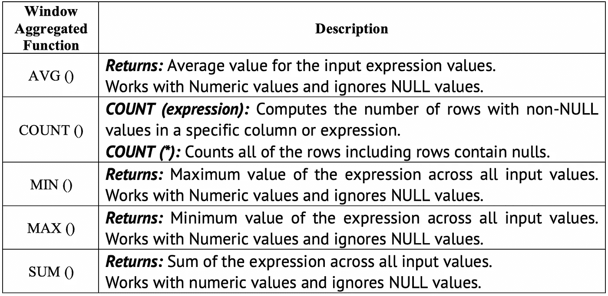
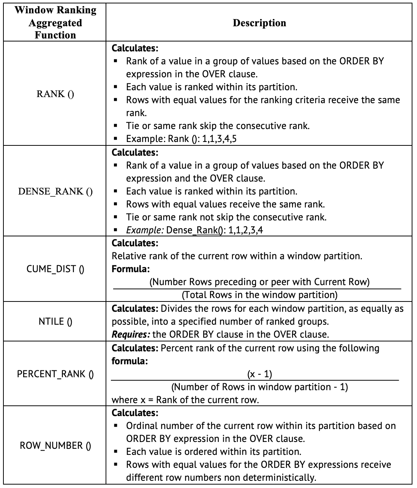
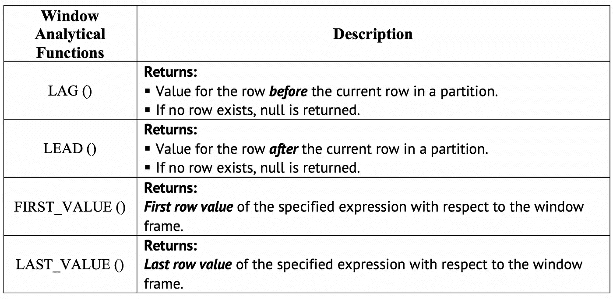
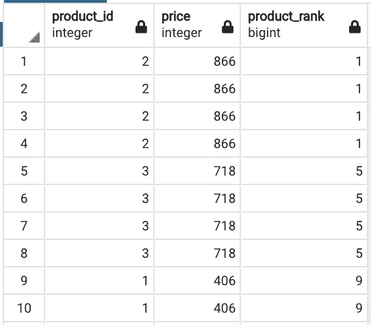
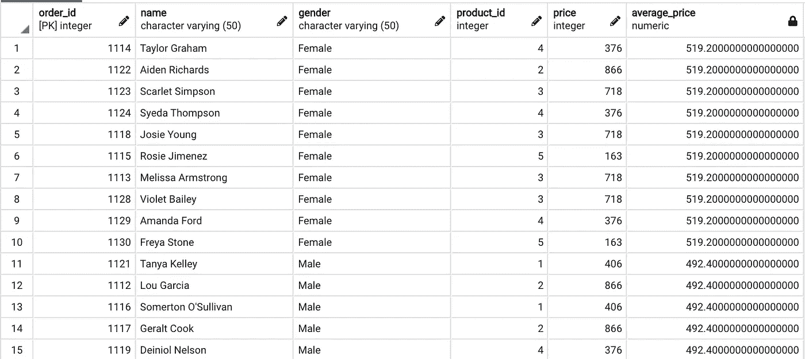
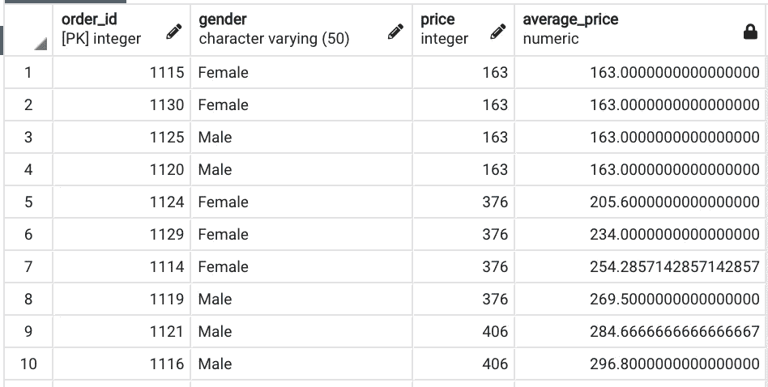
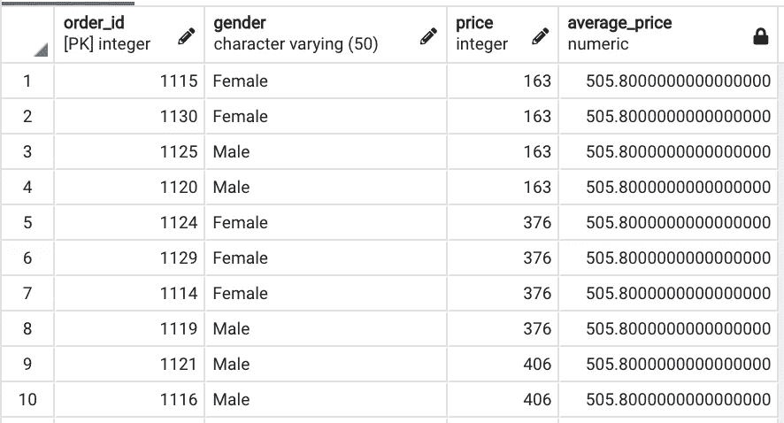
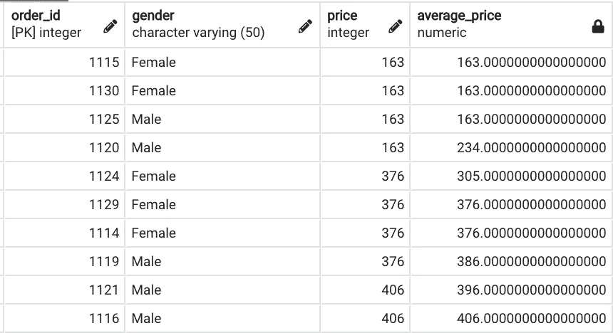

# SQL 窗口函数—第一部分

> 原文：<https://medium.com/analytics-vidhya/sql-windows-function-5dc5cbdb1aa?source=collection_archive---------7----------------------->

## SQL 中窗口函数的类型介绍和概述。



图片由作者提供，灵感来自[Toptal.com](https://www.toptal.com/sql/intro-to-sql-windows-functions)

**简介:**

窗口函数跨一组与当前行有某种关系的表行执行数据分析计算。地址可比较类型的计算可以用一个聚合函数来完成，该函数给出一行或按条件分组(参见图 1)。

Window 函数不会导致行组合成一个输出行。保留其单独标识的行也能够访问查询结果的当前行以外的内容。(参见图 1)



图 1 —聚合函数和窗口函数的区别

*用于解释以下概念的数据库:Postgres 数据库和数据集:可从*[*Github Order _ table . CSV*](https://github.com/GDhasade/Medium.com_Contents/tree/master/SQL)获得

**窗口函数语法:**

```
Window_Function([All] expression) 
OVER( [PARTITION BY expression_list] [ORDER BY order_list Row_or_ Range clause] )
```

语法的每个部分解释如下:

**窗口 _ 功能:**

window _ functions 有 3 种主要类型

1.  **窗口聚合函数:**包含一个支持聚合函数，即 AVG()、计数()、最小值()、最大值()、总和()。



窗口聚合函数

**2。窗口排名聚合函数:**包含一个支持排名的函数，即 RANK()、DENSE_RANK()、ROW_NUMBER()。



**窗口排名聚合函数**

**3。窗口分析函数:**由支持排名函数之一组成，即 FIRST_VALUE()、LAST_VALUE()、NTH_VALUE()。



**窗口分析功能**

**Over()子句:**

Over()子句用于为函数(即 avg、count 等)定义行(即窗口)的分区和排序。)做手术。因此，称为窗口功能。

Over()子句有以下参数:

1.  **Order by:** 定义行的逻辑顺序。

**例如:-** 根据产品价格对产品标识进行排序。

```
**Query:**
Select product_id, price, Rank() OVER (ORDER BY price desc) AS Average_price
From orders;
```



参数-排序依据

**2。Partition by:-** 将查询结果集划分为*个分区*，即分别应用于每个分区的窗口函数。

**例如:-** 按性别计算 Average_Order_Price，即按性别划分。



参数—分区依据

**观察:**

计算 average_price 时考虑了分区列，即性别。因此，对每个性别类别都计算了相同的平均价格。

**3。ROWS or RANGE 子句:**通过指定分区内的起点和终点来限制分区内的行*。Rows 或 Range 子句的默认值是*范围，在无界的前一行和当前行之间**

**行或范围子句的类型:**

***a .无边界的前一行和当前行:***

*   它将从第 1 行到当前行开始考虑聚合函数的行值。
*   **例如:-**

```
**Query:**SELECT order_id, gender, price, 
AVG(price) OVER (ORDER BY price ROWS BETWEEN UNBOUNDED PRECEDING AND CURRENT ROW) AS Average_Price
FROM orders;
```



***前一行和当前行的无界***

*   ***当前行第 7 位*** —平均价格***:***(163+163+163+376+376+376)/7 = 254.2857

***b .无界前与无界后:***

*   无界在前考虑第一行*和无界在后意味着它将考虑计算列的最后一行。*
*   **例如:**

```
**Query:**
SELECT order_id, gender, price, 
AVG(price) OVER (ORDER BY price ROWS BETWEEN UNBOUNDED PRECEDING AND UNBOUNDED FOLLOWING) AS Average_Price
FROM orders;
```



***前无界后无界***

*   我们可以看到，每一列的 average_price 是相同的，因为它考虑了 price 列中的所有值。

**c .其他类型:**

***在*之前的 EN 1 和之后的 1 个之间:**

```
**Query:**
SELECT order_id, gender, price, 
AVG(price) OVER (ORDER BY price ROWS BETWEEN 1 PRECEDING AND 1 FOLLOWING) AS Average_Price
FROM orders;
```



***前一个 EN 1 和后一个***

Average_Price 通过考虑以下因素进行计算:

a.当前行值

b.current_row 值的前一行，即前一行。

c.下一行，即当前行值以下的行。

*   同样，我们可以根据需要改变窗口的范围。

**结论:**

SQL Windows 函数非常强大。在这篇博客中，我试图对 Windows 功能做一个简短的概述。

我希望这个博客对你有所帮助，也希望它能激发你的兴趣，看看 windows 函数能做什么。

我强烈建议阅读参考文献以获得更深入的解释。

**参考资料/学习资料:**

1.  postgresql.org(2019 年)。 *PostgreSQL:文档:9.1:窗口函数*。[在线]Postgresql.org。可用地点:[https://www.postgresql.org/docs/9.1/tutorial-window.html.](https://www.postgresql.org/docs/9.1/tutorial-window.html.)
2.  drill.apache.org(未标出)。 *SQL 窗口函数介绍— Apache Drill* 。[在线]drill.apache.org。可在:[https://drill . Apache . org/docs/SQL-window-functions-introduction/](https://drill.apache.org/docs/sql-window-functions-introduction/)【2020 年 11 月 10 日访问】。