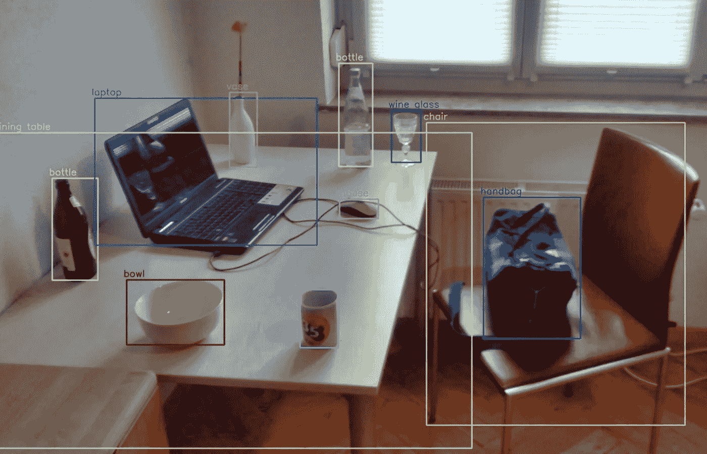
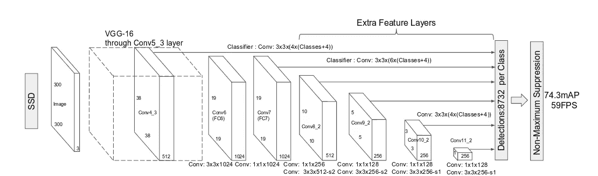
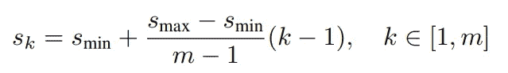
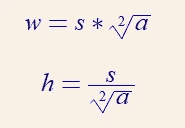
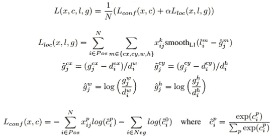
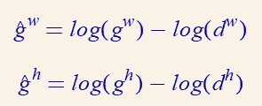

# （同 solid-statedisk）固态（磁）盘

> 原文：<https://medium.com/analytics-vidhya/ssd-fec074ce57c?source=collection_archive---------11----------------------->

## 精确的实时目标检测

来源:[https://en.wikipedia.org/wiki/Object_detection](https://en.wikipedia.org/wiki/Object_detection)作者: [Mtheiler](https://commons.wikimedia.org/wiki/User:MTheiler)

我已经计划阅读主要的物体探测论文(虽然我已经浏览了大部分，现在我将详细阅读它们，好到足以写一篇关于它们的博客)。这些论文与基于深度学习的对象检测相关。随时给建议或询问疑惑会尽我所能帮助大家。任何从这个领域开始的人都可以跳过许多这样的论文。当我看完所有的论文后，我也会写下它们的优先顺序/重要性。
我写这篇博客是考虑到和我相似并且仍在学习的读者。虽然我会通过从各种来源(包括博客、代码和视频)深入理解论文来尽力写出论文的关键，但如果您发现任何错误，请随时在博客上指出或添加评论。我已经提到了我将在博客结尾涉及的论文列表。

我们开始吧:)

SSD 是一种单级对象检测器，它比更快的 RCNN 获得了更好的结果，并且它还可以实时工作。因此 SSD 是现代单级物体探测器的支柱文件之一。

我将博客分为三个部分:

1.  模型
2.  培养
3.  推理

# 模型

SSD 模型可分为 3 个部分，我们将详细讨论每个部分:

1.  基础网络
2.  辅助网络
3.  预测网络

资料来源:SSD 文件

基础网络是具有截断分类层(移除最终全连接层和汇集层)的任何影像分类网络。该基本网络用于从输入图像中提取特征图。该特征图然后通过辅助网络传递。

我们在以前的一些博客中讨论了不同规模的推理(拍摄多种尺寸的图像，并通过网络传递每张图像，图像金字塔)，这有助于检测不同尺寸的对象。我们可以通过创建不同大小的特征地图来实现这样的效果。辅助网络用于实现这一点，它由卷积层组成，卷积层逐渐减小输入特征图(来自基本网络)的大小。卷积层数是一个超参数。尽管所有这些卷积层都是连续的，并且在每一层之后尺寸都减小了，但是中间结果的所有结果都被用于使用每个辅助卷积的预测卷积来产生预测。

**默认框**

SSD 引入了默认盒的概念，这类似于更快的 RCNN 中的锚盒。为每个要素地图像元创建不同比例和纵横比的默认框。比例和长宽比基于我们想要识别的对象的类型。例如，在我们的问题中，只有方形盒子是可能的，我们只需要 1:1 的长宽比。由于 SSD 处理具有多个类的更一般的数据集，总共 5 个纵横比(1，2，3，1/2，1/3)用于创建默认框。

不同的标度用于每个辅助卷积。关于缩放，我们指的是默认框相对于原始图像的大小。这个尺度也是超参数的，应该根据我们使用的数据集进行调整。在 SSD 文件中，该比例计算如下:

规模计算公式，学分:SSD 纸

这里 m 是应用的辅助卷积的总数，k 是我们正在计算的比例。原论文使用的 Smin 和 Smax 分别为 0.2 和 0.9。这里的 0.2 表示每个默认框将是原始图像大小的 0.2 倍。我们可以将默认框的宽度和高度计算公式化为:

宽度和高度计算

这里 s 是比例，a 是长宽比。

默认框的中心计算如下:

(i+0.5)/f，(j+0.5)/f

其中 I，j ϵ [0，f]和 f 是特征图的大小。

因此，对于大小为 4*4 的特征地图，特征地图单元(0，0)上的默认框将在原始图像中的(0.125，0.125)处具有中心。

一个观察结果是，默认框的比例随着每个辅助层而增加，这是直观的，因为对于具有较小特征图的特征图，在原始图像中感受野将更大，因此可以检测到更大的对象。类似地，对于较大尺寸的特征地图，默认框较小，从而使它们更适合较小的对象。

由我们的模型计算的预测不是原始的回归输出，它们是从这些默认框偏移的边界框。因此，基本上我们预测的是最佳默认框的微小变化，这将更好地适应地面真相框。

因此，从大小为(m*n)的每个特征图生成的预测总数是(c+4)*k*m*n。这里 c 是类的数量(我们也将包括背景类), k 是每个特征图单元的默认框的数量(如果我们使用上面定义的 5 个纵横比，k = 5 ),这里的 4 表示预测的 4 个坐标。

# 培养

由于预测的总数与基础事实箱相比非常大，我们需要找到哪个预测与基础事实相匹配。因为我们的预测偏移到默认框，所以我们可以通过找到每个基本事实框和默认框之间的重叠来匹配预测和基本事实，具有最大重叠的默认框将对应于匹配的预测。这种重叠是使用 Jaccard 指数计算的。因此，具有最佳 Jaccard 与地面实况重叠的默认框被认为是匹配的。Jaccard 重叠高于阈值(通常为 0.5)的默认框也被认为是匹配的。这简化了学习问题，允许网络预测多个重叠框的较高分数。

现在我们已经将预测与地面事实相匹配，我们可以定义损失函数。在此之前，我们还有一个技术细节，因为与负面预测相比，正面预测的数量将非常少(例如，SSD 的总预测数为 8732，但真实值的数量将为~10 或 20，可能更多，但仍然显著更低)，因此我们不能包括所有负面预测，因为显著的类别不平衡(所有负面预测都将属于背景类别)。为了减少负样本，我们使用硬负挖掘。硬负面挖掘意味着我们将根据置信度对所有负面预测进行排序，并且只包括前 k 个预测。在原始论文中，阴性样本与阳性样本的比例为 3:1。

# 失败

我们需要损失函数中的位置和分类组件。

来源:[https://junji won 1031 . github . io/2017/09/08/Single-Shot-multi box-detector . html](https://junjiwon1031.github.io/2017/09/08/Single-Shot-Multibox-Detector.html)

上面写的数学比看起来简单，所以不要担心，我们会破译它。

Lconf 表示分类损失，Lloc 表示回归损失。α是一个权重项，在原始论文中设置为 1，但可以调整。n 是阳性样本的总数(如上所述，匹配的默认框)。

**本地化损失:**

SSD 使用中心、宽度和高度作为坐标方案。

由于 SSD 计算从默认框的偏移，地面真实值将是地面真实值和默认框之间的偏移值，而不是中心的实际位置。对于中心坐标，这种偏移计算简单地是地面真实中心和缺省框中心之间的差(参见损失图像中的 g^cx 和 g^cy 术语，d^cx 和 d^cy 表示缺省框的中心位置，它除以缺省框的宽度和高度，以将值归一化在 0 和 1 之间，而不是保持它们的实际大小，因为它可以随着图像大小的变化而变化。).对于宽度和高度的计算，该偏移量是以对数刻度计算的。因此，它将是:

首先，sigma 用于所有阳性样本，第二个 sigma 用于 cx、cy、宽度和高度，因此将运行 4 次。这里使用 j 和 I 是因为基本事实和缺省框的数量不同，因此我们认为第 j 个基本事实将与第 I 个缺省框匹配。可以参考[这里的](https://stats.stackexchange.com/questions/351874/how-to-interpret-smooth-l1-loss)来了解关于平滑 l1 丢失的问题。

这里 x_ij 项只是一个二进制标志，对于正样本为 1，对于负样本为 0，这表明负样本对定位损失的贡献为 0。

**分类损失**

是正常的交叉熵损失。在局部化损失的情况下，没有负面预测的基础事实，因此由于这些样本在局部化损失中没有贡献。但是在分类丢失的情况下，负样本具有基础事实，即背景类别。因此，Lconf 具有两个项，第一项是由于正样本(p 定义了基础真实类的索引),第二项是由于负样本(因此，我们使用 0 代替 p，因为背景类将具有 0 个索引)。)由于我们使用硬负挖掘，负样本的数量将首先被过滤，并且所有负样本将不会对损失函数有贡献。

# 推理

1.  通过网络传递图像，网络将返回 8732 个置信度得分和 8732 个边界框偏移量。
2.  将边界框偏移转换为原始形式，即在默认框中添加这些偏移(与本地化损失中讨论的内容相反)。
3.  应用非最大抑制来抑制大多数预测。

*PS。即使你完全了解 SSD，也请仔细阅读第一份参考资料，我不可能写得如此清楚和详细。这是非常详细的，这就是为什么我没有在开始提到这个环节。*

和平…

# 参考资料:

1.  [https://github . com/sgrvinod/a-py torch-Tutorial-to-Object-Detection](https://github.com/sgrvinod/a-PyTorch-Tutorial-to-Object-Detection)
2.  [https://towards data science . com/non-maximum-suppression-NMS-93ce 178 e 177 c](https://towardsdatascience.com/non-maximum-suppression-nms-93ce178e177c)

# 论文列表:

1.  [OverFeat:使用卷积网络的综合识别、定位和检测](https://arxiv.org/pdf/1312.6229.pdf)。[ [链接到博客](https://towardsdatascience.com/overfeat-review-1312-6229-4fd925f3739f)
2.  [丰富的特征层次，用于精确的对象检测和语义分割(RCNN)。](https://arxiv.org/pdf/1311.2524.pdf) [ [链接到博客](/@sanchittanwar75/rcnn-review-1311-2524-898c3148789a)
3.  [用于视觉识别的深度卷积网络中的空间金字塔池。](https://arxiv.org/pdf/1406.4729.pdf) [ [链接到博客](/@sanchittanwar75/review-spatial-pyramid-pooling-1406-4729-bfc142988dd2)
4.  [快速 R-CNN](https://arxiv.org/pdf/1504.08083.pdf) [ [链接到博客](/@sanchittanwar75/fast-rcnn-1504-08083-d9a968a82a70) ]
5.  [更快的 R-CNN:利用区域提议网络实现实时目标检测。](https://arxiv.org/pdf/1506.01497.pdf) [ [链接到博客](https://towardsdatascience.com/faster-rcnn-1506-01497-5c8991b0b6d3)
6.  [你只看一次:统一的，实时的物体检测。](https://arxiv.org/pdf/1506.02640.pdf) [ [链接到博客](/@sanchittanwar75/yolo-1506-02640-dbe968e87b46) ]
7.  [SSD:单次多盒探测器](https://arxiv.org/pdf/1512.02325.pdf)。←你完成了这篇博客。
8.  [用于目标检测的特征金字塔网络。](https://arxiv.org/pdf/1612.03144.pdf)【博客链接】
9.  [DSSD:解卷积单粒子探测器](https://arxiv.org/pdf/1701.06659.pdf)。[博客链接]
10.  [密集物体检测的失焦(视网膜网)。](https://arxiv.org/pdf/1708.02002.pdf)【博客链接】
11.  [YOLOv3:增量改进](https://arxiv.org/pdf/1804.02767.pdf)。[博客链接]
12.  [狙击手:高效多尺度训练](https://arxiv.org/pdf/1805.09300v3.pdf)。[博客链接]
13.  [用于标记像素和区域的高分辨率表示。](https://arxiv.org/pdf/1904.04514.pdf)【博客链接】
14.  [FCOS:全卷积一级目标检测](https://arxiv.org/pdf/1904.01355v5.pdf)。[博客链接]
15.  [物体为点](https://arxiv.org/pdf/1904.07850.pdf)。[博客链接]
16.  CornerNet-Lite:高效的基于关键点的对象检测。【博客链接】
17.  [CenterNet:用于对象检测的关键点三元组](https://arxiv.org/pdf/1904.08189v3.pdf)。[博客链接]
18.  [CBNet:一种用于目标检测的新型复合主干网络体系结构。](https://arxiv.org/pdf/1909.03625v1.pdf)【博客链接】
19.  EfficientDet:可扩展且高效的对象检测。[博客链接]
20.  [YOLOv4:物体检测的最佳速度和精度](https://arxiv.org/abs/2004.10934)。[博客链接]