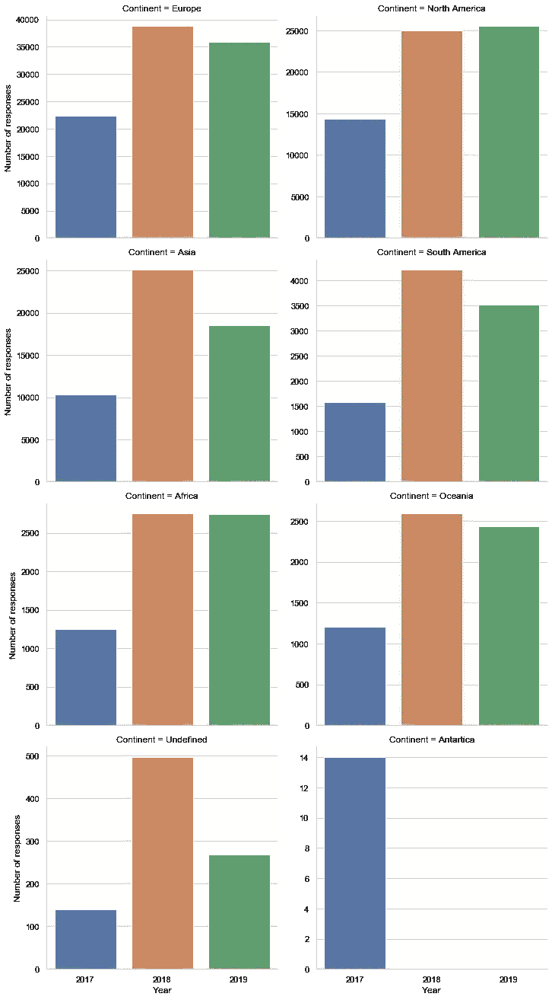
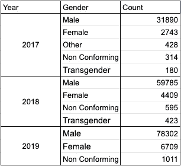
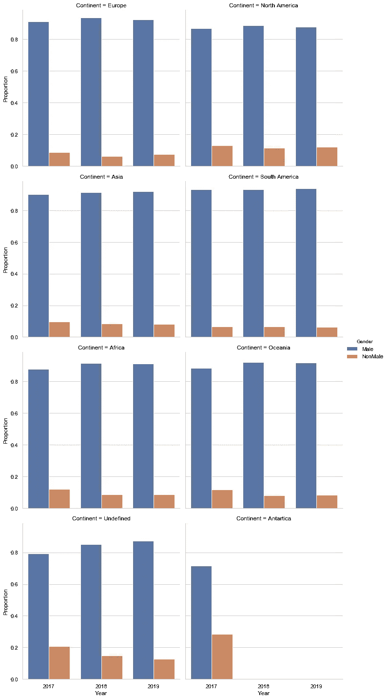
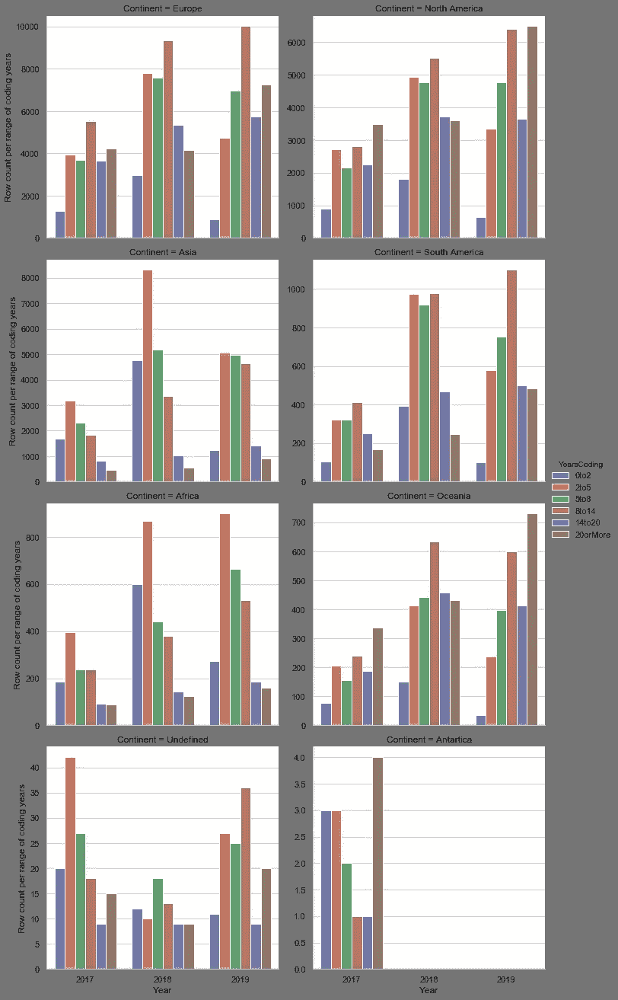
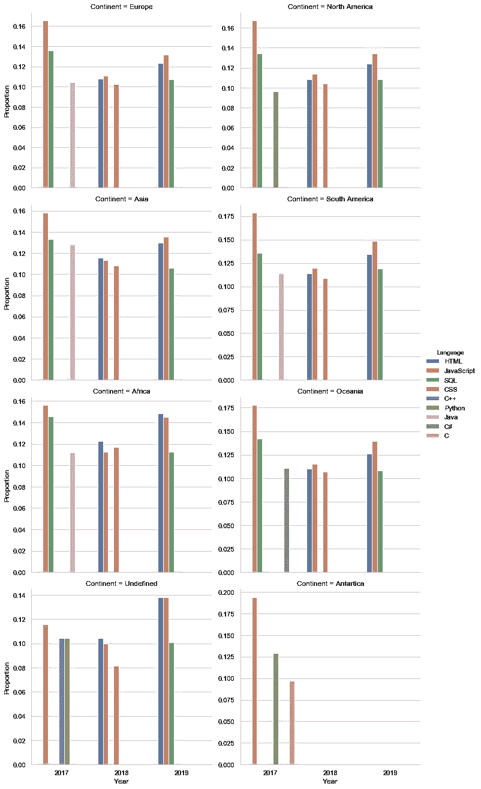

# 堆栈溢出:全球视角

> 原文：<https://medium.com/analytics-vidhya/stack-overflow-a-global-perspective-4645871c05ea?source=collection_archive---------22----------------------->

## 对 2017 年至 2019 年官方 Stack Overflow 年度调查数据的高级分析

来源:https://pixabay.com/images/id-3699552/

# 介绍

[Stack Overflow](http://stackoverflow.com/) 可能是当今世界上最大、最值得信赖的专业开发人员在线社区。我自己也是一名软件工程师，我想不出最近一周我没有检查过一次，以找到我所面临的问题的答案。

自 2011 年以来，Stack Overflow 一直在进行一项[年度开发者](https://insights.stackoverflow.com/survey/)调查，考察开发者体验的各个方面，从职业满意度和求职到教育和对开源软件的看法。

他们已经对这些答复进行了深入分析。我检查了 2019 年的[分析](https://insights.stackoverflow.com/survey/2019)，我认为它真的很好，但我希望看到的一件事是更多的大陆层面的分析。此外，我不知道这些结果与前几年相比如何。

这促使我自己进行了一项分析，我缩小到各大洲的水平，查看过去 3 年的回复。从那时起，我开始关注以下问题:

1.  收到了多少回复？
2.  性别分布如何？
3.  编码年份分布如何？
4.  最流行的编程语言是什么？

我的目标是从我个人认为相关的某些方面来看，了解世界各地的反应有多不同(或一致)。此外，通过回顾过去几年，我们可以潜在地了解该领域的一些趋势。

# 1.收到了多少回复？

这项分析涵盖了 2017 年、2018 年和 2019 年年度调查中收到的所有 239，130 份答复。回答来自 218 个国家和地区，每年有 80 多个问题被提出。

下表显示了各大洲每年的回复数量:

图一。各大洲每年的回复数量

*   大多数回复来自北美、欧洲和亚洲。调查发现，来自其他大陆的回应有所增加，但还不足以构成竞争。
*   *从 2017 年到 2018 年，各大洲的回复数量都有显著增加，但看起来这种情况在 2018 年到 2019 年并没有重现。*
*   我惊讶地发现，欧洲仍然是大部分回复的来源。亚洲在 2019 年观察到的数量较少，这不是我所预期的。堆栈溢出可能面临到达该区域的基本技术挑战。
*   *一些用户选择不指定居住国家，在某些情况下，数据集中没有答案。这些在图表中被分类为* `*Undefined*` *。*
*   *只有 2017 年观察到来自南极洲的反应。它们可能是用户的错误，并且可能在接下来的几年里从可能的国家中删除了该选项。*

# 2.性别分布如何？

我知道科技行业目前面临着巨大的性别差距，这促使我关注世界各地的性别分布。希望是我们已经观察到了一些朝向多样性的进步。

在按大洲划分之前，让我们先来看看按年份划分的性别分类:

表 1。每年每个性别群体的答复数量

不出所料，男性是目前占主导地位的群体。此外，只有`Female`、`Male`和`Non Conforming`跨年度存在。 [2019 人口统计分析](https://insights.stackoverflow.com/survey/2019#demographics)提到，跨性别身份与性别身份问题是分开的。 [2018 人口统计分析](https://insights.stackoverflow.com/survey/2018#demographics)没有提到`Other`发生了什么，所以不确定为什么决定可以移除。我无法判断这是否是正确的方法，但它解释了上面观察到的情况。

以下是各大洲男性与非男性性别群体比例的可视化图:

图二。男性与非男性群体的性别比例

*   *通过目测，人们可以很容易地告诉被调查者，确定为* `*Male*` *的群体是迄今为止最大的群体。去年，在各大洲，他们平均约占各自受访人口的 90.9%。不仅如此，进一步的目测和 2.4%的标准差似乎表明，世界各地的现实并没有太大变化。*
*   `*Female*` *紧随其后，是第二大群体，但以大约 8%的平均比例落后。2.1%的标准差似乎表明世界各地的现实并没有太大变化。*
*   *当将非男性的回答组合成一组时，人们很容易注意到他们在过去的 3 年里并没有增长多少。事实上，看起来这个群体在某些地区正在变小！有可能这项调查根本无法触及这些人群。*

# 3.编码年份分布如何？

当被问及他们从事编码工作的总年限时，受访者提供了各种范围。我收集了这些答案，创建了 6 组年份范围，并以此生成了以下计数细目:

图 3。编码年份范围的分布

对我来说最突出的一点是，分布有时似乎是钟形的(2018 年欧洲)，但其他时间是向左倾斜的(2019 年北美)或向右倾斜的(2018 年亚洲)。随着时间的推移，我预计会发现分布向右倾斜成为主导模式，这表明全球范围内有更多的人进入该领域，但仔细想想，这可能是有道理的。我读到过亚洲[和非洲](https://www.sc.com/en/trade-beyond-borders/emerging-asia-is-the-present-and-future-for-growth/)[是如何见证世界上一些最快的经济增长的，所以这可能反映了这一点。尽管如此，应注意不要对潜在的人口分布下太多结论，因为调查范围目前似乎偏向西方国家，欧洲和北美的主要样本量表明了这一点。](https://www.africa-business.com/features/africa-emerging-business.html)

# 4.最受欢迎的语言是什么？

作为一名软件工程师，跟上最新发展是我工作的一部分，这包括跟踪编程语言的使用趋势。根据调查，我很想知道世界上最受欢迎的语言是什么。

在 3 年的时间里，总共指定了 44 种不同的编程、脚本和标记语言。在这些语言中，您可以观察到每年各大洲排名前三的语言:

图 4。各大洲每年排名前三的编程语言

从调查的角度来看，看起来 Web 在过去 3 年中一直占据主导地位！`Javascript`是前端开发人员使用的主要语言之一，在过去的 3 年里，它在各大洲都占据了前 3 名。`HTML`和`CSS`也非常受欢迎，它们是 Web 开发工具包的一部分。`SQL`是后端 Web 开发人员经常使用的语言，因此也可能是 Web 受欢迎程度的一个标志。只有在 2017 年期间，我们才能观察到其他通用编程语言，如`Java`、`C++`、`Python`。

# 结论

我开始这一分析，希望从一个大陆的角度来看这些反应，发现高度的多样性，但我发现它们的相似之处多于不同之处:

*   *查看过去 3 年各大洲的回复数量，我发现大多数回复来自北美、欧洲和亚洲。但各大洲都观察到了类似的趋势:从 2017 年到 2018 年，回应有所增加，但从 2018 年到 2019 年，回应要么基本保持不变，要么有所下降。世界上一些地方很难完成 2019 年的调查，这可能是部分原因。*
*   在检查性别反应的分布时，我发现男性是目前世界上最大的群体，而且这种支配的程度似乎在世界各地都很相似，在过去的三年里没有太大的变化。当把非男性的回答组合成一组时，人们很容易注意到他们没有增长多少。事实上，看起来这个群体在某些地方变得越来越小了！
*   *另一方面，编码年份范围的分布提供了我在分析中观察到的最多样化的结果。分布有时呈钟形(2018 年欧洲)，但有时向左倾斜(2019 年北美)，有时向右倾斜(2018 年亚洲)。*
*   *最后，我发现世界上一些最流行的编程语言都是用于 Web 开发的:* `*Javascript*` *、* `*HTML/CSS*` *、* `*SQL*` *。只有在 2017 年期间，我们才能观察到其他通用编程语言，如顶部的*`*Java*`*`*C++*`*`*Python*`*。***

**如果你想深入了解这个分析的细节，可以在这里查看 Github 项目的链接。**