# 堆栈溢出问题标签

> 原文：<https://medium.com/analytics-vidhya/stack-overflow-question-tagger-96a045c1ca4c?source=collection_archive---------21----------------------->


## 背景

如果我断言每个开发人员/工程师/学生在他们的旅程中都不止一次地使用过网站堆栈溢出，我不会说谎。被广泛认为是开发者学习和分享知识的最大和最值得信赖的网站之一，该网站目前拥有超过 10，000，000 个问题。在这篇文章中，我们试图根据网站上的问题文本来预测问题标签。网站上最常见的标签包括 Java、JavaScript、C#、PHP、Android 等等。

标签的正确预测对于确保问题被建议给在与所建议的主题相关的回答方面具有丰富经验的用户是很重要的。

## **数据**

数据收集自脸书在 ka ggle([https://www . ka ggle . com/c/Facebook-recruiting-iii-Keyword-Extraction/data](https://www.kaggle.com/c/facebook-recruiting-iii-keyword-extraction/data))上举办的关键词提取大赛。

在解压缩数据集时，我们获得了 train.csv 和 text.csv 文件。

**Train.csv** 包含 4 列:Id、标题、正文、标签。主体由大量计算机代码组成，这是一个需要尽早解决的问题。
**Test.csv** 包含相同的列，但是没有标签。
**火车大小. csv** — 6.75GB
**火车大小. csv** — 2GB

**train . CSV 中的行数** = 6034195
这些问题是随机的，既包含冗长的文本网站，也包含与数学和编程相关的网站。每个站点的问题数量可能会有所不同，并且没有对问题进行过滤(如封闭式问题)。

**属性解释-**

> **Id** -每个问题的唯一标识符
> 
> **标题** -问题的标题
> 
> **正文** -问题的正文
> 
> **标签** -以空格分隔的格式与问题相关联的标签(全部小写，不应包含制表符' \t '或&符号'【T36 ')

## **约束条件-**

与所有信息检索模型一样，高精度和高召回率是必须的。错误的标签会影响精确度，而遗漏的标签会影响召回率。两者都妨碍了用户在网站上的体验。延迟要求并不严格。

## 预测问题-

我们的问题本质上是一个多标签分类问题，其中每个标签都是一个标签，并且它们的预测本质上不是互斥的。

要使用的评估指标是微平均 F1 分数，它完美地同时包含了精确度和召回率。

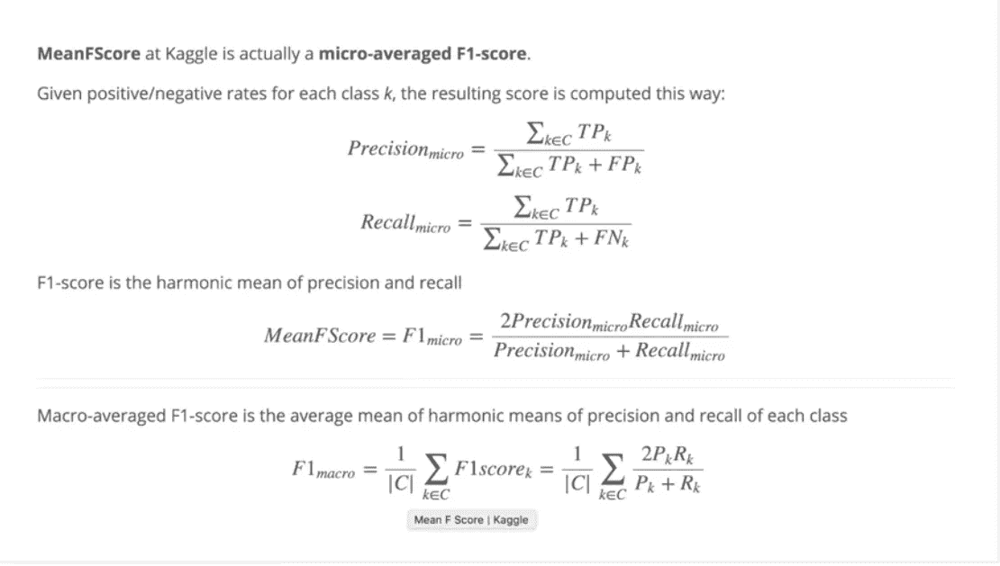

来自竞争网站的绩效指标

因为微观 F1 分数包括特定类别的真阳性、假阳性和假阴性的数量，所以它还固有地通过数据点的频率对每个类别进行加权。然而，宏观 F1 分数没有这种偏差。这是一个简单的平均函数。

我们使用微观 F1 分数来说明班级规模的不平等。

## **探索性数据分析**

数据从 csv 文件加载到 SQLite 数据库。重复问题的删除是通过 SQL 查询完成的。数据库中的原始行数是 6034196。重复数据删除后的新数据库包含 4206314 行。

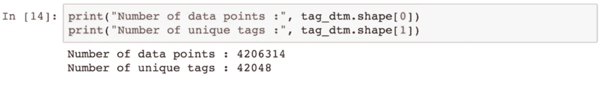

```
#Code to get the bag of words vocabulary for the tags
tags = vectorizer.get_feature_names()
```

让我们看看一些按字母顺序排序的标签及其数量。

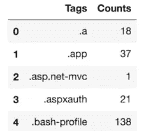

现在，我们按照出现次数的降序对标签进行排序，然后绘制分布图。

```
plt.plot(tag_counts)plt.title(“Distribution of number of times tag appeared questions”)plt.grid()plt.xlabel(“Tag number”)plt.ylabel(“Number of times tag appeared”)plt.show()
```

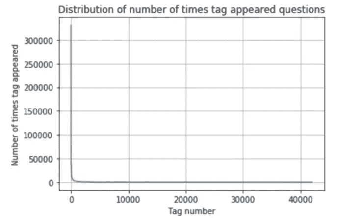

值得注意的是，分布是高度倾斜的，最频繁的标签出现超过 300 万次，而较罕见的标签出现大约一次。

我们需要放大数据，以便更好地了解分布情况。我们现在考虑前 100 个标签。

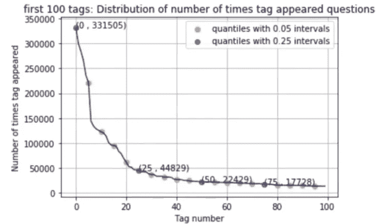

请注意，0→100 个百分点，25→75 个百分点，因为这是按降序排列的。

分位数的下降仍然很显著。第 75 百分位仅包含 100 百分位值的 15%。随着分位数的下降，这些数字变得更低。

事实上，仅前 14 个标签就被使用了超过 100 万次。最常用的标签(C#)使用了 331505 次。

标签频率的巨大变化证明微观平均 F1 分数是合适的度量。

我们现在绘制每个问题的标签数量。

```
sns.countplot(tag_quest_count, palette='gist_rainbow')plt.title("Number of tags in the questions ")plt.xlabel("Number of Tags")plt.ylabel("Number of questions")plt.show()
```

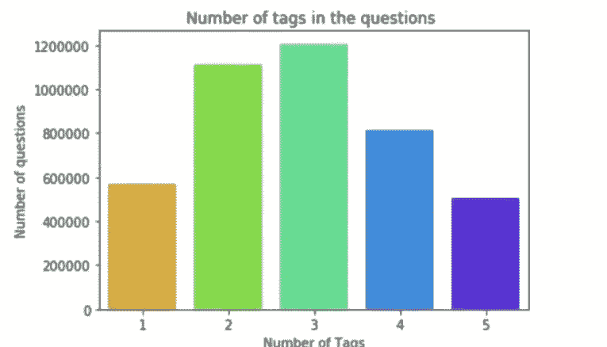

大多数问题有 2-3 个标签，平均在 2.9 左右。每个问题的标签范围是从 1 到 5。

我们现在为标签绘制单词 Cloud。每个单词的字体大小与其出现的频率成正比。

```
tup = dict(result.items())#Initializing WordCloud using frequencies of tags.wordcloud = WordCloud( background_color=’black’,width=1600,height=800,).generate_from_frequencies(tup)fig = plt.figure(figsize=(30,20))plt.imshow(wordcloud)plt.axis(‘off’)plt.tight_layout(pad=0)fig.savefig(“tag.png”)plt.show()
```


让我们来看看前 20 个标签。

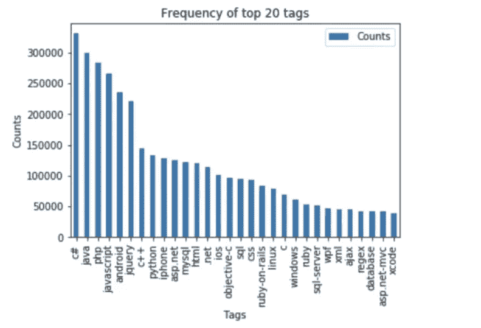

大多数顶级标签都与编程语言和平台相关联。

## **文本预处理**

由于计算能力的限制，从 400 万个数据点中抽取了 100 万个数据点。

让我们来看一个示例数据点。

```
**Title**:  Implementing Boundary Value Analysis of Software Testing in a C++ program?
**Body** :#include<
        iostream>\n
        #include<
        stdlib.h>\n\n
        using namespace std;\n\n
        int main()\n
        {\n
                 int n,a[n],x,c,u[n],m[n],e[n][4];\n         
                 cout<<"Enter the number of variables";\n         cin>>n;\n\n         
                 cout<<"Enter the Lower, and Upper Limits of the variables";\n         
                 for(int y=1; y<n+1; y++)\n         
                 {\n                 
                    cin>>m[y];\n                 
                    cin>>u[y];\n         
                 }\n         
                 for(x=1; x<n+1; x++)\n         
                 {\n                 
                    a[x] = (m[x] + u[x])/2;\n         
                 }\n         
                 c=(n*4)-4;\n         
                 for(int a1=1; a1<n+1; a1++)\n         
                 {\n\n             
                    e[a1][0] = m[a1];\n             
                    e[a1][1] = m[a1]+1;\n             
                    e[a1][2] = u[a1]-1;\n             
                    e[a1][3] = u[a1];\n         
                 }\n         
                 for(int i=1; i<n+1; i++)\n         
                 {\n            
                    for(int l=1; l<=i; l++)\n            
                    {\n                 
                        if(l!=1)\n                 
                        {\n                    
                            cout<<a[l]<<"\\t";\n                 
                        }\n            
                    }\n            
                    for(int j=0; j<4; j++)\n            
                    {\n                
                        cout<<e[i][j];\n                
                        for(int k=0; k<n-(i+1); k++)\n                
                        {\n                    
                            cout<<a[k]<<"\\t";\n               
                        }\n                
                        cout<<"\\n";\n            
                    }\n        
                 }    \n\n        
                 system("PAUSE");\n        
                 return 0;    \n
        }\n\n\n<p>The answer should come in the form of a table like</p>\n\n
    <pre><code>       
    1            50              50\n       
    2            50              50\n       
    99           50              50\n       
    100          50              50\n       
    50           1               50\n       
    50           2               50\n       
    50           99              50\n       
    50           100             50\n       
    50           50              1\n       
    50           50              2\n       
    50           50              99\n       
    50           50              100\n
    </code></pre>\n\n
    <p>if the no of inputs is 3 and their ranges are\n
    1,100\n
    1,100\n
    1,100\n
    (could be varied too)</p>\n\n
    <p>The output is not coming,can anyone correct the code or tell me what\'s wrong?</p>\n'**Tags** : 'c++ c'
```

预处理采取了以下步骤-

1.  使用正则表达式从标题和正文(不包括代码)中删除了特殊字符。
2.  停用词已被删除。(C 除外)。
3.  HTML 标签(“<something>”)被移除。(这些用于将问题/答案的特定单词加粗，例如 **Python** )</something>
4.  将单词转换成小写，然后用雪球斯特梅尔做词干。
5.  每个问题都是标题+问题，因此取消了“标题”栏

这是一些问题体处理后的样子。

```
('ef code first defin one mani relationship differ key troubl defin one zero mani relationship entiti ef object model look like use fluent api object composit pk defin batch id batch detail id use fluent api object composit pk defin batch detail id compani id map exist databas tpt basic idea submittedtransact zero mani submittedsplittransact associ navig realli need one way submittedtransact submittedsplittransact need dbcontext class onmodelcr overrid map class lazi load occur submittedtransact submittedsplittransact help would much appreci edit taken advic made follow chang dbcontext class ad follow onmodelcr overrid must miss someth get follow except thrown submittedtransact key batch id batch detail id zero one mani submittedsplittransact key batch detail id compani id rather assum convent creat relationship two object configur requir sinc obvious wrong',) ---------------------------------------------------------------------------------------------------- ('explan new statement review section c code came accross statement block come accross new oper use way someon explain new call way',) ---------------------------------------------------------------------------------------------------- ('error function notat function solv logic riddl iloczyni list structur list possibl candid solut list possibl coordin matrix wan na choos one candid compar possibl candid element equal wan na delet coordin call function skasuj look like ni knowledg haskel cant see what wrong',) ---------------------------------------------------------------------------------------------------- ('step plan move one isp anoth one work busi plan switch isp realli soon need chang lot inform dns wan wan wifi question guy help mayb peopl plan correct chang current isp new one first dns know receiv new ip isp major chang need take consider exchang server owa vpn two site link wireless connect km away citrix server vmware exchang domain control link place import server crucial step inform need know avoid downtim busi regard ndavid',) ---------------------------------------------------------------------------------------------------- ('use ef migrat creat databas googl migrat tutori af first run applic creat databas ef enabl migrat way creat databas migrat rune applic tri',) ---------------------------------------------------------------------------------------------------- ('magento unit test problem magento site recent look way check integr magento site given point unit test jump one method would assum would big job write whole lot test check everyth site work anyon involv unit test magento advis follow possibl test whole site custom modul nis exampl test would amaz given site heavili link databas would nbe possibl fulli test site without disturb databas better way automaticlli check integr magento site say integr realli mean fault site ship payment etc work correct',) ---------------------------------------------------------------------------------------------------- ('find network devic without bonjour write mac applic need discov mac pcs iphon ipad connect wifi network bonjour seem reason choic turn problem mani type router mine exampl work block bonjour servic need find ip devic tri connect applic specif port determin process run best approach accomplish task without violat app store sandbox',) ---------------------------------------------------------------------------------------------------- ('send multipl row mysql databas want send user mysql databas column user skill time nnow want abl add one row user differ time etc would code send databas nthen use help schema',) ---------------------------------------------------------------------------------------------------- ('insert data mysql php powerpoint event powerpoint present run continu way updat slide present automat data mysql databas websit',) --------------------------------------------------------------------------------------------------**--**
```

## **造型-**

提出这种多标签分类问题作为二分类对于我们应用各种 ML 模型是至关重要的。42000 标签上一个 vs Rest 分类会太慢。分类器链的使用是相关的，因为标签本身可能是相关的。例如，“C++”的出现也可能触发“指针”的出现。标号幂集可能导致大量类的产生。采用现有算法进行多标签分类是另一种方法。关于这个话题的更多信息可以在[这个链接](https://www.analyticsvidhya.com/blog/2017/08/introduction-to-multi-label-classification/)上找到。

由于计算的限制，我们不能使用所有的标签作为类。我们需要根据“部分覆盖”的出现频率选择顶部标签

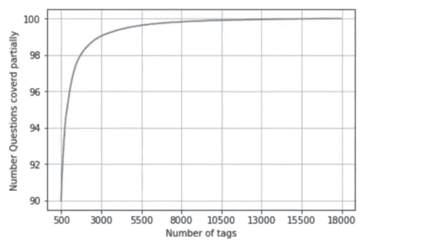

覆盖的问题与标签数量的百分比

仅使用前 5500 个标签就能让我们部分覆盖超过 99%的问题**。**

**随机执行 80-20 比例的训练测试分割。**

```
total_size=preprocessed_data.shape[0]train_size=int(0.80*total_size)x_train=preprocessed_data.head(train_size)x_test=preprocessed_data.tail(total_size — train_size)y_train = multilabel_yx[0:train_size,:]y_test = multilabel_yx[train_size:total_size,:]
```

**现在，我们将问题的预处理文本数据转换成 Tf-Idf 形式。**

```
vectorizer = TfidfVectorizer(min_df=0.00009, max_features=200000, smooth_idf=True, norm="l2", \tokenizer = lambda x: x.split(), sublinear_tf=False, ngram_range=(1,3))x_train_multilabel = vectorizer.fit_transform(x_train['question'])x_test_multilabel = vectorizer.transform(x_test['question'])
```

**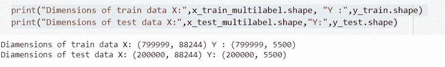**

**我们的特征向量是 88244 维，而标签向量是 5500 维。我们遇到了一个问题。**

**Tf-idf 矢量器将这些高维向量存储为稀疏向量。scikit-multilearn' library 试图将这种稀疏向量表示转换为正常的密集数据矩阵，以供自己使用，这给我们带来了一个内存错误。因此，在这种情况下，我们没有使用 MLKNN(KNN 的多标签算法)。**

**我们使用一个 vs Rest 分类器。该算法分别训练 5500 个分类器，并使用它们的结果。**

```
classifier = OneVsRestClassifier(SGDClassifier(loss='log', alpha=0.00001, penalty='l1'), n_jobs=-1)classifier.fit(x_train_multilabel, y_train)predictions = classifier.predict(x_test_multilabel)print("accuracy :",metrics.accuracy_score(y_test,predictions))print("macro f1 score :",metrics.f1_score(y_test, predictions, average = 'macro'))print("micro f1 scoore :",metrics.f1_score(y_test, predictions, average = 'micro'))print("hamming loss :",metrics.hamming_loss(y_test,predictions))
```

**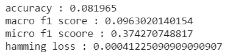**

**这是前 10 个标签的精确召回报告-**

**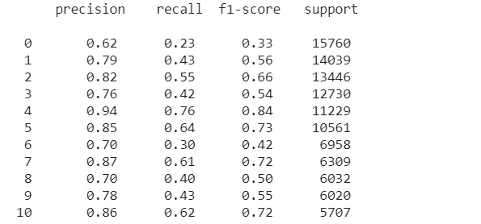**

**正如我们所观察到的，这些指标相对较低。由于数据集很大，超参数调整受到限制。培训在中级笔记本电脑(i5 处理器)上进行，大约需要 9 个小时。因此，我们重复相同的过程，但现在是 50 万个数据点，取前 500 个标签(占问题的 90%部分覆盖率)。**

**还执行了特征工程的另一步骤。问题的标题比正文更重要。这是通过使 question= title*3+ question(而不是 title+question)完成的，并存储在另一个数据库的表中，从该表中查询该问题。**

**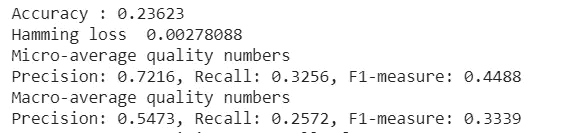**

**正如所见，这些指标与之前的培训相比有所改进。召回率仍然很低，这增加了我们的模型丢失标签的可能性。可以通过进一步的调整来解决这个问题。**

**特别提及:【https://youtu.be/nNDqbUhtIRg】T4**

# **使用 MLFlow 管道:**

**虽然上面的方法对于小型的个人项目是可以的，但是一个更大的项目需要团队之间的合作，这就是 ML 生命周期跟踪变得必要的地方。**

**从开源 MLFlow 项目的 Github 存储库中，**

> **MLflow 是一个简化机器学习开发的平台，包括跟踪实验，将代码打包成可复制的运行，以及共享和部署模型。MLflow 提供了一组轻量级 API，可用于任何现有的机器学习应用程序或库(TensorFlow、PyTorch、XGBoost 等)，无论您当前在哪里运行 ML 代码(例如，在笔记本、独立应用程序或云中)。**

**即使到目前为止，49%的企业只是在探索机器学习的大量用例，而没有具体的计划。这部分是因为他们采用简单的传统软件工程工具包来解决与 ML 工作流相关的挑战性问题，如处理规模、记录管道的各个方面，如数据工程、分析、建模、部署、这些团队之间的协作、跟踪和监控过去的实验等。**

**这就是 MLFlow 发挥作用的地方。一般来说，MLFlow 用于-**

1.  **数据分析和统计推断，为业务问题选择一系列模型**
2.  **设计 MLFlow 实验以确定模型的最佳超参数。**
3.  **使用 Apache Spark 训练和部署大规模 ML 模型。**

**这些都是使用 MLFlow 的不同组件完成的，我们将在下面讨论。**

## **ml 流跟踪:监视和日志记录实验**

**Databricks Community Edition 工作区将是理想的，因为它们是 MLFlow 的提供者。然而，他们不允许超过 1 GB 的存储空间，所以我不得不使用 Colab 进行 MLFlow]**

**Ngrok 用于从 Google Colab 部署本地主机服务器。然后开始 MLFlow 训练，并记录参数(alpha)、度量分数和模型 pickle 文件。**

**将 MLFlow 文件作为 zip 文件夹下载到您的本地计算机上。它们包含一组 alphas 的单独运行作为超参数。**

## **MLFlow 项目:**

**在内部，工件文件夹将是 model.pkl 文件。MLmodel 文件中提到了项目的入口点和模型风格。**

**要在端点部署模型，克隆 Github 存储库并使用:**

> **mlflow 型号 serve-m 4ce 61665 C3 e 443 a4 b 21 FB 605969 a1b 44/artifacts/model/-h 127 . 0 . 0 . 1-p 5000**