# 堆栈溢出标签预测

> 原文：<https://medium.com/analytics-vidhya/stack-overflow-tag-prediction-fb5c17d6bf39?source=collection_archive---------13----------------------->

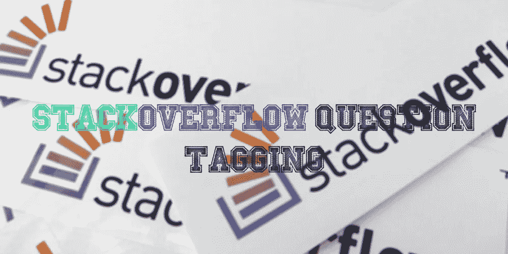

如果你是一名软件工程师或程序员，你一生中一定至少使用过一次 StackOverflow。但是你有没有想过 StackOverflow 是如何预测给定问题的标签的？在这篇博客中，我将讨论 StackOverflow 标记预测器案例研究。

# 内容

1.  堆栈溢出数据集概述。
2.  探索性数据分析。
3.  数据预处理。
4.  数据的缩减。
5.  列车测试分离。
6.  使用 Tfidf 矢量器的文本特征。
7.  超参数调谐。
8.  使用 OneVsRest 分类器的逻辑回归
9.  带 SVM 的 OneVsRestClassifier
10.  结论。
11.  增强功能。

Stack Overflow 是最大、最值得信赖的在线社区，供开发人员学习、分享他们的编程知识和发展他们的职业生涯。

堆栈溢出是每个程序员都会以某种方式使用的东西。每个月都有超过 5000 万的开发人员来到 Stack Overflow 学习、分享他们的知识，并建立他们的职业生涯。它的特点是在计算机编程中广泛的问题和答案。该网站为用户提供了一个提问和回答问题的平台，并通过会员资格和积极参与，对问题和答案进行投票表决，并以类似于 wiki 或 Digg 的方式编辑问题和答案。截至 2014 年 4 月，Stack Overflow 拥有超过 4，000，000 个注册用户，到 2015 年 8 月底，其问题数量超过 10，000，000 个。根据分配给问题的标签类型，网站上讨论最多的前八个主题是 Java、JavaScript、C#、PHP、Android、jQuery、Python 和 HTML。

数据可以在这里找到[](https://www.kaggle.com/c/facebook-recruiting-iii-keyword-extraction/data)****。****

**关于 [**问题**](https://youtu.be/nNDqbUhtIRg) **的 Youtube 解释。****

**更多信息请阅读研究论文 [**此处**](https://www.microsoft.com/en-us/research/wp-content/uploads/2016/02/tagging-1.pdf) **。****

**Github 代码回购: [**StackOverflow 标签预测器**](https://github.com/Sachin-D-N/Stack_overflow_Tag_Prediction/blob/main/Stack_Overflow_Tag_Predictor/Stack_Overflow_Tag_Predictor.ipynb)**

# **问题陈述**

**仅给定问题文本及其标题，预测标签(关键词、主题、摘要)。**

**阅读 [**上的完整问题陈述**](https://www.kaggle.com/c/facebook-recruiting-iii-keyword-extraction/)**

*   **高 [**精度预测尽可能多的标签，召回**](/analytics-vidhya/performance-metrics-for-machine-learning-models-80d7666b432e) **。****
*   **不正确的标签可能会影响 StackOverflow 上的客户体验。**
*   **没有严格的延迟限制。**

# **数据**

**数据包含 4 个字段**

1.  **Id —每个问题的唯一标识符**
2.  **标题—问题的标题**
3.  **正文—问题的正文**
4.  **标签—与问题相关联的标签**

**点击[**此处**](https://www.kaggle.com/c/facebook-recruiting-iii-keyword-extraction/data) 了解更多详情。**

**所有的数据都在两个文件中:训练和测试。**

```
**Size of Train.csv** - 6.75GB
**Size of Test.csv** - 2GB
**Number of rows in Train.csv** = 6034195
```

**这些问题是随机的，既包含冗长的文本网站，也包含与数学和编程相关的网站。每个站点的问题数量可能会有所不同，并且没有对问题进行筛选。**

# **样本数据点**

```
**Title**: Implementing Boundary Value Analysis of Software Testing in a C++ program?**Body** :#include< iostream>\n #include< stdlib.h>\n\n using namespace std;\n\n int main()\n {\n int n,a[n],x,c,u[n],m[n],e[n][4];\n cout<<"Enter the number of variables";\n cin>>n;\n\n cout<<"Enter the Lower, and Upper Limits of the variables";\n for(int y=1; y<n+1; y++)\n {\n cin>>m[y];\n cin>>u[y];\n }\n for(x=1; x<n+1; x++)\n {\n a[x] = (m[x] + u[x])/2;\n }\n for(int i=1; i<n+1; i++)\n {\n for(int l=1; l<=i; l++)\n {\n if(l!=1)\n {\n cout<<a[l]<<"\\t";\n }\n }\n for(int j=0; j<4; j++)\n {\n cout<<e[i][j];\n for(int k=0; k<n-(i+1); k++)\n {\n cout<<a[k]<<"\\t";\n }\n cout<<"\\n";\n }\n } \n\n system("PAUSE");\n return 0; \n }\n\n\nThe answer should come in the form of a table like\n\nThe output is not coming,can anyone correct the code or tell me what\'s wrong?\n' **Tags** : 'c++ c'
```

# **将业务问题映射到机器学习问题**

**这是一个多标签分类问题。**

**在多标签分类中，多个标签(在这个问题中是它的标签)可以被分配给每个实例，并且对于该实例可以被分配给多少个类没有限制。来源: [**维基**](https://en.wikipedia.org/wiki/Multi-label_classification)**

**点击 了解更多关于多标签分类问题[](https://scikit-learn.org/stable/modules/multiclass.html)**

****Stackoverflow 上的一个问题可能是关于 C、指针、JAVA、Regex、FileIO 和/或内存管理中的任何一个，也可能不是这些。****

## ****绩效指标****

1.  ****微观 F1 分数****
2.  ****宏观 F1 分数****

****请阅读这篇 [**博客**](https://www.kaggle.com/wiki/HammingLoss) 了解更多关于度量的信息。****

# ****探索性数据分析****

****我已经使用熊猫图书馆加载数据。请访问我的 [**GitHub**](https://github.com/Sachin-D-N/Stack_overflow_Tag_Prediction/blob/main/Stack_Overflow_Tag_Predictor/Stack_Overflow_Tag_Predictor.ipynb) repo 查看完整代码。我从 Train.csv 中抽取了 20 万(20 万)个数据点的样本。****

1.  ****数据库中的行数:200000****
2.  ****唯一标签的数量:42048****
3.  ****十大重要标签:['。一个'，'。app '，' . asp.net-mvc '，'。aspxauth“，”。bash-profile“，”。类别档案'，'。cs 文件“，”。文档'，'。drv '，'。ds-store']****
4.  ****总共有 153 个标签被使用超过 10000 次。****
5.  ****14 个标签使用超过 100000 次。****
6.  ****最常用的标记(即 c#)使用了 331505 次。****
7.  ****由于一些标签比其他标签出现得更频繁，因此微平均 F1 分数是解决此问题的合适指标。****

****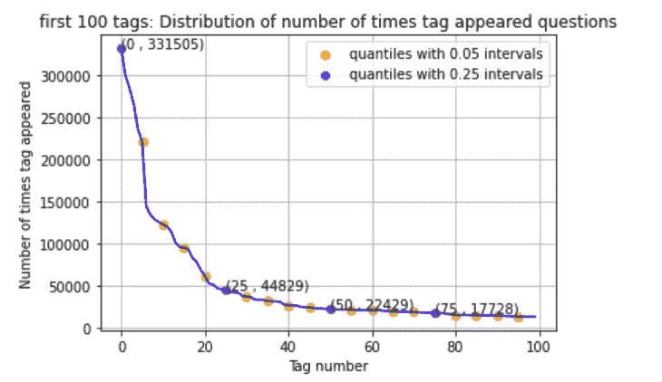****

****8.标签分析****

*   ****每个问题的最大标签数:5****
*   ****每个问题的最小标签数:1****
*   ****平均值。每个问题的标签数量:2.899440****
*   ****带有 3 个标签的问题出现的次数更多****

****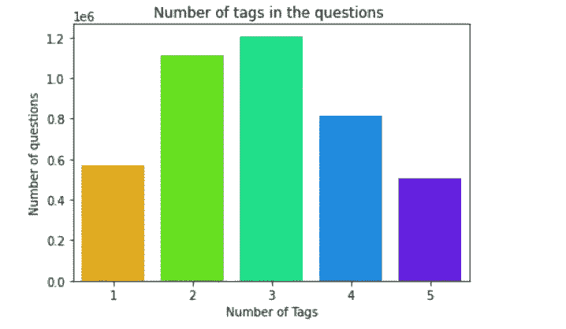************

****C#出现的次数最多，Java 次之。大多数最常见的标签是编程语言。这是前 20 个标签的图表****

****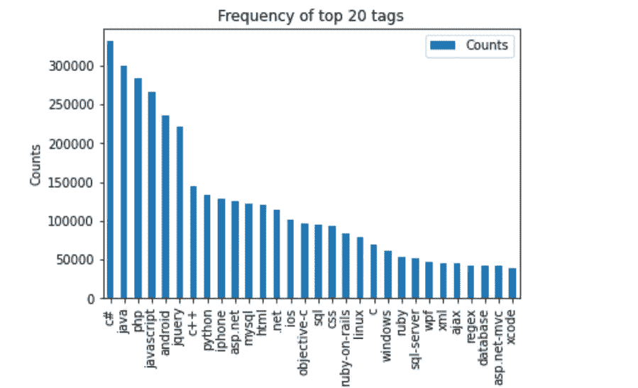****

*   ****大多数最常见的标签是编程语言。****
*   ****C#是最常用的编程语言。****
*   ****Android、IOS、Linux 和 windows 是最常见的操作系统。****

# ****问题的清洗和预处理****

****由于硬件限制，我只考虑 20 万个数据点****

1.  ****问题包含 HTML 标签代码标签，所以从正文中分离出代码片段。****
2.  ****从标题和正文中删除特殊字符(不在代码中)。****
3.  ****删除停用词(C 除外)。****
4.  ****移除 HTML 标签。****
5.  ****将所有字符转换成小写字母。****
6.  ****使用雪球词干分析器来阻止单词。词干化是将一个单词缩减为其词干的过程。例如:“python”是单词[“python”“python oner”“python 化”“python 化”]的词干。****
7.  ****给标题更多的权重:给问题加三次标题。标题包含对问题更具体的信息，并且也只有在看到问题标题之后，用户才决定是否详细研究该问题。如果不是所有的用户，至少大部分用户是这样做的。****

## ****预处理后的样本问题****

****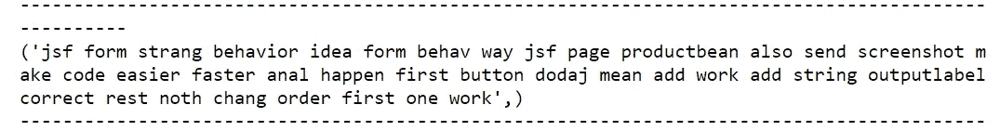****

## ****机器学习模型****

*   ****问题总数:199999****
*   ****标签总数:23747****

****这里我们要用问题转换(二元相关)的方法来解决问题。****

## ****二元相关性****

****这里我们将把多标签分类问题转化为多个单类分类问题。例如，如果我们有 5 个多标签分类问题，那么我们需要训练 5 个单类分类模型。****

****基本上，在这个方法中，我们把每个标签(在我们的例子中是它的标记)作为一个单独的类分类问题。这种技术简单且应用广泛。****

****请参考这个[**博客**](https://www.analyticsvidhya.com/blog/2017/08/introduction-to-multi-label-classification/) 了解更多关于解决多标签分类问题的技巧。****

## ****数据的缩减****

****回到我们的 stackoverflow 预测器问题，我们需要训练 23437 个模型！！！对于一个 8GB RAM 和 i5 处理器的系统来说，这实在是太大了(在时间和速度方面)。因此，我们将对标签的数量进行采样，而不是考虑所有标签。但是在信息损失最小的情况下，要采样多少个标签呢？绘制“覆盖问题的百分比”与“标签的数量”将有助于解决这个问题。****

****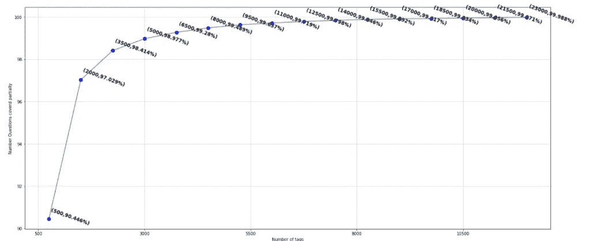****

## ****观察****

1.  ****500 个标签覆盖了 90.446%的问题****
2.  ****5000 个标签覆盖了 98.77 %的问题****
3.  ****通过在总共 23437 个标签中只选择 500 个标签(大约 2%)，我们只丢失了 9%的问题&而且训练 500 个模型是相当好的，所以我们将选择 500 个标签。****

# ****训练和测试数据****

****如果每个问题的数据都附有时间戳，那么根据数据的时间性质来拆分数据将比随机拆分数据更有意义。但是由于数据不是时间性的(即没有时间戳)，我们将数据随机分为 80%的训练集和 20%的测试集。****

****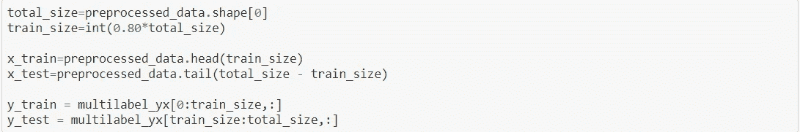****

# ****使用 TfIdf 矢量器显示文本数据****

****有多种方法来描述文本数据。我已经在我的 [**博客**](/analytics-vidhya/amazon-fine-food-reviews-featurization-with-natural-language-processing-a386b0317f56) 帖子里解释过了。首先，让我们用 TfIdf 矢量器来描述问题数据。****

****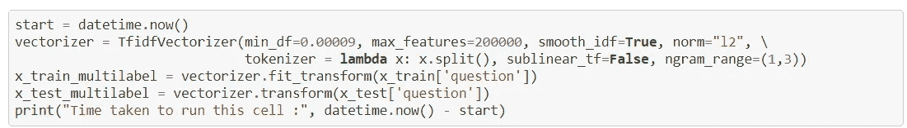****

## ****用 OneVsRest 分类器应用逻辑回归****

******超参数调谐以获得最佳 alpha******

****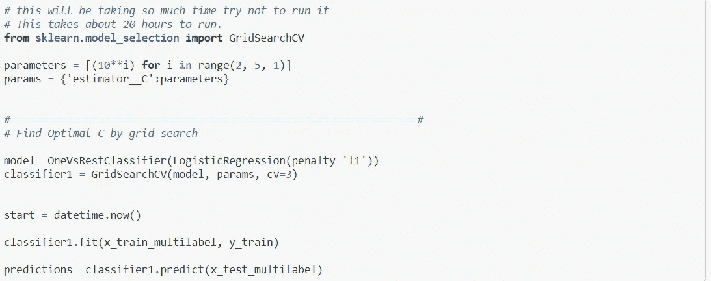****

****让我们使用逻辑回归来训练 500 个模型(500 个标签)只不过是具有对数损失的 SGD 分类器。****

****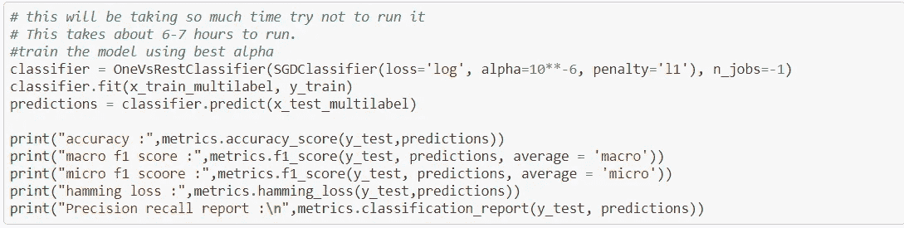****

******结果******

*   ****微 F1-测量值:0.492****
*   ****精确度:0.222****
*   ****汉明损失:0.0029****

## ****带 SVM 的 OneVsRestClassifier****

****让我们用 SVM 算法来训练 500 个模型。线性 SVM 只不过是以损耗为枢纽的 SGD 分类器。在使用 GridSearchCV 找到超参数 alpha 之后，我发现 alpha 是 10**6。****

****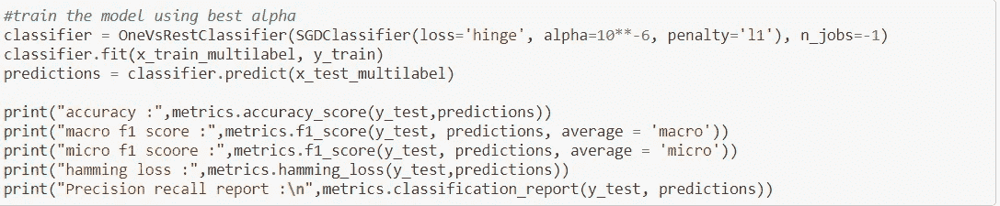****

******结果******

*   ****微 F1-测量值:0.487****
*   ****精确度:0.201****
*   ****汉明损失:0.0031****

# ****结论****

****在我们目前使用的所有模型中，使用 TfIdf 矢量器和 n_grams=(1，3)的逻辑回归比其他模型表现更好。但我们已经用大量数据点训练了逻辑回归模型，因此将该模型与用较少数据点训练的其余模型进行比较没有意义。****

****这是所有模型的结果…****

****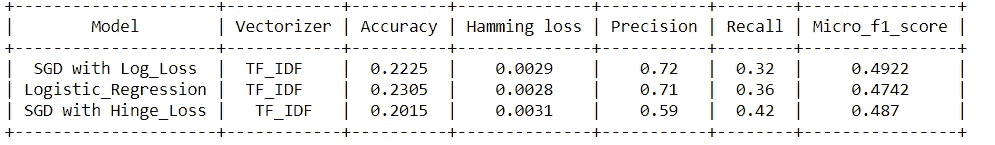****

****这里我们只训练了两个线性模型。其他模型，如基于树的模型，由于数据的高维度，在这里不太适用。线性 SVM 具有高时间复杂度，因此在线性 SVM 上训练 500 个模型是不可行的。因此，SGD 分类器是我们的最佳选择。****

# ****像随机森林或 GBDT 这样的复杂模型有问题吗？****

****你可能已经注意到了，我采用了像逻辑回归和线性 SVM 这样最简单的模型来训练这个模型。这是复杂模型没有被尝试的两个主要原因****

******高维数据**:由于我们将文本转换为 TfIdf 或 BOW 向量，所以我们得到的维度非常大。当维度很大时，典型的随机森林& GBDT 将不会很好地工作。****

****需要训练的模型太多:我们实际上有 500 个模型需要训练(在缩减数据之后)。逻辑回归是人们可以使用的最简单的模型&它相对来说更快。如果我们开始使用其他模型，如 RBF-SVM 或 RF，将需要太多的时间来训练模型。对我来说，训练线性 SVM 需要更多的时间，这也是在大幅度缩减数据之后。****

## ****提高****

****尝试使用更多数据点(在具有 32GB RAM 和高端处理器的系统上)用 Word2Vec 特征化文本数据:当您尝试使用 Word2Vec 时，数据的维数会降低&因此像随机森林或 GBDT 这样的复杂模型可能会工作得很好。****

****尝试使用 scikit-multilearn 库。请注意，这个库不接受一个稀疏矩阵作为输入，你需要给出一个密集矩阵作为输入。所以显然你需要更多的内存来使用这个库。****

****要了解完整代码请访问我的 [**GitHub**](https://github.com/Sachin-D-N/Stack_overflow_Tag_Prediction/blob/main/Stack_Overflow_Tag_Predictor/Stack_Overflow_Tag_Predictor.ipynb) 链接。****

****感谢您的阅读和耐心。我希望你喜欢这个帖子，如果我的帖子有错误，请告诉我。****

# ****参考****

*   ****应用人工智能****
*   ****维基百科(一个基于 wiki 技术的多语言的百科全书协作计划ˌ也是一部用不同语言写成的网络百科全书ˌ 其目标及宗旨是为全人类提供自由的百科全书)ˌ开放性的百科全书****
*   ****Coursera****
*   ****数据营****

> ******联系人:** [**邮箱**](https://sachin-d-n.github.io/Stack_overflow_Tag_Prediction/sachin.s1dn@gmail.com)**[**LinkedIn**](https://www.linkedin.com/in/sachin-d-n-1st-8150351b2/)**[**Github**](https://github.com/Sachin-D-N/Stack_overflow_Tag_Prediction/tree/main)**[**中型**](https://sachin-s1dn.medium.com/)**[**Twitter**](https://twitter.com/home)************

*****博客也发布在*[*https://sachin-d-n . github . io*](https://sachin-d-n.github.io/Stack_overflow_Tag_Prediction/)*。*****