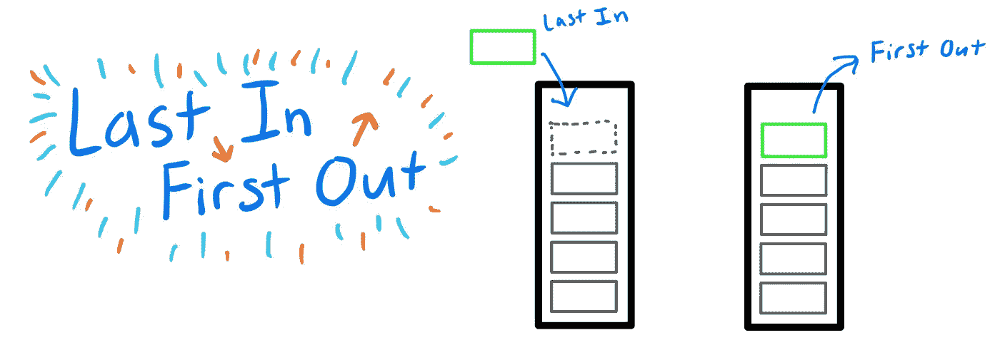
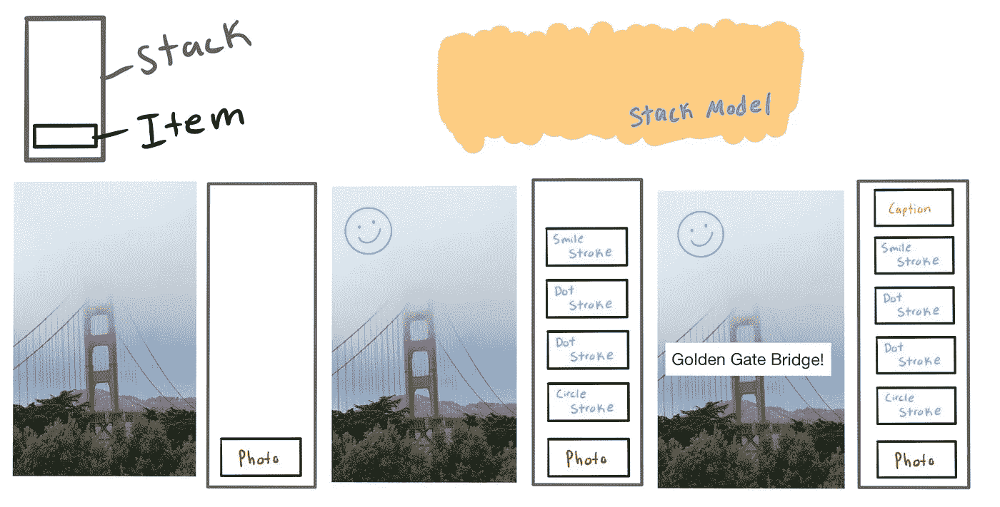
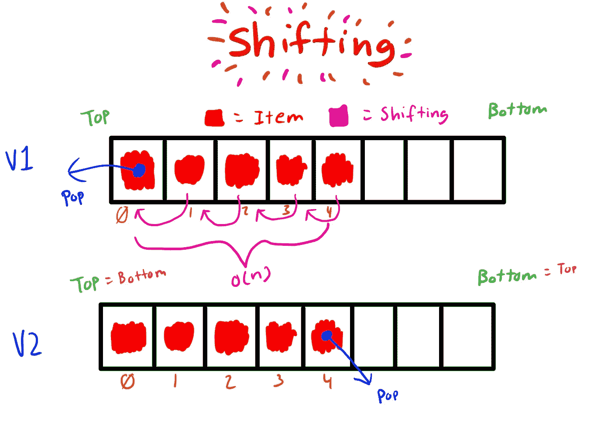
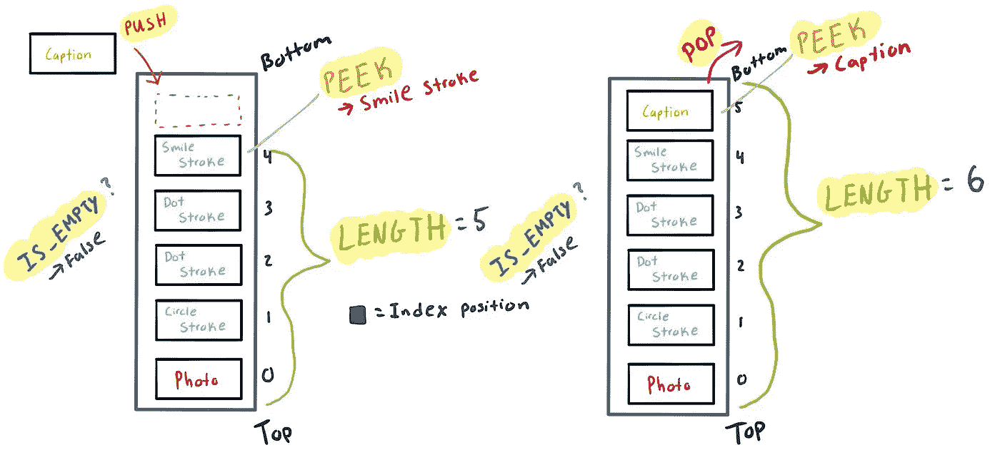

# 把它们堆在一起

> 原文：<https://medium.com/analytics-vidhya/stackem-up-data-structure-5cbf23a43170?source=collection_archive---------17----------------------->


安妮·斯普拉特在 [Unsplash](https://unsplash.com?utm_source=medium&utm_medium=referral) 上的照片

最直观的计算机科学数据结构之一是堆栈。这种数据结构广泛应用于但不限于您的编译器、应用程序内存和一些函数调用中。现在你可能不熟悉这种结构，可能想知道，什么是栈？嗯，根据谷歌的解释，stack 是"*一堆物体，通常是整齐排列的物体*就是这样……就是这样。栈数据结构是一堆对象，没什么特别的。在深入什么是栈数据结构之前，让我们先来看看我们在日常生活中是如何创建栈的。

# 准备堆叠

让我们放轻松，从一个简单的类比开始，老式的叠衣服。

当你坐在那里叠衣服，思考你的生活时，你不知不觉地创造了一堆整齐排列的衣服。你突然意识到你需要那件堆中间的红色衬衫。我知道你通常会把红色的衬衫拉出来，但是让我们假装一下我们是一个整洁的人，把一件衬衫脱下来，直到我们得到我们想要的那件。我知道这听起来有点疯狂，但这一切很快就会有意义。

太好了，您正在学习更多关于堆栈的知识。请记住这个类比，因为在我们继续讨论时我会引用它。是时候更专业一点了。

# 很高兴知道

**抽象数据类型:**数据和操作的定义但是那些操作的实现方式是隐藏的。

**抽象例子:**电脑用户可以看到它有多少内存，ram 的数量，CPU 的类型等规格。

```
Processor: 2.3 GHz 8-Core Intel Core I9
Memory: 32 GB 2667 MHz DDR4
Storage: 512 GB SSD
```

**实现示例:**用户看到一台计算机的规格标签*(抽象视图)*，但标签背后包含了使计算机发挥功能的非常复杂的实现。

```
**def Computer():** processor_name = “Intel”
   ram_size= 32
   storage_type= “SSD”
   storage_amount= 512
```

# 什么是栈数据结构？



后进先出模型

堆栈是一种抽象的数据类型，充当项目的集合。这种数据结构创建了添加和删除项目的特定顺序。这种顺序被称为**后进先出**(后进先出)。最后进入堆栈的项目是第一个出来的。如果我必须选择我想让你从这篇文章中学到什么，那一定是 LIFO 所代表的。如果你能记住后进先出法，你就能很容易地拼凑出堆栈是如何工作的。

# 指导原则

回到我们的衣服类比，我提到我们必须一件接一件地脱下每件衣服才能得到我们想要的衬衫。这是因为你不能在一堆东西中挑出你想要的，然后把它拉出来。你必须从顶部开始，并删除每个项目，直到你得到你想要的。

# 我们为什么以及如何使用堆栈

当你想以特定的顺序(LIFO)记住前一个动作或项目时，堆栈是一个强大的工具。栈的一个很好的例子是撤销功能，许多应用程序允许你编辑照片。我们以 Snapchat 为例。

## 我们的快照轮廓:

*   拍一张照片，画一个笑脸，并添加一个标题。



金门大桥照片和 Snapchat 堆栈模型

## 幕后:

1.  一个用户拍了一张照片，这张照片被放到一个堆栈中。
2.  用户画一个笑脸，每个笔画按照画的顺序放在栈顶。
3.  用户添加一个文本标题，然后标题被放在栈顶。

这种数据结构对这些应用程序非常有用，因为每个动作都是按照编辑的顺序添加到堆栈中的。程序员可以创建一个撤销按钮来删除最后添加的项目(LIFO)。栈是非常高效和容易创建的，但是这取决于你如何实现它。

# 提高堆栈的效率



阵列移位模型

根据您构建堆栈的方式，用数组创建堆栈可能会变得非常低效。然而，提高效率非常容易，只需要改变你观察顶部和底部的方式。

## V1 的例子

数组是连续的，这意味着每一项都相互接触。如果你在索引 0 处移除一个项目(顶部项目)，每个项目都必须向左移动 1，这需要 O(n)时间。这也适用于向堆栈中添加一个条目时，除了不是向左移动，所有的条目都必须向右移动 1。

## V2 的例子

您会注意到，我将 Top 重命名为 Bottom，Bottom 重命名为 Top，因为这是您查看该实现所需的方式。因为数组中的最后一项的右边永远不会有项，所以当您移除它时，它不会导致任何移动。当你添加一个项目时，同样的规则也适用，因为它将移动到数组的末尾，所以不需要向右移动项目。这允许您在 O(1)时间内创建一个推和弹出方法。

# 堆栈是如何制作的

## 履行

在本文中，我们的堆栈将以数组数据结构的形式出现。另一种创建堆栈的方法是使用链表。它们各有利弊，我鼓励你了解它们的不同之处。如果你想了解更多关于链表堆栈的工作原理，可以考虑阅读 Vaidehi Joshi 的这篇文章，他很好地解释了链表的工作原理。

如果你还同意我的观点，让我们来看看组成堆栈的方法。



行动模型中的方法

## 堆栈方法词汇表

不确定 Big-O 符号是什么？考虑看看 Bret Cameron 的这篇非常详细的文章讨论 Big-O 符号如何工作以及我们为什么使用它。

**阵列实现**

请记住，这是我们在本节之前讨论过的 V2 实现。顶部=底部，底部=顶部。

*   Push() —将新项目添加到堆栈的顶部

```
Running time: O(1). The append operation executes in constant time in this implementation because no shifting occurs.
```

*   Pop() —从堆栈中移除顶部项目

```
Running time: O(1). Pop executes in constant time in this implementation because no shifting occurs.
```

## 有用的方法

*   Is_Empty() —如果堆栈为空，则返回 true，否则返回 false

```
Running time: O(1). Arrays keep track of their own length, so checking if there is a length simply returns true or false which takes constant time.
```

*   peek()-返回顶部项目，但不删除它

```
Running time: O(1). Returns the top item without removing it which takes constant time.
```

*   length()-返回堆栈中的项目数

```
Running time: O(1). Arrays keep track of their own length so there is no need to loop over each item, so this runs in constant time.
```

# Python 中的堆栈实现